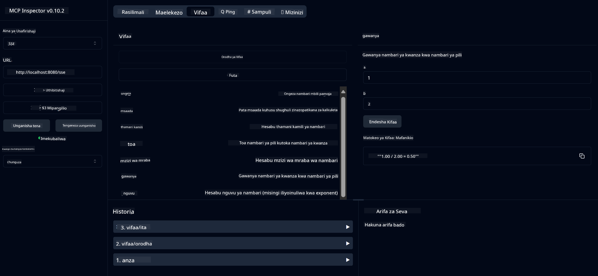

<!--
CO_OP_TRANSLATOR_METADATA:
{
  "original_hash": "ed9cab32cc67c12d8969b407aa47100a",
  "translation_date": "2025-07-13T17:55:59+00:00",
  "source_file": "03-GettingStarted/01-first-server/solution/java/README.md",
  "language_code": "sw"
}
-->
# Huduma ya Calculator Msingi MCP

Huduma hii hutoa shughuli za msingi za calculator kupitia Model Context Protocol (MCP) kwa kutumia Spring Boot na usafirishaji wa WebFlux. Imetengenezwa kama mfano rahisi kwa wanaoanza kujifunza kuhusu utekelezaji wa MCP.

Kwa maelezo zaidi, angalia nyaraka za rejea za [MCP Server Boot Starter](https://docs.spring.io/spring-ai/reference/api/mcp/mcp-server-boot-starter-docs.html).


## Kutumia Huduma

Huduma inatoa API zifuatazo kupitia itifaki ya MCP:

- `add(a, b)`: Ongeza nambari mbili pamoja
- `subtract(a, b)`: Toa nambari ya pili kutoka ya kwanza
- `multiply(a, b)`: Zidisha nambari mbili
- `divide(a, b)`: Gawanya nambari ya kwanza kwa ya pili (ikiwa na ukaguzi wa sifuri)
- `power(base, exponent)`: Hesabu nguvu ya nambari
- `squareRoot(number)`: Hesabu mzizi wa mraba (ikiwa na ukaguzi wa nambari hasi)
- `modulus(a, b)`: Hesabu mabaki ya mgawanyo
- `absolute(number)`: Hesabu thamani kamili

## Mategemeo

Mradi unahitaji mategemeo muhimu yafuatayo:

```xml
<dependency>
    <groupId>org.springframework.ai</groupId>
    <artifactId>spring-ai-starter-mcp-server-webflux</artifactId>
</dependency>
```

## Kujenga Mradi

Jenga mradi kwa kutumia Maven:
```bash
./mvnw clean install -DskipTests
```

## Kuendesha Server

### Kutumia Java

```bash
java -jar target/calculator-server-0.0.1-SNAPSHOT.jar
```

### Kutumia MCP Inspector

MCP Inspector ni chombo cha msaada kwa kuingiliana na huduma za MCP. Ili kuitumia na huduma hii ya calculator:

1. **Sakinisha na endesha MCP Inspector** katika dirisha jipya la terminal:
   ```bash
   npx @modelcontextprotocol/inspector
   ```

2. **Fikia UI ya wavuti** kwa kubofya URL inayotolewa na programu (kawaida http://localhost:6274)

3. **Sanidi muunganisho**:
   - Weka aina ya usafirishaji kuwa "SSE"
   - Weka URL ya endpoint ya SSE ya server yako inayotumika: `http://localhost:8080/sse`
   - Bonyeza "Connect"

4. **Tumia zana**:
   - Bonyeza "List Tools" kuona shughuli za calculator zinazopatikana
   - Chagua zana na bonyeza "Run Tool" kuendesha shughuli



**Kiarifu cha Kutotegemea**:  
Hati hii imetafsiriwa kwa kutumia huduma ya tafsiri ya AI [Co-op Translator](https://github.com/Azure/co-op-translator). Ingawa tunajitahidi kwa usahihi, tafadhali fahamu kwamba tafsiri za kiotomatiki zinaweza kuwa na makosa au upungufu wa usahihi. Hati ya asili katika lugha yake ya asili inapaswa kuchukuliwa kama chanzo cha mamlaka. Kwa taarifa muhimu, tafsiri ya kitaalamu inayofanywa na binadamu inapendekezwa. Hatubebei dhamana kwa kutoelewana au tafsiri potofu zinazotokana na matumizi ya tafsiri hii.