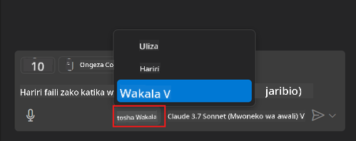
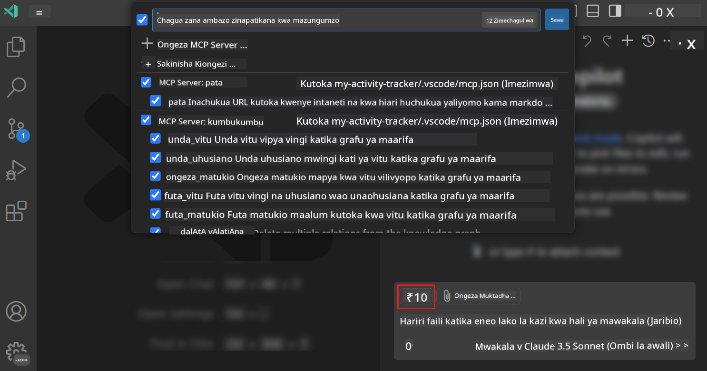
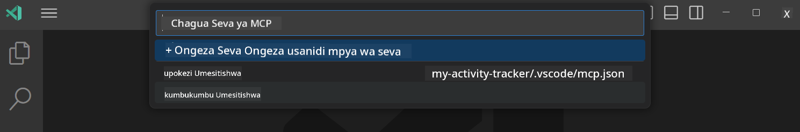
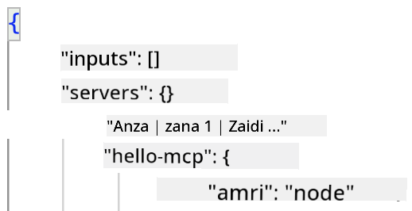
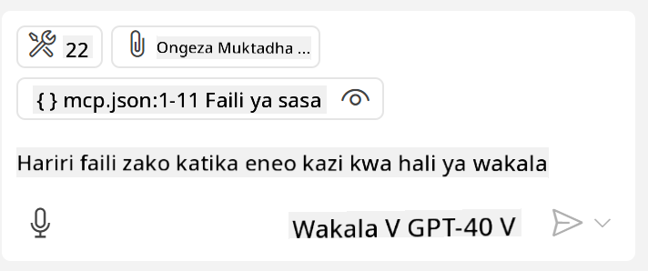
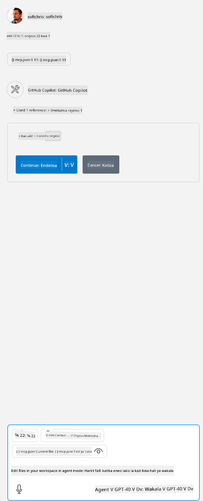

<!--
CO_OP_TRANSLATOR_METADATA:
{
  "original_hash": "d940b5e0af75e3a3a4d1c3179120d1d9",
  "translation_date": "2025-08-26T18:09:57+00:00",
  "source_file": "03-GettingStarted/04-vscode/README.md",
  "language_code": "sw"
}
-->
# Kutumia seva kutoka kwa hali ya Wakala wa GitHub Copilot

Visual Studio Code na GitHub Copilot vinaweza kufanya kazi kama mteja na kutumia seva ya MCP. Kwa nini tungependa kufanya hivyo, unaweza kuuliza? Naam, hii inamaanisha kwamba vipengele vyovyote ambavyo seva ya MCP inavyo sasa vinaweza kutumika moja kwa moja kutoka ndani ya IDE yako. Fikiria ukiongeza, kwa mfano, seva ya MCP ya GitHub, hii itakuruhusu kudhibiti GitHub kupitia maelekezo badala ya kuandika amri maalum kwenye terminal. Au fikiria chochote kwa ujumla ambacho kinaweza kuboresha uzoefu wako wa maendeleo, vyote vikidhibitiwa kwa lugha ya kawaida. Sasa unaanza kuona faida, sivyo?

## Muhtasari

Somo hili linaelezea jinsi ya kutumia Visual Studio Code na hali ya Wakala wa GitHub Copilot kama mteja kwa seva yako ya MCP.

## Malengo ya Kujifunza

Mwisho wa somo hili, utaweza:

- Kutumia seva ya MCP kupitia Visual Studio Code.
- Kuendesha uwezo kama zana kupitia GitHub Copilot.
- Kuseti Visual Studio Code ili kutafuta na kudhibiti seva yako ya MCP.

## Matumizi

Unaweza kudhibiti seva yako ya MCP kwa njia mbili tofauti:

- Kiolesura cha mtumiaji, utaona jinsi hii inafanyika baadaye katika sura hii.
- Terminal, inawezekana kudhibiti mambo kutoka terminal kwa kutumia `code`:

  Ili kuongeza seva ya MCP kwenye wasifu wako wa mtumiaji, tumia chaguo la mstari wa amri --add-mcp, na toa usanidi wa seva ya JSON katika muundo {\"name\":\"server-name\",\"command\":...}.

  ```
  code --add-mcp "{\"name\":\"my-server\",\"command\": \"uvx\",\"args\": [\"mcp-server-fetch\"]}"
  ```

### Picha za Skrini





Hebu tuzungumze zaidi kuhusu jinsi tunavyotumia kiolesura cha kuona katika sehemu zinazofuata.

## Njia

Hivi ndivyo tunavyohitaji kukaribia hili kwa kiwango cha juu:

- Kuseti faili ili kutafuta seva yetu ya MCP.
- Kuanza/Kuunganisha na seva hiyo ili iweze kuorodhesha uwezo wake.
- Kutumia uwezo huo kupitia kiolesura cha mazungumzo cha GitHub Copilot.

Nzuri, sasa kwamba tunaelewa mtiririko, hebu tujaribu kutumia seva ya MCP kupitia Visual Studio Code kupitia zoezi.

## Zoezi: Kutumia seva

Katika zoezi hili, tutaseti Visual Studio Code ili kutafuta seva yako ya MCP ili iweze kutumika kutoka kwa kiolesura cha mazungumzo cha GitHub Copilot.

### -0- Hatua ya awali, wezesha ugunduzi wa seva ya MCP

Huenda ukahitaji kuwezesha ugunduzi wa seva za MCP.

1. Nenda kwa `File -> Preferences -> Settings` katika Visual Studio Code.

1. Tafuta "MCP" na wezesha `chat.mcp.discovery.enabled` katika faili ya settings.json.

### -1- Unda faili ya usanidi

Anza kwa kuunda faili ya usanidi katika mzizi wa mradi wako, utahitaji faili inayoitwa MCP.json na kuiweka katika folda inayoitwa .vscode. Inapaswa kuonekana kama hivi:

```text
.vscode
|-- mcp.json
```

Sasa, hebu tuone jinsi tunavyoweza kuongeza ingizo la seva.

### -2- Kuseti seva

Ongeza maudhui yafuatayo kwenye *mcp.json*:

```json
{
    "inputs": [],
    "servers": {
       "hello-mcp": {
           "command": "node",
           "args": [
               "build/index.js"
           ]
       }
    }
}
```

Hapa kuna mfano rahisi hapo juu wa jinsi ya kuanza seva iliyoandikwa kwa Node.js, kwa mazingira mengine eleza amri sahihi ya kuanza seva kwa kutumia `command` na `args`.

### -3- Anzisha seva

Sasa kwamba umeongeza ingizo, hebu tuanzishe seva:

1. Tafuta ingizo lako katika *mcp.json* na hakikisha unapata ikoni ya "play":

    

1. Bonyeza ikoni ya "play", unapaswa kuona ikoni ya zana katika GitHub Copilot Chat ikiongeza idadi ya zana zinazopatikana. Ukibonyeza ikoni ya zana, utaona orodha ya zana zilizosajiliwa. Unaweza kuangalia/kutoa alama kwa kila zana kulingana na kama unataka GitHub Copilot kuzitumia kama muktadha:

  

1. Ili kuendesha zana, andika maelekezo unayojua yatalingana na maelezo ya mojawapo ya zana zako, kwa mfano maelekezo kama "ongeza 22 kwa 1":

  

  Unapaswa kuona jibu likisema 23.

## Kazi

Jaribu kuongeza ingizo la seva kwenye faili yako ya *mcp.json* na hakikisha unaweza kuanzisha/kusimamisha seva. Hakikisha pia unaweza kuwasiliana na zana kwenye seva yako kupitia kiolesura cha mazungumzo cha GitHub Copilot.

## Suluhisho

[Solution](./solution/README.md)

## Mambo Muhimu ya Kujifunza

Mambo muhimu kutoka sura hii ni yafuatayo:

- Visual Studio Code ni mteja mzuri unaokuruhusu kutumia seva kadhaa za MCP na zana zake.
- Kiolesura cha mazungumzo cha GitHub Copilot ndicho unachotumia kuwasiliana na seva.
- Unaweza kumwomba mtumiaji maingizo kama funguo za API ambazo zinaweza kupitishwa kwa seva ya MCP wakati wa kuseti ingizo la seva katika faili ya *mcp.json*.

## Sampuli

- [Java Calculator](../samples/java/calculator/README.md)
- [.Net Calculator](../../../../03-GettingStarted/samples/csharp)
- [JavaScript Calculator](../samples/javascript/README.md)
- [TypeScript Calculator](../samples/typescript/README.md)
- [Python Calculator](../../../../03-GettingStarted/samples/python)

## Rasilimali za Ziada

- [Visual Studio docs](https://code.visualstudio.com/docs/copilot/chat/mcp-servers)

## Nini Kinachofuata

- Ifuatayo: [Kuunda seva ya stdio](../05-stdio-server/README.md)

---

**Kanusho**:  
Hati hii imetafsiriwa kwa kutumia huduma ya tafsiri ya AI [Co-op Translator](https://github.com/Azure/co-op-translator). Ingawa tunajitahidi kuhakikisha usahihi, tafsiri za kiotomatiki zinaweza kuwa na makosa au kutokuwa sahihi. Hati ya asili katika lugha yake ya awali inapaswa kuchukuliwa kama chanzo cha mamlaka. Kwa taarifa muhimu, tafsiri ya kitaalamu ya binadamu inapendekezwa. Hatutawajibika kwa kutoelewana au tafsiri zisizo sahihi zinazotokana na matumizi ya tafsiri hii.