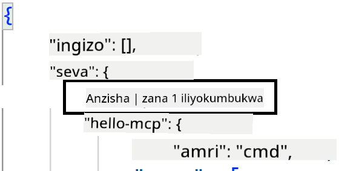
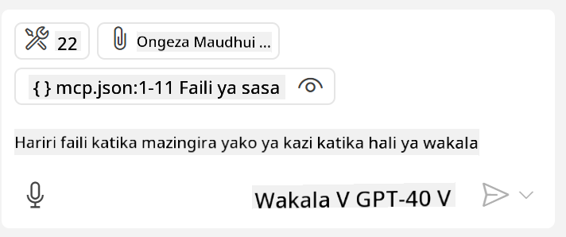
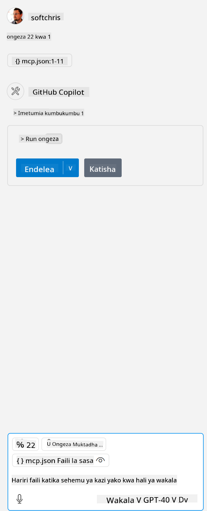

<!--
CO_OP_TRANSLATOR_METADATA:
{
  "original_hash": "c37fabfbc0dcbc9a4afb6d17e7d3be9f",
  "translation_date": "2025-05-17T11:13:33+00:00",
  "source_file": "03-GettingStarted/04-vscode/README.md",
  "language_code": "sw"
}
-->
# Kutumia seva kutoka kwa hali ya Wakala wa GitHub Copilot

Visual Studio Code na GitHub Copilot vinaweza kufanya kazi kama mteja na kutumia MCP Server. Kwa nini tungependa kufanya hivyo unaweza kuuliza? Naam, hiyo inamaanisha kwamba sifa zozote ambazo MCP Server inazo sasa zinaweza kutumika kutoka ndani ya IDE yako. Fikiria unaongeza kwa mfano seva ya MCP ya GitHub, hii itaruhusu kudhibiti GitHub kupitia maagizo badala ya kuandika amri maalum kwenye terminal. Au fikiria chochote kwa ujumla ambacho kinaweza kuboresha uzoefu wako wa maendeleo yote yakidhibitiwa na lugha ya asili. Sasa unaanza kuona faida sivyo?

## Muhtasari

Somo hili linafunika jinsi ya kutumia hali ya Wakala ya Visual Studio Code na GitHub Copilot kama mteja kwa MCP Server yako.

## Malengo ya Kujifunza

Mwisho wa somo hili, utaweza:

- Kutumia MCP Server kupitia Visual Studio Code.
- Kuendesha uwezo kama zana kupitia GitHub Copilot.
- Kusakinisha Visual Studio Code ili kupata na kusimamia MCP Server yako.

## Matumizi

Unaweza kudhibiti seva yako ya MCP kwa njia mbili tofauti:

- Kiolesura cha mtumiaji, utaona jinsi hii inavyofanyika baadaye katika sura hii.
- Terminal, inawezekana kudhibiti mambo kutoka kwenye terminal kwa kutumia `code` inayoweza kutekelezwa:

  Ili kuongeza seva ya MCP kwenye wasifu wako wa mtumiaji, tumia chaguo la mstari wa amri --add-mcp, na toa usanidi wa seva ya JSON kwa namna {\"name\":\"server-name\",\"command\":...}.

  ```
  code --add-mcp "{\"name\":\"my-server\",\"command\": \"uvx\",\"args\": [\"mcp-server-fetch\"]}"
  ```

Hebu tuzungumze zaidi kuhusu jinsi tunavyotumia kiolesura cha kuona katika sehemu zinazofuata.

## Mbinu

Hivi ndivyo tunavyohitaji kukaribia hili kwa kiwango cha juu:

- Sanidi faili ili kupata MCP Server yetu.
- Anzisha/Unganisha kwenye seva hiyo ili iweze kuorodhesha uwezo wake.
- Tumia uwezo huo kupitia kiolesura cha mazungumzo cha GitHub Copilot.

Nzuri, sasa kwa kuwa tunaelewa mtiririko, hebu jaribu kutumia MCP Server kupitia Visual Studio Code kupitia zoezi.

## Zoezi: Kutumia seva

Katika zoezi hili, tutaweka Visual Studio Code ili kupata seva yako ya MCP ili iweze kutumika kutoka kwa kiolesura cha mazungumzo cha GitHub Copilot.

### -0- Hatua ya awali, wezesha ugunduzi wa MCP Server

Unaweza kuhitaji kuwezesha ugunduzi wa MCP Servers.

1. Nenda kwa `File -> Preferences -> Settings` in Visual Studio Code.

1. Search for "MCP" and enable `chat.mcp.discovery.enabled` kwenye faili ya settings.json.

### -1- Unda faili ya usanidi

Anza kwa kuunda faili ya usanidi kwenye mzizi wa mradi wako, utahitaji faili inayoitwa MCP.json na kuiweka kwenye folda inayoitwa .vscode. Inapaswa kuonekana kama hivi:

```text
.vscode
|-- mcp.json
```

Ifuatayo, tuone jinsi tunavyoweza kuongeza kiingilio cha seva.

### -2- Sanidi seva

Ongeza maudhui yafuatayo kwenye *mcp.json*:

```json
{
    "inputs": [],
    "servers": {
       "hello-mcp": {
           "command": "cmd",
           "args": [
               "/c", "node", "<absolute path>\\build\\index.js"
           ]
       }
    }
}
```

Hapa kuna mfano rahisi juu ya jinsi ya kuanzisha seva iliyoandikwa kwa Node.js, kwa muda mwingine toa amri sahihi ya kuanzisha seva kwa kutumia `command` and `args`.

### -3- Anzisha seva

Sasa kwa kuwa umeongeza kiingilio, hebu anzisha seva:

1. Tafuta kiingilio chako kwenye *mcp.json* na hakikisha unapata ikoni ya "play":

    

1. Bonyeza ikoni ya "play", unapaswa kuona ikoni ya zana katika mazungumzo ya GitHub Copilot ikiongeza idadi ya zana zinazopatikana. Ukibonyeza ikoni ya zana hiyo, utaona orodha ya zana zilizosajiliwa. Unaweza kuangalia/kutoa alama kila zana kulingana na ikiwa unataka GitHub Copilot kuzitumia kama muktadha: 

  

1. Ili kuendesha zana, andika amri unayojua itaendana na maelezo ya moja ya zana zako, kwa mfano amri kama hii "ongeza 22 kwa 1":

  

  Unapaswa kuona jibu linalosema 23.

## Kazi

Jaribu kuongeza kiingilio cha seva kwenye faili yako ya *mcp.json* na hakikisha unaweza kuanzisha/kusimamisha seva. Hakikisha unaweza pia kuwasiliana na zana kwenye seva yako kupitia kiolesura cha mazungumzo cha GitHub Copilot.

## Suluhisho

[Suluhisho](./solution/README.md)

## Mambo Muhimu

Mambo muhimu kutoka sura hii ni yafuatayo:

- Visual Studio Code ni mteja mzuri ambao hukuruhusu kutumia seva kadhaa za MCP na zana zao.
- Kiolesura cha mazungumzo cha GitHub Copilot ndicho unachotumia kuingiliana na seva.
- Unaweza kumuuliza mtumiaji maingizo kama funguo za API ambazo zinaweza kupitishwa kwa MCP Server wakati wa kusanidi kiingilio cha seva katika faili ya *mcp.json*.

## Sampuli

- [Kikokotoo cha Java](../samples/java/calculator/README.md)
- [Kikokotoo cha .Net](../../../../03-GettingStarted/samples/csharp)
- [Kikokotoo cha JavaScript](../samples/javascript/README.md)
- [Kikokotoo cha TypeScript](../samples/typescript/README.md)
- [Kikokotoo cha Python](../../../../03-GettingStarted/samples/python) 

## Rasilimali za Ziada

- [Nyaraka za Visual Studio](https://code.visualstudio.com/docs/copilot/chat/mcp-servers)

## Nini Kifuatavyo

- Ifuatayo: [Kuunda Seva ya SSE](/03-GettingStarted/05-sse-server/README.md)

**Kanusho**: 
Hati hii imetafsiriwa kwa kutumia huduma ya tafsiri ya AI [Co-op Translator](https://github.com/Azure/co-op-translator). Ingawa tunajitahidi kwa usahihi, tafadhali fahamu kuwa tafsiri za kiotomatiki zinaweza kuwa na makosa au kutokuwa sahihi. Hati ya asili katika lugha yake ya asili inapaswa kuzingatiwa kama chanzo rasmi. Kwa taarifa muhimu, inashauriwa kutumia tafsiri ya kibinadamu ya kitaalamu. Hatutawajibika kwa kutokuelewana au tafsiri potofu zinazotokana na matumizi ya tafsiri hii.