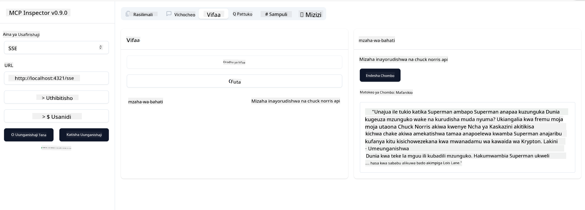

<!--
CO_OP_TRANSLATOR_METADATA:
{
  "original_hash": "0a8086dc4bf89448f83e7936db972c42",
  "translation_date": "2025-05-17T11:41:19+00:00",
  "source_file": "03-GettingStarted/05-sse-server/README.md",
  "language_code": "sw"
}
-->
Sasa tunajua kidogo zaidi kuhusu SSE, hebu tujenge seva ya SSE.

## Zoezi: Kuunda Seva ya SSE

Ili kuunda seva yetu, tunahitaji kuzingatia mambo mawili:

- Tunahitaji kutumia seva ya wavuti ili kufichua njia za kuunganisha na ujumbe.
- Jenga seva yetu kama tunavyofanya kawaida kwa kutumia zana, rasilimali na maelekezo tulipokuwa tunatumia stdio.

### -1- Unda mfano wa seva

Ili kuunda seva yetu, tunatumia aina zilezile kama tulivyofanya na stdio. Hata hivyo, kwa usafiri, tunahitaji kuchagua SSE.

Hebu tuongeze njia zinazohitajika.

### -2- Ongeza njia

Hebu tuongeze njia zinazoshughulikia muunganisho na ujumbe unaoingia:

Hebu tuongeze uwezo kwenye seva.

### -3- Kuongeza uwezo wa seva

Sasa kwa kuwa tumefafanua kila kitu kinachohusiana na SSE, hebu tuongeze uwezo wa seva kama zana, maelekezo na rasilimali.

Nambari yako kamili inapaswa kuonekana kama hivi:

Vizuri, tuna seva inayotumia SSE, hebu tuijaribu.

## Zoezi: Kusafisha Seva ya SSE na Inspector

Inspector ni zana nzuri tuliyoona katika somo la awali [Kuunda seva yako ya kwanza](/03-GettingStarted/01-first-server/README.md). Hebu tuone kama tunaweza kutumia Inspector hata hapa:

### -1- Kuendesha inspector

Ili kuendesha inspector, lazima kwanza uwe na seva ya SSE inayoendesha, kwa hivyo hebu tufanye hivyo:

1. Endesha seva

1. Endesha inspector

    > ![NOTE]
    > Endesha hii kwenye dirisha tofauti la terminal kuliko ile seva inayoendesha. Pia kumbuka, unahitaji kurekebisha amri iliyo chini ili kuendana na URL ambapo seva yako inaendesha.

    ```sh
    npx @modelcontextprotocol/inspector --cli http://localhost:8000/sse --method tools/list
    ```

    Kuendesha inspector kunaonekana sawa katika mazingira yote. Angalia jinsi badala ya kupitisha njia ya seva yetu na amri ya kuanza seva tunapitisha URL ambapo seva inaendesha na pia tunabainisha njia ya `/sse`.

### -2- Kujaribu zana

Unganisha seva kwa kuchagua SSE katika droplist na kujaza uwanja wa URL ambapo seva yako inaendesha, kwa mfano http:localhost:4321/sse. Sasa bonyeza kitufe cha "Connect". Kama awali, chagua kuorodhesha zana, chagua zana na toa thamani za pembejeo. Unapaswa kuona matokeo kama yafuatayo:



Vizuri, unaweza kufanya kazi na inspector, hebu tuone jinsi tunavyoweza kufanya kazi na Visual Studio Code.

## Kazi

Jaribu kujenga seva yako na uwezo zaidi. Angalia [ukurasa huu](https://api.chucknorris.io/) ili kwa mfano kuongeza zana inayopiga API, wewe amua seva inapaswa kuonekana vipi. Furahia :)

## Suluhisho

[Suluhisho](./solution/README.md) Hapa kuna suluhisho linalowezekana na nambari inayofanya kazi.

## Mambo Muhimu

Mambo muhimu kutoka sura hii ni kama ifuatavyo:

- SSE ni usafiri wa pili unaoungwa mkono baada ya stdio.
- Ili kusaidia SSE, unahitaji kudhibiti miunganisho inayoingia na ujumbe kwa kutumia mfumo wa wavuti.
- Unaweza kutumia Inspector na Visual Studio Code ili kutumia seva ya SSE, kama seva za stdio. Angalia jinsi inavyotofautiana kidogo kati ya stdio na SSE. Kwa SSE, unahitaji kuanzisha seva kando na kisha kuendesha zana yako ya inspector. Kwa zana ya inspector, kuna tofauti katika kwamba unahitaji kubainisha URL.

## Sampuli

- [Java Calculator](../samples/java/calculator/README.md)
- [.Net Calculator](../../../../03-GettingStarted/samples/csharp)
- [JavaScript Calculator](../samples/javascript/README.md)
- [TypeScript Calculator](../samples/typescript/README.md)
- [Python Calculator](../../../../03-GettingStarted/samples/python)

## Rasilimali za Ziada

- [SSE](https://developer.mozilla.org/en-US/docs/Web/API/Server-sent_events)

## Kinachofuata

- Kinachofuata: [Kuanza na AI Toolkit kwa VSCode](/03-GettingStarted/06-aitk/README.md)

**Kanusho**:  
Hati hii imetafsiriwa kwa kutumia huduma ya tafsiri ya AI [Co-op Translator](https://github.com/Azure/co-op-translator). Ingawa tunajitahidi kwa usahihi, tafadhali fahamu kuwa tafsiri za kiotomatiki zinaweza kuwa na makosa au kutokuwa sahihi. Hati ya asili katika lugha yake ya asili inapaswa kuzingatiwa kama chanzo cha mamlaka. Kwa taarifa muhimu, tafsiri ya kitaalamu ya binadamu inapendekezwa. Hatutawajibika kwa kutoelewana au tafsiri potofu zinazotokana na matumizi ya tafsiri hii.