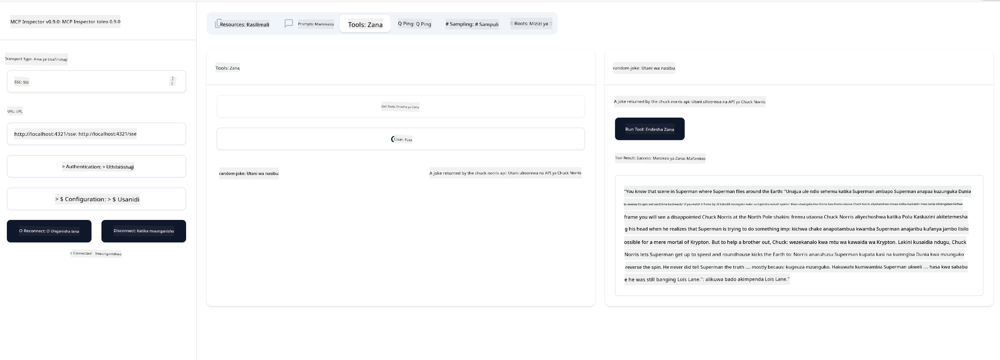

<!--
CO_OP_TRANSLATOR_METADATA:
{
  "original_hash": "1681ca3633aeb49ee03766abdbb94a93",
  "translation_date": "2025-06-17T22:23:58+00:00",
  "source_file": "03-GettingStarted/05-sse-server/README.md",
  "language_code": "sw"
}
-->
Sasa tunapojua kidogo zaidi kuhusu SSE, hebu tujenge seva ya SSE.

## Zoef: Kuunda Seva ya SSE

Ili kuunda seva yetu, tunahitaji kumbuka mambo mawili:

- Tunahitaji kutumia seva ya wavuti kufungua njia za kuunganishwa na ujumbe.
- Jenga seva yetu kama kawaida tunavyofanya kwa kutumia zana, rasilimali na maelekezo tulipokuwa tunatumia stdio.

### -1- Tengeneza mfano wa seva

Ili kuunda seva yetu, tunatumia aina zile zile kama kwa stdio. Hata hivyo, kwa usafirishaji, tunahitaji kuchagua SSE.

Hebu tuongeze njia zinazohitajika sasa.

### -2- Ongeza njia

Tuongeze njia zinazoshughulikia muunganisho na ujumbe unaokuja:

Hebu tuongeze uwezo kwa seva sasa.

### -3- Kuongeza uwezo wa seva

Sasa tunapokuwa tumedefine kila kitu kinachohusiana na SSE, tuongeze uwezo wa seva kama zana, maelekezo na rasilimali.

Msimbo wako kamili unapaswa kuonekana kama huu:

Nzuri, tuna seva inayotumia SSE, hebu tujaribu sasa.

## Zoef: Kufuatilia kosa la Seva ya SSE kwa Inspector

Inspector ni zana nzuri tuliyoiona katika somo la awali [Kuunda seva yako ya kwanza](/03-GettingStarted/01-first-server/README.md). Hebu tuone kama tunaweza kutumia Inspector hata hapa:

### -1- Kuendesha inspector

Ili kuendesha inspector, kwanza lazima seva ya SSE iwe inafanya kazi, kwa hiyo hebu fanya hivyo sasa:

1. Endesha seva

1. Endesha inspector

    > ![NOTE]
    > Endesha hii katika dirisha tofauti la terminal kuliko ile seva inayoendesha. Pia kumbuka, unahitaji kurekebisha amri iliyo chini ili ifanane na URL ambapo seva yako inaendesha.

    ```sh
    npx @modelcontextprotocol/inspector --cli http://localhost:8000/sse --method tools/list
    ```

    Kuendesha inspector kunaonekana sawa katika mazingira yote ya utekelezaji. Angalia jinsi badala ya kutoa njia ya seva yetu na amri ya kuanzisha seva tunatoa URL ambapo seva inaendesha na pia tunabainisha njia `/sse`.

### -2- Kuangalia zana

Unganisha seva kwa kuchagua SSE kwenye orodha ya kushuka na jaza sehemu ya url ambapo seva yako inaendesha, kwa mfano http:localhost:4321/sse. Sasa bonyeza kitufe cha "Connect". Kama awali, chagua kuorodhesha zana, chagua zana na toa thamani za ingizo. Unapaswa kuona matokeo kama ifuatavyo:



Nzuri, unaweza kufanya kazi na inspector, hebu tuone jinsi ya kufanya kazi na Visual Studio Code sasa.

## Kazi ya Nyumbani

Jaribu kujenga seva yako na uwezo zaidi. Angalia [ukurasa huu](https://api.chucknorris.io/) kuongeza, kwa mfano, zana inayopiga API. Uamuzi ni wako jinsi seva inavyopaswa kuonekana. Furahia :)

## Suluhisho

[Suluhisho](./solution/README.md) Hapa kuna suluhisho linalowezekana lenye msimbo unaofanya kazi.

## Muhimu Kumbuka

Mambo muhimu ya kukumbuka kutoka sura hii ni yafuatayo:

- SSE ni aina ya pili ya usafirishaji inayoungwa mkono baada ya stdio.
- Ili kuunga mkono SSE, unahitaji kusimamia miunganisho na ujumbe unaokuja kwa kutumia mfumo wa wavuti.
- Unaweza kutumia Inspector na Visual Studio Code kula seva ya SSE, kama vile seva za stdio. Angalia jinsi inavyotofautiana kidogo kati ya stdio na SSE. Kwa SSE, unahitaji kuanzisha seva kando na kisha kuendesha zana yako ya inspector. Kwa zana ya inspector, pia kuna tofauti kidogo kwamba unahitaji kubainisha URL.

## Sampuli

- [Kalkuleta ya Java](../samples/java/calculator/README.md)
- [Kalkuleta ya .Net](../../../../03-GettingStarted/samples/csharp)
- [Kalkuleta ya JavaScript](../samples/javascript/README.md)
- [Kalkuleta ya TypeScript](../samples/typescript/README.md)
- [Kalkuleta ya Python](../../../../03-GettingStarted/samples/python)

## Rasilimali Zaidi

- [SSE](https://developer.mozilla.org/en-US/docs/Web/API/Server-sent_events)

## Nini Kifuatacho

- Ifuatayo: [HTTP Streaming na MCP (Streamable HTTP)](/03-GettingStarted/06-http-streaming/README.md)

**Kengele ya Kutolea Maelezo**:  
Hati hii imetafsiriwa kwa kutumia huduma ya tafsiri ya AI [Co-op Translator](https://github.com/Azure/co-op-translator). Ingawa tunajitahidi kuhakikisha usahihi, tafadhali fahamu kuwa tafsiri za kiotomatiki zinaweza kuwa na makosa au upungufu wa usahihi. Hati ya asili katika lugha yake ya asili inapaswa kuchukuliwa kama chanzo cha mamlaka. Kwa taarifa muhimu, tafsiri ya kitaalamu inayofanywa na binadamu inashauriwa. Hatuna dhamana kwa kutoelewana au tafsiri potofu zinazotokana na matumizi ya tafsiri hii.