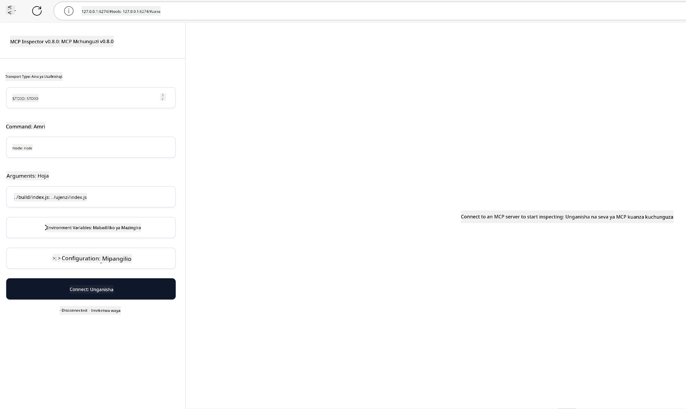

<!--
CO_OP_TRANSLATOR_METADATA:
{
  "original_hash": "4e34e34e84f013e73c7eaa6d09884756",
  "translation_date": "2025-07-13T22:02:56+00:00",
  "source_file": "03-GettingStarted/08-testing/README.md",
  "language_code": "sw"
}
-->
## Kupima na Kurekebisha Hitilafu

Kabla hujaanza kupima seva yako ya MCP, ni muhimu kuelewa zana zinazopatikana na mbinu bora za kurekebisha hitilafu. Kupima kwa ufanisi kunahakikisha seva yako inafanya kazi kama inavyotarajiwa na kukusaidia kugundua na kutatua matatizo haraka. Sehemu ifuatayo inaelezea mbinu zinazopendekezwa za kuthibitisha utekelezaji wako wa MCP.

## Muhtasari

Somo hili linashughulikia jinsi ya kuchagua mbinu sahihi ya kupima na zana bora zaidi za kupima.

## Malengo ya Kujifunza

Mwisho wa somo hili, utaweza:

- Kuelezea mbinu mbalimbali za kupima.
- Kutumia zana tofauti kupima msimbo wako kwa ufanisi.

## Kupima Seva za MCP

MCP hutoa zana za kusaidia kupima na kurekebisha seva zako:

- **MCP Inspector**: Zana ya mstari wa amri inayoweza kutumika kama zana ya CLI na pia kama zana ya kuona.
- **Kupima kwa mkono**: Unaweza kutumia zana kama curl kutuma maombi ya wavuti, lakini zana yoyote inayoweza kutuma HTTP itafanya kazi.
- **Kupima kwa vitengo**: Inawezekana kutumia mfumo wako unaopendelea wa kupima ili kupima vipengele vya seva na mteja.

### Kutumia MCP Inspector

Tumeelezea matumizi ya zana hii katika masomo yaliyopita lakini hebu tuzungumzie kidogo kwa ujumla. Ni zana iliyojengwa kwa Node.js na unaweza kuitumia kwa kuita kifanyike `npx` ambacho kitapakua na kusakinisha zana hiyo kwa muda na kisha kuondoa kila kitu baada ya kumaliza kuendesha ombi lako.

[MCP Inspector](https://github.com/modelcontextprotocol/inspector) inakusaidia:

- **Gundua Uwezo wa Seva**: Kugundua rasilimali, zana, na maelekezo yanayopatikana moja kwa moja
- **Jaribu Uendeshaji wa Zana**: Jaribu vigezo tofauti na uone majibu kwa wakati halisi
- **Tazama Metadata ya Seva**: Chunguza taarifa za seva, skimu, na usanidi

Kuendesha zana hii kawaida huonekana kama ifuatavyo:

```bash
npx @modelcontextprotocol/inspector node build/index.js
```

Amri hapo juu inaanzisha MCP na kiolesura chake cha kuona na kuanzisha kiolesura cha wavuti cha ndani kwenye kivinjari chako. Unaweza kutarajia kuona dashibodi inayoonyesha seva zako za MCP zilizosajiliwa, zana zao zinazopatikana, rasilimali, na maelekezo. Kiolesura hiki kinakuwezesha kupima uendeshaji wa zana kwa njia ya mwingiliano, kuchunguza metadata ya seva, na kuona majibu kwa wakati halisi, jambo linalorahisisha kuthibitisha na kurekebisha utekelezaji wa seva zako za MCP.

Hivi ndivyo kinaweza kuonekana: 

Pia unaweza kuendesha zana hii kwa njia ya CLI ambapo unatumia sifa `--cli`. Hapa kuna mfano wa kuendesha zana kwa njia ya "CLI" inayoorodhesha zana zote kwenye seva:

```sh
npx @modelcontextprotocol/inspector --cli node build/index.js --method tools/list
```

### Kupima kwa Mkono

Mbali na kuendesha zana ya inspector kupima uwezo wa seva, njia nyingine inayofanana ni kuendesha mteja anayeweza kutumia HTTP kama vile curl.

Kwa curl, unaweza kupima seva za MCP moja kwa moja kwa kutumia maombi ya HTTP:

```bash
# Example: Test server metadata
curl http://localhost:3000/v1/metadata

# Example: Execute a tool
curl -X POST http://localhost:3000/v1/tools/execute \
  -H "Content-Type: application/json" \
  -d '{"name": "calculator", "parameters": {"expression": "2+2"}}'
```

Kama unavyoona kutoka kwa matumizi ya curl hapo juu, unatumia ombi la POST kuitisha zana kwa kutumia mzigo wa data unaojumuisha jina la zana na vigezo vyake. Tumia mbinu inayokufaa zaidi. Zana za CLI kwa ujumla huwa haraka kutumia na zinaweza kuandikwa kwa maandishi (script) jambo ambalo linaweza kuwa na manufaa katika mazingira ya CI/CD.

### Kupima kwa Vitengo

Tengeneza vipimo vya vitengo kwa zana na rasilimali zako ili kuhakikisha zinafanya kazi kama inavyotarajiwa. Hapa kuna mfano wa msimbo wa kupima.

```python
import pytest

from mcp.server.fastmcp import FastMCP
from mcp.shared.memory import (
    create_connected_server_and_client_session as create_session,
)

# Mark the whole module for async tests
pytestmark = pytest.mark.anyio


async def test_list_tools_cursor_parameter():
    """Test that the cursor parameter is accepted for list_tools.

    Note: FastMCP doesn't currently implement pagination, so this test
    only verifies that the cursor parameter is accepted by the client.
    """

 server = FastMCP("test")

    # Create a couple of test tools
    @server.tool(name="test_tool_1")
    async def test_tool_1() -> str:
        """First test tool"""
        return "Result 1"

    @server.tool(name="test_tool_2")
    async def test_tool_2() -> str:
        """Second test tool"""
        return "Result 2"

    async with create_session(server._mcp_server) as client_session:
        # Test without cursor parameter (omitted)
        result1 = await client_session.list_tools()
        assert len(result1.tools) == 2

        # Test with cursor=None
        result2 = await client_session.list_tools(cursor=None)
        assert len(result2.tools) == 2

        # Test with cursor as string
        result3 = await client_session.list_tools(cursor="some_cursor_value")
        assert len(result3.tools) == 2

        # Test with empty string cursor
        result4 = await client_session.list_tools(cursor="")
        assert len(result4.tools) == 2
    
```

Msimbo uliotangulia unafanya yafuatayo:

- Unatumia mfumo wa pytest unaokuwezesha kuunda vipimo kama kazi na kutumia kauli za assert.
- Unaunda Seva ya MCP yenye zana mbili tofauti.
- Unatumia kauli ya `assert` kuhakikisha masharti fulani yamekamilika.

Tazama [faili kamili hapa](https://github.com/modelcontextprotocol/python-sdk/blob/main/tests/client/test_list_methods_cursor.py)

Kwa kuzingatia faili hapo juu, unaweza kupima seva yako mwenyewe kuhakikisha uwezo umeundwa kama inavyotakiwa.

SDK zote kuu zina sehemu zinazofanana za kupima hivyo unaweza kubadilisha kulingana na mazingira yako ya utekelezaji.

## Sampuli

- [Kalkuleta ya Java](../samples/java/calculator/README.md)
- [Kalkuleta ya .Net](../../../../03-GettingStarted/samples/csharp)
- [Kalkuleta ya JavaScript](../samples/javascript/README.md)
- [Kalkuleta ya TypeScript](../samples/typescript/README.md)
- [Kalkuleta ya Python](../../../../03-GettingStarted/samples/python)

## Rasilimali Zaidi

- [Python SDK](https://github.com/modelcontextprotocol/python-sdk)

## Nini Kifuatacho

- Ifuatayo: [Utekelezaji](../09-deployment/README.md)

**Kiarifu cha Kutotegemea**:  
Hati hii imetafsiriwa kwa kutumia huduma ya tafsiri ya AI [Co-op Translator](https://github.com/Azure/co-op-translator). Ingawa tunajitahidi kwa usahihi, tafadhali fahamu kwamba tafsiri za kiotomatiki zinaweza kuwa na makosa au upungufu wa usahihi. Hati ya asili katika lugha yake ya asili inapaswa kuchukuliwa kama chanzo cha mamlaka. Kwa taarifa muhimu, tafsiri ya kitaalamu inayofanywa na binadamu inapendekezwa. Hatubebei dhamana kwa kutoelewana au tafsiri potofu zinazotokana na matumizi ya tafsiri hii.