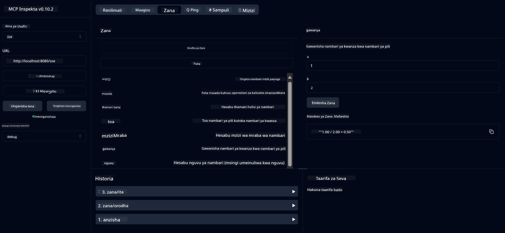

<!--
CO_OP_TRANSLATOR_METADATA:
{
  "original_hash": "13231e9951b68efd9df8c56bd5cdb27e",
  "translation_date": "2025-07-13T22:30:01+00:00",
  "source_file": "03-GettingStarted/samples/java/calculator/README.md",
  "language_code": "sw"
}
-->
# Basic Calculator MCP Service

Huduma hii hutoa shughuli za msingi za kalkuleta kupitia Model Context Protocol (MCP) kwa kutumia Spring Boot na usafirishaji wa WebFlux. Imeundwa kama mfano rahisi kwa wanaoanza kujifunza kuhusu utekelezaji wa MCP.

Kwa maelezo zaidi, angalia nyaraka za rejea za [MCP Server Boot Starter](https://docs.spring.io/spring-ai/reference/api/mcp/mcp-server-boot-starter-docs.html).

## Muhtasari

Huduma inaonyesha:
- Msaada wa SSE (Server-Sent Events)
- Usajili wa zana moja kwa moja kwa kutumia alama ya `@Tool` ya Spring AI
- Kazi za msingi za kalkuleta:
  - Jumla, utofauti, kuzidisha, kugawanya
  - Hesabu ya nguvu na mzizi wa mraba
  - Modulus (salio) na thamani kamili
  - Kazi ya msaada kwa maelezo ya shughuli

## Sifa

Huduma hii ya kalkuleta inatoa uwezo ufuatao:

1. **Shughuli za Msingi za Hisabati**:
   - Kuongeza nambari mbili
   - Kutoa nambari moja kutoka nyingine
   - Kuzidisha nambari mbili
   - Kugawanya nambari moja kwa nyingine (ikiwa na ukaguzi wa kugawanya kwa sifuri)

2. **Shughuli za Juu**:
   - Hesabu ya nguvu (kuinua msingi kwa nguvu fulani)
   - Hesabu ya mzizi wa mraba (ikiwa na ukaguzi wa nambari hasi)
   - Hesabu ya modulus (salio)
   - Hesabu ya thamani kamili

3. **Mfumo wa Msaada**:
   - Kazi ya msaada iliyojengwa kuelezea shughuli zote zinazopatikana

## Jinsi ya Kutumia Huduma

Huduma inaonyesha API zifuatazo kupitia itifaki ya MCP:

- `add(a, b)`: Ongeza nambari mbili pamoja
- `subtract(a, b)`: Toa nambari ya pili kutoka ya kwanza
- `multiply(a, b)`: Zidisha nambari mbili
- `divide(a, b)`: Gawanya nambari ya kwanza kwa ya pili (ikiwa na ukaguzi wa sifuri)
- `power(base, exponent)`: Hesabu nguvu ya nambari
- `squareRoot(number)`: Hesabu mzizi wa mraba (ikiwa na ukaguzi wa nambari hasi)
- `modulus(a, b)`: Hesabu salio la kugawanya
- `absolute(number)`: Hesabu thamani kamili
- `help()`: Pata taarifa kuhusu shughuli zinazopatikana

## Mteja wa Mtihani

Mteja rahisi wa mtihani umejumuishwa katika kifurushi `com.microsoft.mcp.sample.client`. Darasa la `SampleCalculatorClient` linaonyesha shughuli zinazopatikana za huduma ya kalkuleta.

## Kutumia Mteja wa LangChain4j

Mradi huu unajumuisha mfano wa mteja wa LangChain4j katika `com.microsoft.mcp.sample.client.LangChain4jClient` unaoonyesha jinsi ya kuunganisha huduma ya kalkuleta na LangChain4j pamoja na mifano ya GitHub:

### Mahitaji ya Awali

1. **Kuweka Tokeni ya GitHub**:
   
   Ili kutumia mifano ya AI ya GitHub (kama phi-4), unahitaji tokeni ya ufikiaji wa kibinafsi ya GitHub:

   a. Nenda kwenye mipangilio ya akaunti yako ya GitHub: https://github.com/settings/tokens
   
   b. Bonyeza "Generate new token" → "Generate new token (classic)"
   
   c. Toa jina linaloelezea tokeni yako
   
   d. Chagua maeneo yafuatayo:
      - `repo` (Udhibiti kamili wa hifadhidata binafsi)
      - `read:org` (Soma uanachama wa shirika na timu, soma miradi ya shirika)
      - `gist` (Tengeneza gists)
      - `user:email` (Pata anwani za barua pepe za mtumiaji (kusoma tu))
   
   e. Bonyeza "Generate token" na nakili tokeni yako mpya
   
   f. Iwekee kama variable ya mazingira:
      
      Kwa Windows:
      ```
      set GITHUB_TOKEN=your-github-token
      ```
      
      Kwa macOS/Linux:
      ```bash
      export GITHUB_TOKEN=your-github-token
      ```

   g. Kwa usanidi wa kudumu, ongeza kwenye variable za mazingira kupitia mipangilio ya mfumo

2. Ongeza utegemezi wa LangChain4j GitHub kwenye mradi wako (umejumuishwa tayari katika pom.xml):
   ```xml
   <dependency>
       <groupId>dev.langchain4j</groupId>
       <artifactId>langchain4j-github</artifactId>
       <version>${langchain4j.version}</version>
   </dependency>
   ```

3. Hakikisha seva ya kalkuleta inaendesha kwenye `localhost:8080`

### Kuendesha Mteja wa LangChain4j

Mfano huu unaonyesha:
- Kuunganishwa na seva ya MCP ya kalkuleta kupitia usafirishaji wa SSE
- Kutumia LangChain4j kuunda roboti wa mazungumzo unaotumia shughuli za kalkuleta
- Kuunganisha na mifano ya AI ya GitHub (sasa ikitumia mfano wa phi-4)

Mteja hutuma maswali yafuatayo kama mfano kuonyesha utendaji:
1. Kuhesabu jumla ya nambari mbili
2. Kupata mzizi wa mraba wa nambari
3. Kupata taarifa za msaada kuhusu shughuli za kalkuleta zinazopatikana

Endesha mfano na angalia matokeo kwenye console kuona jinsi mfano wa AI unavyotumia zana za kalkuleta kujibu maswali.

### Usanidi wa Mfano wa GitHub

Mteja wa LangChain4j umewekwa kutumia mfano wa phi-4 wa GitHub kwa mipangilio ifuatayo:

```java
ChatLanguageModel model = GitHubChatModel.builder()
    .apiKey(System.getenv("GITHUB_TOKEN"))
    .timeout(Duration.ofSeconds(60))
    .modelName("phi-4")
    .logRequests(true)
    .logResponses(true)
    .build();
```

Ili kutumia mifano tofauti ya GitHub, badilisha tu parameter ya `modelName` kwa mfano mwingine unaoungwa mkono (mfano, "claude-3-haiku-20240307", "llama-3-70b-8192", n.k.).

## Tegemezi

Mradi unahitaji utegemezi muhimu ufuatao:

```xml
<!-- For MCP Server -->
<dependency>
    <groupId>org.springframework.ai</groupId>
    <artifactId>spring-ai-starter-mcp-server-webflux</artifactId>
</dependency>

<!-- For LangChain4j integration -->
<dependency>
    <groupId>dev.langchain4j</groupId>
    <artifactId>langchain4j-mcp</artifactId>
    <version>${langchain4j.version}</version>
</dependency>

<!-- For GitHub models support -->
<dependency>
    <groupId>dev.langchain4j</groupId>
    <artifactId>langchain4j-github</artifactId>
    <version>${langchain4j.version}</version>
</dependency>
```

## Kujenga Mradi

Jenga mradi kwa kutumia Maven:
```bash
./mvnw clean install -DskipTests
```

## Kuendesha Seva

### Kutumia Java

```bash
java -jar target/calculator-server-0.0.1-SNAPSHOT.jar
```

### Kutumia MCP Inspector

MCP Inspector ni zana ya msaada kwa kuingiliana na huduma za MCP. Ili kuitumia na huduma hii ya kalkuleta:

1. **Sakinisha na endesha MCP Inspector** katika dirisha jipya la terminal:
   ```bash
   npx @modelcontextprotocol/inspector
   ```

2. **Fikia UI ya wavuti** kwa kubonyeza URL inayotolewa na programu (kawaida http://localhost:6274)

3. **Sanidi muunganisho**:
   - Weka aina ya usafirishaji kuwa "SSE"
   - Weka URL ya endpoint ya SSE ya seva yako inayotumika: `http://localhost:8080/sse`
   - Bonyeza "Connect"

4. **Tumia zana**:
   - Bonyeza "List Tools" kuona shughuli za kalkuleta zinazopatikana
   - Chagua zana na bonyeza "Run Tool" kutekeleza shughuli



### Kutumia Docker

Mradi unajumuisha Dockerfile kwa ajili ya uenezaji wa kontena:

1. **Jenga picha ya Docker**:
   ```bash
   docker build -t calculator-mcp-service .
   ```

2. **Endesha kontena la Docker**:
   ```bash
   docker run -p 8080:8080 calculator-mcp-service
   ```

Hii itafanya:
- Kujenga picha ya Docker yenye hatua nyingi kwa Maven 3.9.9 na Eclipse Temurin 24 JDK
- Kuunda picha ya kontena iliyoboreshwa
- Kufungua huduma kwenye bandari 8080
- Kuanzisha huduma ya kalkuleta ya MCP ndani ya kontena

Unaweza kufikia huduma kwa `http://localhost:8080` mara kontena linapoanza.

## Utatuzi wa Matatizo

### Masuala ya Kawaida na Tokeni ya GitHub

1. **Masuala ya Ruhusa za Tokeni**: Ikiwa unapata kosa la 403 Forbidden, hakikisha tokeni yako ina ruhusa sahihi kama ilivyoelezwa katika mahitaji ya awali.

2. **Tokeni Haipatikani**: Ikiwa unapata kosa la "No API key found", hakikisha variable ya mazingira GITHUB_TOKEN imewekwa vizuri.

3. **Kizuizi cha Kiwango cha Matumizi**: API ya GitHub ina vizingiti vya kiwango cha matumizi. Ikiwa unakutana na kosa la kizuizi cha kiwango (msimbo wa hali 429), subiri dakika chache kisha jaribu tena.

4. **Muda wa Kuisha wa Tokeni**: Tokeni za GitHub zinaweza kuisha muda. Ikiwa unapata makosa ya uthibitishaji baada ya muda, tengeneza tokeni mpya na sasisha variable yako ya mazingira.

Ikiwa unahitaji msaada zaidi, angalia [nyaraka za LangChain4j](https://github.com/langchain4j/langchain4j) au [nyaraka za API ya GitHub](https://docs.github.com/en/rest).

**Kiarifu cha Kutotegemea**:  
Hati hii imetafsiriwa kwa kutumia huduma ya tafsiri ya AI [Co-op Translator](https://github.com/Azure/co-op-translator). Ingawa tunajitahidi kwa usahihi, tafadhali fahamu kuwa tafsiri za kiotomatiki zinaweza kuwa na makosa au upungufu wa usahihi. Hati ya asili katika lugha yake ya asili inapaswa kuchukuliwa kama chanzo cha mamlaka. Kwa taarifa muhimu, tafsiri ya kitaalamu inayofanywa na binadamu inapendekezwa. Hatubebei dhamana kwa kutoelewana au tafsiri potofu zinazotokana na matumizi ya tafsiri hii.