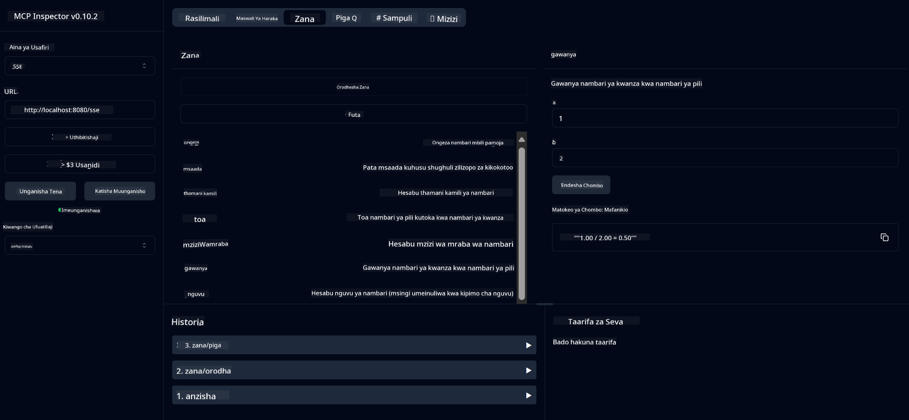

<!--
CO_OP_TRANSLATOR_METADATA:
{
  "original_hash": "13231e9951b68efd9df8c56bd5cdb27e",
  "translation_date": "2025-05-17T13:16:06+00:00",
  "source_file": "03-GettingStarted/samples/java/calculator/README.md",
  "language_code": "sw"
}
-->
# Huduma ya Msingi ya Kikokotozi MCP

Huduma hii inatoa operesheni za kimsingi za kikokotozi kupitia Model Context Protocol (MCP) ikitumia Spring Boot na WebFlux transport. Imeundwa kama mfano rahisi kwa wanaoanza kujifunza kuhusu utekelezaji wa MCP.

Kwa maelezo zaidi, angalia nyaraka za rejea za [MCP Server Boot Starter](https://docs.spring.io/spring-ai/reference/api/mcp/mcp-server-boot-starter-docs.html).

## Muhtasari

Huduma hii inaonyesha:
- Msaada kwa SSE (Matukio Yanayotumwa na Server)
- Usajili wa zana moja kwa moja ukitumia `@Tool` ya Spring AI
- Kazi za kimsingi za kikokotozi:
  - Kuongeza, kutoa, kuzidisha, kugawanya
  - Kuhesabu nguvu na mzizi wa mraba
  - Modulus (kiasi kilichobaki) na thamani kamili
  - Kazi ya msaada kwa maelezo ya operesheni

## Sifa

Huduma hii ya kikokotozi inatoa uwezo ufuatao:

1. **Operesheni za Kimsingi za Hesabu**:
   - Kuongeza namba mbili
   - Kutoa namba moja kutoka kwa nyingine
   - Kuzidisha namba mbili
   - Kugawanya namba moja kwa nyingine (na ukaguzi wa kugawanya kwa sifuri)

2. **Operesheni za Juu**:
   - Kuhesabu nguvu (kuinua msingi kwa kipimo)
   - Kuhesabu mzizi wa mraba (na ukaguzi wa namba hasi)
   - Kuhesabu modulus (kiasi kilichobaki)
   - Kuhesabu thamani kamili

3. **Mfumo wa Msaada**:
   - Kazi ya msaada iliyojengwa ndani inayofafanua operesheni zote zinazopatikana

## Kutumia Huduma

Huduma hii inatoa API endpoints zifuatazo kupitia MCP protocol:

- `add(a, b)`: Ongeza namba mbili pamoja
- `subtract(a, b)`: Towa namba ya pili kutoka ya kwanza
- `multiply(a, b)`: Zidisha namba mbili
- `divide(a, b)`: Gawa namba ya kwanza kwa ya pili (na ukaguzi wa sifuri)
- `power(base, exponent)`: Hesabu nguvu ya namba
- `squareRoot(number)`: Hesabu mzizi wa mraba (na ukaguzi wa namba hasi)
- `modulus(a, b)`: Hesabu kiasi kilichobaki wakati wa kugawanya
- `absolute(number)`: Hesabu thamani kamili
- `help()`: Pata maelezo kuhusu operesheni zinazopatikana

## Mteja wa Mtihani

Mteja rahisi wa mtihani umejumuishwa katika kifurushi cha `com.microsoft.mcp.sample.client`. Darasa la `SampleCalculatorClient` linaonyesha operesheni zinazopatikana za huduma ya kikokotozi.

## Kutumia Mteja wa LangChain4j

Mradi unajumuisha mteja wa mfano wa LangChain4j katika `com.microsoft.mcp.sample.client.LangChain4jClient` unaoonyesha jinsi ya kuunganisha huduma ya kikokotozi na LangChain4j na mifano ya GitHub:

### Mahitaji ya Awali

1. **Usanidi wa Tokeni ya GitHub**:
   
   Ili kutumia mifano ya AI ya GitHub (kama phi-4), unahitaji tokeni ya kibinafsi ya GitHub:

   a. Nenda kwenye mipangilio ya akaunti yako ya GitHub: https://github.com/settings/tokens
   
   b. Bonyeza "Generate new token" → "Generate new token (classic)"
   
   c. Pea tokeni yako jina la kuelezea
   
   d. Chagua maeneo yafuatayo:
      - `repo` (Udhibiti kamili wa hifadhi binafsi)
      - `read:org` (Soma uanachama wa org na timu, soma miradi ya org)
      - `gist` (Unda gists)
      - `user:email` (Fikia anwani za barua pepe za mtumiaji (soma tu))
   
   e. Bonyeza "Generate token" na nakili tokeni yako mpya
   
   f. Iweke kama mazingira ya kutofautiana:
      
      Kwenye Windows:
      ```
      set GITHUB_TOKEN=your-github-token
      ```
      
      Kwenye macOS/Linux:
      ```bash
      export GITHUB_TOKEN=your-github-token
      ```

   g. Kwa usanidi wa kudumu, ongeza kwenye mazingira yako ya kutofautiana kupitia mipangilio ya mfumo

2. Ongeza utegemezi wa LangChain4j GitHub kwenye mradi wako (tayari imejumuishwa katika pom.xml):
   ```xml
   <dependency>
       <groupId>dev.langchain4j</groupId>
       <artifactId>langchain4j-github</artifactId>
       <version>${langchain4j.version}</version>
   </dependency>
   ```

3. Hakikisha seva ya kikokotozi inafanya kazi kwenye `localhost:8080`

### Kuendesha Mteja wa LangChain4j

Mfano huu unaonyesha:
- Kuunganisha kwenye seva ya kikokotozi ya MCP kupitia usafiri wa SSE
- Kutumia LangChain4j kuunda roboti ya mazungumzo inayotumia operesheni za kikokotozi
- Kuunganisha na mifano ya AI ya GitHub (sasa ukitumia mfano wa phi-4)

Mteja hutuma maswali ya mfano yafuatayo kuonyesha utendaji:
1. Kuhesabu jumla ya namba mbili
2. Kupata mzizi wa mraba wa namba
3. Kupata maelezo ya msaada kuhusu operesheni za kikokotozi zinazopatikana

Endesha mfano na angalia matokeo ya console ili kuona jinsi mfano wa AI unavyotumia zana za kikokotozi kujibu maswali.

### Usanidi wa Mfano wa GitHub

Mteja wa LangChain4j umewekwa kutumia mfano wa phi-4 wa GitHub na mipangilio ifuatayo:

```java
ChatLanguageModel model = GitHubChatModel.builder()
    .apiKey(System.getenv("GITHUB_TOKEN"))
    .timeout(Duration.ofSeconds(60))
    .modelName("phi-4")
    .logRequests(true)
    .logResponses(true)
    .build();
```

Ili kutumia mifano tofauti ya GitHub, badilisha tu parameter ya `modelName` kwa mfano mwingine unaoungwa mkono (mfano, "claude-3-haiku-20240307", "llama-3-70b-8192", nk).

## Utegemezi

Mradi unahitaji utegemezi muhimu ufuatao:

```xml
<!-- For MCP Server -->
<dependency>
    <groupId>org.springframework.ai</groupId>
    <artifactId>spring-ai-starter-mcp-server-webflux</artifactId>
</dependency>

<!-- For LangChain4j integration -->
<dependency>
    <groupId>dev.langchain4j</groupId>
    <artifactId>langchain4j-mcp</artifactId>
    <version>${langchain4j.version}</version>
</dependency>

<!-- For GitHub models support -->
<dependency>
    <groupId>dev.langchain4j</groupId>
    <artifactId>langchain4j-github</artifactId>
    <version>${langchain4j.version}</version>
</dependency>
```

## Kujenga Mradi

Jenga mradi ukitumia Maven:
```bash
./mvnw clean install -DskipTests
```

## Kuendesha Seva

### Kutumia Java

```bash
java -jar target/calculator-server-0.0.1-SNAPSHOT.jar
```

### Kutumia MCP Inspector

MCP Inspector ni zana muhimu kwa kuingiliana na huduma za MCP. Ili kuitumia na huduma hii ya kikokotozi:

1. **Sakinisha na endesha MCP Inspector** katika dirisha jipya la terminal:
   ```bash
   npx @modelcontextprotocol/inspector
   ```

2. **Fikia UI ya wavuti** kwa kubofya URL inayoonyeshwa na programu (kwa kawaida http://localhost:6274)

3. **Sanidi muunganisho**:
   - Weka aina ya usafiri kuwa "SSE"
   - Weka URL kwa endpoint ya SSE ya seva yako inayofanya kazi: `http://localhost:8080/sse`
   - Bonyeza "Connect"

4. **Tumia zana**:
   - Bonyeza "List Tools" kuona operesheni za kikokotozi zinazopatikana
   - Chagua zana na bonyeza "Run Tool" kutekeleza operesheni



### Kutumia Docker

Mradi unajumuisha Dockerfile kwa ajili ya uwekaji wa kontena:

1. **Jenga picha ya Docker**:
   ```bash
   docker build -t calculator-mcp-service .
   ```

2. **Endesha kontena la Docker**:
   ```bash
   docker run -p 8080:8080 calculator-mcp-service
   ```

Hii itafanya:
- Kujenga picha ya Docker ya hatua nyingi na Maven 3.9.9 na Eclipse Temurin 24 JDK
- Kuunda picha ya kontena iliyoboreshwa
- Kufungua huduma kwenye bandari 8080
- Kuanzisha huduma ya kikokotozi ya MCP ndani ya kontena

Unaweza kufikia huduma kwenye `http://localhost:8080` mara tu kontena linapoanza kufanya kazi.

## Utatuzi wa Shida

### Masuala ya Kawaida na Tokeni ya GitHub

1. **Masuala ya Ruhusa ya Tokeni**: Ikiwa unapata kosa la 403 Forbidden, hakikisha kwamba tokeni yako ina ruhusa sahihi kama ilivyoainishwa katika mahitaji ya awali.

2. **Tokeni Haikupatikana**: Ikiwa unapata kosa la "No API key found", hakikisha mazingira ya kutofautiana ya GITHUB_TOKEN yamewekwa vizuri.

3. **Upungufu wa Kiwango**: API ya GitHub ina mipaka ya kiwango. Ikiwa unakutana na kosa la kiwango cha kiwango (nambari ya hali 429), subiri dakika chache kabla ya kujaribu tena.

4. **Kuisha kwa Tokeni**: Tokeni za GitHub zinaweza kuisha. Ikiwa unapokea makosa ya uthibitishaji baada ya muda fulani, tengeneza tokeni mpya na usasishe mazingira yako ya kutofautiana.

Ikiwa unahitaji msaada zaidi, angalia [nyaraka za LangChain4j](https://github.com/langchain4j/langchain4j) au [nyaraka za API ya GitHub](https://docs.github.com/en/rest).

**Kanusho**: 
Hati hii imetafsiriwa kwa kutumia huduma ya kutafsiri ya AI [Co-op Translator](https://github.com/Azure/co-op-translator). Ingawa tunajitahidi kwa usahihi, tafadhali fahamu kuwa tafsiri za kiotomatiki zinaweza kuwa na makosa au kutokuelewana. Hati asili katika lugha yake ya asili inapaswa kuchukuliwa kama chanzo chenye mamlaka. Kwa taarifa muhimu, tafsiri ya kitaalamu ya binadamu inapendekezwa. Hatutawajibika kwa kutoelewana au tafsiri zisizo sahihi zinazotokana na matumizi ya tafsiri hii.