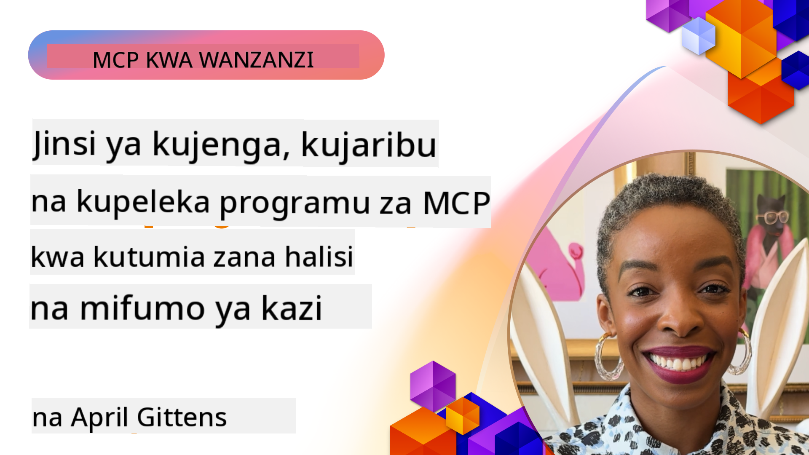

<!--
CO_OP_TRANSLATOR_METADATA:
{
  "original_hash": "83efa75a69bc831277263a6f1ae53669",
  "translation_date": "2025-08-19T14:29:04+00:00",
  "source_file": "04-PracticalImplementation/README.md",
  "language_code": "sw"
}
-->
# Utekelezaji wa Kivitendo

[](https://youtu.be/vCN9-mKBDfQ)

_(Bofya picha hapo juu kutazama video ya somo hili)_

Utekelezaji wa kivitendo ni pale ambapo nguvu ya Model Context Protocol (MCP) inakuwa dhahiri. Ingawa kuelewa nadharia na usanifu wa MCP ni muhimu, thamani halisi inajitokeza unapotekeleza dhana hizi kujenga, kupima, na kuweka suluhisho zinazotatua changamoto za ulimwengu halisi. Sura hii inaunganisha pengo kati ya maarifa ya dhana na maendeleo ya vitendo, ikikuongoza kupitia mchakato wa kuleta programu za MCP katika maisha.

Ikiwa unajenga wasaidizi wenye akili, unajumuisha AI katika mifumo ya kazi ya biashara, au unaunda zana maalum za usindikaji wa data, MCP hutoa msingi unaobadilika. Muundo wake usiofungamana na lugha na SDK rasmi kwa lugha maarufu za programu hufanya iweze kufikiwa na watengenezaji wengi. Kwa kutumia SDK hizi, unaweza kuunda haraka, kurudia, na kupanua suluhisho zako katika majukwaa na mazingira tofauti.

Katika sehemu zinazofuata, utapata mifano ya kivitendo, sampuli za msimbo, na mikakati ya kuweka suluhisho zinazodhihirisha jinsi ya kutekeleza MCP kwa kutumia C#, Java na Spring, TypeScript, JavaScript, na Python. Pia utajifunza jinsi ya kufuatilia na kupima seva za MCP, kusimamia API, na kuweka suluhisho kwenye wingu kwa kutumia Azure. Rasilimali hizi za vitendo zimetengenezwa ili kuharakisha kujifunza kwako na kukusaidia kujenga programu za MCP zenye nguvu na tayari kwa uzalishaji kwa ujasiri.

## Muhtasari

Somo hili linazingatia vipengele vya kivitendo vya utekelezaji wa MCP katika lugha mbalimbali za programu. Tutachunguza jinsi ya kutumia SDK za MCP katika C#, Java na Spring, TypeScript, JavaScript, na Python kujenga programu thabiti, kufuatilia na kupima seva za MCP, na kuunda rasilimali zinazoweza kutumika tena, maelekezo, na zana.

## Malengo ya Kujifunza

Mwisho wa somo hili, utaweza:

- Kutekeleza suluhisho za MCP kwa kutumia SDK rasmi katika lugha mbalimbali za programu
- Kufuatilia na kupima seva za MCP kwa utaratibu
- Kuunda na kutumia vipengele vya seva (Rasilimali, Maelekezo, na Zana)
- Kubuni mifumo ya kazi ya MCP yenye ufanisi kwa kazi ngumu
- Kuboresha utekelezaji wa MCP kwa utendaji na uaminifu

## Rasilimali Rasmi za SDK

Model Context Protocol inatoa SDK rasmi kwa lugha mbalimbali:

- [C# SDK](https://github.com/modelcontextprotocol/csharp-sdk)
- [Java na Spring SDK](https://github.com/modelcontextprotocol/java-sdk) **Kumbuka:** inahitaji utegemezi wa [Project Reactor](https://projectreactor.io). (Tazama [mjadala suala 246](https://github.com/orgs/modelcontextprotocol/discussions/246).)
- [TypeScript SDK](https://github.com/modelcontextprotocol/typescript-sdk)
- [Python SDK](https://github.com/modelcontextprotocol/python-sdk)
- [Kotlin SDK](https://github.com/modelcontextprotocol/kotlin-sdk)

## Kufanya Kazi na SDK za MCP

Sehemu hii inatoa mifano ya kivitendo ya kutekeleza MCP katika lugha mbalimbali za programu. Unaweza kupata sampuli za msimbo katika saraka ya `samples` iliyopangwa kwa lugha.

### Sampuli Zinazopatikana

Hifadhi inajumuisha [utekelezaji wa sampuli](../../../04-PracticalImplementation/samples) katika lugha zifuatazo:

- [C#](./samples/csharp/README.md)
- [Java na Spring](./samples/java/containerapp/README.md)
- [TypeScript](./samples/typescript/README.md)
- [JavaScript](./samples/javascript/README.md)
- [Python](./samples/python/README.md)

Kila sampuli inaonyesha dhana kuu za MCP na mifumo ya utekelezaji kwa lugha na mfumo husika.

## Vipengele Vikuu vya Seva

Seva za MCP zinaweza kutekeleza mchanganyiko wowote wa vipengele hivi:

### Rasilimali

Rasilimali hutoa muktadha na data kwa mtumiaji au modeli ya AI kutumia:

- Hifadhi za nyaraka
- Misingi ya maarifa
- Vyanzo vya data vilivyopangwa
- Mifumo ya faili

### Maelekezo

Maelekezo ni ujumbe uliotengenezwa na mifumo ya kazi kwa watumiaji:

- Violezo vya mazungumzo vilivyotangulia
- Mifumo ya mwingiliano iliyoongozwa
- Miundo maalum ya mazungumzo

### Zana

Zana ni kazi za modeli ya AI kutekeleza:

- Huduma za usindikaji wa data
- Ujumuishaji wa API za nje
- Uwezo wa hesabu
- Utendaji wa utafutaji

## Utekelezaji wa Sampuli: Utekelezaji wa C#

Hifadhi rasmi ya SDK ya C# ina utekelezaji kadhaa wa sampuli unaoonyesha vipengele tofauti vya MCP:

- **Mteja wa MCP wa Msingi**: Mfano rahisi unaoonyesha jinsi ya kuunda mteja wa MCP na kuita zana
- **Seva ya MCP ya Msingi**: Utekelezaji wa seva wa kiwango cha chini na usajili wa zana za msingi
- **Seva ya MCP ya Juu**: Seva kamili yenye usajili wa zana, uthibitishaji, na utunzaji wa makosa
- **Ujumuishaji wa ASP.NET**: Mifano inayoonyesha ujumuishaji na ASP.NET Core
- **Mifumo ya Utekelezaji wa Zana**: Mifumo mbalimbali ya kutekeleza zana kwa viwango tofauti vya ugumu

SDK ya MCP ya C# iko katika awamu ya majaribio na API zinaweza kubadilika. Tutaendelea kusasisha blogu hii kadri SDK inavyoendelea.

### Vipengele Muhimu

- [C# MCP Nuget ModelContextProtocol](https://www.nuget.org/packages/ModelContextProtocol)
- Kujenga [seva yako ya kwanza ya MCP](https://devblogs.microsoft.com/dotnet/build-a-model-context-protocol-mcp-server-in-csharp/).

Kwa sampuli kamili za utekelezaji wa C#, tembelea [hifadhi rasmi ya sampuli za SDK ya C#](https://github.com/modelcontextprotocol/csharp-sdk)

## Utekelezaji wa Sampuli: Utekelezaji wa Java na Spring

SDK ya Java na Spring inatoa chaguo thabiti za utekelezaji wa MCP na vipengele vya daraja la biashara.

### Vipengele Muhimu

- Ujumuishaji wa Mfumo wa Spring
- Usalama wa aina kali
- Msaada wa programu tendaji
- Utunzaji wa makosa wa kina

Kwa sampuli kamili ya utekelezaji wa Java na Spring, angalia [sampuli ya Java na Spring](samples/java/containerapp/README.md) katika saraka ya sampuli.

## Utekelezaji wa Sampuli: Utekelezaji wa JavaScript

SDK ya JavaScript inatoa mbinu nyepesi na rahisi ya utekelezaji wa MCP.

### Vipengele Muhimu

- Msaada wa Node.js na kivinjari
- API inayotegemea ahadi
- Ujumuishaji rahisi na Express na mifumo mingine
- Msaada wa WebSocket kwa utiririshaji

Kwa sampuli kamili ya utekelezaji wa JavaScript, angalia [sampuli ya JavaScript](samples/javascript/README.md) katika saraka ya sampuli.

## Utekelezaji wa Sampuli: Utekelezaji wa Python

SDK ya Python inatoa mbinu ya Pythonic kwa utekelezaji wa MCP na ujumuishaji bora wa mifumo ya ML.

### Vipengele Muhimu

- Msaada wa async/await na asyncio
- Ujumuishaji wa FastAPI
- Usajili rahisi wa zana
- Ujumuishaji wa asili na maktaba maarufu za ML

Kwa sampuli kamili ya utekelezaji wa Python, angalia [sampuli ya Python](samples/python/README.md) katika saraka ya sampuli.

## Usimamizi wa API

Azure API Management ni jibu bora kwa jinsi tunavyoweza kulinda seva za MCP. Wazo ni kuweka mfano wa Azure API Management mbele ya seva yako ya MCP na kuiruhusu kushughulikia vipengele unavyoweza kutaka kama:

- Kuweka mipaka ya kiwango
- Usimamizi wa tokeni
- Ufuatiliaji
- Usawazishaji wa mzigo
- Usalama

### Sampuli ya Azure

Hapa kuna Sampuli ya Azure inayofanya hivyo, yaani [kuunda seva ya MCP na kuilinda kwa Azure API Management](https://github.com/Azure-Samples/remote-mcp-apim-functions-python).

Tazama jinsi mtiririko wa uthibitishaji unavyotokea katika picha hapa chini:


Katika picha iliyotangulia, yafuatayo yanatokea:

- Uthibitishaji/Uidhinishaji unafanyika kwa kutumia Microsoft Entra.
- Azure API Management inafanya kazi kama lango na hutumia sera kuelekeza na kusimamia trafiki.
- Azure Monitor inarekodi maombi yote kwa uchambuzi zaidi.

#### Mtiririko wa Uidhinishaji

Hebu tuangalie mtiririko wa uidhinishaji kwa undani zaidi:


#### Maelezo ya Uidhinishaji wa MCP

Jifunze zaidi kuhusu [maelezo ya Uidhinishaji wa MCP](https://modelcontextprotocol.io/specification/2025-03-26/basic/authorization#2-10-third-party-authorization-flow)

## Kuweka Seva ya MCP ya Mbali kwenye Azure

Hebu tuone kama tunaweza kuweka sampuli tuliyotaja awali:

1. Clone hifadhi

    ```bash
    git clone https://github.com/Azure-Samples/remote-mcp-apim-functions-python.git
    cd remote-mcp-apim-functions-python
    ```

1. Sajili mtoa huduma wa rasilimali `Microsoft.App`.

   - Ikiwa unatumia Azure CLI, endesha `az provider register --namespace Microsoft.App --wait`.
   - Ikiwa unatumia Azure PowerShell, endesha `Register-AzResourceProvider -ProviderNamespace Microsoft.App`. Kisha endesha `(Get-AzResourceProvider -ProviderNamespace Microsoft.App).RegistrationState` baada ya muda fulani ili kuangalia ikiwa usajili umekamilika.

1. Endesha amri hii ya [azd](https://aka.ms/azd) ili kutoa huduma ya usimamizi wa api, programu ya kazi (na msimbo) na rasilimali zote zinazohitajika za Azure

    ```shell
    azd up
    ```

    Amri hii inapaswa kuweka rasilimali zote za wingu kwenye Azure

### Kupima seva yako na MCP Inspector

1. Katika **dirisha jipya la terminal**, sakinisha na endesha MCP Inspector

    ```shell
    npx @modelcontextprotocol/inspector
    ```

    Unapaswa kuona kiolesura kinachofanana na:

    

1. Bofya CTRL ili kupakia programu ya wavuti ya MCP Inspector kutoka URL iliyoonyeshwa na programu (mfano [http://127.0.0.1:6274/#resources](http://127.0.0.1:6274/#resources))
1. Weka aina ya usafirishaji kuwa `SSE`
1. Weka URL kwa sehemu yako ya mwisho ya API Management SSE inayoonyeshwa baada ya `azd up` na **Unganisha**:

    ```shell
    https://<apim-servicename-from-azd-output>.azure-api.net/mcp/sse
    ```

1. **Orodhesha Zana**. Bofya zana na **Endesha Zana**.  

Ikiwa hatua zote zimefanikiwa, sasa unapaswa kuwa umeunganishwa na seva ya MCP na umeweza kuita zana.

## Seva za MCP kwa Azure

[Remote-mcp-functions](https://github.com/Azure-Samples/remote-mcp-functions-dotnet): Hifadhi hizi ni templeti za kuanza haraka kwa kujenga na kuweka seva za MCP za mbali (Model Context Protocol) kwa kutumia Azure Functions na Python, C# .NET au Node/TypeScript.

Sampuli zinatoa suluhisho kamili linaloruhusu watengenezaji:

- Kujenga na kuendesha ndani: Kuendeleza na kufuatilia seva ya MCP kwenye mashine ya ndani
- Kuweka kwenye Azure: Kuweka kwa urahisi kwenye wingu kwa amri rahisi ya azd up
- Kuunganisha kutoka kwa wateja: Kuunganisha na seva ya MCP kutoka kwa wateja mbalimbali ikiwa ni pamoja na hali ya wakala wa Copilot ya VS Code na zana ya MCP Inspector

### Vipengele Muhimu

- Usalama kwa muundo: Seva ya MCP inalindwa kwa kutumia funguo na HTTPS
- Chaguo za uthibitishaji: Inasaidia OAuth kwa kutumia uthibitishaji wa ndani na/au Usimamizi wa API
- Kutengwa kwa mtandao: Inaruhusu kutengwa kwa mtandao kwa kutumia Mitandao ya Kibinafsi ya Azure (VNET)
- Usanifu usio na seva: Inatumia Azure Functions kwa utekelezaji unaoweza kupanuka na unaotegemea matukio
- Maendeleo ya ndani: Msaada kamili wa maendeleo ya ndani na kufuatilia
- Mchakato rahisi wa kuweka: Mchakato uliorahisishwa wa kuweka kwenye Azure

Hifadhi inajumuisha faili zote muhimu za usanidi, msimbo wa chanzo, na ufafanuzi wa miundombinu ili kuanza haraka na utekelezaji wa seva ya MCP tayari kwa uzalishaji.

- [Azure Remote MCP Functions Python](https://github.com/Azure-Samples/remote-mcp-functions-python) - Utekelezaji wa sampuli wa MCP kwa kutumia Azure Functions na Python

- [Azure Remote MCP Functions .NET](https://github.com/Azure-Samples/remote-mcp-functions-dotnet) - Utekelezaji wa sampuli wa MCP kwa kutumia Azure Functions na C# .NET

- [Azure Remote MCP Functions Node/Typescript](https://github.com/Azure-Samples/remote-mcp-functions-typescript) - Utekelezaji wa sampuli wa MCP kwa kutumia Azure Functions na Node/TypeScript.

## Mambo Muhimu ya Kujifunza

- SDK za MCP zinatoa zana maalum za lugha kwa kutekeleza suluhisho thabiti za MCP
- Mchakato wa kufuatilia na kupima ni muhimu kwa programu za MCP zinazotegemewa
- Violezo vya maelekezo vinavyoweza kutumika tena vinawezesha mwingiliano thabiti wa AI
- Mifumo ya kazi iliyoundwa vizuri inaweza kuratibu kazi ngumu kwa kutumia zana nyingi
- Kutekeleza suluhisho za MCP kunahitaji kuzingatia usalama, utendaji, na utunzaji wa makosa

## Zoezi

Buni mfumo wa kazi wa MCP wa kivitendo unaoshughulikia tatizo la ulimwengu halisi katika uwanja wako:

1. Tambua zana 3-4 ambazo zingekuwa muhimu kwa kutatua tatizo hili
2. Unda mchoro wa mfumo wa kazi unaoonyesha jinsi zana hizi zinavyoshirikiana
3. Tekeleza toleo la msingi la moja ya zana kwa kutumia lugha unayopendelea
4. Unda kiolezo cha maelekezo ambacho kingesaidia modeli kutumia zana yako kwa ufanisi

## Rasilimali za Ziada

---

Next: [Mada za Juu](../05-AdvancedTopics/README.md)

**Kanusho**:  
Hati hii imetafsiriwa kwa kutumia huduma ya tafsiri ya AI [Co-op Translator](https://github.com/Azure/co-op-translator). Ingawa tunajitahidi kwa usahihi, tafadhali fahamu kuwa tafsiri za kiotomatiki zinaweza kuwa na makosa au kutokuwa sahihi. Hati ya asili katika lugha yake ya awali inapaswa kuchukuliwa kama chanzo cha mamlaka. Kwa taarifa muhimu, inashauriwa kutumia huduma ya tafsiri ya kitaalamu ya binadamu. Hatutawajibika kwa maelewano mabaya au tafsiri zisizo sahihi zinazotokana na matumizi ya tafsiri hii.