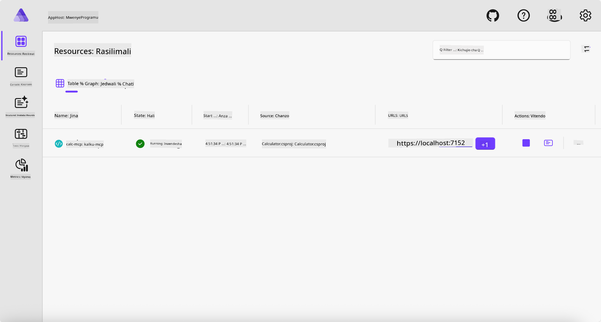
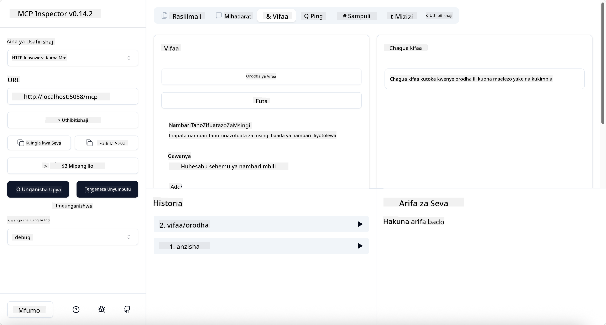
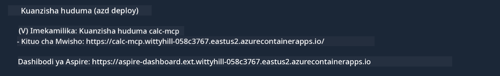

<!--
CO_OP_TRANSLATOR_METADATA:
{
  "original_hash": "0bc7bd48f55f1565f1d95ccb2c16f728",
  "translation_date": "2025-07-13T23:09:00+00:00",
  "source_file": "04-PracticalImplementation/samples/csharp/README.md",
  "language_code": "sw"
}
-->
# Mfano

Mfano uliopita unaonyesha jinsi ya kutumia mradi wa ndani wa .NET kwa aina ya `stdio`. Na jinsi ya kuendesha seva kwa ndani ndani ya kontena. Hii ni suluhisho nzuri katika hali nyingi. Hata hivyo, inaweza kuwa na faida kuwa na seva inayoendesha kwa mbali, kama katika mazingira ya wingu. Hapa ndipo aina ya `http` inapoingia.

Tukiangalia suluhisho katika folda ya `04-PracticalImplementation`, inaweza kuonekana ngumu zaidi kuliko ile ya awali. Lakini kwa kweli, si hivyo. Ukitazama kwa makini mradi `src/Calculator`, utaona kwamba ni karibu sawa na mfano uliopita. Tofauti pekee ni kwamba tunatumia maktaba tofauti `ModelContextProtocol.AspNetCore` kushughulikia maombi ya HTTP. Na tunabadilisha njia `IsPrime` kuwa binafsi, tu kuonyesha kwamba unaweza kuwa na njia binafsi katika msimbo wako. Msimbo mwingine uko sawa kama awali.

Miradi mingine ni kutoka kwa [.NET Aspire](https://learn.microsoft.com/dotnet/aspire/get-started/aspire-overview). Kuwa na .NET Aspire katika suluhisho kutaboresha uzoefu wa msanidi programu wakati wa kuendeleza na kujaribu na kusaidia kwa uangalizi. Haijalishi kuendesha seva, lakini ni mazoea mazuri kuwa nayo katika suluhisho lako.

## Anzisha seva kwa ndani

1. Kutoka VS Code (ikiwa na ugani wa C# DevKit), nenda hadi saraka ya `04-PracticalImplementation/samples/csharp`.
1. Tekeleza amri ifuatayo kuanzisha seva:

   ```bash
    dotnet watch run --project ./src/AppHost
   ```

1. Wakati kivinjari cha wavuti kinapofungua dashibodi ya .NET Aspire, kumbuka URL ya `http`. Inapaswa kuwa kama `http://localhost:5058/`.

   

## Jaribu Streamable HTTP na MCP Inspector

Kama una Node.js 22.7.5 au zaidi, unaweza kutumia MCP Inspector kujaribu seva yako.

Anzisha seva na endesha amri ifuatayo kwenye terminal:

```bash
npx @modelcontextprotocol/inspector http://localhost:5058
```



- Chagua `Streamable HTTP` kama aina ya Usafirishaji.
- Katika sehemu ya Url, ingiza URL ya seva uliyoikumbuka hapo awali, na ongeza `/mcp`. Inapaswa kuwa `http` (si `https`) kama `http://localhost:5058/mcp`.
- Chagua kitufe cha Connect.

Kitu kizuri kuhusu Inspector ni kwamba hutoa muonekano mzuri wa kinachoendelea.

- Jaribu orodha ya zana zinazopatikana
- Jaribu baadhi yao, inapaswa kufanya kazi kama awali.

## Jaribu MCP Server na GitHub Copilot Chat katika VS Code

Ili kutumia usafirishaji wa Streamable HTTP na GitHub Copilot Chat, badilisha usanidi wa seva ya `calc-mcp` iliyoundwa awali ili ionekane hivi:

```jsonc
// .vscode/mcp.json
{
  "servers": {
    "calc-mcp": {
      "type": "http",
      "url": "http://localhost:5058/mcp"
    }
  }
}
```

Fanya majaribio:

- Uliza "nambari 3 za kwanza za prime baada ya 6780". Angalia jinsi Copilot atakavyotumia zana mpya `NextFivePrimeNumbers` na kurudisha nambari 3 za kwanza za prime tu.
- Uliza "nambari 7 za kwanza za prime baada ya 111", kuona kinachotokea.
- Uliza "John ana pipi 24 na anataka kuzigawa kwa watoto wake 3. Kila mtoto ana pipi ngapi?", kuona kinachotokea.

## Sambaza seva kwenye Azure

Tuasambaze seva kwenye Azure ili watu wengi zaidi waiweze kutumia.

Kutoka kwenye terminal, nenda kwenye saraka `04-PracticalImplementation/samples/csharp` na endesha amri ifuatayo:

```bash
azd up
```

Mara baada ya usambazaji kumalizika, unapaswa kuona ujumbe kama huu:



Chukua URL na uitumie katika MCP Inspector na GitHub Copilot Chat.

```jsonc
// .vscode/mcp.json
{
  "servers": {
    "calc-mcp": {
      "type": "http",
      "url": "https://calc-mcp.gentleriver-3977fbcf.australiaeast.azurecontainerapps.io/mcp"
    }
  }
}
```

## Nini kinachofuata?

Tumejaribu aina tofauti za usafirishaji na zana za majaribio. Pia tumesambaza seva yako ya MCP kwenye Azure. Lakini je, seva yetu inahitaji kufikia rasilimali za binafsi? Kwa mfano, hifadhidata au API binafsi? Katika sura inayofuata, tutaona jinsi tunavyoweza kuboresha usalama wa seva yetu.

**Kiarifu cha Kutotegemea**:  
Hati hii imetafsiriwa kwa kutumia huduma ya tafsiri ya AI [Co-op Translator](https://github.com/Azure/co-op-translator). Ingawa tunajitahidi kwa usahihi, tafadhali fahamu kwamba tafsiri za kiotomatiki zinaweza kuwa na makosa au upungufu wa usahihi. Hati ya asili katika lugha yake ya asili inapaswa kuchukuliwa kama chanzo cha mamlaka. Kwa taarifa muhimu, tafsiri ya kitaalamu inayofanywa na binadamu inapendekezwa. Hatubebei dhamana kwa kutoelewana au tafsiri potofu zinazotokana na matumizi ya tafsiri hii.