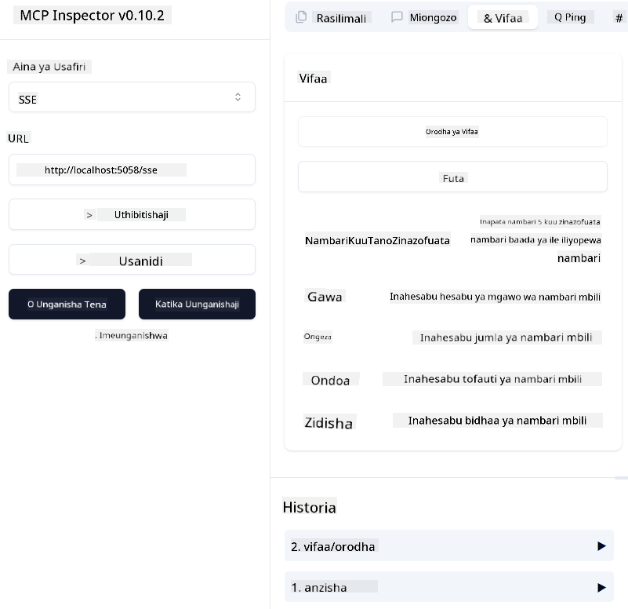
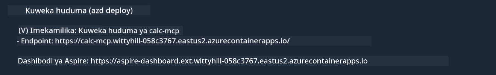

<!--
CO_OP_TRANSLATOR_METADATA:
{
  "original_hash": "5020a3e1a1c7f30c00f9e37f1fa208e3",
  "translation_date": "2025-05-17T14:11:19+00:00",
  "source_file": "04-PracticalImplementation/samples/csharp/README.md",
  "language_code": "sw"
}
-->
# Sampuli

Mfano uliopita unaonyesha jinsi ya kutumia mradi wa ndani wa .NET na aina ya `sdio`. Na jinsi ya kuendesha seva ndani ya kontena. Hii ni suluhisho nzuri katika hali nyingi. Hata hivyo, inaweza kuwa muhimu kuwa na seva inayoendesha kwa mbali, kama katika mazingira ya wingu. Hapa ndipo aina ya `http` inapoingia.

Ukiangalia suluhisho katika folda ya `04-PracticalImplementation`, inaweza kuonekana kuwa ngumu zaidi kuliko ile ya awali. Lakini kwa kweli, sivyo. Ukichunguza mradi wa `src/mcpserver/mcpserver.csproj` kwa makini, utaona kwamba ni msimbo sawa na mfano wa awali. Tofauti pekee ni kwamba tunatumia maktaba tofauti `ModelContextProtocol.AspNetCore` kushughulikia maombi ya HTTP. Na tunabadilisha mbinu `IsPrime` ili iwe ya kibinafsi, ili tu kuonyesha kuwa unaweza kuwa na mbinu za kibinafsi katika msimbo wako. Msimbo uliobaki ni sawa na ule wa awali.

Miradi mingine ni kutoka [.NET Aspire](https://learn.microsoft.com/dotnet/aspire/get-started/aspire-overview). Kuwa na .NET Aspire katika suluhisho kutaboresha uzoefu wa mjenzi wakati wa kuunda na kujaribu na kusaidia na ufuatiliaji. Haitahitajika kuendesha seva, lakini ni mazoezi mazuri kuwa nayo katika suluhisho lako.

## Anzisha seva ndani ya eneo

1. Kutoka VS Code (na kiendelezi cha C# DevKit), fungua suluhisho `04-PracticalImplementation\samples\csharp\src\Calculator-chap4.sln`.
2. Bonyeza `F5` kuanzisha seva. Inapaswa kufungua kivinjari cha wavuti na dashibodi ya .NET Aspire.

au

1. Kutoka kwenye terminali, nenda kwenye folda `04-PracticalImplementation\samples\csharp\src`
2. Tekeleza amri ifuatayo kuanzisha seva:
   ```bash
    dotnet run --project .\AppHost
   ```

3. Kutoka kwenye Dashibodi, angalia URL ya `http`. Inapaswa kuwa kama `http://localhost:5058/`.

## Test `SSE` na ModelContext Protocol Inspector

Ikiwa una Node.js 22.7.5 na zaidi, unaweza kutumia ModelContext Protocol Inspector kujaribu seva yako.

Anzisha seva na endesha amri ifuatayo kwenye terminali:

```bash
npx @modelcontextprotocol/inspector@latest
```



- Chagua `SSE` as the Transport type. SSE stand for Server-Sent Events. 
- In the Url field, enter the URL of the server noted earlier,and append `/sse`. Inapaswa kuwa `http` (sio `https`) something like `http://localhost:5058/sse`.
- select the Connect button.

A nice thing about the Inspector is that it provide a nice visibility on what is happening.

- Try listing the availables tools
- Try some of them, it should works just like before.


## Test `SSE` with Github Copilot Chat in VS Code

To use the `SSE` transport with Github Copilot Chat, change the configuration of the `mcp-calc` seva iliyoundwa hapo awali ili ionekane hivi:

```json
"mcp-calc": {
    "type": "sse",
    "url": "http://localhost:5058/sse"
}
```

Fanya baadhi ya majaribio:
- Uliza nambari 3 za kwanza baada ya 6780. Angalia jinsi Copilot itakavyotumia zana mpya `NextFivePrimeNumbers` na kurudisha nambari 3 za kwanza pekee.
- Uliza nambari 7 za kwanza baada ya 111, ili kuona nini kitatokea.

# Peleka seva kwenye Azure

Wacha tupeleke seva kwenye Azure ili watu wengi zaidi waweze kuitumia.

Kutoka kwenye terminali, nenda kwenye folda `04-PracticalImplementation\samples\csharp\src` na endesha amri ifuatayo:

```bash
azd init
```

Hii itaunda faili chache ndani ya eneo ili kuhifadhi usanidi wa rasilimali za Azure, na Miundombinu yako kama msimbo (IaC).

Kisha, endesha amri ifuatayo kupeleka seva kwenye Azure:

```bash
azd up
```

Mara baada ya kupelekwa kumalizika, unapaswa kuona ujumbe kama huu:



Nenda kwenye dashibodi ya Aspire na angalia URL ya `HTTP` ili kuitumia katika MCP Inspector na katika Mazungumzo ya Github Copilot.

## Nini kinafuata?

Tunajaribu aina tofauti za usafiri, na zana za majaribio na pia tunapeleka seva yetu ya MCP kwenye Azure. Lakini vipi kama seva yetu inahitaji kufikia rasilimali za kibinafsi? Kwa mfano, hifadhidata au API ya kibinafsi? Katika sura inayofuata, tutaona jinsi tunaweza kuboresha usalama wa seva yetu.

**Kanusho**: 
Hati hii imetafsiriwa kwa kutumia huduma ya tafsiri ya AI [Co-op Translator](https://github.com/Azure/co-op-translator). Ingawa tunajitahidi kwa usahihi, tafadhali fahamu kwamba tafsiri za kiotomatiki zinaweza kuwa na makosa au kutokuwa sahihi. Hati ya asili katika lugha yake ya kiasili inapaswa kuzingatiwa kama chanzo cha mamlaka. Kwa taarifa muhimu, tafsiri ya kitaalamu ya kibinadamu inapendekezwa. Hatutawajibika kwa kutoelewana au tafsiri zisizo sahihi zinazotokana na matumizi ya tafsiri hii.