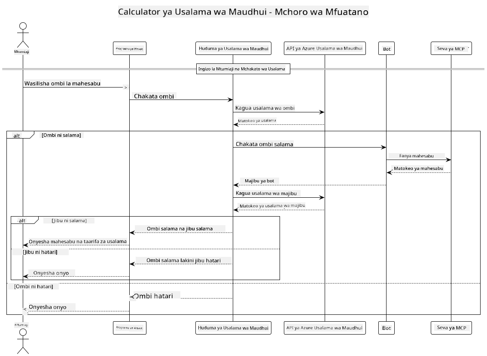

<!--
CO_OP_TRANSLATOR_METADATA:
{
  "original_hash": "e5ea5e7582f70008ea9bec3b3820f20a",
  "translation_date": "2025-07-13T23:19:05+00:00",
  "source_file": "04-PracticalImplementation/samples/java/containerapp/README.md",
  "language_code": "sw"
}
-->
## Muundo wa Mfumo

Mradi huu unaonyesha programu ya wavuti inayotumia ukaguzi wa usalama wa maudhui kabla ya kupitisha maelekezo ya mtumiaji kwa huduma ya kalkuleta kupitia Model Context Protocol (MCP).



### Jinsi Inavyofanya Kazi

1. **Ingizo la Mtumiaji**: Mtumiaji anaingiza maelekezo ya hesabu kwenye kiolesura cha wavuti  
2. **Ukaguzi wa Usalama wa Maudhui (Ingizo)**: Maelekezo yanachambuliwa na Azure Content Safety API  
3. **Uamuzi wa Usalama (Ingizo)**:  
   - Ikiwa maudhui ni salama (ukali < 2 katika makundi yote), yanaendelea kwa kalkuleta  
   - Ikiwa maudhui yanatambulika kuwa yanaweza kuwa hatari, mchakato unasimama na kurejesha onyo  
4. **Uunganishaji wa Kalkereta**: Maudhui salama yanashughulikiwa na LangChain4j, ambayo huwasiliana na seva ya kalkuleta ya MCP  
5. **Ukaguzi wa Usalama wa Maudhui (Matokeo)**: Jibu la bot linachambuliwa na Azure Content Safety API  
6. **Uamuzi wa Usalama (Matokeo)**:  
   - Ikiwa jibu la bot ni salama, linaonyeshwa kwa mtumiaji  
   - Ikiwa jibu la bot linatambulika kuwa linaweza kuwa hatari, linabadilishwa na onyo  
7. **Jibu**: Matokeo (ikiwa ni salama) yanaonyeshwa kwa mtumiaji pamoja na uchambuzi wa usalama wa pande zote mbili

## Kutumia Model Context Protocol (MCP) na Huduma za Kalkereta

Mradi huu unaonyesha jinsi ya kutumia Model Context Protocol (MCP) kupiga simu huduma za kalkuleta za MCP kutoka LangChain4j. Utekelezaji hutumia seva ya MCP ya ndani inayotumia bandari 8080 kutoa huduma za hesabu.

### Kuweka Huduma ya Azure Content Safety

Kabla ya kutumia vipengele vya usalama wa maudhui, unahitaji kuunda rasilimali ya huduma ya Azure Content Safety:

1. Ingia kwenye [Azure Portal](https://portal.azure.com)  
2. Bonyeza "Create a resource" na tafuta "Content Safety"  
3. Chagua "Content Safety" na bonyeza "Create"  
4. Weka jina la kipekee kwa rasilimali yako  
5. Chagua usajili na kundi la rasilimali (au unda jipya)  
6. Chagua eneo linaloungwa mkono (angalia [Region availability](https://azure.microsoft.com/en-us/global-infrastructure/services/?products=cognitive-services) kwa maelezo)  
7. Chagua kiwango kinachofaa cha bei  
8. Bonyeza "Create" kuanzisha rasilimali  
9. Mara baada ya kuanzishwa kukamilika, bonyeza "Go to resource"  
10. Katika sehemu ya kushoto, chini ya "Resource Management", chagua "Keys and Endpoint"  
11. Nakili moja ya funguo na URL ya endpoint kwa matumizi katika hatua inayofuata

### Kusanidi Mabadiliko ya Mazingira

Weka mabadiliko ya mazingira ya `GITHUB_TOKEN` kwa uthibitishaji wa modeli za GitHub:  
```sh
export GITHUB_TOKEN=<your_github_token>
```

Kwa vipengele vya usalama wa maudhui, weka:  
```sh
export CONTENT_SAFETY_ENDPOINT=<your_content_safety_endpoint>
export CONTENT_SAFETY_KEY=<your_content_safety_key>
```

Mabadiliko haya ya mazingira yanatumika na programu kuthibitisha huduma ya Azure Content Safety. Ikiwa hayawezi kuwekwa, programu itatumia thamani za mfano kwa madhumuni ya maonyesho, lakini vipengele vya usalama havitafanya kazi ipasavyo.

### Kuanzisha Seva ya Kalkuleta MCP

Kabla ya kuendesha mteja, unahitaji kuanzisha seva ya kalkuleta MCP katika hali ya SSE kwenye localhost:8080.

## Maelezo ya Mradi

Mradi huu unaonyesha uunganishaji wa Model Context Protocol (MCP) na LangChain4j kupiga simu huduma za kalkuleta. Vipengele muhimu ni pamoja na:

- Kutumia MCP kuunganishwa na huduma ya kalkuleta kwa shughuli za hesabu za msingi  
- Ukaguzi wa usalama wa maudhui kwa tabaka mbili kwa maelekezo ya mtumiaji na majibu ya bot  
- Uunganishaji na modeli ya gpt-4.1-nano ya GitHub kupitia LangChain4j  
- Kutumia Server-Sent Events (SSE) kwa usafirishaji wa MCP

## Uunganishaji wa Usalama wa Maudhui

Mradi huu unajumuisha vipengele kamili vya usalama wa maudhui kuhakikisha kuwa ingizo la mtumiaji na majibu ya mfumo hayana maudhui hatarishi:

1. **Ukaguzi wa Ingizo**: Maelekezo yote ya mtumiaji yanachambuliwa kwa makundi ya maudhui hatarishi kama vile hotuba za chuki, vurugu, kujiua, na maudhui ya ngono kabla ya kusindika.  

2. **Ukaguzi wa Matokeo**: Hata wakati wa kutumia modeli ambazo huenda hazijafungiwa kikamilifu, mfumo unakagua majibu yote yaliyotengenezwa kupitia vichujio vya usalama wa maudhui kabla ya kuonyesha kwa mtumiaji.

Mbinu hii ya tabaka mbili inahakikisha mfumo unabaki salama bila kujali ni modeli gani ya AI inayotumika, ikilinda watumiaji dhidi ya ingizo hatari na matokeo yanayoweza kuwa na matatizo yanayotokana na AI.

## Mteja wa Wavuti

Programu hii ina kiolesura cha wavuti rahisi kwa mtumiaji kinachomruhusu mtumiaji kuingiliana na mfumo wa Content Safety Calculator:

### Vipengele vya Kiolesura cha Wavuti

- Fomu rahisi na ya kueleweka kwa kuingiza maelekezo ya hesabu  
- Uthibitishaji wa usalama wa maudhui kwa tabaka mbili (ingizo na matokeo)  
- Maoni ya papo hapo kuhusu usalama wa maelekezo na majibu  
- Viashiria vya usalama vilivyo na rangi kwa ufafanuzi rahisi  
- Muundo safi na unaojibadilisha unaofanya kazi kwenye vifaa mbalimbali  
- Mifano ya maelekezo salama kusaidia watumiaji

### Kutumia Mteja wa Wavuti

1. Anzisha programu:  
   ```sh
   mvn spring-boot:run
   ```

2. Fungua kivinjari chako na nenda kwenye `http://localhost:8087`

3. Ingiza maelekezo ya hesabu kwenye eneo la maandishi lililotolewa (mfano, "Calculate the sum of 24.5 and 17.3")

4. Bonyeza "Submit" ili kusindika ombi lako

5. Tazama matokeo, ambayo yatajumuisha:  
   - Uchambuzi wa usalama wa maudhui wa maelekezo yako  
   - Matokeo ya hesabu (ikiwa maelekezo yalikuwa salama)  
   - Uchambuzi wa usalama wa maudhui wa jibu la bot  
   - Onyo lolote la usalama ikiwa ingizo au matokeo yalitambuliwa kuwa hatari

Mteja wa wavuti huendesha moja kwa moja michakato yote ya ukaguzi wa usalama wa maudhui, kuhakikisha maingiliano yote ni salama na yanayofaa bila kujali ni modeli gani ya AI inayotumika.

**Kiarifu cha Kutotegemea**:  
Hati hii imetafsiriwa kwa kutumia huduma ya tafsiri ya AI [Co-op Translator](https://github.com/Azure/co-op-translator). Ingawa tunajitahidi kwa usahihi, tafadhali fahamu kwamba tafsiri za kiotomatiki zinaweza kuwa na makosa au upungufu wa usahihi. Hati ya asili katika lugha yake ya asili inapaswa kuchukuliwa kama chanzo cha mamlaka. Kwa taarifa muhimu, tafsiri ya kitaalamu inayofanywa na binadamu inapendekezwa. Hatubebei dhamana kwa kutoelewana au tafsiri potofu zinazotokana na matumizi ya tafsiri hii.