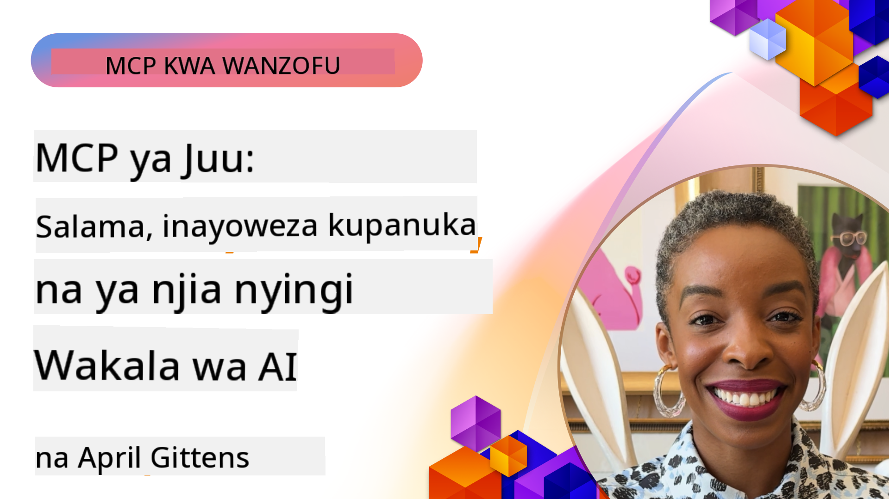

<!--
CO_OP_TRANSLATOR_METADATA:
{
  "original_hash": "d204bc94ea6027d06a703b21b711ca57",
  "translation_date": "2025-08-18T18:57:03+00:00",
  "source_file": "05-AdvancedTopics/README.md",
  "language_code": "sw"
}
-->
# Mada ya Juu katika MCP

_(Bonyeza picha hapo juu kutazama video ya somo hili)_

Sura hii inashughulikia mada mbalimbali za juu katika utekelezaji wa Model Context Protocol (MCP), ikijumuisha ujumuishaji wa njia nyingi, uwezo wa kupanuka, mbinu bora za usalama, na ujumuishaji wa kibiashara. Mada hizi ni muhimu kwa kujenga programu za MCP imara na tayari kwa uzalishaji zinazoweza kukidhi mahitaji ya mifumo ya kisasa ya AI.

## Muhtasari

Somo hili linachunguza dhana za juu katika utekelezaji wa Model Context Protocol, likilenga ujumuishaji wa njia nyingi, uwezo wa kupanuka, mbinu bora za usalama, na ujumuishaji wa kibiashara. Mada hizi ni muhimu kwa kujenga programu za MCP za kiwango cha uzalishaji zinazoweza kushughulikia mahitaji changamano katika mazingira ya biashara.

## Malengo ya Kujifunza

Ifikapo mwisho wa somo hili, utaweza:

- Kutekeleza uwezo wa njia nyingi ndani ya mifumo ya MCP
- Kubuni miundo ya MCP inayoweza kupanuka kwa hali za mahitaji makubwa
- Kutumia mbinu bora za usalama zinazolingana na kanuni za usalama za MCP
- Kujumuisha MCP na mifumo na mifumo ya AI ya kibiashara
- Kuboresha utendaji na uaminifu katika mazingira ya uzalishaji

## Masomo na Miradi ya Mfano

| Kiungo | Kichwa | Maelezo |
|-------|--------|---------|
| [5.1 Ujumuishaji na Azure](./mcp-integration/README.md) | Jumuisha na Azure | Jifunze jinsi ya kujumuisha MCP Server yako kwenye Azure |
| [5.2 Mfano wa Njia Nyingi](./mcp-multi-modality/README.md) | Sampuli za MCP za Njia Nyingi | Sampuli za sauti, picha, na majibu ya njia nyingi |
| [5.3 Mfano wa MCP OAuth2](../../../05-AdvancedTopics/mcp-oauth2-demo) | Demo ya MCP OAuth2 | Programu ndogo ya Spring Boot inayoonyesha OAuth2 na MCP, kama Mamlaka na Seva ya Rasilimali. Inaonyesha utoaji wa tokeni salama, sehemu zilizolindwa, usambazaji wa Azure Container Apps, na ujumuishaji wa Usimamizi wa API. |
| [5.4 Muktadha wa Mizizi](./mcp-root-contexts/README.md) | Muktadha wa Mizizi | Jifunze zaidi kuhusu muktadha wa mizizi na jinsi ya kuutekeleza |
| [5.5 Uelekezaji](./mcp-routing/README.md) | Uelekezaji | Jifunze aina tofauti za uelekezaji |
| [5.6 Sampuli](./mcp-sampling/README.md) | Sampuli | Jifunze jinsi ya kufanya kazi na sampuli |
| [5.7 Uwezo wa Kupanuka](./mcp-scaling/README.md) | Kupanuka | Jifunze kuhusu uwezo wa kupanuka |
| [5.8 Usalama](./mcp-security/README.md) | Usalama | Linda MCP Server yako |
| [5.9 Mfano wa Utafutaji wa Wavuti](./web-search-mcp/README.md) | MCP ya Utafutaji wa Wavuti | MCP server na mteja wa Python wakijumuisha na SerpAPI kwa utafutaji wa wavuti, habari, bidhaa, na maswali na majibu kwa wakati halisi. Inaonyesha uratibu wa zana nyingi, ujumuishaji wa API za nje, na utunzaji wa makosa madhubuti. |
| [5.10 Utiririshaji wa Wakati Halisi](./mcp-realtimestreaming/README.md) | Utiririshaji | Utiririshaji wa data wa wakati halisi umekuwa muhimu katika ulimwengu wa leo unaoendeshwa na data, ambapo biashara na programu zinahitaji ufikiaji wa haraka wa taarifa kufanya maamuzi kwa wakati. |
| [5.11 Utafutaji wa Wavuti wa Wakati Halisi](./mcp-realtimesearch/README.md) | Utafutaji wa Wavuti | Jinsi MCP inavyobadilisha utafutaji wa wavuti wa wakati halisi kwa kutoa mbinu sanifu ya usimamizi wa muktadha kati ya mifumo ya AI, injini za utafutaji, na programu. |
| [5.12 Uthibitishaji wa Entra ID kwa Seva za Model Context Protocol](./mcp-security-entra/README.md) | Uthibitishaji wa Entra ID | Microsoft Entra ID inatoa suluhisho thabiti la usimamizi wa utambulisho na ufikiaji wa wingu, ikihakikisha kuwa ni watumiaji na programu zilizoidhinishwa pekee zinazoweza kuingiliana na seva yako ya MCP. |
| [5.13 Ujumuishaji wa Wakala wa Azure AI Foundry](./mcp-foundry-agent-integration/README.md) | Ujumuishaji wa Azure AI Foundry | Jifunze jinsi ya kujumuisha seva za Model Context Protocol na mawakala wa Azure AI Foundry, kuwezesha uratibu wa zana zenye nguvu na uwezo wa AI wa kibiashara na miunganisho sanifu ya vyanzo vya data vya nje. |
| [5.14 Uhandisi wa Muktadha](./mcp-contextengineering/README.md) | Uhandisi wa Muktadha | Fursa za siku zijazo za mbinu za uhandisi wa muktadha kwa seva za MCP, ikijumuisha uboreshaji wa muktadha, usimamizi wa muktadha wa nguvu, na mikakati ya uhandisi bora wa maelekezo ndani ya mifumo ya MCP. |

## Marejeleo ya Ziada

Kwa taarifa za hivi karibuni zaidi kuhusu mada za juu za MCP, rejelea:
- [MCP Documentation](https://modelcontextprotocol.io/)
- [MCP Specification](https://spec.modelcontextprotocol.io/)
- [GitHub Repository](https://github.com/modelcontextprotocol)

## Mambo Muhimu ya Kukumbuka

- Utekelezaji wa MCP wa njia nyingi huongeza uwezo wa AI zaidi ya usindikaji wa maandishi
- Uwezo wa kupanuka ni muhimu kwa usambazaji wa kibiashara na unaweza kushughulikiwa kupitia upanuzi wa usawa na wima
- Hatua za kina za usalama hulinda data na kuhakikisha udhibiti sahihi wa ufikiaji
- Ujumuishaji wa kibiashara na majukwaa kama Azure OpenAI na Microsoft AI Foundry huimarisha uwezo wa MCP
- Utekelezaji wa juu wa MCP unafaidika na miundo iliyoboreshwa na usimamizi wa rasilimali kwa makini

## Zoezi

Buni utekelezaji wa MCP wa kiwango cha biashara kwa matumizi maalum:

1. Tambua mahitaji ya njia nyingi kwa matumizi yako
2. Eleza udhibiti wa usalama unaohitajika kulinda data nyeti
3. Buni muundo unaoweza kupanuka unaoweza kushughulikia mzigo unaobadilika
4. Panga sehemu za ujumuishaji na mifumo ya AI ya kibiashara
5. Andika nyakati zinazoweza kusababisha matatizo ya utendaji na mikakati ya kuyatatua

## Rasilimali za Ziada

- [Azure OpenAI Documentation](https://learn.microsoft.com/en-us/azure/ai-services/openai/)
- [Microsoft AI Foundry Documentation](https://learn.microsoft.com/en-us/ai-services/)

---

## Nini Kifuatacho

- [5.1 Ujumuishaji wa MCP](./mcp-integration/README.md)

**Kanusho**:  
Hati hii imetafsiriwa kwa kutumia huduma ya tafsiri ya AI [Co-op Translator](https://github.com/Azure/co-op-translator). Ingawa tunajitahidi kuhakikisha usahihi, tafadhali fahamu kuwa tafsiri za kiotomatiki zinaweza kuwa na makosa au kutokuwa sahihi. Hati ya asili katika lugha yake ya awali inapaswa kuchukuliwa kama chanzo cha mamlaka. Kwa taarifa muhimu, tafsiri ya kitaalamu ya binadamu inapendekezwa. Hatutawajibika kwa kutoelewana au tafsiri zisizo sahihi zinazotokana na matumizi ya tafsiri hii.