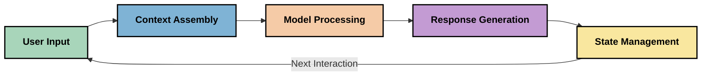
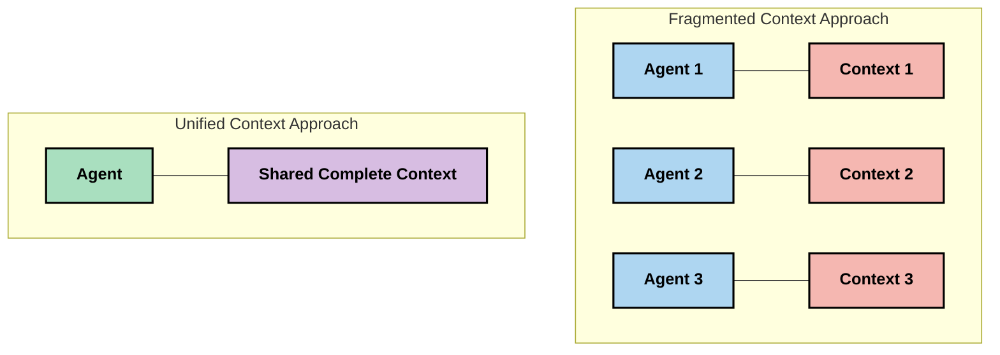
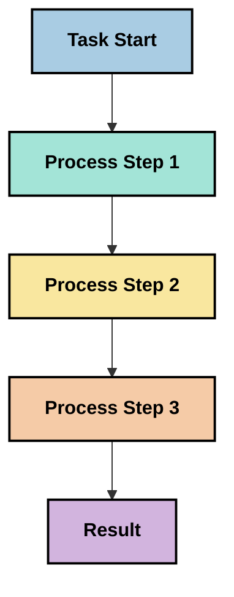
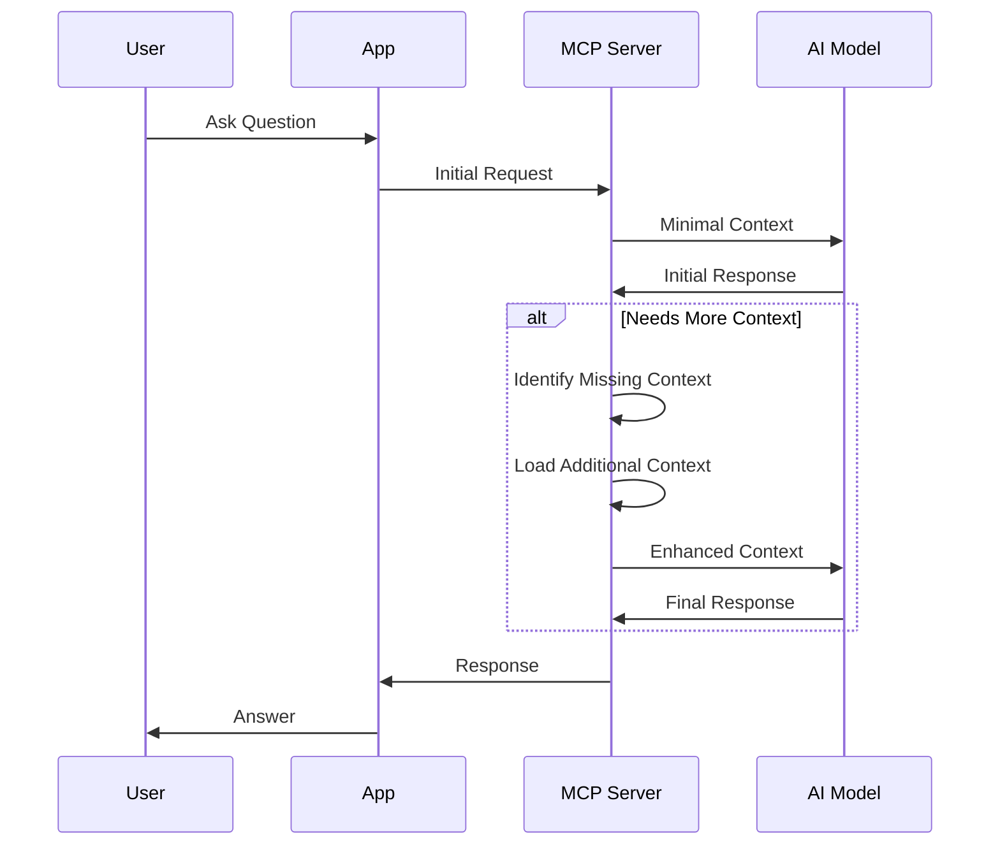
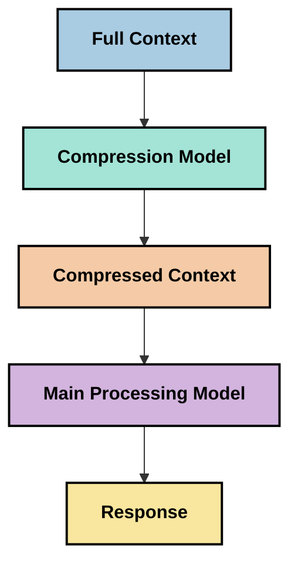

<!--
CO_OP_TRANSLATOR_METADATA:
{
  "original_hash": "5762e8e74dd99d8b7dbb31e69a82561e",
  "translation_date": "2025-07-17T13:12:44+00:00",
  "source_file": "05-AdvancedTopics/mcp-contextengineering/README.md",
  "language_code": "sw"
}
-->
# Uhandisi wa Muktadha: Dhana Inayoibuka katika Mfumo wa MCP

## Muhtasari

Uhandisi wa muktadha ni dhana inayojitokeza katika eneo la AI inayochunguza jinsi taarifa zinavyopangwa, kusambazwa, na kudumishwa katika mwingiliano kati ya wateja na huduma za AI. Kadiri mfumo wa Model Context Protocol (MCP) unavyoendelea, kuelewa jinsi ya kusimamia muktadha kwa ufanisi kunazidi kuwa muhimu. Moduli hii inatambulisha dhana ya uhandisi wa muktadha na kuchunguza matumizi yake yanayoweza kutokea katika utekelezaji wa MCP.

## Malengo ya Kujifunza

Mwisho wa moduli hii, utaweza:

- Kuelewa dhana inayojitokeza ya uhandisi wa muktadha na nafasi yake inayoweza kuwa katika matumizi ya MCP
- Kutambua changamoto kuu katika usimamizi wa muktadha ambazo muundo wa itifaki ya MCP unazitatua
- Kuchunguza mbinu za kuboresha utendaji wa modeli kupitia usimamizi bora wa muktadha
- Kufikiria mbinu za kupima na kutathmini ufanisi wa muktadha
- Kutumia dhana hizi zinazojitokeza kuboresha uzoefu wa AI kupitia mfumo wa MCP

## Utangulizi wa Uhandisi wa Muktadha

Uhandisi wa muktadha ni dhana inayojitokeza inayolenga muundo makusudi na usimamizi wa mtiririko wa taarifa kati ya watumiaji, programu, na modeli za AI. Tofauti na nyanja zilizojitokeza kama uhandisi wa prompt, uhandisi wa muktadha bado unaelezwa na wataalamu wanapojaribu kutatua changamoto za kipekee za kutoa modeli za AI taarifa sahihi kwa wakati unaofaa.

Kadiri modeli kubwa za lugha (LLMs) zinavyoendelea, umuhimu wa muktadha umeongezeka wazi. Ubora, umuhimu, na muundo wa muktadha tunaotoa huathiri moja kwa moja matokeo ya modeli. Uhandisi wa muktadha unachunguza uhusiano huu na kutafuta kuendeleza kanuni za usimamizi mzuri wa muktadha.

> "Mnamo 2025, modeli zilizopo ni werevu sana. Lakini hata mwanadamu mwenye akili zaidi hawezi kufanya kazi yake kwa ufanisi bila muktadha wa kile anachoulizwa kufanya... 'Uhandisi wa muktadha' ni ngazi inayofuata ya uhandisi wa prompt. Ni kuhusu kufanya hili moja kwa moja katika mfumo unaobadilika." — Walden Yan, Cognition AI

Uhandisi wa muktadha unaweza kujumuisha:

1. **Uchaguzi wa Muktadha**: Kuweka wazi ni taarifa gani zinazofaa kwa kazi fulani
2. **Ukipangaji wa Muktadha**: Kupanga taarifa ili kuongeza uelewa wa modeli
3. **Uwasilishaji wa Muktadha**: Kuboresha jinsi na lini taarifa zinatumwa kwa modeli
4. **Uendelezaji wa Muktadha**: Kusimamia hali na mabadiliko ya muktadha kwa muda
5. **Tathmini ya Muktadha**: Kupima na kuboresha ufanisi wa muktadha

Sehemu hizi za mkazo ni muhimu hasa kwa mfumo wa MCP, ambao hutoa njia ya kawaida kwa programu kutoa muktadha kwa LLMs.

## Mtazamo wa Safari ya Muktadha

Njia moja ya kuona uhandisi wa muktadha ni kufuatilia safari ya taarifa kupitia mfumo wa MCP:



### Hatua Muhimu katika Safari ya Muktadha:

1. **Ingizo la Mtumiaji**: Taarifa ghafi kutoka kwa mtumiaji (maandishi, picha, nyaraka)
2. **Ukusanyaji wa Muktadha**: Kuunganisha ingizo la mtumiaji na muktadha wa mfumo, historia ya mazungumzo, na taarifa nyingine zilizopatikana
3. **Usindikaji wa Modeli**: Modeli ya AI inasindika muktadha uliokusanywa
4. **Uundaji wa Majibu**: Modeli hutengeneza matokeo kulingana na muktadha uliotolewa
5. **Usimamizi wa Hali**: Mfumo unasasisha hali yake ya ndani kulingana na mwingiliano

Mtazamo huu unaonyesha asili inayobadilika ya muktadha katika mifumo ya AI na kuibua maswali muhimu kuhusu jinsi ya kusimamia taarifa kwa kila hatua.

## Kanuni Zinazoibuka katika Uhandisi wa Muktadha

Kadiri uhandisi wa muktadha unavyochukua sura, baadhi ya kanuni za awali zinaanza kuibuka kutoka kwa wataalamu. Kanuni hizi zinaweza kusaidia kuelekeza chaguzi za utekelezaji wa MCP:

### Kanuni 1: Shiriki Muktadha Kwa Ukamilifu

Muktadha unapaswa kushirikiwa kikamilifu kati ya vipengele vyote vya mfumo badala ya kugawanyika kwa mawakala au michakato mingi. Muktadha ukigawanyika, maamuzi yanayofanywa sehemu moja ya mfumo yanaweza kupingana na yale ya sehemu nyingine.



Katika matumizi ya MCP, hii inaashiria kubuni mifumo ambapo muktadha unapitishwa bila mshono kupitia mchakato mzima badala ya kugawanyika.

### Kanuni 2: Tambua Kwamba Vitendo Vinabeba Maamuzi Yasiyo ya Moja kwa Moja

Kila kitendo ambacho modeli huchukua kina maamuzi yasiyo ya moja kwa moja kuhusu jinsi ya kufasiri muktadha. Vipengele vingi vinapofanya kazi kwa muktadha tofauti, maamuzi haya yasiyo ya moja kwa moja yanaweza kupingana, na kusababisha matokeo yasiyo thabiti.

Kanuni hii ina maana muhimu kwa matumizi ya MCP:
- Pendelea usindikaji wa mfululizo wa kazi ngumu badala ya utekelezaji sambamba na muktadha uliogawanyika
- Hakikisha kwamba pointi zote za maamuzi zina upatikanaji wa taarifa sawa za muktadha
- Buni mifumo ambapo hatua za baadaye zinaweza kuona muktadha mzima wa maamuzi ya awali

### Kanuni 3: Linganisha Kina cha Muktadha na Mipaka ya Dirisha

Kadiri mazungumzo na michakato inavyoongezeka, dirisha la muktadha hatimaye huta. Uhandisi mzuri wa muktadha unachunguza mbinu za kusimamia mvutano huu kati ya muktadha kamili na vikwazo vya kiufundi.

Mbinu zinazochunguzwa ni pamoja na:
- Ukandishaji wa muktadha unaohifadhi taarifa muhimu huku ukipunguza matumizi ya tokeni
- Kupakia muktadha kwa hatua kulingana na umuhimu kwa mahitaji ya sasa
- Muhtasari wa mwingiliano wa awali huku ukihifadhi maamuzi na ukweli muhimu

## Changamoto za Muktadha na Muundo wa Itifaki ya MCP

Model Context Protocol (MCP) ilibuniwa kwa kuzingatia changamoto za kipekee za usimamizi wa muktadha. Kuelewa changamoto hizi husaidia kueleza vipengele muhimu vya muundo wa itifaki ya MCP:

### Changamoto 1: Mipaka ya Dirisha la Muktadha
Mifano mingi ya AI ina ukubwa wa dirisha la muktadha uliowekwa, ukizuia kiasi cha taarifa zinazoweza kusindika kwa wakati mmoja.

**Jibu la Muundo wa MCP:**  
- Itifaki inaunga mkono muktadha uliopangwa, unaotegemea rasilimali ambao unaweza kurejelewa kwa ufanisi  
- Rasilimali zinaweza kugawanywa na kupakiwa kwa hatua

### Changamoto 2: Uamuzi wa Umuhimu
Kugundua ni taarifa gani muhimu zaidi kuingizwa katika muktadha ni vigumu.

**Jibu la Muundo wa MCP:**  
- Zana zinazobadilika huruhusu upatikanaji wa taarifa kwa nguvu kulingana na hitaji  
- Prompt zilizopangwa hutoa muundo thabiti wa muktadha

### Changamoto 3: Kudumu kwa Muktadha
Kusimamia hali katika mwingiliano kunahitaji ufuatiliaji makini wa muktadha.

**Jibu la Muundo wa MCP:**  
- Usimamizi wa kikao uliowekwa viwango  
- Mifumo ya mwingiliano iliyo wazi kwa mabadiliko ya muktadha

### Changamoto 4: Muktadha wa Aina Mbalimbali
Aina tofauti za data (maandishi, picha, data iliyopangwa) zinahitaji usimamizi tofauti.

**Jibu la Muundo wa MCP:**  
- Muundo wa itifaki unazingatia aina mbalimbali za maudhui  
- Uwakilishi uliowekwa viwango wa taarifa za aina nyingi

### Changamoto 5: Usalama na Faragha
Muktadha mara nyingi una taarifa nyeti ambazo lazima zilindwe.

**Jibu la Muundo wa MCP:**  
- Mipaka wazi kati ya majukumu ya mteja na seva  
- Chaguzi za usindikaji wa ndani kupunguza kufichuliwa kwa data

Kuelewa changamoto hizi na jinsi MCP inazitatua hutoa msingi wa kuchunguza mbinu za hali ya juu za uhandisi wa muktadha.

## Mbinu Zinazoibuka za Uhandisi wa Muktadha

Kadiri uhandisi wa muktadha unavyoendelea, mbinu kadhaa zenye matumaini zinaibuka. Hizi zinawakilisha mawazo ya sasa badala ya mbinu zilizothibitishwa, na huenda zikabadilika kadiri tunavyozidi kupata uzoefu na utekelezaji wa MCP.

### 1. Usindikaji wa Mstari Mmoja

Tofauti na usanifu wa mawakala wengi unaogawanya muktadha, baadhi ya wataalamu wanagundua kuwa usindikaji wa mstari mmoja hutoa matokeo thabiti zaidi. Hii inaendana na kanuni ya kudumisha muktadha mmoja.



Ingawa njia hii inaweza kuonekana si ya ufanisi kama usindikaji sambamba, mara nyingi hutoa matokeo yenye muktadha mzuri na ya kuaminika kwa sababu kila hatua hujengwa kwa uelewa kamili wa maamuzi ya awali.

### 2. Kugawanya na Kuweka Kipaumbele Muktadha

Kuvunja muktadha mkubwa kuwa vipande vinavyoweza kudhibitiwa na kuweka kipaumbele kwa mambo muhimu zaidi.

```python
# Conceptual Example: Context Chunking and Prioritization
def process_with_chunked_context(documents, query):
    # 1. Break documents into smaller chunks
    chunks = chunk_documents(documents)
    
    # 2. Calculate relevance scores for each chunk
    scored_chunks = [(chunk, calculate_relevance(chunk, query)) for chunk in chunks]
    
    # 3. Sort chunks by relevance score
    sorted_chunks = sorted(scored_chunks, key=lambda x: x[1], reverse=True)
    
    # 4. Use the most relevant chunks as context
    context = create_context_from_chunks([chunk for chunk, score in sorted_chunks[:5]])
    
    # 5. Process with the prioritized context
    return generate_response(context, query)
```

Mfano hapo juu unaonyesha jinsi tunavyoweza kuvunja nyaraka kubwa kuwa sehemu ndogo na kuchagua sehemu muhimu zaidi kwa muktadha. Njia hii inaweza kusaidia kufanya kazi ndani ya mipaka ya dirisha la muktadha huku ikitumia hifadhidata kubwa za maarifa.

### 3. Kupakia Muktadha Kwa Hatua

Kupakia muktadha kwa hatua kulingana na hitaji badala ya wote kwa wakati mmoja.



Kupakia muktadha kwa hatua huanza na muktadha mdogo na kuongezeka tu inapohitajika. Hii inaweza kupunguza matumizi ya tokeni kwa maswali rahisi huku ikidumisha uwezo wa kushughulikia maswali magumu.

### 4. Ukandishaji na Muhtasari wa Muktadha

Kupunguza ukubwa wa muktadha huku ukihifadhi taarifa muhimu.



Ukandishaji wa muktadha unalenga:  
- Kuondoa taarifa zinazojirudia  
- Kufupisha maudhui marefu  
- Kuchukua ukweli na maelezo muhimu  
- Kuhifadhi vipengele muhimu vya muktadha  
- Kuboresha matumizi ya tokeni

Njia hii inaweza kuwa ya thamani hasa kwa kudumisha mazungumzo marefu ndani ya dirisha la muktadha au kusindika nyaraka kubwa kwa ufanisi. Wataalamu wengine wanatumia modeli maalum kwa ukandishaji na muhtasari wa historia ya mazungumzo.

## Mambo ya Kuzingatia Katika Uhandisi wa Muktadha

Tunapochunguza uhandisi wa muktadha unaojitokeza, mambo kadhaa yanastahili kuzingatiwa wakati wa kufanya kazi na utekelezaji wa MCP. Haya si mbinu za lazima bali maeneo ya uchunguzi yanayoweza kuleta maboresho katika matumizi yako maalum.

### Fikiria Malengo Yako ya Muktadha

Kabla ya kutekeleza suluhisho tata za usimamizi wa muktadha, fafanua wazi unachotaka kufanikisha:  
- Ni taarifa gani hasa modeli inahitaji kufanikisha  
- Ni taarifa gani muhimu na ni zipi za ziada  
- Ni vizingiti gani vya utendaji (muda wa majibu, mipaka ya tokeni, gharama)

### Chunguza Mbinu za Muktadha Zenye Tabaka

Baadhi ya wataalamu wanapata mafanikio na muktadha uliopangwa kwa tabaka za dhana:  
- **Tabaka la Msingi**: Taarifa muhimu ambazo modeli daima inahitaji  
- **Tabaka la Hali**: Muktadha maalum kwa mwingiliano wa sasa  
- **Tabaka la Msaada**: Taarifa za ziada zinazoweza kusaidia  
- **Tabaka la Akiba**: Taarifa zinazopatikana tu inapohitajika

### Chunguza Mikakati ya Upatikanaji

Ufanisi wa muktadha mara nyingi hutegemea jinsi unavyopata taarifa:  
- Utafutaji wa maana na embeddings kwa kupata taarifa zinazohusiana  
- Utafutaji kwa maneno muhimu kwa maelezo maalum  
- Mbinu mchanganyiko zinazochanganya njia mbalimbali za upatikanaji  
- Kuchuja metadata kupunguza wigo kulingana na makundi, tarehe, au vyanzo

### Jaribu Ulinganifu wa Muktadha

Muundo na mtiririko wa muktadha unaweza kuathiri uelewa wa modeli:  
- Kuweka taarifa zinazohusiana pamoja  
- Kutumia muundo na upangaji thabiti  
- Kudumisha mpangilio wa mantiki au wa kihistoria inapofaa  
- Kuepuka taarifa zinazopingana

### Linganisha Faida na Hasara za Usanifu wa Mawakala Wengi

Ingawa usanifu wa mawakala wengi ni maarufu katika mifumo mingi ya AI, huleta changamoto kubwa za usimamizi wa muktadha:  
- Kugawanyika kwa muktadha kunaweza kusababisha maamuzi yasiyo thabiti kati ya mawakala  
- Usindikaji sambamba unaweza kuleta migongano ngumu kutatua  
- Mzigo wa mawasiliano kati ya mawakala unaweza kupunguza faida za utendaji  
- Usimamizi wa hali tata unahitajika kudumisha ulinganifu

Katika hali nyingi, njia ya wakala mmoja yenye usimamizi kamili wa muktadha inaweza kutoa matokeo ya kuaminika zaidi kuliko mawakala wengi wenye muktadha uliogawanyika.

### Tengeneza Mbinu za Tathmini

Ili kuboresha uhandisi wa muktadha kwa muda, fikiria jinsi utakavyopima mafanikio:  
- Upimaji wa A/B wa miundo tofauti ya muktadha  
- Kufuatilia matumizi ya tokeni na muda wa majibu  
- Kufuatilia kuridhika kwa watumiaji na viwango vya kukamilisha kazi  
- Kuchambua ni lini na kwa nini mikakati ya muktadha inashindwa

Mambo haya ni maeneo ya uchunguzi yanayoendelea katika uhandisi wa muktadha. Kadiri nyanja inavyozidi kukomaa, mifumo na mbinu thabiti zitajitokeza.

## Kupima Ufanisi wa Muktadha: Mfumo Unaobadilika

Kadiri uhandisi wa muktadha unavyoibuka, wataalamu wanaanza kuchunguza jinsi ya kupima ufanisi wake. Hakuna mfumo uliothibitishwa bado, lakini vipimo mbalimbali vinaangaliwa ambavyo vinaweza kusaidia kuelekeza kazi za baadaye.

### Vipimo Vinavyowezekana

#### 1. Mambo ya Ufanisi wa Ingizo

- **Uwiano wa Muktadha kwa Jibu**: Ni kiasi gani cha muktadha kinahitajika ikilinganishwa na ukubwa wa jibu?  
- **Matumizi ya Tokeni**: Ni asilimia gani ya tokeni za muktadha zinazotumika kuathiri jibu?  
- **Upunguzaji wa Muktadha**: Tunawezaje kupunguza taarifa ghafi kwa ufanisi?

#### 2. Mambo ya Utendaji

- **Athari ya Muda wa Majibu**: Usimamizi wa muktadha unaathirije muda wa jibu?  
- **Ufanisi wa Tokeni**: Je, tunatumia tokeni kwa ufanisi?  
- **Usahihi wa Upatikanaji**: Taarifa zilizopatikana ni muhimu kiasi gani?  
- **Matumizi ya Rasilimali**: Ni rasilimali gani za kompyuta zinahitajika?

#### 3. Mambo ya Ubora

- **Umuhimu wa Jibu**: Jibu linaendana vipi na swali?  
- **Usahihi wa Ukweli**: Usimamizi wa muktadha unaboresha usahihi wa ukweli?  
- **Ulinganifu**: Majibu ni thabiti kati ya maswali yanayofanana?  
- **Kiwango cha Uongo**: Je, muktadha bora hupunguza makosa ya modeli?

#### 4. Mambo ya Uzoefu wa Mtumiaji

- **Kiwango cha Maswali ya Fuata**: Watumiaji mara ngapi wanahitaji ufafanuzi?  
- **Kukamilika kwa Kazi**: Watumiaji wanafanikiwa kufanikisha malengo yao?  
- **Viashiria vya Kuridhika**: Watumiaji wanapima uzoefu wao vipi?

### Mbinu za Uchunguzi wa Upimaji

Unapojaribu uhandisi wa muktadha katika utekelezaji wa MCP, zingatia mbinu hizi za uchunguzi:

1. **Mlinganisho wa Msingi**: Anzisha msingi wa mbinu rahisi za muktadha kabla ya kujaribu mbinu tata  
2. **Mabadiliko ya Hatua kwa Hatua**:
- [Model Context Protocol Website](https://modelcontextprotocol.io/)
- [Model Context Protocol Specification](https://github.com/modelcontextprotocol/modelcontextprotocol)
- [MCP Documentation](https://modelcontextprotocol.io/docs)
- [MCP C# SDK](https://github.com/modelcontextprotocol/csharp-sdk)
- [MCP Python SDK](https://github.com/modelcontextprotocol/python-sdk)
- [MCP TypeScript SDK](https://github.com/modelcontextprotocol/typescript-sdk)
- [MCP Inspector](https://github.com/modelcontextprotocol/inspector) - Zana ya kuona majaribio kwa seva za MCP

### Makala za Uhandisi wa Muktadha
- [Usijenge Wakala Wengi: Kanuni za Uhandisi wa Muktadha](https://cognition.ai/blog/dont-build-multi-agents) - Maoni ya Walden Yan kuhusu kanuni za uhandisi wa muktadha
- [Mwongozo wa Kivitendo wa Kujenga Wakala](https://cdn.openai.com/business-guides-and-resources/a-practical-guide-to-building-agents.pdf) - Mwongozo wa OpenAI juu ya muundo mzuri wa wakala
- [Kujenga Wakala Wenye Ufanisi](https://www.anthropic.com/engineering/building-effective-agents) - Mbinu ya Anthropic katika maendeleo ya wakala

### Utafiti Unaohusiana
- [Uboreshaji wa Urejeshaji wa Muktadha kwa Modeli Kubwa za Lugha](https://arxiv.org/abs/2310.01487) - Utafiti juu ya mbinu za urejeshaji wa muktadha zinazoendelea
- [Kupotea Kati: Jinsi Modeli za Lugha Zinavyotumia Muktadha Mrefu](https://arxiv.org/abs/2307.03172) - Utafiti muhimu juu ya mifumo ya usindikaji wa muktadha
- [Uundaji wa Picha kwa Muktadha wa Maandishi wa Ngazi za Juu kwa kutumia CLIP Latents](https://arxiv.org/abs/2204.06125) - Karatasi ya DALL-E 2 yenye maarifa juu ya muundo wa muktadha
- [Kuchunguza Nafasi ya Muktadha katika Miundo ya Modeli Kubwa za Lugha](https://aclanthology.org/2023.findings-emnlp.124/) - Utafiti wa hivi karibuni juu ya usimamizi wa muktadha
- [Ushirikiano wa Wakala Wengi: Utafiti wa Kina](https://arxiv.org/abs/2304.03442) - Utafiti juu ya mifumo ya wakala wengi na changamoto zao

### Rasilimali Zaidi
- [Mbinu za Kuboresha Dirisha la Muktadha](https://learn.microsoft.com/en-us/azure/ai-services/openai/concepts/context-window)
- [Mbinu za Juu za RAG](https://www.microsoft.com/en-us/research/blog/retrieval-augmented-generation-rag-and-frontier-models/)
- [Nyaraka za Semantic Kernel](https://github.com/microsoft/semantic-kernel)
- [Zana za AI kwa Usimamizi wa Muktadha](https://github.com/microsoft/aitoolkit)

## Nini Kifuatacho
- [6. Michango ya Jamii](../../06-CommunityContributions/README.md)

**Kiarifu cha Kutotegemea**:  
Hati hii imetafsiriwa kwa kutumia huduma ya tafsiri ya AI [Co-op Translator](https://github.com/Azure/co-op-translator). Ingawa tunajitahidi kuhakikisha usahihi, tafadhali fahamu kwamba tafsiri za kiotomatiki zinaweza kuwa na makosa au upungufu wa usahihi. Hati ya asili katika lugha yake ya asili inapaswa kuchukuliwa kama chanzo cha mamlaka. Kwa taarifa muhimu, tafsiri ya kitaalamu inayofanywa na binadamu inapendekezwa. Hatubebei dhamana kwa kutoelewana au tafsiri potofu zinazotokana na matumizi ya tafsiri hii.