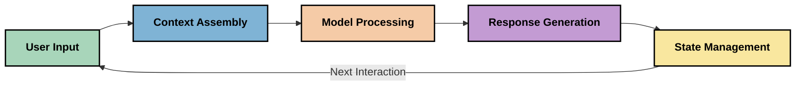
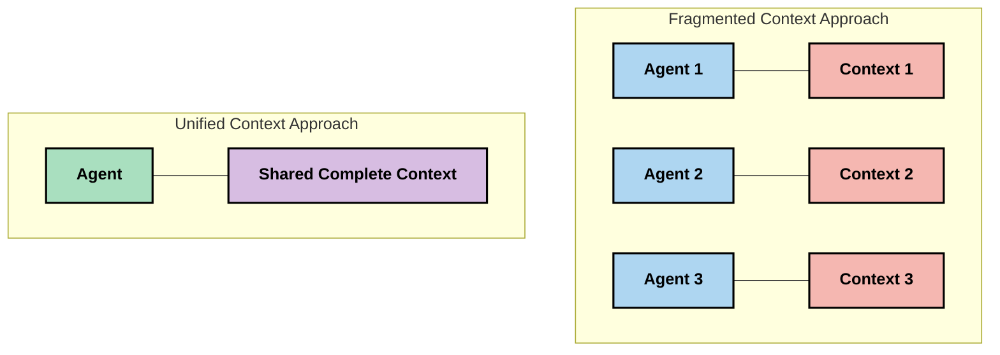
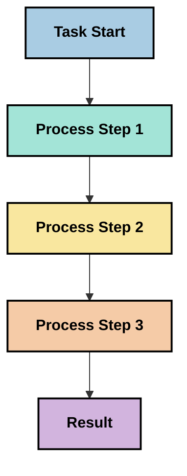
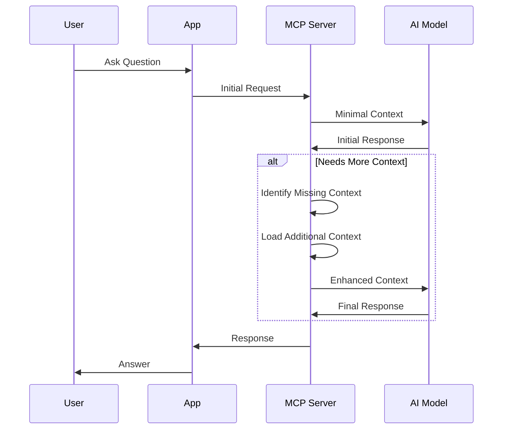
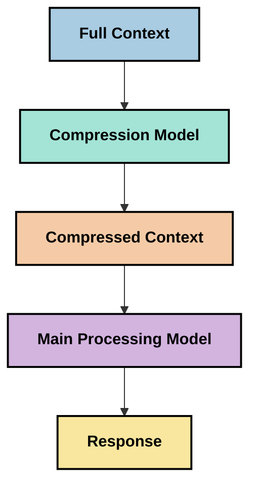

<!--
CO_OP_TRANSLATOR_METADATA:
{
  "original_hash": "fd169ca3071b81b5ee282e194bc823df",
  "translation_date": "2025-09-15T20:56:28+00:00",
  "source_file": "05-AdvancedTopics/mcp-contextengineering/README.md",
  "language_code": "sw"
}
-->
# Uhandisi wa Muktadha: Dhana Inayochipuka katika Mfumo wa MCP

## Muhtasari

Uhandisi wa muktadha ni dhana inayochipuka katika eneo la AI inayochunguza jinsi taarifa zinavyopangwa, kutolewa, na kudumishwa wakati wa mwingiliano kati ya wateja na huduma za AI. Kadri mfumo wa Model Context Protocol (MCP) unavyoendelea, kuelewa jinsi ya kusimamia muktadha kwa ufanisi kunakuwa muhimu zaidi. Moduli hii inatambulisha dhana ya uhandisi wa muktadha na kuchunguza matumizi yake yanayowezekana katika utekelezaji wa MCP.

## Malengo ya Kujifunza

Mwisho wa moduli hii, utaweza:

- Kuelewa dhana inayochipuka ya uhandisi wa muktadha na jukumu lake linalowezekana katika matumizi ya MCP
- Kutambua changamoto kuu katika usimamizi wa muktadha ambazo muundo wa MCP unashughulikia
- Kuchunguza mbinu za kuboresha utendaji wa modeli kupitia usimamizi bora wa muktadha
- Kuzingatia njia za kupima na kutathmini ufanisi wa muktadha
- Kutumia dhana hizi zinazochipuka kuboresha uzoefu wa AI kupitia mfumo wa MCP

## Utangulizi wa Uhandisi wa Muktadha

Uhandisi wa muktadha ni dhana inayochipuka inayolenga muundo wa makusudi na usimamizi wa mtiririko wa taarifa kati ya watumiaji, programu, na modeli za AI. Tofauti na nyanja zilizoanzishwa kama uhandisi wa maelekezo (prompt engineering), uhandisi wa muktadha bado unafafanuliwa na wataalamu wanapojaribu kutatua changamoto za kipekee za kutoa modeli za AI taarifa sahihi kwa wakati sahihi.

Kadri modeli kubwa za lugha (LLMs) zinavyoendelea, umuhimu wa muktadha unazidi kuwa dhahiri. Ubora, umuhimu, na muundo wa muktadha tunaotoa huathiri moja kwa moja matokeo ya modeli. Uhandisi wa muktadha unachunguza uhusiano huu na kutafuta kuendeleza kanuni za usimamizi wa muktadha kwa ufanisi.

> "Mnamo 2025, modeli zilizopo zitakuwa na akili sana. Lakini hata binadamu mwenye akili zaidi hatakuwa na uwezo wa kufanya kazi yake kwa ufanisi bila muktadha wa kile anachoulizwa kufanya... 'Uhandisi wa muktadha' ni kiwango kinachofuata cha uhandisi wa maelekezo. Ni kuhusu kufanya hili kiotomatiki katika mfumo wa nguvu." — Walden Yan, Cognition AI

Uhandisi wa muktadha unaweza kujumuisha:

1. **Uchaguzi wa Muktadha**: Kuamua ni taarifa gani zinazofaa kwa kazi fulani
2. **Muundo wa Muktadha**: Kupanga taarifa ili kuongeza uelewa wa modeli
3. **Utoaji wa Muktadha**: Kuboresha jinsi na wakati taarifa zinavyotumwa kwa modeli
4. **Udumishaji wa Muktadha**: Kusimamia hali na mabadiliko ya muktadha kwa muda
5. **Tathmini ya Muktadha**: Kupima na kuboresha ufanisi wa muktadha

Maeneo haya ya kuzingatia ni muhimu hasa kwa mfumo wa MCP, ambao hutoa njia sanifu kwa programu za kutoa muktadha kwa LLMs.

## Mtazamo wa Safari ya Muktadha

Njia moja ya kuona uhandisi wa muktadha ni kufuatilia safari ambayo taarifa inachukua kupitia mfumo wa MCP:



### Hatua Muhimu katika Safari ya Muktadha:

1. **Ingizo la Mtumiaji**: Taarifa ghafi kutoka kwa mtumiaji (maandishi, picha, nyaraka)
2. **Muungano wa Muktadha**: Kuchanganya ingizo la mtumiaji na muktadha wa mfumo, historia ya mazungumzo, na taarifa nyingine zilizopatikana
3. **Usindikaji wa Modeli**: Modeli ya AI inasindika muktadha uliounganishwa
4. **Uzalishaji wa Majibu**: Modeli inatoa matokeo kulingana na muktadha uliotolewa
5. **Usimamizi wa Hali**: Mfumo unasasisha hali yake ya ndani kulingana na mwingiliano

Mtazamo huu unaonyesha asili ya nguvu ya muktadha katika mifumo ya AI na huibua maswali muhimu kuhusu jinsi ya kusimamia taarifa kwa ufanisi katika kila hatua.

## Kanuni Zinazochipuka katika Uhandisi wa Muktadha

Kadri uwanja wa uhandisi wa muktadha unavyoanza kuundwa, baadhi ya kanuni za awali zinaanza kujitokeza kutoka kwa wataalamu. Kanuni hizi zinaweza kusaidia kuongoza chaguo za utekelezaji wa MCP:

### Kanuni ya 1: Shiriki Muktadha Kikamilifu

Muktadha unapaswa kushirikiwa kikamilifu kati ya vipengele vyote vya mfumo badala ya kugawanywa kati ya mawakala au michakato mbalimbali. Wakati muktadha unaposambazwa, maamuzi yaliyofanywa katika sehemu moja ya mfumo yanaweza kupingana na yale yaliyofanywa mahali pengine.



Katika matumizi ya MCP, hii inapendekeza kubuni mifumo ambapo muktadha unazunguka bila mshono kupitia bomba lote badala ya kugawanywa.

### Kanuni ya 2: Tambua Kwamba Vitendo Hubeba Maamuzi ya Kificho

Kila kitendo ambacho modeli huchukua kina maamuzi ya kificho kuhusu jinsi ya kutafsiri muktadha. Wakati vipengele vingi vinapofanya kazi kwenye muktadha tofauti, maamuzi haya ya kificho yanaweza kupingana, na kusababisha matokeo yasiyo thabiti.

Kanuni hii ina athari muhimu kwa matumizi ya MCP:
- Pendelea usindikaji wa mstari wa kazi ngumu badala ya utekelezaji sambamba na muktadha uliogawanyika
- Hakikisha kwamba sehemu zote za maamuzi zina ufikiaji wa taarifa sawa ya muktadha
- Buni mifumo ambapo hatua za baadaye zinaweza kuona muktadha kamili wa maamuzi ya awali

### Kanuni ya 3: Linganisha Kina cha Muktadha na Vikwazo vya Dirisha

Kadri mazungumzo na michakato inavyokuwa mirefu, madirisha ya muktadha hatimaye hujaa. Uhandisi wa muktadha wa ufanisi huchunguza njia za kusimamia mvutano huu kati ya muktadha wa kina na vikwazo vya kiufundi.

Njia zinazowezekana zinazochunguzwa ni pamoja na:
- Ukandamizaji wa muktadha unaohifadhi taarifa muhimu huku ukipunguza matumizi ya tokeni
- Upakiaji wa muktadha kwa hatua kulingana na umuhimu kwa mahitaji ya sasa
- Muhtasari wa mwingiliano wa awali huku ukihifadhi maamuzi na ukweli muhimu

## Changamoto za Muktadha na Muundo wa Itifaki ya MCP

Model Context Protocol (MCP) ilibuniwa kwa ufahamu wa changamoto za kipekee za usimamizi wa muktadha. Kuelewa changamoto hizi husaidia kuelezea vipengele muhimu vya muundo wa MCP:

### Changamoto ya 1: Vikwazo vya Dirisha la Muktadha
Modeli nyingi za AI zina ukubwa wa dirisha la muktadha lililowekwa, na hivyo kupunguza kiasi cha taarifa wanazoweza kusindika mara moja.

**Jibu la Muundo wa MCP:** 
- Itifaki inaunga mkono muktadha uliopangwa, unaotegemea rasilimali ambao unaweza kurejelewa kwa ufanisi
- Rasilimali zinaweza kugawanywa na kupakiwa kwa hatua

### Changamoto ya 2: Uamuzi wa Umuhimu
Kuamua ni taarifa gani ni muhimu zaidi kujumuishwa katika muktadha ni kazi ngumu.

**Jibu la Muundo wa MCP:**
- Zana zinazobadilika huruhusu upatikanaji wa taarifa kwa nguvu kulingana na mahitaji
- Maelekezo yaliyopangwa huwezesha muundo thabiti wa muktadha

### Changamoto ya 3: Udumishaji wa Muktadha
Kusimamia hali katika mwingiliano kunahitaji ufuatiliaji makini wa muktadha.

**Jibu la Muundo wa MCP:**
- Usimamizi wa kikao uliosanifiwa
- Mifumo ya mwingiliano iliyoelezwa wazi kwa mabadiliko ya muktadha

### Changamoto ya 4: Muktadha wa Aina Nyingi
Aina tofauti za data (maandishi, picha, data iliyopangwa) zinahitaji usimamizi tofauti.

**Jibu la Muundo wa MCP:**
- Muundo wa itifaki unakubali aina mbalimbali za maudhui
- Uwakilishi uliosanifiwa wa taarifa za aina nyingi

### Changamoto ya 5: Usalama na Faragha
Muktadha mara nyingi una taarifa nyeti ambazo lazima zilindwe.

**Jibu la Muundo wa MCP:**
- Mipaka wazi kati ya majukumu ya mteja na seva
- Chaguo za usindikaji wa ndani ili kupunguza kufichuliwa kwa data

Kuelewa changamoto hizi na jinsi MCP inavyoshughulikia hutoa msingi wa kuchunguza mbinu za hali ya juu za uhandisi wa muktadha.

## Mbinu Zinazochipuka za Uhandisi wa Muktadha

Kadri uwanja wa uhandisi wa muktadha unavyoendelea, mbinu kadhaa zenye matumaini zinaanza kujitokeza. Hizi zinawakilisha mawazo ya sasa badala ya mazoea yaliyowekwa, na zitaendelea kubadilika kadri tunavyopata uzoefu zaidi na utekelezaji wa MCP.

### 1. Usindikaji wa Mstari wa Thread Moja

Tofauti na usanifu wa mawakala wengi unaosambaza muktadha, baadhi ya wataalamu wanagundua kuwa usindikaji wa mstari wa thread moja unazalisha matokeo thabiti zaidi. Hii inaendana na kanuni ya kudumisha muktadha wa umoja.



Ingawa mbinu hii inaweza kuonekana kuwa na ufanisi mdogo kuliko usindikaji sambamba, mara nyingi huzalisha matokeo yanayolingana na ya kuaminika zaidi kwa sababu kila hatua inajengwa juu ya uelewa kamili wa maamuzi ya awali.

### 2. Kugawanya Muktadha na Kuweka Kipaumbele

Kugawanya muktadha mkubwa katika vipande vinavyoweza kudhibitiwa na kuweka kipaumbele kwa kile kilicho muhimu zaidi.

```python
# Conceptual Example: Context Chunking and Prioritization
def process_with_chunked_context(documents, query):
    # 1. Break documents into smaller chunks
    chunks = chunk_documents(documents)
    
    # 2. Calculate relevance scores for each chunk
    scored_chunks = [(chunk, calculate_relevance(chunk, query)) for chunk in chunks]
    
    # 3. Sort chunks by relevance score
    sorted_chunks = sorted(scored_chunks, key=lambda x: x[1], reverse=True)
    
    # 4. Use the most relevant chunks as context
    context = create_context_from_chunks([chunk for chunk, score in sorted_chunks[:5]])
    
    # 5. Process with the prioritized context
    return generate_response(context, query)
```

Dhana hapo juu inaonyesha jinsi tunavyoweza kugawanya nyaraka kubwa katika vipande vinavyoweza kudhibitiwa na kuchagua sehemu muhimu zaidi kwa muktadha. Mbinu hii inaweza kusaidia kufanya kazi ndani ya vikwazo vya dirisha la muktadha huku ikitumia hifadhidata kubwa.

### 3. Upakiaji wa Muktadha kwa Hatua

Kupakia muktadha kwa hatua kadri inavyohitajika badala ya mara moja.



Upakiaji wa muktadha kwa hatua huanza na muktadha mdogo na kupanuka tu inapohitajika. Hii inaweza kupunguza kwa kiasi kikubwa matumizi ya tokeni kwa maswali rahisi huku ikidumisha uwezo wa kushughulikia maswali magumu.

### 4. Ukandamizaji wa Muktadha na Muhtasari

Kupunguza ukubwa wa muktadha huku ukihifadhi taarifa muhimu.



Ukandamizaji wa muktadha unalenga:
- Kuondoa taarifa zisizohitajika
- Kufupisha maudhui marefu
- Kutoa ukweli na maelezo muhimu
- Kuhifadhi vipengele muhimu vya muktadha
- Kuboresha ufanisi wa tokeni

Mbinu hii inaweza kuwa muhimu hasa kwa kudumisha mazungumzo marefu ndani ya madirisha ya muktadha au kwa kusindika nyaraka kubwa kwa ufanisi. Baadhi ya wataalamu wanatumia modeli maalum kwa ukandamizaji wa muktadha na muhtasari wa historia ya mazungumzo.

## Mazingatio ya Uhandisi wa Muktadha wa Kichunguzi

Tunapochunguza uwanja unaochipuka wa uhandisi wa muktadha, kuna mazingatio kadhaa yanayostahili kuzingatiwa wakati wa kufanya kazi na utekelezaji wa MCP. Haya si mazoea bora ya lazima bali maeneo ya uchunguzi ambayo yanaweza kuleta maboresho katika kesi yako maalum.

### Fikiria Malengo Yako ya Muktadha

Kabla ya kutekeleza suluhisho tata za usimamizi wa muktadha, eleza wazi unachojaribu kufanikisha:
- Ni taarifa gani maalum ambayo modeli inahitaji kufanikiwa?
- Ni taarifa gani muhimu dhidi ya zile za ziada?
- Ni vikwazo vyako vya utendaji (muda wa kusubiri, vikwazo vya tokeni, gharama)?

### Chunguza Mbinu za Muktadha Zenye Tabaka

Baadhi ya wataalamu wanapata mafanikio na muktadha uliopangwa katika tabaka za dhana:
- **Tabaka la Msingi**: Taarifa muhimu ambayo modeli inahitaji kila wakati
- **Tabaka la Hali**: Muktadha maalum kwa mwingiliano wa sasa
- **Tabaka la Msaada**: Taarifa za ziada ambazo zinaweza kusaidia
- **Tabaka la Akiba**: Taarifa zinazopatikana tu inapohitajika

### Chunguza Mikakati ya Upatikanaji

Ufanisi wa muktadha wako mara nyingi hutegemea jinsi unavyopata taarifa:
- Utafutaji wa semantiki na embeddings kwa kupata taarifa zinazohusiana dhana
- Utafutaji wa maneno muhimu kwa maelezo maalum ya ukweli
- Mbinu za mseto zinazochanganya njia nyingi za upatikanaji
- Uchujaji wa metadata ili kupunguza wigo kulingana na kategoria, tarehe, au vyanzo

### Jaribu Ushirikiano wa Muktadha

Muundo na mtiririko wa muktadha wako unaweza kuathiri uelewa wa modeli:
- Kuweka taarifa zinazohusiana pamoja
- Kutumia muundo na mpangilio thabiti
- Kudumisha mpangilio wa kimantiki au wa muda inapofaa
- Kuepuka taarifa zinazopingana

### Pima Faida na Hasara za Usanifu wa Mawakala Wengi

Ingawa usanifu wa mawakala wengi ni maarufu katika mifumo mingi ya AI, huja na changamoto kubwa kwa usimamizi wa muktadha:
- Kugawanyika kwa muktadha kunaweza kusababisha maamuzi yasiyo thabiti kati ya mawakala
- Usindikaji sambamba unaweza kuanzisha migongano ambayo ni vigumu kusuluhisha
- Mzigo wa mawasiliano kati ya mawakala unaweza kupunguza faida za utendaji
- Usimamizi wa hali tata unahitajika kudumisha mshikamano

Katika hali nyingi, mbinu ya wakala mmoja yenye usimamizi wa muktadha wa kina inaweza kutoa matokeo ya kuaminika zaidi kuliko mawakala wengi maalum wenye muktadha uliogawanyika.

### Tengeneza Mbinu za Tathmini

Ili kuboresha uhandisi wa muktadha kwa muda, fikiria jinsi utakavyopima mafanikio:
- Kupima A/B miundo tofauti ya muktadha
- Kufuatilia matumizi ya tokeni na nyakati za majibu
- Kufuatilia kuridhika kwa mtumiaji na viwango vya kukamilisha kazi
- Kuchambua ni lini na kwa nini mikakati ya muktadha inashindwa

Mazingatio haya yanawakilisha maeneo ya uchunguzi yanayoendelea katika uwanja wa uhandisi wa muktadha. Kadri uwanja unavyokomaa, mifumo na mazoea ya uhakika zaidi yanaweza kujitokeza.

## Kupima Ufanisi wa Muktadha: Mfumo Unaobadilika

Kadri uhandisi wa muktadha unavyochipuka kama dhana, wataalamu wanaanza kuchunguza jinsi tunavyoweza kupima ufanisi wake. Hakuna mfumo uliowekwa bado, lakini vipimo mbalimbali vinazingatiwa ambavyo vinaweza kusaidia kuongoza kazi ya baadaye.

### Vipimo Vinavyowezekana vya Kupima

#### 1. Mazingatio ya Ufanisi wa Ingizo

- **Uwiano wa Muktadha kwa Majibu**: Ni kiasi gani cha muktadha kinahitajika ikilinganishwa na ukubwa wa majibu?
- **Matumizi ya Tokeni**: Asilimia gani ya tokeni za muktadha zinazotolewa zinaonekana kuathiri majibu?
- **Kupunguza Muktadha**: Tunaweza kukandamiza taarifa ghafi kwa ufanisi kiasi gani?

#### 2. Mazingatio ya Utendaji

- **Athari ya Muda wa Kusubiri**: Usimamizi wa muktadha unaathirije muda wa majibu?
- **Uchumi wa Tokeni**: Je, tunatumia tokeni kwa ufanisi?
- **Usahihi wa Upatikanaji**: Taarifa zilizopatikana ni muhimu kiasi gani?
- **Matumizi ya Rasilimali**: Ni rasilimali gani za kompyuta zinazohitajika?

#### 3. Mazingatio ya Ubora

- **Umuhimu wa Majibu**: Majibu yanashughulikia swali vizuri kiasi gani?
- **Usahihi wa Ukweli**: Je, usimamizi wa muktadha unaboresha usahihi wa ukweli?
- **Mshikamano**: Majibu yanalingana katika maswali yanayofanana?
- **Kiwango cha Uhalisia**: Je, muktadha bora unapunguza uhalisia wa modeli?

#### 4. Mazingatio ya Uzoefu wa Mtumiaji

- **Kiwango cha Ufuatiliaji**: Watumiaji wanahitaji ufafanuzi mara ngapi?
- **Kukamilisha Kazi**: Watumiaji wanakamilisha malengo yao kwa
- [Model Context Protocol Website](https://modelcontextprotocol.io/)
- [Model Context Protocol Specification](https://github.com/modelcontextprotocol/modelcontextprotocol)
- [MCP Documentation](https://modelcontextprotocol.io/docs)
- [MCP C# SDK](https://github.com/modelcontextprotocol/csharp-sdk)
- [MCP Python SDK](https://github.com/modelcontextprotocol/python-sdk)
- [MCP TypeScript SDK](https://github.com/modelcontextprotocol/typescript-sdk)
- [MCP Inspector](https://github.com/modelcontextprotocol/inspector) - Zana ya majaribio ya kuona kwa seva za MCP

### Makala za Uhandisi wa Muktadha
- [Usijenge Wakala Wengi: Kanuni za Uhandisi wa Muktadha](https://cognition.ai/blog/dont-build-multi-agents) - Maoni ya Walden Yan kuhusu kanuni za uhandisi wa muktadha
- [Mwongozo wa Kivitendo wa Kujenga Mawakala](https://cdn.openai.com/business-guides-and-resources/a-practical-guide-to-building-agents.pdf) - Mwongozo wa OpenAI kuhusu muundo bora wa mawakala
- [Kujenga Mawakala Wenye Ufanisi](https://www.anthropic.com/engineering/building-effective-agents) - Mbinu ya Anthropic katika ukuzaji wa mawakala

### Utafiti Husika
- [Kuongeza Urejeshaji wa Kielezo kwa Miundo Mikubwa ya Lugha](https://arxiv.org/abs/2310.01487) - Utafiti kuhusu mbinu za urejeshaji wa kielezo
- [Kupotea Katikati: Jinsi Miundo ya Lugha Inavyotumia Muktadha Mrefu](https://arxiv.org/abs/2307.03172) - Utafiti muhimu kuhusu mifumo ya usindikaji wa muktadha
- [Kizazi cha Picha Kilichopangwa na Maandishi kwa Ngazi ya Hierarkia kwa CLIP Latents](https://arxiv.org/abs/2204.06125) - Karatasi ya DALL-E 2 yenye maoni kuhusu muundo wa muktadha
- [Kuchunguza Jukumu la Muktadha katika Miundo Mikubwa ya Lugha](https://aclanthology.org/2023.findings-emnlp.124/) - Utafiti wa hivi karibuni kuhusu usimamizi wa muktadha
- [Ushirikiano wa Mawakala Wengi: Utafiti](https://arxiv.org/abs/2304.03442) - Utafiti kuhusu mifumo ya mawakala wengi na changamoto zake

### Rasilimali za Ziada
- [Mbinu za Kuboresha Dirisha la Muktadha](https://learn.microsoft.com/en-us/azure/ai-services/openai/concepts/context-window)
- [Mbinu za Juu za RAG](https://www.microsoft.com/en-us/research/blog/retrieval-augmented-generation-rag-and-frontier-models/)
- [Nyaraka za Kernel ya Semantiki](https://github.com/microsoft/semantic-kernel)
- [Zana ya AI kwa Usimamizi wa Muktadha](https://github.com/microsoft/aitoolkit)

## Nini kinafuata 

- [5.15 MCP Usafiri Maalum](../mcp-transport/README.md)

---

**Kanusho**:  
Hati hii imetafsiriwa kwa kutumia huduma ya tafsiri ya AI [Co-op Translator](https://github.com/Azure/co-op-translator). Ingawa tunajitahidi kuhakikisha usahihi, tafsiri za kiotomatiki zinaweza kuwa na makosa au kutokuwa sahihi. Hati ya asili katika lugha yake ya awali inapaswa kuchukuliwa kama chanzo cha mamlaka. Kwa taarifa muhimu, tafsiri ya kitaalamu ya binadamu inapendekezwa. Hatutawajibika kwa kutoelewana au tafsiri zisizo sahihi zinazotokana na matumizi ya tafsiri hii.