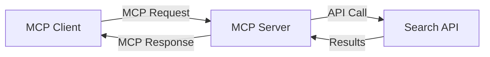
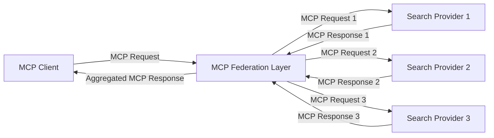
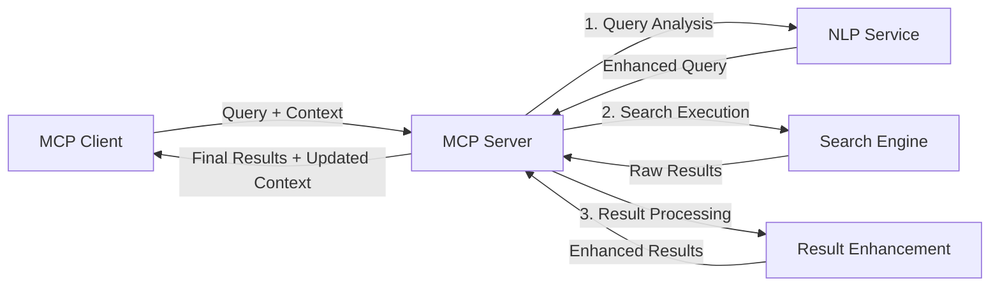

<!--
CO_OP_TRANSLATOR_METADATA:
{
  "original_hash": "16bef2c93c6a86d4ca6a8ce9e120e384",
  "translation_date": "2025-06-13T02:57:52+00:00",
  "source_file": "05-AdvancedTopics/mcp-realtimesearch/README.md",
  "language_code": "sw"
}
-->
## Maelezo ya Mifano ya Msimbo

> **Kumbuka Muhimu**: Mifano ya msimbo hapa chini inaonyesha jinsi ya kuunganisha Model Context Protocol (MCP) na kazi za utafutaji wa wavuti. Ingawa inafuata muundo na mitindo ya SDK rasmi za MCP, imepunguzwa kwa madhumuni ya elimu.
> 
> Mifano hii inaonyesha:
> 
> 1. **Utekelezaji wa Python**: Utekelezaji wa seva ya FastMCP inayotoa chombo cha utafutaji wa wavuti na kuunganishwa na API ya utafutaji ya nje. Mfano huu unaonyesha usimamizi sahihi wa muda wa maisha, usimamizi wa muktadha, na utekelezaji wa zana ukifuata mitindo ya [SDK rasmi ya MCP ya Python](https://github.com/modelcontextprotocol/python-sdk). Seva hutumia usafirishaji wa HTTP wa Streamable uliopendekezwa ambao umechukua nafasi ya usafirishaji wa SSE wa zamani kwa matumizi ya uzalishaji.
> 
> 2. **Utekelezaji wa JavaScript**: Utekelezaji wa TypeScript/JavaScript ukitumia mtindo wa FastMCP kutoka kwa [SDK rasmi ya MCP ya TypeScript](https://github.com/modelcontextprotocol/typescript-sdk) kuunda seva ya utafutaji yenye ufafanuzi sahihi wa zana na muunganisho wa wateja. Unafuata mitindo ya hivi karibuni inayopendekezwa kwa usimamizi wa vikao na uhifadhi wa muktadha.
> 
> Mifano hii itahitaji usimamizi zaidi wa makosa, uthibitishaji, na msimbo maalum wa kuunganishwa na API kwa matumizi ya uzalishaji. Anuani za API za utafutaji zilizotumika (`https://api.search-service.example/search`) ni za mfano na zinahitaji kubadilishwa na anuani halisi za huduma za utafutaji.
> 
> Kwa maelezo kamili ya utekelezaji na mbinu za kisasa zaidi, tafadhali rejelea [maelezo rasmi ya MCP](https://spec.modelcontextprotocol.io/) na nyaraka za SDK.

## Misingi ya Muktadha

### Mfumo wa Model Context Protocol (MCP)

Kwa msingi wake, Model Context Protocol hutoa njia iliyosanifiwa kwa viwango kwa modeli za AI, programu, na huduma kubadilishana muktadha. Katika utafutaji wa wavuti wa wakati halisi, mfumo huu ni muhimu kwa kuunda uzoefu wa utafutaji unaoendelea kwa mizunguko mingi. Vipengele muhimu ni:

1. **Mimaario ya Mteja-Seva**: MCP huanzisha mgawanyiko wazi kati ya wateja wa utafutaji (waombaji) na seva za utafutaji (watoa huduma), kuruhusu mifano ya usambazaji yenye kubadilika.
2. **Mawasiliano ya JSON-RPC**: Itumia JSON-RPC kwa kubadilishana ujumbe, kufanya iwe sambamba na teknolojia za wavuti na rahisi kutekelezwa kwenye majukwaa tofauti.
3. **Usimamizi wa Muktadha**: MCP hufafanua mbinu za muundo za kuhifadhi, kusasisha, na kutumia muktadha wa utafutaji katika mwingiliano mingi.
4. **Ufafanuzi wa Zana**: Uwezo wa utafutaji unaonyeshwa kama zana zilizo na vigezo na thamani za kurudi zilizo wazi.
5. **Msaada wa Usambazaji**: Itakuwa na uwezo wa kusambaza matokeo, muhimu kwa utafutaji wa wakati halisi ambapo matokeo yanaweza kuwasili hatua kwa hatua.

### Mifumo ya Kuunganisha Utafutaji wa Wavuti

Unapoingiza MCP na utafutaji wa wavuti, mifumo kadhaa hujitokeza:

#### 1. Muunganisho wa Mtoa Huduma wa Utafutaji Moja kwa Moja

Katika mfumo huu, seva ya MCP inaunganisha moja kwa moja na API moja au zaidi za utafutaji, ikitafsiri maombi ya MCP kuwa simu maalum za API na kuunda matokeo kama majibu ya MCP.

#### 2. Utafutaji wa Muungano na Uhifadhi wa Muktadha

Mfumo huu hueneza maswali ya utafutaji kwa watoa huduma wengi wa utafutaji wanaoendana na MCP, kila mmoja akihusiana na aina tofauti za maudhui au uwezo wa utafutaji, huku ukihifadhi muktadha mmoja wa umoja.

#### 3. Mnyororo wa Utafutaji Ulioimarishwa kwa Muktadha

Katika mfumo huu, mchakato wa utafutaji unagawanywa katika hatua nyingi, ambapo muktadha unaongezwa kila hatua, na kuleta matokeo yenye uhusiano zaidi kwa hatua.

### Vipengele vya Muktadha wa Utafutaji

Katika utafutaji wa wavuti unaotumia MCP, muktadha kawaida unajumuisha:

- **Historia ya Maswali**: Maswali ya utafutaji yaliyopita katika kikao
- **Mapendeleo ya Mtumiaji**: Lugha, eneo, mipangilio ya utafutaji salama
- **Historia ya Mwingiliano**: Matokeo yaliyoangaziwa, muda uliotumika kwa matokeo
- **Vigezo vya Utafutaji**: Vichujio, mpangilio wa matokeo, na visahihisho vingine vya utafutaji
- **Maarifa ya Kikoa**: Muktadha maalum wa somo unaohusiana na utafutaji
- **Muktadha wa Muda**: Vigezo vya umuhimu vinavyotegemea muda
- **Mapendeleo ya Vyanzo**: Vyanzo vya habari vinavyoaminika au vinavyopendekezwa

## Matumizi na Maombi

### Utafiti na Ukusanyaji wa Taarifa

MCP huongeza utiririshaji wa utafiti kwa:

- Kuhifadhi muktadha wa utafiti katika vikao vya utafutaji
- Kuwezesha maswali ya hali ya juu na yenye muktadha unaofaa
- Kusaidia muungano wa vyanzo vingi vya utafutaji
- Kuwezesha uchimbaji wa maarifa kutoka kwa matokeo ya utafutaji

### Ufuatiliaji wa Habari na Mwelekeo wa Wakati Halisi

Utafutaji unaotumia MCP unatoa faida kwa ufuatiliaji wa habari:

- Ugunduzi wa karibu wa wakati halisi wa hadithi zinazoibuka
- Kuchuja habari zinazohusiana kwa muktadha
- Ufuatiliaji wa mada na vitu katika vyanzo vingi
- Tahadhari za habari zilizobinafsishwa kulingana na muktadha wa mtumiaji

### Uvinjari na Utafiti Unaosaidiwa na AI

MCP huunda fursa mpya kwa uvinjari unaosaidiwa na AI:

- Mapendekezo ya utafutaji yanayotegemea muktadha wa shughuli za kivinjari
- Muunganisho usio na mshono wa utafutaji wa wavuti na wasaidizi wa LLM
- Uboreshaji wa utafutaji wa mizunguko mingi ukiwa na muktadha uliodumishwa
- Ukaguzi bora wa ukweli na uhakiki wa taarifa

## Mwelekeo na Ubunifu wa Baadaye

### Mageuzi ya MCP katika Utafutaji wa Wavuti

Tukitazama mbele, tunatarajia MCP itabadilika ili kushughulikia:

- **Utafutaji wa Multimodal**: Kuunganisha utafutaji wa maandishi, picha, sauti, na video ukihifadhi muktadha
- **Utafutaji Usio na Kituo Kimoja**: Kusaidia mifumo ya utafutaji iliyosambazwa na muungano
- **Faragha ya Utafutaji**: Mbinu za utafutaji zinazoilinda faragha na zinazoelewa muktadha
- **Uelewa wa Maswali**: Kuchambua kwa kina maana ya maswali ya lugha asilia

### Maendeleo Yanayoweza Kutokea Katika Teknolojia

Teknolojia zinazoibuka zitazoathiri MCP ya utafutaji:

1. **Mimaario ya Utafutaji wa Neural**: Mifumo ya utafutaji inayotumia embeddings iliyoboreshwa kwa MCP
2. **Muktadha wa Utafutaji Binafsi**: Kujifunza mifumo ya utafutaji ya mtumiaji binafsi kwa muda
3. **Muunganisho wa Grafu za Maarifa**: Utafutaji unaoimarishwa na grafu za maarifa maalum kwa kikoa
4. **Muktadha wa Mifumo Mbalimbali**: Kuhifadhi muktadha kati ya aina tofauti za utafutaji

## Mazoezi ya Kivitendo

### Zoeezi 1: Kuweka Msingi wa Mnyororo wa Utafutaji wa MCP

Katika zoezi hili, utajifunza jinsi ya:
- Kusanidi mazingira ya msingi ya utafutaji wa MCP
- Kutekeleza wasimamizi wa muktadha kwa utafutaji wa wavuti
- Kupima na kuthibitisha uhifadhi wa muktadha katika mizunguko ya utafutaji

### Zoezi 2: Kujenga Msaidizi wa Utafiti kwa Utafutaji wa MCP

Tengeneza programu kamili inayofanya:
- Kuchakata maswali ya utafiti kwa lugha asilia
- Kufanya utafutaji wa wavuti unaojali muktadha
- Kusintetisha taarifa kutoka vyanzo vingi
- Kuonyesha matokeo ya utafiti yaliyopangwa vizuri

### Zoezi 3: Kutekeleza Muungano wa Utafutaji wa Vyanzo Vingi kwa MCP

Zoezi la hali ya juu linalojumuisha:
- Kutuma maswali yanayojali muktadha kwa injini nyingi za utafutaji
- Kupanga na kuunganisha matokeo
- Kutoa matokeo ya utafutaji yasiyojirudia kwa muktadha
- Kusimamia metadata maalum ya vyanzo

## Rasilimali Zaidi

- [Maelezo ya Model Context Protocol](https://spec.modelcontextprotocol.io/) - Maelezo rasmi ya MCP na nyaraka za itifaki
- [Nyaraka za Model Context Protocol](https://modelcontextprotocol.io/) - Mafunzo ya kina na mwongozo wa utekelezaji
- [SDK ya MCP ya Python](https://github.com/modelcontextprotocol/python-sdk) - Utekelezaji rasmi wa MCP kwa Python
- [SDK ya MCP ya TypeScript](https://github.com/modelcontextprotocol/typescript-sdk) - Utekelezaji rasmi wa MCP kwa TypeScript
- [Seva za Marejeleo za MCP](https://github.com/modelcontextprotocol/servers) - Utekelezaji wa rejeleo wa seva za MCP
- [Nyaraka za Bing Web Search API](https://learn.microsoft.com/en-us/bing/search-apis/bing-web-search/overview) - API ya utafutaji wa wavuti ya Microsoft
- [Google Custom Search JSON API](https://developers.google.com/custom-search/v1/overview) - Injini ya utafutaji wa programu ya Google
- [Nyaraka za SerpAPI](https://serpapi.com/search-api) - API ya kuripoti matokeo ya injini za utafutaji
- [Nyaraka za Meilisearch](https://www.meilisearch.com/docs) - Injini ya utafutaji ya chanzo huria
- [Nyaraka za Elasticsearch](https://www.elastic.co/guide/index.html) - Injini ya utafutaji na uchambuzi uliosambazwa
- [Nyaraka za LangChain](https://python.langchain.com/docs/get_started/introduction) - Kujenga programu kwa LLMs

## Matokeo ya Kujifunza

Kwa kumaliza moduli hii, utaweza:

- Kuelewa misingi ya utafutaji wa wavuti wa wakati halisi na changamoto zake
- Kueleza jinsi Model Context Protocol (MCP) inavyoboreshwa uwezo wa utafutaji wa wakati halisi
- Kutekeleza suluhisho za utafutaji zinazotumia MCP kwa kutumia mifumo maarufu na API
- Kubuni na kupeleka mimaario ya utafutaji yenye uwezo mkubwa na inayoweza kupanuka kwa MCP
- Kutumia dhana za MCP katika matumizi mbalimbali ikiwa ni pamoja na utafutaji wa maana, msaada wa utafiti, na uvinjari unaosaidiwa na AI
- Kutathmini mwelekeo unaoibuka na ubunifu wa baadaye katika teknolojia za utafutaji zinazotumia MCP

### Mambo ya Kuamini na Usalama

Unapotekeleza suluhisho za utafutaji wa wavuti zinazotumia MCP, kumbuka kanuni hizi muhimu kutoka kwa maelezo ya MCP:

1. **Ruhusa na Udhibiti wa Mtumiaji**: Watumiaji lazima waruhusu wazi na kuelewa upatikanaji wa data na shughuli zote. Hii ni muhimu hasa kwa utekelezaji wa utafutaji wa wavuti unaoweza kufikia vyanzo vya data vya nje.
2. **Faragha ya Data**: Hakikisha usimamizi sahihi wa maswali ya utafutaji na matokeo, hasa yanapojumuisha taarifa nyeti. Tekeleza udhibiti wa upatikanaji kulinda data za watumiaji.
3. **Usalama wa Zana**: Tekeleza uthibitishaji na uidhinishaji sahihi kwa zana za utafutaji, kwani zinaweza kuwa hatari za usalama kupitia utekelezaji wa msimbo usio wa kuaminika. Maelezo ya tabia ya zana hayapaswi kuaminiwa isipokuwa yatolewe na seva inayotegemewa.
4. **Nyaraka Zilizofafanuliwa Vizuri**: Toa nyaraka wazi kuhusu uwezo, mipaka, na masuala ya usalama ya utekelezaji wako wa utafutaji unaotumia MCP, ukifuata mwongozo wa utekelezaji kutoka kwa maelezo ya MCP.
5. **Mifumo Imara ya Ruhusa**: Tengeneza mifumo imara ya ruhusa na uthibitishaji inayofafanua wazi kile kila zana inachofanya kabla ya kuidhinisha matumizi yake, hasa kwa zana zinazoshirikiana na rasilimali za wavuti za nje.

Kwa maelezo kamili kuhusu usalama na mambo ya kuamini MCP, rejelea [nyaraka rasmi](https://modelcontextprotocol.io/specification/2025-03-26#security-and-trust-%26-safety).

## Hatua Inayofuata

- [6. Michango ya Jamii](../../06-CommunityContributions/README.md)

**Kiepaza**:  
Hati hii imetafsiriwa kwa kutumia huduma ya utafsiri wa AI [Co-op Translator](https://github.com/Azure/co-op-translator). Ingawa tunajitahidi kuwa sahihi, tafadhali fahamu kwamba utafsiri wa kiotomatiki unaweza kuwa na makosa au kasoro. Hati ya asili katika lugha yake ya asili inapaswa kuchukuliwa kama chanzo cha mamlaka. Kwa taarifa muhimu, tafsiri ya kitaalamu ya binadamu inapendekezwa. Hatubeba uwajibikaji wowote kwa kutoelewana au tafsiri potofu zinazotokana na matumizi ya tafsiri hii.