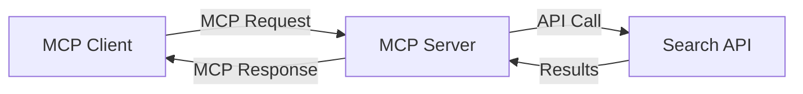
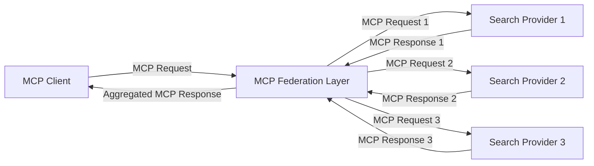
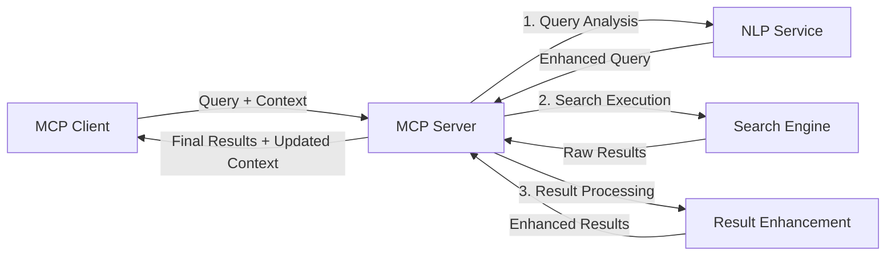

<!--
CO_OP_TRANSLATOR_METADATA:
{
  "original_hash": "eb12652eb7bd17f2193b835a344425c6",
  "translation_date": "2025-06-26T14:16:24+00:00",
  "source_file": "05-AdvancedTopics/mcp-realtimesearch/README.md",
  "language_code": "sw"
}
-->
## Kauli Kuhusu Mifano ya Msimbo

> **Kumbuka Muhimu**: Mifano ya msimbo hapa chini inaonyesha jinsi ya kuunganisha Model Context Protocol (MCP) na uwezo wa utafutaji wa wavuti. Ingawa inafuata mifumo na muundo wa MCP SDK rasmi, imefanywa iwe rahisi kwa madhumuni ya elimu.
> 
> Mifano hii inaonyesha:
> 
> 1. **Utekelezaji wa Python**: Utekelezaji wa seva ya FastMCP inayotoa zana ya utafutaji wa wavuti na kuunganishwa na API ya utafutaji ya nje. Mfano huu unaonyesha usimamizi sahihi wa maisha ya mzunguko, usimamizi wa muktadha, na utekelezaji wa zana kwa kufuata mifano ya [MCP Python SDK rasmi](https://github.com/modelcontextprotocol/python-sdk). Seva hutumia usafirishaji wa HTTP wa Streamable uliopendekezwa ambao umebadili usafirishaji wa zamani wa SSE kwa ajili ya matumizi ya uzalishaji.
> 
> 2. **Utekelezaji wa JavaScript**: Utekelezaji wa TypeScript/JavaScript ukitumia muundo wa FastMCP kutoka kwa [MCP TypeScript SDK rasmi](https://github.com/modelcontextprotocol/typescript-sdk) kuunda seva ya utafutaji na ufafanuzi sahihi wa zana na muunganisho wa wateja. Inafuata mifano ya hivi karibuni ya usimamizi wa vikao na uhifadhi wa muktadha.
> 
> Mifano hii itahitaji usimamizi zaidi wa makosa, uthibitishaji, na msimbo maalum wa kuunganishwa na API kwa matumizi ya uzalishaji. Vikoa vya API vya utafutaji vilivyoonyeshwa (`https://api.search-service.example/search`) ni sehemu za mfano na vinahitaji kubadilishwa na vikoa halisi vya huduma za utafutaji.
> 
> Kwa maelezo kamili ya utekelezaji na mbinu za kisasa zaidi, tafadhali rejelea [sifa rasmi ya MCP](https://spec.modelcontextprotocol.io/) na nyaraka za SDK.

## Misingi Muhimu

### Mfumo wa Model Context Protocol (MCP)

Kwa msingi wake, Model Context Protocol hutoa njia ya kawaida kwa mifano ya AI, programu, na huduma kubadilishana muktadha. Katika utafutaji wa wavuti wa wakati halisi, mfumo huu ni muhimu kwa kuunda uzoefu wa utafutaji unaoeleweka na wa mizunguko mingi. Vipengele muhimu ni:

1. **Miundombinu ya Mteja-Seva**: MCP huanzisha mgawanyo wazi kati ya wateja wa utafutaji (watafuta) na seva za utafutaji (watoaji), kuruhusu mifano ya usambazaji yenye kubadilika.

2. **Mawasiliano ya JSON-RPC**: Itifaki hutumia JSON-RPC kubadilishana ujumbe, kufanya iwe sambamba na teknolojia za wavuti na rahisi kutekelezwa kwenye majukwaa tofauti.

3. **Usimamizi wa Muktadha**: MCP huainisha mbinu za muundo za kudumisha, kusasisha, na kutumia muktadha wa utafutaji katika mwingiliano mingi.

4. **Ufafanuzi wa Zana**: Uwezo wa utafutaji unaonyeshwa kama zana za kawaida zenye vigezo na thamani za kurudi zilizo wazi.

5. **Msaada wa Kuendesha Mfululizo**: Itifaki inaunga mkono matokeo yanayotiririka, muhimu kwa utafutaji wa wakati halisi ambapo matokeo yanaweza kuwasili kwa hatua.

### Mifumo ya Kuunganisha Utafutaji wa Wavuti

Unapounganisha MCP na utafutaji wa wavuti, mifumo kadhaa huibuka:

#### 1. Uunganisho wa Mtoa Huduma wa Utafutaji Moja kwa Moja

Katika mfumo huu, seva ya MCP inaunganishwa moja kwa moja na API moja au zaidi za utafutaji, ikitafsiri maombi ya MCP kuwa simu za API maalum na kuunda matokeo kama majibu ya MCP.

#### 2. Utafutaji wa Umoja kwa Uhifadhi wa Muktadha

Mfumo huu unasambaza maswali ya utafutaji kwa watoa huduma wa utafutaji wa MCP wengi, kila mmoja akijikita katika aina tofauti za maudhui au uwezo wa utafutaji, huku ukidumisha muktadha wa pamoja.

#### 3. Mnyororo wa Utafutaji Ulioimarishwa kwa Muktadha

Katika mfumo huu, mchakato wa utafutaji umegawanywa katika hatua nyingi, na muktadha unaongezwa kila hatua, ukizalisha matokeo yenye umuhimu zaidi kwa hatua.

### Vipengele vya Muktadha wa Utafutaji

Katika utafutaji wa wavuti unaotumia MCP, muktadha kawaida unajumuisha:

- **Historia ya Maswali**: Maswali ya utafutaji yaliyopita katika kikao
- **Mapendeleo ya Mtumiaji**: Lugha, eneo, mipangilio ya utafutaji salama
- **Historia ya Mwingiliano**: Matokeo gani yaliibonwa, muda uliotumika kwa matokeo
- **Vigezo vya Utafutaji**: Vichujio, mpangilio wa matokeo, na viongezaji vingine vya utafutaji
- **Maarifa ya Sekta**: Muktadha maalum wa mada unaohusiana na utafutaji
- **Muktadha wa Muda**: Vigezo vya umuhimu vinavyotegemea muda
- **Mapendeleo ya Vyanzo**: Vyanzo vya habari vinavyoaminika au vinavyopendekezwa

## Matumizi na Programu

### Utafiti na Ukusanyaji wa Taarifa

MCP huimarisha mtiririko wa kazi wa utafiti kwa:

- Kuhifadhi muktadha wa utafiti kati ya vikao vya utafutaji
- Kuwezesha maswali ya hali ya juu na yenye muktadha
- Kusaidia ushirikiano wa vyanzo vingi vya utafutaji
- Kurahisisha uchimbaji wa maarifa kutoka kwa matokeo ya utafutaji

### Ufuatiliaji wa Habari na Mwelekeo wa Wakati Halisi

Utafutaji unaotumia MCP unatoa faida kwa ufuatiliaji wa habari:

- Ugunduzi wa karibu wa hadithi mpya zinazoibuka
- Kuchuja habari muhimu kwa muktadha
- Kufuatilia mada na vitu katika vyanzo vingi
- Arifa za habari zilizoandaliwa binafsi kulingana na muktadha wa mtumiaji

### Kivinjari na Utafiti Ulioongezwa na AI

MCP huunda fursa mpya kwa vivinjari vilivyoongezwa na AI:

- Mapendekezo ya utafutaji yanayotegemea shughuli za kivinjari kwa sasa
- Uunganisho laini wa utafutaji wa wavuti na wasaidizi wa LLM
- Uboreshaji wa mizunguko mingi wa utafutaji ukiwa na muktadha unaodumishwa
- Uboreshaji wa uhakiki wa ukweli na uthibitishaji wa taarifa

## Mwelekeo na Ubunifu wa Baadaye

### Maendeleo ya MCP katika Utafutaji wa Wavuti

Tukiangalia mbele, tunatarajia MCP itabadilika ili kushughulikia:

- **Utafutaji wa Aina Nyingi**: Kuunganisha utafutaji wa maandishi, picha, sauti, na video huku muktadha ukidumishwa
- **Utafutaji Usio na Kituo Kimoja**: Kusaidia mifumo ya utafutaji iliyosambazwa na ya umoja
- **Faragha ya Utafutaji**: Mbinu za utafutaji zinazolinda faragha zenye muktadha
- **Uelewa wa Maswali**: Uchambuzi wa kina wa maana ya maswali ya lugha asilia

### Maboresho Yanayoweza Kuja

Teknolojia zinazoibuka zitakazoathiri MCP ya baadaye:

1. **Miundombinu ya Utafutaji wa Neural**: Mifumo ya utafutaji inayotumia embeddings iliyoboreshwa kwa MCP
2. **Muktadha wa Utafutaji wa Kibinafsi**: Kujifunza mifumo ya utafutaji ya mtumiaji binafsi kwa muda
3. **Uunganisho wa Grafu za Maarifa**: Utafutaji wenye muktadha ulioimarishwa na grafu za maarifa maalum
4. **Muktadha wa Aina Mbalimbali**: Kudumisha muktadha katika aina tofauti za utafutaji

## Mazoezi ya Vitendo

### Zozi la 1: Kuweka Msingi wa Mipangilio ya Utafutaji ya MCP

Katika zoezi hili, utajifunza jinsi ya:
- Kusanidi mazingira ya msingi ya utafutaji wa MCP
- Kutekeleza wasimamizi wa muktadha kwa utafutaji wa wavuti
- Kupima na kuthibitisha uhifadhi wa muktadha kati ya mizunguko ya utafutaji

### Zozi la 2: Kujenga Msaidizi wa Utafiti kwa Utafutaji wa MCP

Unda programu kamili inayoweza:
- Kushughulikia maswali ya utafiti ya lugha asilia
- Kufanya utafutaji wa wavuti unaojali muktadha
- Kusintetiza taarifa kutoka vyanzo vingi
- Kuonyesha matokeo ya utafiti yaliyopangwa vizuri

### Zozi la 3: Kutekeleza Ushirikiano wa Utafutaji wa Vyanzo Vingi kwa MCP

Zozi la hali ya juu linalojumuisha:
- Kusambaza maswali yenye muktadha kwa injini nyingi za utafutaji
- Kupangilia na kujumlisha matokeo
- Kuondoa marudio ya matokeo kwa muktadha
- Kushughulikia metadata maalum ya chanzo

## Rasilimali Zaidi

- [Ufafanuzi wa Model Context Protocol](https://spec.modelcontextprotocol.io/) - Ufafanuzi rasmi wa MCP na nyaraka za itifaki
- [Nyaraka za Model Context Protocol](https://modelcontextprotocol.io/) - Mafunzo na mwongozo wa utekelezaji
- [MCP Python SDK](https://github.com/modelcontextprotocol/python-sdk) - Utekelezaji rasmi wa MCP kwa Python
- [MCP TypeScript SDK](https://github.com/modelcontextprotocol/typescript-sdk) - Utekelezaji rasmi wa MCP kwa TypeScript
- [Seva za Marejeleo za MCP](https://github.com/modelcontextprotocol/servers) - Utekelezaji wa marejeleo wa seva za MCP
- [Nyaraka za Bing Web Search API](https://learn.microsoft.com/en-us/bing/search-apis/bing-web-search/overview) - API ya utafutaji wa wavuti ya Microsoft
- [Google Custom Search JSON API](https://developers.google.com/custom-search/v1/overview) - Injini ya utafutaji inayoweza kupangwa ya Google
- [Nyaraka za SerpAPI](https://serpapi.com/search-api) - API ya ukurasa wa matokeo ya injini za utafutaji
- [Nyaraka za Meilisearch](https://www.meilisearch.com/docs) - Injini ya utafutaji ya chanzo huria
- [Nyaraka za Elasticsearch](https://www.elastic.co/guide/index.html) - Injini ya utafutaji na uchambuzi iliyosambazwa
- [Nyaraka za LangChain](https://python.langchain.com/docs/get_started/introduction) - Kujenga programu kwa LLMs

## Matokeo ya Kujifunza

Kwa kukamilisha moduli hii, utaweza:

- Kuelewa misingi ya utafutaji wa wavuti wa wakati halisi na changamoto zake
- Kueleza jinsi Model Context Protocol (MCP) inavyoboreshwa uwezo wa utafutaji wa wakati halisi
- Kutekeleza suluhisho za utafutaji zinazotumia MCP kwa kutumia mifumo maarufu na API
- Kubuni na kupeleka miundombinu ya utafutaji yenye uwezo mkubwa na inayoweza kupanuka kwa MCP
- Kutumia dhana za MCP katika matumizi mbalimbali ikiwa ni pamoja na utafutaji wa maana, msaada wa utafiti, na vivinjari vilivyoongezwa na AI
- Kutathmini mwelekeo unaoibuka na ubunifu wa baadaye katika teknolojia za utafutaji zinazotumia MCP

### Masuala ya Uaminifu na Usalama

Unapotekeleza suluhisho za utafutaji wa wavuti zinazotumia MCP, kumbuka kanuni hizi muhimu kutoka kwa sifa ya MCP:

1. **Idhini na Udhibiti wa Mtumiaji**: Watumiaji lazima wape idhini wazi na kuelewa ufikiaji na operesheni zote za data. Hii ni muhimu hasa kwa utekelezaji wa utafutaji wa wavuti unaoweza kufikia vyanzo vya data vya nje.

2. **Faragha ya Data**: Hakikisha usimamizi unaofaa wa maswali na matokeo ya utafutaji, hasa yanapojumuisha taarifa nyeti. Tekeleza udhibiti wa ufikiaji unaofaa kulinda data za watumiaji.

3. **Usalama wa Zana**: Tekeleza uthibitishaji na uhakiki sahihi kwa zana za utafutaji, kwani zinaweza kuleta hatari za usalama kupitia utekelezaji wa msimbo wa hiari. Maelezo ya tabia ya zana yasizingatiwe kama salama isipokuwa yanatoka kwa seva inayotegemewa.

4. **Nyaraka Zilizowazi**: Toa nyaraka wazi kuhusu uwezo, mipaka, na masuala ya usalama ya utekelezaji wako wa utafutaji wa MCP, ukifuata mwongozo wa utekelezaji kutoka kwa sifa ya MCP.

5. **Mtiririko Imara wa Idhini**: Tengeneza mitiririko thabiti ya idhini na ruhusa inayofafanua wazi kile kila zana inachofanya kabla ya kuruhusu matumizi yake, hasa kwa zana zinazoshirikiana na rasilimali za wavuti za nje.

Kwa maelezo kamili kuhusu usalama na masuala ya uaminifu ya MCP, rejelea [nyaraka rasmi](https://modelcontextprotocol.io/specification/2025-03-26#security-and-trust-%26-safety).

## Nini Kifuatacho

- [5.11 Uthibitishaji wa Entra ID kwa Seva za Model Context Protocol](../mcp-security-entra/README.md)

**Kangizo**:  
Nyaraka hii imetafsiriwa kwa kutumia huduma ya tafsiri ya AI [Co-op Translator](https://github.com/Azure/co-op-translator). Ingawa tunajitahidi kwa usahihi, tafadhali fahamu kuwa tafsiri za moja kwa moja zinaweza kuwa na makosa au upungufu wa usahihi. Nyaraka ya asili katika lugha yake ya mama inapaswa kuzingatiwa kama chanzo cha mamlaka. Kwa taarifa muhimu, tafsiri ya mtaalamu wa binadamu inapendekezwa. Hatubebei dhima kwa maelewano au tafsiri potofu zitokanazo na matumizi ya tafsiri hii.