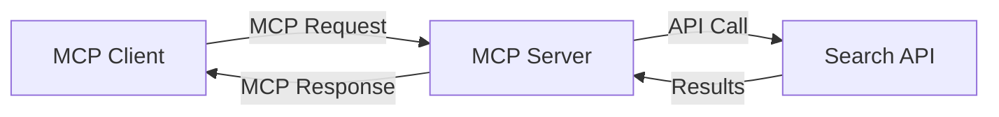
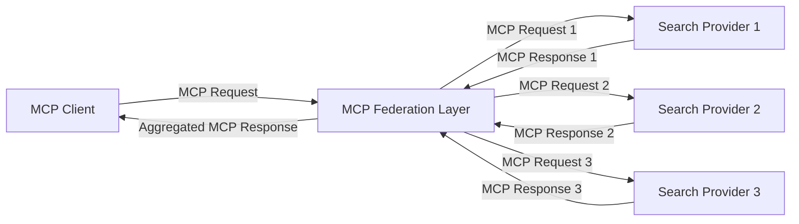
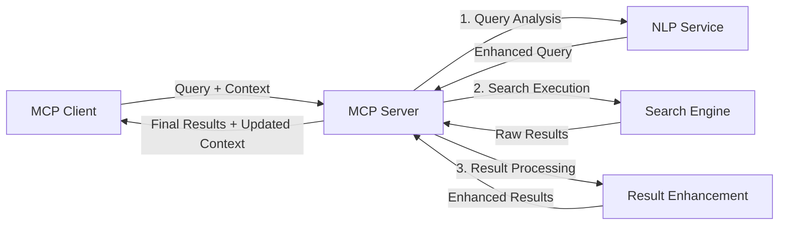

<!--
CO_OP_TRANSLATOR_METADATA:
{
  "original_hash": "eb12652eb7bd17f2193b835a344425c6",
  "translation_date": "2025-07-14T01:14:11+00:00",
  "source_file": "05-AdvancedTopics/mcp-realtimesearch/README.md",
  "language_code": "sw"
}
-->
## Maelezo Kuhusu Mifano ya Msimbo

> **Kumbuka Muhimu**: Mifano ya msimbo hapa chini inaonyesha jinsi ya kuunganisha Model Context Protocol (MCP) na utendaji wa utafutaji wa wavuti. Ingawa inafuata mifumo na miundo ya SDK rasmi za MCP, imefanywa iwe rahisi kwa madhumuni ya elimu.
> 
> Mifano hii inaonyesha:
> 
> 1. **Utekelezaji wa Python**: Utekelezaji wa seva ya FastMCP inayotoa chombo cha utafutaji wa wavuti na kuunganishwa na API ya utafutaji ya nje. Mfano huu unaonyesha usimamizi sahihi wa muda wa maisha, usimamizi wa muktadha, na utekelezaji wa zana ukifuata mifumo ya [SDK rasmi ya MCP ya Python](https://github.com/modelcontextprotocol/python-sdk). Seva hutumia usafirishaji wa HTTP wa Streamable uliopendekezwa ambao umebadili usafirishaji wa zamani wa SSE kwa matumizi ya uzalishaji.
> 
> 2. **Utekelezaji wa JavaScript**: Utekelezaji wa TypeScript/JavaScript ukitumia muundo wa FastMCP kutoka kwa [SDK rasmi ya MCP ya TypeScript](https://github.com/modelcontextprotocol/typescript-sdk) kuunda seva ya utafutaji yenye ufafanuzi sahihi wa zana na miunganisho ya wateja. Inafuata mifumo ya hivi karibuni inayopendekezwa kwa usimamizi wa vikao na uhifadhi wa muktadha.
> 
> Mifano hii itahitaji usimamizi wa ziada wa makosa, uthibitishaji, na msimbo maalum wa kuunganishwa na API kwa matumizi ya uzalishaji. Anuani za API za utafutaji zilizoonyeshwa (`https://api.search-service.example/search`) ni nafasi za kuingiza na zinahitaji kubadilishwa na anuani halisi za huduma za utafutaji.
> 
> Kwa maelezo kamili ya utekelezaji na mbinu za kisasa zaidi, tafadhali rejelea [maelezo rasmi ya MCP](https://spec.modelcontextprotocol.io/) na nyaraka za SDK.

## Dhana Muhimu

### Mfumo wa Model Context Protocol (MCP)

Kwa msingi wake, Model Context Protocol hutoa njia iliyosanifiwa kwa mfano wa AI, programu, na huduma kubadilishana muktadha. Katika utafutaji wa wavuti wa wakati halisi, mfumo huu ni muhimu kwa kuunda uzoefu wa utafutaji unaoeleweka na unaoendelea kwa mizunguko mingi. Vipengele muhimu ni:

1. **Mimari ya Mteja-Seva**: MCP huweka mgawanyo wazi kati ya wateja wa utafutaji (waombaji) na seva za utafutaji (watoa huduma), kuruhusu mifano ya usambazaji yenye kubadilika.

2. **Mawasiliano ya JSON-RPC**: Itifaki hutumia JSON-RPC kwa kubadilishana ujumbe, na kufanya iwe sambamba na teknolojia za wavuti na rahisi kutekeleza kwenye majukwaa tofauti.

3. **Usimamizi wa Muktadha**: MCP hufafanua mbinu zilizopangwa za kudumisha, kusasisha, na kutumia muktadha wa utafutaji katika mwingiliano mingi.

4. **Ufafanuzi wa Zana**: Uwezo wa utafutaji unaonyeshwa kama zana zilizosanifiwa na vigezo na thamani za kurudisha zilizo wazi.

5. **Msaada wa Utoaji wa Matiririko**: Itifaki inaunga mkono utoaji wa matokeo kwa mtiririko, muhimu kwa utafutaji wa wakati halisi ambapo matokeo yanaweza kuwasili hatua kwa hatua.

### Mifumo ya Kuunganisha Utafutaji wa Wavuti

Unapoingiza MCP na utafutaji wa wavuti, mifumo kadhaa huibuka:

#### 1. Muunganisho wa Mtoa Huduma wa Utafutaji Moja kwa Moja

Katika mfumo huu, seva ya MCP huingiliana moja kwa moja na API moja au zaidi za utafutaji, ikitafsiri maombi ya MCP kuwa simu maalum za API na kuunda matokeo kama majibu ya MCP.

#### 2. Utafutaji wa Muungano na Uhifadhi wa Muktadha

Mfumo huu unasambaza maswali ya utafutaji kwa watoa huduma wa utafutaji wanaoendana na MCP wengi, kila mmoja akibobea katika aina tofauti za maudhui au uwezo wa utafutaji, huku ukidumisha muktadha mmoja.

#### 3. Mnyororo wa Utafutaji Ulioimarishwa na Muktadha

Katika mfumo huu, mchakato wa utafutaji hugawanywa katika hatua nyingi, na muktadha unaongezwa kila hatua, na kusababisha matokeo yanayozidi kuwa na umuhimu.

### Vipengele vya Muktadha wa Utafutaji

Katika utafutaji wa wavuti unaotumia MCP, muktadha kawaida unajumuisha:

- **Historia ya Maswali**: Maswali ya utafutaji yaliyopita katika kikao
- **Mapendeleo ya Mtumiaji**: Lugha, eneo, mipangilio ya utafutaji salama
- **Historia ya Mwingiliano**: Matokeo yaliyobofiwa, muda uliotumika kwenye matokeo
- **Vigezo vya Utafutaji**: Vichujio, mpangilio wa matokeo, na marekebisho mengine ya utafutaji
- **Maarifa ya Sekta**: Muktadha maalum wa somo unaohusiana na utafutaji
- **Muktadha wa Wakati**: Vigezo vya umuhimu vinavyotegemea muda
- **Mapendeleo ya Vyanzo**: Vyanzo vya habari vinavyoaminika au vinavyopendekezwa

## Matumizi na Maombi

### Utafiti na Ukusanyaji wa Taarifa

MCP huongeza ufanisi wa kazi za utafiti kwa:

- Kuhifadhi muktadha wa utafiti katika vikao vya utafutaji
- Kuruhusu maswali yenye ufanisi zaidi na yanayohusiana na muktadha
- Kusaidia muungano wa vyanzo vingi vya utafutaji
- Kuwezesha uchimbaji wa maarifa kutoka kwa matokeo ya utafutaji

### Ufuatiliaji wa Habari na Mwelekeo wa Wakati Halisi

Utafutaji unaotumia MCP hutoa faida kwa ufuatiliaji wa habari:

- Ugunduzi wa karibu wa wakati halisi wa hadithi mpya zinazoibuka
- Kuchuja taarifa muhimu kwa muktadha
- Ufuatiliaji wa mada na vitu katika vyanzo vingi
- Arifa za habari zilizobinafsishwa kulingana na muktadha wa mtumiaji

### Kivinjari na Utafiti Ulioimarishwa na AI

MCP huleta fursa mpya kwa kivinjari kilichoimarishwa na AI:

- Mapendekezo ya utafutaji yanayotegemea shughuli za kivinjari kwa sasa
- Muunganisho usio na mshono wa utafutaji wa wavuti na wasaidizi wa LLM
- Uboreshaji wa utafutaji kwa mizunguko mingi huku muktadha ukidumishwa
- Uboreshaji wa uhakiki wa ukweli na uhakiki wa taarifa

## Mwelekeo na Ubunifu wa Baadaye

### Maendeleo ya MCP katika Utafutaji wa Wavuti

Tukiangalia mbele, tunatarajia MCP itakua ili kushughulikia:

- **Utafutaji wa Njia Nyingi**: Kuunganisha utafutaji wa maandishi, picha, sauti, na video huku muktadha ukidumishwa
- **Utafutaji Usio na Kituo Kimoja**: Kusaidia mifumo ya utafutaji iliyosambazwa na muungano
- **Faragha ya Utafutaji**: Mbinu za utafutaji zinazohifadhi faragha kwa kuzingatia muktadha
- **Uelewa wa Maswali**: Uchambuzi wa kina wa maana ya maswali ya utafutaji kwa lugha ya asili

### Maendeleo Yanayoweza Kutokea Katika Teknolojia

Teknolojia zinazoibuka zitakazobadilisha mustakabali wa utafutaji wa MCP:

1. **Miundo ya Utafutaji ya Neural**: Mifumo ya utafutaji inayotumia uingizaji wa data iliyoboreshwa kwa MCP  
2. **Muktadha wa Utafutaji Binafsi**: Kujifunza mifumo ya utafutaji ya mtumiaji mmoja kwa muda  
3. **Uunganishaji wa Grafu za Maarifa**: Utafutaji unaoimarishwa na grafu za maarifa maalum za sekta  
4. **Muktadha wa Mbalimbali wa Modalities**: Kudumisha muktadha kati ya aina tofauti za utafutaji

## Mazoezi ya Vitendo

### Zoeezi 1: Kuweka Mlolongo wa Msingi wa Utafutaji wa MCP

Katika zoezi hili, utajifunza jinsi ya:
- Kusanidi mazingira ya msingi ya utafutaji wa MCP  
- Kutekeleza wasimamizi wa muktadha kwa utafutaji wa wavuti  
- Kupima na kuthibitisha uhifadhi wa muktadha katika mizunguko ya utafutaji

### Zoeezi 2: Kujenga Msaidizi wa Utafiti kwa Utafutaji wa MCP

Tengeneza programu kamili inayoweza:
- Kuchakata maswali ya utafiti kwa lugha ya asili  
- Kufanya utafutaji wa wavuti unaozingatia muktadha  
- Kusanya taarifa kutoka vyanzo mbalimbali  
- Kuonyesha matokeo ya utafiti yaliyopangwa vizuri

### Zoeezi 3: Kutekeleza Umoja wa Utafutaji wa Vyanzo Vingi kwa MCP

Zoezi la juu linalojumuisha:
- Kusambaza maswali kwa injini nyingi za utafutaji kwa kuzingatia muktadha  
- Kupanga na kujumlisha matokeo  
- Kuondoa matokeo yanayojirudia kwa muktadha  
- Kushughulikia metadata maalum ya chanzo

## Rasilimali Zaidi

- [Model Context Protocol Specification](https://spec.modelcontextprotocol.io/) - Maelezo rasmi ya MCP na nyaraka za kina za itifaki  
- [Model Context Protocol Documentation](https://modelcontextprotocol.io/) - Mafunzo ya kina na mwongozo wa utekelezaji  
- [MCP Python SDK](https://github.com/modelcontextprotocol/python-sdk) - Utekelezaji rasmi wa MCP kwa Python  
- [MCP TypeScript SDK](https://github.com/modelcontextprotocol/typescript-sdk) - Utekelezaji rasmi wa MCP kwa TypeScript  
- [MCP Reference Servers](https://github.com/modelcontextprotocol/servers) - Utekelezaji wa marejeleo ya seva za MCP  
- [Bing Web Search API Documentation](https://learn.microsoft.com/en-us/bing/search-apis/bing-web-search/overview) - API ya utafutaji wa wavuti ya Microsoft  
- [Google Custom Search JSON API](https://developers.google.com/custom-search/v1/overview) - Injini ya utafutaji inayoweza kupangwa ya Google  
- [SerpAPI Documentation](https://serpapi.com/search-api) - API ya ukurasa wa matokeo ya injini za utafutaji  
- [Meilisearch Documentation](https://www.meilisearch.com/docs) - Injini ya utafutaji ya chanzo huria  
- [Elasticsearch Documentation](https://www.elastic.co/guide/index.html) - Injini ya utafutaji na uchambuzi iliyosambazwa  
- [LangChain Documentation](https://python.langchain.com/docs/get_started/introduction) - Kujenga programu kwa kutumia LLMs

## Matokeo ya Kujifunza

Kwa kumaliza moduli hii, utaweza:

- Kuelewa misingi ya utafutaji wa wavuti kwa wakati halisi na changamoto zake  
- Kueleza jinsi Model Context Protocol (MCP) inavyoboreshwa uwezo wa utafutaji wa wavuti kwa wakati halisi  
- Kutekeleza suluhisho za utafutaji zinazotumia MCP kwa kutumia mifumo maarufu na API  
- Kubuni na kupeleka miundo ya utafutaji yenye uwezo mkubwa na utendaji wa hali ya juu kwa MCP  
- Kutumia dhana za MCP katika matumizi mbalimbali ikiwemo utafutaji wa maana, msaada wa utafiti, na kuvinjari kwa msaada wa AI  
- Kutathmini mwelekeo mpya na uvumbuzi wa baadaye katika teknolojia za utafutaji zinazotegemea MCP

### Mambo ya Kuamini na Usalama

Unapotekeleza suluhisho za utafutaji wa wavuti zinazotumia MCP, kumbuka kanuni hizi muhimu kutoka kwa maelezo ya MCP:

1. **Idhini na Udhibiti wa Mtumiaji**: Watumiaji lazima wape idhini wazi na kuelewa upana wa ufikiaji na shughuli zote za data. Hii ni muhimu hasa kwa utekelezaji wa utafutaji wa wavuti unaoweza kufikia vyanzo vya data vya nje.

2. **Faragha ya Data**: Hakikisha usimamizi sahihi wa maswali na matokeo ya utafutaji, hasa yanapojumuisha taarifa nyeti. Tekeleza udhibiti wa ufikiaji unaofaa kulinda data za watumiaji.

3. **Usalama wa Zana**: Tekeleza uthibitishaji na uhakiki sahihi kwa zana za utafutaji, kwani zinaweza kuwa hatari za usalama kupitia utekelezaji wa msimbo usio na udhibiti. Maelezo ya tabia ya zana hayapaswi kuaminika isipokuwa yanatoka seva inayotegemewa.

4. **Nyaraka Zenye Uwazi**: Toa nyaraka wazi kuhusu uwezo, mipaka, na mambo ya usalama ya utekelezaji wako wa utafutaji wa MCP, ukifuata miongozo ya utekelezaji kutoka kwa maelezo ya MCP.

5. **Mifumo Imara ya Idhini**: Tengeneza mifumo imara ya idhini na ruhusa inayofafanua wazi kile kila zana inachofanya kabla ya kuidhinisha matumizi yake, hasa kwa zana zinazoshirikiana na rasilimali za wavuti za nje.

Kwa maelezo kamili kuhusu usalama na mambo ya kuamini MCP, rejelea [nyaraka rasmi](https://modelcontextprotocol.io/specification/2025-03-26#security-and-trust-%26-safety).

## Nini Kifuatacho

- [5.11 Entra ID Authentication for Model Context Protocol Servers](../mcp-security-entra/README.md)

**Kiarifu cha Kutotegemea**:  
Hati hii imetafsiriwa kwa kutumia huduma ya tafsiri ya AI [Co-op Translator](https://github.com/Azure/co-op-translator). Ingawa tunajitahidi kwa usahihi, tafadhali fahamu kuwa tafsiri za kiotomatiki zinaweza kuwa na makosa au upungufu wa usahihi. Hati ya asili katika lugha yake ya asili inapaswa kuchukuliwa kama chanzo cha mamlaka. Kwa taarifa muhimu, tafsiri ya kitaalamu inayofanywa na binadamu inapendekezwa. Hatubebei dhamana kwa kutoelewana au tafsiri potofu zinazotokana na matumizi ya tafsiri hii.