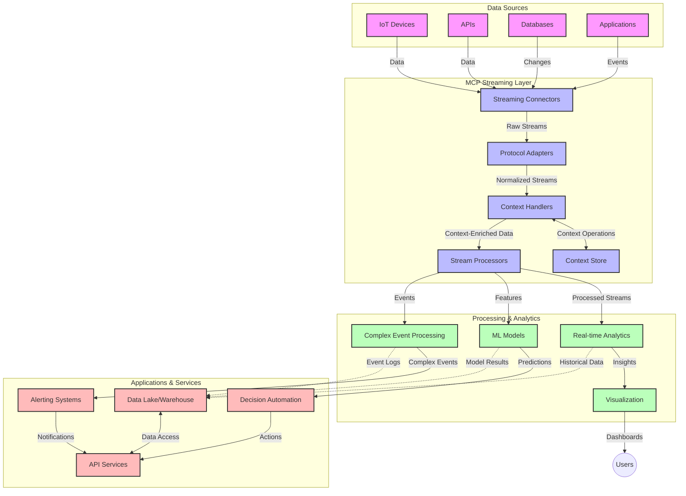

<!--
CO_OP_TRANSLATOR_METADATA:
{
  "original_hash": "b41174ac781ebf228b2043cbdfc09105",
  "translation_date": "2025-06-12T00:42:37+00:00",
  "source_file": "05-AdvancedTopics/mcp-realtimestreaming/README.md",
  "language_code": "sw"
}
-->
# Itifaki ya Muktadha wa Mfano kwa Usambazaji wa Data wa Muda Halisi

## Muhtasari

Usambazaji wa data wa muda halisi umekuwa muhimu katika dunia ya leo inayotegemea data, ambapo biashara na programu zinahitaji kupata taarifa mara moja kufanya maamuzi kwa wakati. Itifaki ya Muktadha wa Mfano (MCP) ni maendeleo makubwa katika kuboresha michakato hii ya usambazaji wa muda halisi, ikiongeza ufanisi wa usindikaji data, kudumisha muktadha muhimu, na kuboresha utendaji wa mfumo kwa ujumla.

Moduli hii inachunguza jinsi MCP inavyobadilisha usambazaji wa data wa muda halisi kwa kutoa njia iliyopangwa kwa usimamizi wa muktadha kati ya mifano ya AI, majukwaa ya usambazaji, na programu.

## Utangulizi wa Usambazaji wa Data wa Muda Halisi

Usambazaji wa data wa muda halisi ni mtindo wa kiteknolojia unaowezesha uhamisho endelevu, usindikaji, na uchambuzi wa data inavyozalishwa, kuruhusu mifumo kujibu mara moja kwa taarifa mpya. Tofauti na usindikaji wa kundi unaofanya kazi kwa seti za data zisizobadilika, usambazaji hufanya usindikaji wa data zinazoendelea, kutoa maarifa na hatua kwa kuchelewa kidogo.

### Misingi ya Usambazaji wa Data wa Muda Halisi:

- **Mtiririko Endelevu wa Data**: Data husindikwa kama mfululizo usioisha wa matukio au rekodi.
- **Usindikaji wa kuchelewa kidogo**: Mifumo imeundwa kupunguza muda kati ya uzalishaji wa data na usindikaji.
- **Uwezo wa Kupanua**: Miundo ya usambazaji lazima ishughulikie kiasi na kasi tofauti za data.
- **Uvumilivu wa Hitilafu**: Mifumo inahitaji kuwa na uwezo wa kuhimili makosa ili kuhakikisha mtiririko wa data haukatikani.
- **Usindikaji unaoendelea**: Kudumisha muktadha kati ya matukio ni muhimu kwa uchambuzi wenye maana.

### Itifaki ya Muktadha wa Mfano na Usambazaji wa Muda Halisi

Itifaki ya Muktadha wa Mfano (MCP) inashughulikia changamoto kadhaa muhimu katika mazingira ya usambazaji wa muda halisi:

1. **Mfuatano wa Muktadha**: MCP huweka viwango vya jinsi muktadha unavyodumishwa kati ya vipengele vilivyoenea vya usambazaji, kuhakikisha mifano ya AI na nodi za usindikaji zina upatikanaji wa muktadha wa kihistoria na wa mazingira unaohitajika.

2. **Usimamizi wa Hali Bora**: Kwa kutoa mbinu za muundo kwa ajili ya usafirishaji wa muktadha, MCP hupunguza mzigo wa usimamizi wa hali katika njia za usambazaji.

3. **Ushirikiano wa Teknolojia Mbalimbali**: MCP huunda lugha ya kawaida ya kushirikiana muktadha kati ya teknolojia tofauti za usambazaji na mifano ya AI, kuwezesha miundo yenye kubadilika na kuongezeka.

4. **Muktadha ulioboreshwa kwa Usambazaji**: Matumizi ya MCP yanaweza kuweka kipaumbele vipengele vya muktadha vinavyofaa zaidi kwa maamuzi ya muda halisi, kuboresha utendaji na usahihi.

5. **Usindikaji Unaobadilika**: Kwa usimamizi mzuri wa muktadha kupitia MCP, mifumo ya usambazaji inaweza kubadilisha usindikaji kulingana na hali na mifumo inayobadilika ya data.

Katika programu za kisasa kuanzia mitandao ya sensa za IoT hadi majukwaa ya biashara ya fedha, ushirikiano wa MCP na teknolojia za usambazaji unaleta usindikaji wenye akili zaidi, unaojua muktadha na unaoweza kujibu kwa usahihi hali changamano zinazobadilika kwa wakati halisi.

## Malengo ya Kujifunza

Mwisho wa somo hili, utaweza:

- Kuelewa misingi ya usambazaji wa data wa muda halisi na changamoto zake
- Kueleza jinsi Itifaki ya Muktadha wa Mfano (MCP) inavyoboresha usambazaji wa data wa muda halisi
- Kutekeleza suluhisho za usambazaji zenye msingi wa MCP kwa kutumia mifumo maarufu kama Kafka na Pulsar
- Kubuni na kupeleka miundo ya usambazaji yenye uvumilivu wa makosa na utendaji wa juu kwa MCP
- Kutumia dhana za MCP kwa matumizi ya IoT, biashara ya fedha, na uchambuzi unaotegemea AI
- Kutathmini mwelekeo unaoibuka na uvumbuzi wa baadaye katika teknolojia za usambazaji zenye msingi wa MCP

### Ufafanuzi na Umuhimu

Usambazaji wa data wa muda halisi unahusisha uzalishaji endelevu, usindikaji, na utoaji wa data kwa kuchelewa kidogo. Tofauti na usindikaji wa kundi, ambapo data hukusanywa na kusindikwa kwa vikundi, data za usambazaji husindikwa kwa hatua wakati zinapowasili, kuruhusu maarifa na hatua mara moja.

Sifa kuu za usambazaji wa data wa muda halisi ni:

- **Kuchelewa Kidogo**: Kusindika na kuchambua data ndani ya milisekunde hadi sekunde chache
- **Mtiririko Endelevu**: Mfululizo usiokatika wa data kutoka vyanzo mbalimbali
- **Usindikaji wa Mara Moja**: Kuchambua data inavyowasili badala ya kwa vikundi
- **Miundo ya Matukio**: Kujibu matukio yanapotokea

### Changamoto katika Usambazaji wa Data wa Kawaida

Njia za kawaida za usambazaji wa data zinakumbana na vikwazo kadhaa:

1. **Kupotea kwa Muktadha**: Ugumu wa kudumisha muktadha kati ya mifumo iliyosambazwa
2. **Changamoto za Kupanua**: Ugumu wa kupanua ili kushughulikia kiasi kikubwa na kasi kubwa ya data
3. **Ugumu wa Muunganisho**: Matatizo ya ushirikiano kati ya mifumo tofauti
4. **Usimamizi wa Kuchelewa**: Kuweka mizani kati ya kiwango cha maingizo na muda wa usindikaji
5. **Ulinganifu wa Data**: Kuhakikisha usahihi na ukamilifu wa data katika mfululizo mzima

## Kuelewa Itifaki ya Muktadha wa Mfano (MCP)

### MCP ni Nini?

Itifaki ya Muktadha wa Mfano (MCP) ni itifaki ya mawasiliano iliyopangwa kusaidia mwingiliano bora kati ya mifano ya AI na programu. Katika muktadha wa usambazaji wa data wa muda halisi, MCP hutoa mfumo wa:

- Kuhifadhi muktadha katika njia ya data
- Kuweka viwango vya kubadilishana data
- Kuboresha usafirishaji wa seti kubwa za data
- Kuongeza mawasiliano kati ya mifano na kati ya mfano na programu

### Vipengele Muhimu na Miundo

Miundo ya MCP kwa usambazaji wa muda halisi ina vipengele vikuu vifuatavyo:

1. **Wasimamizi wa Muktadha**: Husimamia na kudumisha taarifa za muktadha katika njia ya usambazaji
2. **Wasindikaji wa Mfululizo**: Husindika mfululizo wa data unaoingia kwa mbinu zinazojua muktadha
3. **Mbadalishaji wa Itifaki**: Hubadilisha kati ya itifaki tofauti za usambazaji huku wakidumisha muktadha
4. **Hifadhi ya Muktadha**: Kuhifadhi na kupata taarifa za muktadha kwa ufanisi
5. **Viunganishi vya Usambazaji**: Kuunganishwa na majukwaa mbalimbali ya usambazaji (Kafka, Pulsar, Kinesis, nk)



### Jinsi MCP Inavyoboresha Usindikaji wa Data wa Muda Halisi

MCP inashughulikia changamoto za usambazaji wa kawaida kwa:

- **Uadilifu wa Muktadha**: Kudumisha uhusiano kati ya data katika njia nzima
- **Usafirishaji Ulioboreshwa**: Kupunguza rudufu katika kubadilishana data kupitia usimamizi wa muktadha wenye akili
- **Mwingiliano wa Violesura Vilivyopangwa**: Kutoa API thabiti kwa vipengele vya usambazaji
- **Kuchelewa Kidogo**: Kupunguza mzigo wa usindikaji kupitia usimamizi bora wa muktadha
- **Uwezo wa Kupanua**: Kusaidia upanuzi wa mlalo huku ukidumisha muktadha

## Ushirikiano na Utekelezaji

Mifumo ya usambazaji wa data wa muda halisi inahitaji muundo makini na utekelezaji ili kudumisha utendaji na uadilifu wa muktadha. Itifaki ya Muktadha wa Mfano hutoa njia iliyopangwa ya kuunganisha mifano ya AI na teknolojia za usambazaji, kuruhusu njia za usindikaji zenye akili na zenye kujua muktadha.

### Muhtasari wa Ushirikiano wa MCP katika Miundo ya Usambazaji

Kutekeleza MCP katika mazingira ya usambazaji wa muda halisi kunahusisha mambo muhimu yafuatayo:

1. **Usanisi na Usafirishaji wa Muktadha**: MCP hutoa mbinu bora za kuweka taarifa za muktadha ndani ya vifurushi vya data vya usambazaji, kuhakikisha muktadha muhimu unafuata data katika njia ya usindikaji. Hii ni pamoja na viwango vya usanisi vilivyoboresha kwa usafirishaji wa usambazaji.

2. **Usindikaji wa Mfululizo unaojua Hali**: MCP inaruhusu usindikaji wa hali wenye akili zaidi kwa kudumisha uwakilishi thabiti wa muktadha kati ya nodi za usindikaji. Hii ni muhimu hasa katika miundo ya usambazaji iliyosambazwa ambapo usimamizi wa hali ni changamoto.

3. **Muda wa Tukio dhidi ya Muda wa Usindikaji**: Matumizi ya MCP katika mifumo ya usambazaji yanapaswa kushughulikia changamoto ya kutofautisha kati ya wakati tukio lilitokea na wakati linaposindikwa. Itifaki inaweza kujumuisha muktadha wa muda unaohifadhi maana ya muda wa tukio.

4. **Usimamizi wa Mzigo wa Kuingiza**: Kwa kuweka viwango vya usimamizi wa muktadha, MCP husaidia kusimamia mzigo wa kuingiza katika mifumo ya usambazaji, kuruhusu vipengele kuwasiliana uwezo wao wa usindikaji na kurekebisha mtiririko ipasavyo.

5. **Udirisha wa Muktadha na Ukusanyaji**: MCP hurahisisha operesheni za dirisha zilizo na muundo mzuri wa muktadha wa muda na uhusiano, kuruhusu ukusanyaji wenye maana zaidi kati ya mfululizo wa matukio.

6. **Usindikaji wa Mara-Moja-Kamili**: Katika mifumo ya usambazaji inayohitaji mantiki ya mara-moja-kamili, MCP inaweza kujumuisha metadata ya usindikaji kusaidia kufuatilia na kuthibitisha hali ya usindikaji kati ya vipengele vilivyoenea.

Utekelezaji wa MCP katika teknolojia mbalimbali za usambazaji huunda njia moja kwa usimamizi wa muktadha, kupunguza haja ya msimbo maalum wa muunganisho huku ukiongeza uwezo wa mfumo kudumisha muktadha muhimu wakati data inapopita kwenye njia.

### MCP katika Mifumo Mbalimbali ya Usambazaji wa Data

Mifano hii inafuata maelezo ya MCP ya sasa inayolenga itifaki ya JSON-RPC yenye njia tofauti za usafirishaji. Msimbo unaonyesha jinsi ya kutekeleza njia maalum zinazounganisha majukwaa ya usambazaji kama Kafka na Pulsar huku ukidumisha ulinganifu kamili na itifaki ya MCP.

Mifano imeundwa kuonyesha jinsi majukwaa ya usambazaji yanavyoweza kuunganishwa na MCP kutoa usindikaji wa data wa muda halisi huku wakihifadhi ufahamu wa muktadha unaojumuishwa na MCP. Njia hii inahakikisha mifano ya msimbo inaonyesha hali ya sasa ya maelezo ya MCP hadi Juni 2025.

MCP inaweza kuunganishwa na mifumo maarufu ya usambazaji ikiwemo:

#### Ushirikiano wa Apache Kafka

```python
import asyncio
import json
from typing import Dict, Any, Optional
from confluent_kafka import Consumer, Producer, KafkaError
from mcp.client import Client, ClientCapabilities
from mcp.core.message import JsonRpcMessage
from mcp.core.transports import Transport

# Custom transport class to bridge MCP with Kafka
class KafkaMCPTransport(Transport):
    def __init__(self, bootstrap_servers: str, input_topic: str, output_topic: str):
        self.bootstrap_servers = bootstrap_servers
        self.input_topic = input_topic
        self.output_topic = output_topic
        self.producer = Producer({'bootstrap.servers': bootstrap_servers})
        self.consumer = Consumer({
            'bootstrap.servers': bootstrap_servers,
            'group.id': 'mcp-client-group',
            'auto.offset.reset': 'earliest'
        })
        self.message_queue = asyncio.Queue()
        self.running = False
        self.consumer_task = None
        
    async def connect(self):
        """Connect to Kafka and start consuming messages"""
        self.consumer.subscribe([self.input_topic])
        self.running = True
        self.consumer_task = asyncio.create_task(self._consume_messages())
        return self
        
    async def _consume_messages(self):
        """Background task to consume messages from Kafka and queue them for processing"""
        while self.running:
            try:
                msg = self.consumer.poll(1.0)
                if msg is None:
                    await asyncio.sleep(0.1)
                    continue
                
                if msg.error():
                    if msg.error().code() == KafkaError._PARTITION_EOF:
                        continue
                    print(f"Consumer error: {msg.error()}")
                    continue
                
                # Parse the message value as JSON-RPC
                try:
                    message_str = msg.value().decode('utf-8')
                    message_data = json.loads(message_str)
                    mcp_message = JsonRpcMessage.from_dict(message_data)
                    await self.message_queue.put(mcp_message)
                except Exception as e:
                    print(f"Error parsing message: {e}")
            except Exception as e:
                print(f"Error in consumer loop: {e}")
                await asyncio.sleep(1)
    
    async def read(self) -> Optional[JsonRpcMessage]:
        """Read the next message from the queue"""
        try:
            message = await self.message_queue.get()
            return message
        except Exception as e:
            print(f"Error reading message: {e}")
            return None
    
    async def write(self, message: JsonRpcMessage) -> None:
        """Write a message to the Kafka output topic"""
        try:
            message_json = json.dumps(message.to_dict())
            self.producer.produce(
                self.output_topic,
                message_json.encode('utf-8'),
                callback=self._delivery_report
            )
            self.producer.poll(0)  # Trigger callbacks
        except Exception as e:
            print(f"Error writing message: {e}")
    
    def _delivery_report(self, err, msg):
        """Kafka producer delivery callback"""
        if err is not None:
            print(f'Message delivery failed: {err}')
        else:
            print(f'Message delivered to {msg.topic()} [{msg.partition()}]')
    
    async def close(self) -> None:
        """Close the transport"""
        self.running = False
        if self.consumer_task:
            self.consumer_task.cancel()
            try:
                await self.consumer_task
            except asyncio.CancelledError:
                pass
        self.consumer.close()
        self.producer.flush()

# Example usage of the Kafka MCP transport
async def kafka_mcp_example():
    # Create MCP client with Kafka transport
    client = Client(
        {"name": "kafka-mcp-client", "version": "1.0.0"},
        ClientCapabilities({})
    )
    
    # Create and connect the Kafka transport
    transport = KafkaMCPTransport(
        bootstrap_servers="localhost:9092",
        input_topic="mcp-responses",
        output_topic="mcp-requests"
    )
    
    await client.connect(transport)
    
    try:
        # Initialize the MCP session
        await client.initialize()
        
        # Example of executing a tool via MCP
        response = await client.execute_tool(
            "process_data",
            {
                "data": "sample data",
                "metadata": {
                    "source": "sensor-1",
                    "timestamp": "2025-06-12T10:30:00Z"
                }
            }
        )
        
        print(f"Tool execution response: {response}")
        
        # Clean shutdown
        await client.shutdown()
    finally:
        await transport.close()

# Run the example
if __name__ == "__main__":
    asyncio.run(kafka_mcp_example())
```

#### Utekelezaji wa Apache Pulsar

```python
import asyncio
import json
import pulsar
from typing import Dict, Any, Optional
from mcp.core.message import JsonRpcMessage
from mcp.core.transports import Transport
from mcp.server import Server, ServerOptions
from mcp.server.tools import Tool, ToolExecutionContext, ToolMetadata

# Create a custom MCP transport that uses Pulsar
class PulsarMCPTransport(Transport):
    def __init__(self, service_url: str, request_topic: str, response_topic: str):
        self.service_url = service_url
        self.request_topic = request_topic
        self.response_topic = response_topic
        self.client = pulsar.Client(service_url)
        self.producer = self.client.create_producer(response_topic)
        self.consumer = self.client.subscribe(
            request_topic,
            "mcp-server-subscription",
            consumer_type=pulsar.ConsumerType.Shared
        )
        self.message_queue = asyncio.Queue()
        self.running = False
        self.consumer_task = None
    
    async def connect(self):
        """Connect to Pulsar and start consuming messages"""
        self.running = True
        self.consumer_task = asyncio.create_task(self._consume_messages())
        return self
    
    async def _consume_messages(self):
        """Background task to consume messages from Pulsar and queue them for processing"""
        while self.running:
            try:
                # Non-blocking receive with timeout
                msg = self.consumer.receive(timeout_millis=500)
                
                # Process the message
                try:
                    message_str = msg.data().decode('utf-8')
                    message_data = json.loads(message_str)
                    mcp_message = JsonRpcMessage.from_dict(message_data)
                    await self.message_queue.put(mcp_message)
                    
                    # Acknowledge the message
                    self.consumer.acknowledge(msg)
                except Exception as e:
                    print(f"Error processing message: {e}")
                    # Negative acknowledge if there was an error
                    self.consumer.negative_acknowledge(msg)
            except Exception as e:
                # Handle timeout or other exceptions
                await asyncio.sleep(0.1)
    
    async def read(self) -> Optional[JsonRpcMessage]:
        """Read the next message from the queue"""
        try:
            message = await self.message_queue.get()
            return message
        except Exception as e:
            print(f"Error reading message: {e}")
            return None
    
    async def write(self, message: JsonRpcMessage) -> None:
        """Write a message to the Pulsar output topic"""
        try:
            message_json = json.dumps(message.to_dict())
            self.producer.send(message_json.encode('utf-8'))
        except Exception as e:
            print(f"Error writing message: {e}")
    
    async def close(self) -> None:
        """Close the transport"""
        self.running = False
        if self.consumer_task:
            self.consumer_task.cancel()
            try:
                await self.consumer_task
            except asyncio.CancelledError:
                pass
        self.consumer.close()
        self.producer.close()
        self.client.close()

# Define a sample MCP tool that processes streaming data
@Tool(
    name="process_streaming_data",
    description="Process streaming data with context preservation",
    metadata=ToolMetadata(
        required_capabilities=["streaming"]
    )
)
async def process_streaming_data(
    ctx: ToolExecutionContext,
    data: str,
    source: str,
    priority: str = "medium"
) -> Dict[str, Any]:
    """
    Process streaming data while preserving context
    
    Args:
        ctx: Tool execution context
        data: The data to process
        source: The source of the data
        priority: Priority level (low, medium, high)
        
    Returns:
        Dict containing processed results and context information
    """
    # Example processing that leverages MCP context
    print(f"Processing data from {source} with priority {priority}")
    
    # Access conversation context from MCP
    conversation_id = ctx.conversation_id if hasattr(ctx, 'conversation_id') else "unknown"
    
    # Return results with enhanced context
    return {
        "processed_data": f"Processed: {data}",
        "context": {
            "conversation_id": conversation_id,
            "source": source,
            "priority": priority,
            "processing_timestamp": ctx.get_current_time_iso()
        }
    }

# Example MCP server implementation using Pulsar transport
async def run_mcp_server_with_pulsar():
    # Create MCP server
    server = Server(
        {"name": "pulsar-mcp-server", "version": "1.0.0"},
        ServerOptions(
            capabilities={"streaming": True}
        )
    )
    
    # Register our tool
    server.register_tool(process_streaming_data)
    
    # Create and connect Pulsar transport
    transport = PulsarMCPTransport(
        service_url="pulsar://localhost:6650",
        request_topic="mcp-requests",
        response_topic="mcp-responses"
    )
    
    try:
        # Start the server with the Pulsar transport
        await server.run(transport)
    finally:
        await transport.close()

# Run the server
if __name__ == "__main__":
    asyncio.run(run_mcp_server_with_pulsar())
```

### Mbinu Bora za Kuweka Kazi

Unapotekeleza MCP kwa usambazaji wa muda halisi:

1. **Buni kwa Uvumilivu wa Hitilafu**:
   - Tekeleza usimamizi sahihi wa makosa
   - Tumia safu za barua zisizotumwa kwa ujumbe uliofeli
   - Buni wasindikaji wasioathiriwa na kuanzishwa mara nyingi

2. **Boresha Utendaji**:
   - Sanidi ukubwa unaofaa wa buffer
   - Tumia kundi la data inapofaa
   - Tekeleza mbinu za kudhibiti mzigo wa kuingiza

3. **Fuatilia na Angalia**:
   - Fuata vipimo vya usindikaji wa mfululizo
   - Fuatilia usambazaji wa muktadha
   - Weka tahadhari kwa matukio yasiyo ya kawaida

4. **Linda Mfululizo Wako**:
   - Tekeleza usimbaji kwa data nyeti
   - Tumia uthibitishaji na ruhusa
   - Tumia udhibiti sahihi wa upatikanaji

### MCP katika IoT na Kompyuta ya Edge

MCP huongeza usambazaji wa IoT kwa:

- Kuhifadhi muktadha wa kifaa katika njia ya usindikaji
- Kuwezesha usambazaji wa data uanzia Edge hadi Cloud kwa ufanisi
- Kusaidia uchambuzi wa muda halisi wa mfululizo wa data za IoT
- Kurahisisha mawasiliano kati ya vifaa kwa muktadha

Mfano: Mitandao ya Sensor za Miji Mahiri  
```
Sensors → Edge Gateways → MCP Stream Processors → Real-time Analytics → Automated Responses
```

### Nafasi katika Miamala ya Fedha na Biashara ya Muda Mfupi

MCP hutoa faida kubwa kwa usambazaji wa data za fedha:

- Usindikaji wa kuchelewa kidogo sana kwa maamuzi ya biashara
- Kudumisha muktadha wa muamala katika usindikaji wote
- Kusaidia usindikaji wa matukio changamano kwa ufahamu wa muktadha
- Kuhakikisha ulinganifu wa data kati ya mifumo ya biashara iliyosambazwa

### Kuongeza Uchambuzi wa Data unaotegemea AI

MCP huunda fursa mpya kwa uchambuzi wa usambazaji:

- Mafunzo ya modeli na utambuzi wa muda halisi
- Kujifunza endelevu kutoka kwa data za mfululizo
- Uvutaji wa sifa unaojua muktadha
- Mifumo ya utambuzi wa modeli nyingi yenye muktadha uliohifadhiwa

## Mwelekeo wa Baadaye na Uvumbuzi

### Mageuzi ya MCP katika Mazingira ya Muda Halisi

Tukiangalia mbele, tunatarajia MCP itabadilika kushughulikia:

- **Ushirikiano na Kompyuta za Quantum**: Kujiandaa kwa mifumo ya usambazaji inayotumia quantum
- **Usindikaji wa Asili wa Edge**: Kuhamisha usindikaji wenye ufahamu wa muktadha zaidi kwenye vifaa vya Edge
- **Usimamizi wa Mfululizo Uliojitegemea**: Njia za usambazaji zinazojiboresha wenyewe
- **Usambazaji wa Usambazaji**: Usindikaji uliosambazwa huku ukihifadhi faragha

### Maendeleo Yanayoweza Kutokea katika Teknolojia

Teknolojia zinazoibuka zitakazounda mustakabali wa MCP katika usambazaji:

1. **Itifaki za Usambazaji Zinazoboreshwa kwa AI**: Itifaki maalum zilizoundwa kwa kazi za AI
2. **Ushirikiano na Kompyuta za Neuromorphic**: Kompyuta zinazofanana na ubongo kwa usindikaji wa mfululizo
3. **Usambazaji Usio na Seva**: Usambazaji unaoendeshwa na matukio, unaoweza kupanuka bila usimamizi wa miundombinu
4. **Hifadhi za Muktadha Zilizogawanyika**: Usimamizi wa muktadha uliosambazwa duniani kote lakini wenye uthabiti mkubwa

## Mazoezi ya Vitendo

### Zoeezi 1: Kuweka Msingi wa Mfululizo wa MCP

Katika zoezi hili, utajifunza jinsi ya:
- Kusanidi mazingira ya msingi ya usambazaji wa MCP
- Kutekeleza wasimamizi wa muktadha kwa usindikaji wa mfululizo
- Kupima na kuthibitisha uhifadhi wa muktadha

### Zoeezi 2: Kuunda Dashibodi ya Uchambuzi wa Muda Halisi

Tengeneza programu kamili inayofanya:
- Kupokea data za usambazaji kwa kutumia MCP
- Kusindika mfululizo huku ukidumisha muktadha
- Kuonyesha matokeo kwa wakati halisi

### Zoeezi 3: Kutekeleza Usindikaji Changamano wa Matukio kwa MCP

Z

**Kiasi cha majumuisho**:  
Hati hii imetafsiriwa kwa kutumia huduma ya tafsiri ya AI [Co-op Translator](https://github.com/Azure/co-op-translator). Ingawa tunajitahidi kuhakikisha usahihi, tafadhali fahamu kwamba tafsiri za kiotomatiki zinaweza kuwa na makosa au kasoro. Hati asili katika lugha yake ya asili inapaswa kuchukuliwa kama chanzo cha mamlaka. Kwa taarifa muhimu, tafsiri ya kitaalamu inayofanywa na binadamu inapendekezwa. Hatuna wajibu wowote kwa kutoelewana au tafsiri potofu zinazotokana na matumizi ya tafsiri hii.