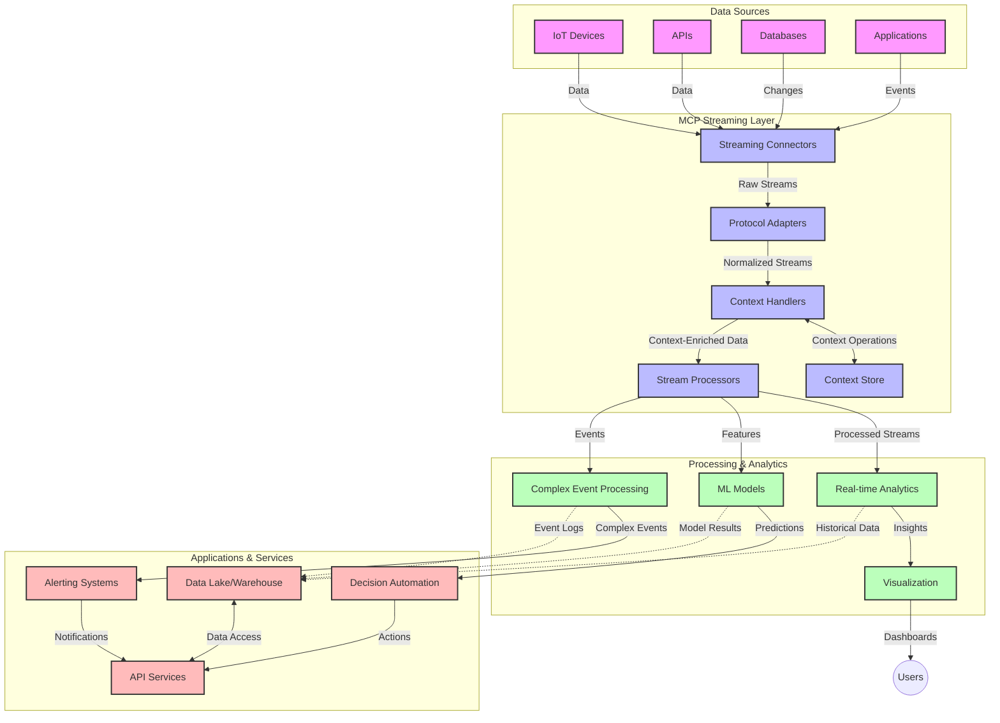

<!--
CO_OP_TRANSLATOR_METADATA:
{
  "original_hash": "195f7287638b77a549acadd96c8f981c",
  "translation_date": "2025-06-13T00:46:56+00:00",
  "source_file": "05-AdvancedTopics/mcp-realtimestreaming/README.md",
  "language_code": "sw"
}
-->
# Itifaki ya Muktadha wa Mfano kwa Usambazaji wa Data kwa Wakati Halisi

## Muhtasari

Usambazaji wa data kwa wakati halisi umekuwa muhimu katika dunia ya leo inayotegemea data, ambapo biashara na programu zinahitaji kupata taarifa mara moja ili kufanya maamuzi ya wakati muafaka. Itifaki ya Muktadha wa Mfano (MCP) inawakilisha maendeleo makubwa katika kuboresha michakato hii ya usambazaji wa wakati halisi, ikiboresha ufanisi wa usindikaji data, kudumisha muktadha unaofaa, na kuongeza utendaji wa jumla wa mfumo.

Moduli hii inachunguza jinsi MCP inavyobadilisha usambazaji wa data kwa wakati halisi kwa kutoa njia iliyosanifiwa ya usimamizi wa muktadha kati ya mifano ya AI, majukwaa ya usambazaji, na programu.

## Utangulizi wa Usambazaji wa Data kwa Wakati Halisi

Usambazaji wa data kwa wakati halisi ni mtindo wa kiteknolojia unaowezesha uhamisho endelevu, usindikaji, na uchambuzi wa data wakati inapotengenezwa, kuruhusu mifumo kutoa majibu mara moja kwa taarifa mpya. Tofauti na usindikaji wa kundi unaofanya kazi kwenye seti za data zisizobadilika, usambazaji hufanya usindikaji wa data zinazoendelea, ukitoa maarifa na hatua kwa ucheleweshaji mdogo.

### Dhana Muhimu za Usambazaji wa Data kwa Wakati Halisi:

- **Mtiririko Endelevu wa Data**: Data husindika kama mfululizo wa matukio au rekodi usioisha.
- **Usindikaji wa Ucheleweshaji Chini**: Mifumo imeundwa kupunguza muda kati ya uzalishaji wa data na usindikaji wake.
- **Uwezo wa Kupanuka**: Miundo ya usambazaji lazima idhibiti kiasi na kasi tofauti za data.
- **Uvumilivu wa Makosa**: Mifumo inahitaji kuwa na uwezo wa kuhimili makosa ili kuhakikisha mtiririko wa data haukatiki.
- **Usindikaji unaozingatia Hali**: Kudumisha muktadha kati ya matukio ni muhimu kwa uchambuzi wenye maana.

### Itifaki ya Muktadha wa Mfano na Usambazaji wa Wakati Halisi

Itifaki ya Muktadha wa Mfano (MCP) inashughulikia changamoto kadhaa muhimu katika mazingira ya usambazaji wa wakati halisi:

1. **Mfuatano wa Muktadha**: MCP inasanifisha jinsi muktadha unavyodumishwa kati ya vipengele vya usambazaji vilivyogawanyika, kuhakikisha mifano ya AI na nodi za usindikaji zinapata muktadha wa kihistoria na mazingira unaofaa.

2. **Usimamizi Bora wa Hali**: Kwa kutoa mbinu zilizopangwa za usafirishaji wa muktadha, MCP inapunguza mzigo wa usimamizi wa hali katika njia za usambazaji.

3. **Ushirikiano wa Teknolojia Mbalimbali**: MCP huunda lugha ya pamoja ya kushirikiana muktadha kati ya teknolojia tofauti za usambazaji na mifano ya AI, kuwezesha miundo inayobadilika na inayoweza kupanuka.

4. **Muktadha Uliyoboreshwa kwa Usambazaji**: Matumizi ya MCP yanaweza kuipa kipaumbele vipengele vya muktadha vinavyohitajika zaidi kwa maamuzi ya wakati halisi, kuboresha utendaji na usahihi.

5. **Usindikaji Unaobadilika**: Kwa usimamizi mzuri wa muktadha kupitia MCP, mifumo ya usambazaji inaweza kubadilisha usindikaji wake kulingana na hali na mifumo inayobadilika ya data.

Katika programu za kisasa kuanzia mitandao ya sensa za IoT hadi majukwaa ya biashara ya fedha, ushirikiano wa MCP na teknolojia za usambazaji unaruhusu usindikaji wenye akili zaidi, unaotambua muktadha, unaoweza kutoa majibu sahihi kwa hali tata zinazobadilika kwa wakati halisi.

## Malengo ya Kujifunza

Mwisho wa somo hili, utaweza:

- Kuelewa misingi ya usambazaji wa data kwa wakati halisi na changamoto zake
- Kueleza jinsi Itifaki ya Muktadha wa Mfano (MCP) inavyoboreshwa usambazaji wa data kwa wakati halisi
- Kutekeleza suluhisho za usambazaji zenye msingi wa MCP kwa kutumia mifumo maarufu kama Kafka na Pulsar
- Kubuni na kupeleka miundo ya usambazaji yenye uvumilivu wa makosa na utendaji wa juu kwa MCP
- Kutumia dhana za MCP katika matumizi ya IoT, biashara ya fedha, na uchambuzi unaotegemea AI
- Kutathmini mwenendo wa sasa na uvumbuzi wa baadaye katika teknolojia za usambazaji zenye msingi wa MCP

### Ufafanuzi na Umuhimu

Usambazaji wa data kwa wakati halisi unahusisha uzalishaji, usindikaji, na utoaji wa data kwa ucheleweshaji mdogo. Tofauti na usindikaji wa kundi ambapo data hukusanywa na kusindika kwa makundi, data za usambazaji husindika hatua kwa hatua zinapofika, kuruhusu maarifa na hatua za papo hapo.

Sifa kuu za usambazaji wa data kwa wakati halisi ni:

- **Ucheleweshaji Mdogo**: Kusindika na kuchambua data ndani ya millisekunde hadi sekunde
- **Mtiririko Endelevu**: Mfululizo usiokatika wa data kutoka vyanzo mbalimbali
- **Usindikaji wa Mara Moja**: Kuchambua data inavyofika badala ya kwa makundi
- **Mimkakati Inayotegemea Matukio**: Kujibu matukio yanapotokea

### Changamoto katika Usambazaji wa Data wa Kawaida

Njia za kawaida za usambazaji wa data zinakumbana na vikwazo kadhaa:

1. **Kupotea kwa Muktadha**: Ugumu wa kudumisha muktadha kati ya mifumo iliyogawanyika
2. **Masuala ya Kupanuka**: Changamoto za kupanua mifumo kushughulikia data nyingi na kasi kubwa
3. **Ugumu wa Ushirikiano**: Matatizo ya kuunganisha mifumo tofauti
4. **Usimamizi wa Ucheleweshaji**: Kuweka uwiano kati ya uwezo wa kupokea data na muda wa usindikaji
5. **Ulinganifu wa Data**: Kuhakikisha usahihi na ukamilifu wa data katika mtiririko mzima

## Kuelewa Itifaki ya Muktadha wa Mfano (MCP)

### MCP ni Nini?

Itifaki ya Muktadha wa Mfano (MCP) ni itifaki ya mawasiliano iliyosanifiwa iliyoundwa kuwezesha mwingiliano bora kati ya mifano ya AI na programu. Katika muktadha wa usambazaji wa data kwa wakati halisi, MCP hutoa mfumo wa:

- Kuhifadhi muktadha katika njia ya data
- Kusanifisha miundo ya kubadilishana data
- Kuboresha usafirishaji wa seti kubwa za data
- Kuongeza mawasiliano kati ya mifano na kati ya mfano na programu

### Vipengele Muhimu na Muundo

Muundo wa MCP kwa usambazaji wa wakati halisi unajumuisha vipengele muhimu vifuatavyo:

1. **Wasimamizi wa Muktadha**: Husimamia na kudumisha taarifa za muktadha katika njia ya usambazaji
2. **Wasindikaji wa Mtiririko**: Husindika mtiririko wa data unaoingia kwa kutumia mbinu zinazotambua muktadha
3. **Vibadilishaji vya Itifaki**: Hubadilisha kati ya itifaki tofauti za usambazaji huku wakihifadhi muktadha
4. **Hifadhi ya Muktadha**: Kuhifadhi na kupata taarifa za muktadha kwa ufanisi
5. **Vihusishi vya Usambazaji**: Kuunganisha na majukwaa mbalimbali ya usambazaji (Kafka, Pulsar, Kinesis, n.k.)



### MCP Inavyoboresha Usimamizi wa Data kwa Wakati Halisi

MCP inashughulikia changamoto za usambazaji wa kawaida kwa:

- **Uadilifu wa Muktadha**: Kudumisha uhusiano kati ya pointi za data katika njia nzima
- **Usafirishaji Ulioboreshwa**: Kupunguza rudufu katika kubadilishana data kupitia usimamizi wa muktadha wenye akili
- **Mawasiliano Sanifu**: Kutoa API thabiti kwa vipengele vya usambazaji
- **Kupunguza Ucheleweshaji**: Kupunguza mzigo wa usindikaji kupitia usimamizi bora wa muktadha
- **Kupanuka Bora**: Kusaidia kupanua kwa usawa huku muktadha ukidumishwa

## Ushirikiano na Utekelezaji

Mifumo ya usambazaji wa data kwa wakati halisi inahitaji muundo makini wa usanifu na utekelezaji ili kudumisha utendaji na uadilifu wa muktadha. Itifaki ya Muktadha wa Mfano inatoa njia iliyosanifiwa ya kuunganisha mifano ya AI na teknolojia za usambazaji, kuruhusu njia za usindikaji zenye akili na zinazotambua muktadha.

### Muhtasari wa Ushirikiano wa MCP katika Miundo ya Usambazaji

Kutumia MCP katika mazingira ya usambazaji wa wakati halisi kunahitaji mambo yafuatayo:

1. **Uthibitishaji na Usafirishaji wa Muktadha**: MCP hutoa mbinu bora za kuficha taarifa za muktadha ndani ya vifurushi vya data vinavyosambazwa, kuhakikisha muktadha muhimu unaambatana na data katika njia ya usindikaji. Hii ni pamoja na miundo ya uthibitishaji iliyosanifiwa iliyoboreshwa kwa usafirishaji wa usambazaji.

2. **Usindikaji wa Mtiririko Unaodumisha Hali**: MCP inaruhusu usindikaji bora unaodumisha hali kwa kudumisha uwakilishi thabiti wa muktadha kati ya nodi za usindikaji. Hii ni muhimu hasa katika miundo ya usambazaji iliyogawanyika ambapo usimamizi wa hali huwa changamoto.

3. **Muda wa Tukio dhidi ya Muda wa Usindikaji**: Matumizi ya MCP katika mifumo ya usambazaji yanapaswa kushughulikia changamoto ya tofauti kati ya wakati tukio lilipotokea na wakati linaposhughulikiwa. Itifaki inaweza kujumuisha muktadha wa muda unaohifadhi maana ya wakati wa tukio.

4. **Usimamizi wa Mzigo wa Kurejesha**: Kwa kusanifisha usimamizi wa muktadha, MCP husaidia kudhibiti mzigo wa kurejesha katika mifumo ya usambazaji, kuruhusu vipengele kuwasiliana uwezo wao wa usindikaji na kurekebisha mtiririko ipasavyo.

5. **Dirisha la Muktadha na Muhtasari**: MCP inarahisisha operesheni za dirisha zenye ufanisi zaidi kwa kutoa uwakilishi wa muktadha wa muda na uhusiano, kuruhusu muhtasari wenye maana zaidi kati ya mitiririko ya matukio.

6. **Usindikaji wa Mara-Moja-Kamili**: Katika mifumo ya usambazaji inayohitaji semantiki ya mara-moja-kamili, MCP inaweza kujumuisha metadata ya usindikaji kusaidia kufuatilia na kuthibitisha hali ya usindikaji kati ya vipengele vilivyoenea.

Utekelezaji wa MCP katika teknolojia mbalimbali za usambazaji unaunda njia moja ya usimamizi wa muktadha, kupunguza hitaji la msimbo wa ushirikiano maalum huku ukiongeza uwezo wa mfumo kudumisha muktadha wenye maana wakati data inapopita katika njia.

### MCP katika Mifumo Mbalimbali ya Usambazaji wa Data

Mifano hii inafuata maelekezo ya sasa ya MCP ambayo yanazingatia itifaki ya JSON-RPC yenye mbinu tofauti za usafirishaji. Msimbo unaonyesha jinsi unaweza kutekeleza usafirishaji maalum unaounganisha majukwaa ya usambazaji kama Kafka na Pulsar huku ukidumisha ulinganifu kamili na itifaki ya MCP.

Mifano imeundwa kuonyesha jinsi majukwaa ya usambazaji yanavyoweza kuunganishwa na MCP kutoa usindikaji wa data kwa wakati halisi huku wakidumisha ufahamu wa muktadha unaojikita katika MCP. Njia hii inahakikisha kuwa sampuli za msimbo zinaonyesha hali halisi ya maelezo ya MCP hadi Juni 2025.

MCP inaweza kuunganishwa na mifumo maarufu ya usambazaji ikiwemo:

#### Ushirikiano wa Apache Kafka

```python
import asyncio
import json
from typing import Dict, Any, Optional
from confluent_kafka import Consumer, Producer, KafkaError
from mcp.client import Client, ClientCapabilities
from mcp.core.message import JsonRpcMessage
from mcp.core.transports import Transport

# Custom transport class to bridge MCP with Kafka
class KafkaMCPTransport(Transport):
    def __init__(self, bootstrap_servers: str, input_topic: str, output_topic: str):
        self.bootstrap_servers = bootstrap_servers
        self.input_topic = input_topic
        self.output_topic = output_topic
        self.producer = Producer({'bootstrap.servers': bootstrap_servers})
        self.consumer = Consumer({
            'bootstrap.servers': bootstrap_servers,
            'group.id': 'mcp-client-group',
            'auto.offset.reset': 'earliest'
        })
        self.message_queue = asyncio.Queue()
        self.running = False
        self.consumer_task = None
        
    async def connect(self):
        """Connect to Kafka and start consuming messages"""
        self.consumer.subscribe([self.input_topic])
        self.running = True
        self.consumer_task = asyncio.create_task(self._consume_messages())
        return self
        
    async def _consume_messages(self):
        """Background task to consume messages from Kafka and queue them for processing"""
        while self.running:
            try:
                msg = self.consumer.poll(1.0)
                if msg is None:
                    await asyncio.sleep(0.1)
                    continue
                
                if msg.error():
                    if msg.error().code() == KafkaError._PARTITION_EOF:
                        continue
                    print(f"Consumer error: {msg.error()}")
                    continue
                
                # Parse the message value as JSON-RPC
                try:
                    message_str = msg.value().decode('utf-8')
                    message_data = json.loads(message_str)
                    mcp_message = JsonRpcMessage.from_dict(message_data)
                    await self.message_queue.put(mcp_message)
                except Exception as e:
                    print(f"Error parsing message: {e}")
            except Exception as e:
                print(f"Error in consumer loop: {e}")
                await asyncio.sleep(1)
    
    async def read(self) -> Optional[JsonRpcMessage]:
        """Read the next message from the queue"""
        try:
            message = await self.message_queue.get()
            return message
        except Exception as e:
            print(f"Error reading message: {e}")
            return None
    
    async def write(self, message: JsonRpcMessage) -> None:
        """Write a message to the Kafka output topic"""
        try:
            message_json = json.dumps(message.to_dict())
            self.producer.produce(
                self.output_topic,
                message_json.encode('utf-8'),
                callback=self._delivery_report
            )
            self.producer.poll(0)  # Trigger callbacks
        except Exception as e:
            print(f"Error writing message: {e}")
    
    def _delivery_report(self, err, msg):
        """Kafka producer delivery callback"""
        if err is not None:
            print(f'Message delivery failed: {err}')
        else:
            print(f'Message delivered to {msg.topic()} [{msg.partition()}]')
    
    async def close(self) -> None:
        """Close the transport"""
        self.running = False
        if self.consumer_task:
            self.consumer_task.cancel()
            try:
                await self.consumer_task
            except asyncio.CancelledError:
                pass
        self.consumer.close()
        self.producer.flush()

# Example usage of the Kafka MCP transport
async def kafka_mcp_example():
    # Create MCP client with Kafka transport
    client = Client(
        {"name": "kafka-mcp-client", "version": "1.0.0"},
        ClientCapabilities({})
    )
    
    # Create and connect the Kafka transport
    transport = KafkaMCPTransport(
        bootstrap_servers="localhost:9092",
        input_topic="mcp-responses",
        output_topic="mcp-requests"
    )
    
    await client.connect(transport)
    
    try:
        # Initialize the MCP session
        await client.initialize()
        
        # Example of executing a tool via MCP
        response = await client.execute_tool(
            "process_data",
            {
                "data": "sample data",
                "metadata": {
                    "source": "sensor-1",
                    "timestamp": "2025-06-12T10:30:00Z"
                }
            }
        )
        
        print(f"Tool execution response: {response}")
        
        # Clean shutdown
        await client.shutdown()
    finally:
        await transport.close()

# Run the example
if __name__ == "__main__":
    asyncio.run(kafka_mcp_example())
```

#### Utekelezaji wa Apache Pulsar

```python
import asyncio
import json
import pulsar
from typing import Dict, Any, Optional
from mcp.core.message import JsonRpcMessage
from mcp.core.transports import Transport
from mcp.server import Server, ServerOptions
from mcp.server.tools import Tool, ToolExecutionContext, ToolMetadata

# Create a custom MCP transport that uses Pulsar
class PulsarMCPTransport(Transport):
    def __init__(self, service_url: str, request_topic: str, response_topic: str):
        self.service_url = service_url
        self.request_topic = request_topic
        self.response_topic = response_topic
        self.client = pulsar.Client(service_url)
        self.producer = self.client.create_producer(response_topic)
        self.consumer = self.client.subscribe(
            request_topic,
            "mcp-server-subscription",
            consumer_type=pulsar.ConsumerType.Shared
        )
        self.message_queue = asyncio.Queue()
        self.running = False
        self.consumer_task = None
    
    async def connect(self):
        """Connect to Pulsar and start consuming messages"""
        self.running = True
        self.consumer_task = asyncio.create_task(self._consume_messages())
        return self
    
    async def _consume_messages(self):
        """Background task to consume messages from Pulsar and queue them for processing"""
        while self.running:
            try:
                # Non-blocking receive with timeout
                msg = self.consumer.receive(timeout_millis=500)
                
                # Process the message
                try:
                    message_str = msg.data().decode('utf-8')
                    message_data = json.loads(message_str)
                    mcp_message = JsonRpcMessage.from_dict(message_data)
                    await self.message_queue.put(mcp_message)
                    
                    # Acknowledge the message
                    self.consumer.acknowledge(msg)
                except Exception as e:
                    print(f"Error processing message: {e}")
                    # Negative acknowledge if there was an error
                    self.consumer.negative_acknowledge(msg)
            except Exception as e:
                # Handle timeout or other exceptions
                await asyncio.sleep(0.1)
    
    async def read(self) -> Optional[JsonRpcMessage]:
        """Read the next message from the queue"""
        try:
            message = await self.message_queue.get()
            return message
        except Exception as e:
            print(f"Error reading message: {e}")
            return None
    
    async def write(self, message: JsonRpcMessage) -> None:
        """Write a message to the Pulsar output topic"""
        try:
            message_json = json.dumps(message.to_dict())
            self.producer.send(message_json.encode('utf-8'))
        except Exception as e:
            print(f"Error writing message: {e}")
    
    async def close(self) -> None:
        """Close the transport"""
        self.running = False
        if self.consumer_task:
            self.consumer_task.cancel()
            try:
                await self.consumer_task
            except asyncio.CancelledError:
                pass
        self.consumer.close()
        self.producer.close()
        self.client.close()

# Define a sample MCP tool that processes streaming data
@Tool(
    name="process_streaming_data",
    description="Process streaming data with context preservation",
    metadata=ToolMetadata(
        required_capabilities=["streaming"]
    )
)
async def process_streaming_data(
    ctx: ToolExecutionContext,
    data: str,
    source: str,
    priority: str = "medium"
) -> Dict[str, Any]:
    """
    Process streaming data while preserving context
    
    Args:
        ctx: Tool execution context
        data: The data to process
        source: The source of the data
        priority: Priority level (low, medium, high)
        
    Returns:
        Dict containing processed results and context information
    """
    # Example processing that leverages MCP context
    print(f"Processing data from {source} with priority {priority}")
    
    # Access conversation context from MCP
    conversation_id = ctx.conversation_id if hasattr(ctx, 'conversation_id') else "unknown"
    
    # Return results with enhanced context
    return {
        "processed_data": f"Processed: {data}",
        "context": {
            "conversation_id": conversation_id,
            "source": source,
            "priority": priority,
            "processing_timestamp": ctx.get_current_time_iso()
        }
    }

# Example MCP server implementation using Pulsar transport
async def run_mcp_server_with_pulsar():
    # Create MCP server
    server = Server(
        {"name": "pulsar-mcp-server", "version": "1.0.0"},
        ServerOptions(
            capabilities={"streaming": True}
        )
    )
    
    # Register our tool
    server.register_tool(process_streaming_data)
    
    # Create and connect Pulsar transport
    transport = PulsarMCPTransport(
        service_url="pulsar://localhost:6650",
        request_topic="mcp-requests",
        response_topic="mcp-responses"
    )
    
    try:
        # Start the server with the Pulsar transport
        await server.run(transport)
    finally:
        await transport.close()

# Run the server
if __name__ == "__main__":
    asyncio.run(run_mcp_server_with_pulsar())
```

### Mbinu Bora za Utekelezaji

Unapotekeleza MCP kwa usambazaji wa wakati halisi:

1. **Buni kwa Uvumilivu wa Makosa**:
   - Tekeleza utambuzi sahihi wa makosa
   - Tumia foleni za ujumbe zilizoshindwa (dead-letter queues)
   - Buni wasindikaji wa idempotent

2. **Boresha Utendaji**:
   - Sanidi ukubwa wa buffer unaofaa
   - Tumia makundi ya data inapofaa
   - Tekeleza mbinu za kudhibiti mzigo wa kurejesha

3. **Fuatilia na Angalia**:
   - Rekodi vipimo vya usindikaji wa mtiririko
   - Angalia usambazaji wa muktadha
   - Weka arifa kwa matukio yasiyo ya kawaida

4. **Linda Mitiririko Yako**:
   - Tekeleza usimbaji fiche kwa data nyeti
   - Tumia uthibitishaji na idhini
   - Tumia udhibiti sahihi wa upatikanaji

### MCP katika IoT na Edge Computing

MCP huongeza thamani katika usambazaji wa IoT kwa:

- Kudumisha muktadha wa kifaa katika njia ya usindikaji
- Kuwezesha usambazaji wa data kwa ufanisi kutoka edge hadi wingu
- Kusaidia uchambuzi wa wakati halisi wa data za IoT
- Kurahisisha mawasiliano ya kifaa kwa kifaa kwa kutumia muktadha

Mfano: Mitandao ya Sensor za Mji Mwerevu  
```
Sensors → Edge Gateways → MCP Stream Processors → Real-time Analytics → Automated Responses
```

### Nafasi Katika Miamala ya Fedha na Biashara ya Kiasi Kikubwa

MCP hutoa faida kubwa kwa usambazaji wa data za fedha:

- Usindikaji wa ucheleweshaji mdogo sana kwa maamuzi ya biashara
- Kudumisha muktadha wa miamala katika usindikaji mzima
- Kusaidia usindikaji wa matukio tata kwa ufahamu wa muktadha
- Kuhakikisha ulinganifu wa data katika mifumo ya biashara iliyogawanyika

### Kuongeza Thamani kwa Uchambuzi wa Data unaotegemea AI

MCP huunda fursa mpya kwa uchambuzi wa usambazaji:

- Mafunzo na utabiri wa mifano kwa wakati halisi
- Kujifunza endelevu kutoka kwa data za usambazaji
- Utoaji wa vipengele vinavyozingatia muktadha
- Mipangilio ya utabiri wa mifano mingi yenye muktadha uliodumishwa

## Mwelekeo wa Baadaye na Uvumbuzi

### Mageuzi ya MCP katika Mazingira ya Wakati Halisi

Katika siku zijazo, tunatarajia MCP itabadilika kushughulikia:

- **Ushirikiano na Kompyuta za Quantum**: Kujiandaa kwa mifumo ya usambazaji inayotumia quantum
- **Usindikaji wa Edge-Native**: Kuhamisha usindikaji unaotambua muktadha zaidi kwenye vifaa vya edge
- **Usimamizi wa Mtiririko Unaojitegemea**: Mifumo ya usambazaji inayojirekebisha yenyewe
- **Usambazaji wa Federated**: Usindikaji uliogawanyika huku ukihifadhi faragha

### Maendeleo Yanayoweza Kutokea Katika Teknolojia

Teknolojia zinazokuja zitakazoathiri MCP ya usambazaji ni:

1. **Itifaki za Usambazaji Zilizoboreshwa kwa AI**: Itifaki maalum kwa mzigo wa kazi wa AI
2. **Ushirikiano wa Kompyuta za Neuromorphic**: Kompyuta zinazotegemea ubongo wa binadamu kwa usindikaji wa mtiririko
3. **Usambazaji Usio na Server**: Usambazaji unaotegemea matukio, unaopanuka bila usimamizi wa miundombinu
4. **Hifadhi za Muktadha Zilizogawanyika**: Usimamizi wa muktadha uliosambazwa duniani kote lakini thabiti

## Mazoezi ya Vitendo

### Zoefzi 1: Kuanzisha Mstari wa Usambazaji wa MCP wa Msingi

Katika zoefzi hili, utajifunza jinsi ya:
- Kusanidi mazingira ya usambazaji wa MCP wa msingi
- Kutekeleza wasimamizi wa muktadha kwa usindikaji wa mtiririko
- Kupima na kuthibitisha uhifadhi wa muktadha

### Zoefzi 2: Kujenga Dashibodi ya Uchambuzi wa Wakati Halisi

Tengeneza programu kamili inayoweza:
- Kupokea data za usambazaji kwa kutumia MCP
- Kusindika mtiririko huku muktadha ukidumishwa
- Kuonyesha matokeo kwa wakati hal

**Kasi ya Majukumu**:  
Hati hii imetafsiriwa kwa kutumia huduma ya tafsiri ya AI [Co-op Translator](https://github.com/Azure/co-op-translator). Ingawa tunajitahidi kwa usahihi, tafadhali fahamu kuwa tafsiri za kiotomatiki zinaweza kuwa na makosa au upungufu wa usahihi. Hati ya asili katika lugha yake ya asili inapaswa kuchukuliwa kama chanzo cha mamlaka. Kwa taarifa muhimu, tafsiri ya kitaalamu na ya binadamu inapendekezwa. Hatuna dhamana kwa kutokuelewana au tafsiri potofu zinazotokana na matumizi ya tafsiri hii.