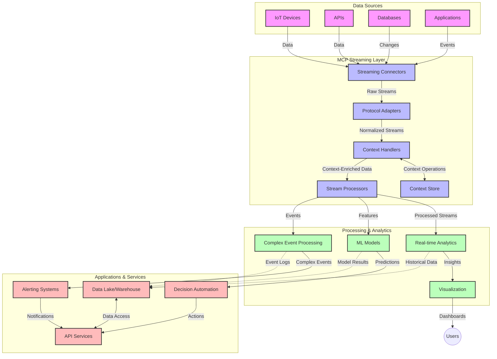

<!--
CO_OP_TRANSLATOR_METADATA:
{
  "original_hash": "68c518dbff8a3b127ed2aa934054c56c",
  "translation_date": "2025-06-11T17:26:37+00:00",
  "source_file": "05-AdvancedTopics/mcp-realtimestreaming/README.md",
  "language_code": "sw"
}
-->
# Itifaki ya Muktadha wa Mfano kwa Utoaji wa Data kwa Wakati Halisi

## Muhtasari

Utoaji wa data kwa wakati halisi umekuwa muhimu katika dunia ya leo inayotegemea data, ambapo biashara na programu zinahitaji kupata taarifa mara moja kufanya maamuzi ya wakati unaofaa. Itifaki ya Muktadha wa Mfano (MCP) ni maendeleo makubwa katika kuboresha michakato hii ya utoaji wa data kwa wakati halisi, ikiboresha ufanisi wa usindikaji wa data, kuhifadhi muktadha muhimu, na kuboresha utendaji wa mfumo kwa ujumla.

Moduli hii inachunguza jinsi MCP inavyobadilisha utoaji wa data kwa wakati halisi kwa kutoa njia ya kawaida ya usimamizi wa muktadha kati ya mifano ya AI, majukwaa ya utoaji, na programu.

## Utangulizi wa Utoaji wa Data kwa Wakati Halisi

Utoaji wa data kwa wakati halisi ni mtindo wa kiteknolojia unaowezesha uhamisho endelevu, usindikaji, na uchambuzi wa data wakati inapotengenezwa, kuruhusu mifumo kujibu mara moja kwa taarifa mpya. Tofauti na usindikaji wa kundi uliozoeleka ambao hufanya kazi na seti za data zisizobadilika, utoaji huu huchakata data iliyo katika mzunguko, ukitoa maarifa na hatua kwa ucheleweshaji mdogo sana.

### Dhana Muhimu za Utoaji wa Data kwa Wakati Halisi:

- **Mtiririko Endelevu wa Data**: Data huchakatwa kama mfululizo wa matukio au rekodi zisizo na mwisho.
- **Usindikaji wa Ucheleweshaji Mdogo**: Mifumo imeundwa kupunguza muda kati ya utengenezaji na usindikaji wa data.
- **Uwezo wa Kupanuka**: Miundo ya utoaji inapaswa kushughulikia kiasi na kasi tofauti za data.
- **Uvumilivu wa Makosa**: Mifumo inahitaji kuwa imara dhidi ya kushindwa ili kuhakikisha mtiririko wa data haukatizwi.
- **Usindikaji Unaohifadhi Hali**: Kuhifadhi muktadha kati ya matukio ni muhimu kwa uchambuzi wenye maana.

### Itifaki ya Muktadha wa Mfano na Utoaji wa Wakati Halisi

Itifaki ya Muktadha wa Mfano (MCP) inashughulikia changamoto kadhaa muhimu katika mazingira ya utoaji wa wakati halisi:

1. **Uendelevu wa Muktadha**: MCP huweka viwango vya jinsi muktadha unavyohifadhiwa kati ya vipengele vya utoaji vilivyoenea, kuhakikisha mifano ya AI na nodi za usindikaji zinapata muktadha wa kihistoria na mazingira unaohitajika.

2. **Usimamizi Bora wa Hali**: Kwa kutoa mbinu za muundo wa usafirishaji wa muktadha, MCP hupunguza mzigo wa usimamizi wa hali katika mitiririko ya utoaji.

3. **Ushirikiano wa Teknolojia Mbalimbali**: MCP huunda lugha ya pamoja ya kushirikiana muktadha kati ya teknolojia mbalimbali za utoaji na mifano ya AI, kuwezesha miundo yenye ufanisi na inayoweza kupanuka.

4. **Muktadha Ulio Boresha kwa Utoaji**: Matumizi ya MCP yanaweza kuipa kipaumbele vipengele vya muktadha vinavyofaa zaidi kwa maamuzi ya wakati halisi, kuboresha utendaji na usahihi.

5. **Usindikaji Unaobadilika**: Kwa usimamizi mzuri wa muktadha kupitia MCP, mifumo ya utoaji inaweza kubadilisha usindikaji kulingana na hali na mifumo inayobadilika ya data.

Katika programu za kisasa kuanzia mitandao ya sensor za IoT hadi majukwaa ya biashara ya fedha, kuunganisha MCP na teknolojia za utoaji kunaruhusu usindikaji mahiri zaidi unaojali muktadha na unaoweza kujibu ipasavyo hali tata zinazoendelea kwa wakati halisi.

## Malengo ya Kujifunza

Mwisho wa somo hili, utaweza:

- Kuelewa misingi ya utoaji wa data kwa wakati halisi na changamoto zake
- Kueleza jinsi Itifaki ya Muktadha wa Mfano (MCP) inavyoboresha utoaji wa data kwa wakati halisi
- Kutekeleza suluhisho za utoaji kwa kutumia MCP kwa kutumia mifumo maarufu kama Kafka na Pulsar
- Kubuni na kupeleka miundo ya utoaji yenye uvumilivu wa makosa na utendaji wa hali ya juu kwa MCP
- Kutumia dhana za MCP katika kesi za matumizi za IoT, biashara ya fedha, na uchambuzi unaoendeshwa na AI
- Kutathmini mwenendo unaojitokeza na ubunifu wa baadaye katika teknolojia za utoaji zinazotumia MCP

### Ufafanuzi na Umuhimu

Utoaji wa data kwa wakati halisi unahusisha uzalishaji endelevu, usindikaji, na usambazaji wa data kwa ucheleweshaji mdogo sana. Tofauti na usindikaji wa kundi ambapo data hukusanywa na kusindikwa kwa makundi, data ya utoaji huchakatwa hatua kwa hatua inavyopokelewa, kuruhusu maarifa na hatua mara moja.

Sifa kuu za utoaji wa data kwa wakati halisi ni:

- **Ucheleweshaji Mdogo**: Kusindika na kuchambua data ndani ya milisekunde hadi sekunde
- **Mtiririko Endelevu**: Mtiririko usioyumba wa data kutoka vyanzo mbalimbali
- **Usindikaji wa Mara Moja**: Kuchambua data inavyopokelewa badala ya kwa makundi
- **Miundo Inayotegemea Matukio**: Kujibu matukio yanapotokea

### Changamoto katika Utoaji wa Data wa Kawaida

Njia za kawaida za utoaji wa data zinakumbwa na vikwazo kadhaa:

1. **Kupotea kwa Muktadha**: Ugumu wa kuhifadhi muktadha kati ya mifumo iliyosambazwa
2. **Matatizo ya Kupanuka**: Changamoto za kupanua kushughulikia kiasi kikubwa na kasi ya data
3. **Ugumu wa Muunganisho**: Matatizo ya ushirikiano kati ya mifumo tofauti
4. **Usimamizi wa Ucheleweshaji**: Kuweka usawa kati ya kiwango cha data na muda wa usindikaji
5. **Ulinganifu wa Data**: Kuhakikisha usahihi na ukamilifu wa data katika mtiririko

## Kuelewa Itifaki ya Muktadha wa Mfano (MCP)

### MCP ni Nini?

Itifaki ya Muktadha wa Mfano (MCP) ni itifaki ya mawasiliano iliyosanifiwa kusaidia mwingiliano bora kati ya mifano ya AI na programu. Katika muktadha wa utoaji wa data kwa wakati halisi, MCP hutoa mfumo wa:

- Kuhifadhi muktadha katika mzunguko mzima wa data
- Kuweka viwango vya muundo wa kubadilishana data
- Kuboresha usafirishaji wa seti kubwa za data
- Kuongeza mawasiliano kati ya mifano na kati ya mfano na programu

### Vipengele Muhimu na Miundo

Muundo wa MCP kwa utoaji wa wakati halisi unajumuisha vipengele vikuu:

1. **Watunzaji wa Muktadha**: Husimamia na kuhifadhi taarifa za muktadha katika mzunguko wa utoaji
2. **Wasindikaji wa Mtiririko**: Huchakata mitiririko ya data inayokuja kwa kutumia mbinu zinazojali muktadha
3. **Vibadilishaji vya Itifaki**: Hubadilisha kati ya itifaki tofauti za utoaji huku wakihifadhi muktadha
4. **Hifadhi ya Muktadha**: Kuhifadhi na kupata taarifa za muktadha kwa ufanisi
5. **Vihusishi vya Utoaji**: Kuunganishwa na majukwaa mbalimbali ya utoaji (Kafka, Pulsar, Kinesis, n.k.)



### Jinsi MCP Inavyoboresha Usindikaji wa Data kwa Wakati Halisi

MCP inashughulikia changamoto za utoaji wa kawaida kwa:

- **Uadilifu wa Muktadha**: Kuhifadhi uhusiano kati ya pointi za data katika mzunguko mzima
- **Usafirishaji Ulio Boresha**: Kupunguza rudufu katika kubadilishana data kupitia usimamizi mahiri wa muktadha
- **Kiolesura Kilichosanifiwa**: Kutoa API za kuaminika kwa vipengele vya utoaji
- **Kupunguza Ucheleweshaji**: Kupunguza mzigo wa usindikaji kupitia usimamizi mzuri wa muktadha
- **Kupanuka kwa Ufanisi**: Kusaidia upanuzi wa wima huku ukihifadhi muktadha

## Muunganisho na Utekelezaji

Mifumo ya utoaji wa data kwa wakati halisi inahitaji muundo makini wa usanifu na utekelezaji ili kuhifadhi utendaji na uadilifu wa muktadha. Itifaki ya Muktadha wa Mfano hutoa njia ya kawaida ya kuunganisha mifano ya AI na teknolojia za utoaji, kuruhusu mitiririko ya usindikaji yenye akili zaidi inayojali muktadha.

### Muhtasari wa Muunganisho wa MCP katika Miundo ya Utoaji

Kutekeleza MCP katika mazingira ya utoaji wa wakati halisi kunahitaji kuzingatia mambo muhimu:

1. **Usanifishaji na Usafirishaji wa Muktadha**: MCP hutoa mbinu bora za kusanifisha taarifa za muktadha ndani ya vifurushi vya data vya utoaji, kuhakikisha muktadha muhimu unafuata data katika mzunguko wa usindikaji. Hii inajumuisha miundo ya usanifishaji iliyosanifiwa kwa usafirishaji wa utoaji.

2. **Usindikaji Unaohifadhi Hali**: MCP huwezesha usindikaji mahiri unaohifadhi hali kwa kuhifadhi uwakilishi thabiti wa muktadha kati ya nodi za usindikaji. Hii ni muhimu hasa katika miundo ya utoaji iliyosambazwa ambapo usimamizi wa hali huwa changamoto.

3. **Wakati wa Tukio dhidi ya Wakati wa Usindikaji**: Matumizi ya MCP katika mifumo ya utoaji yanapaswa kushughulikia changamoto ya kutofautisha wakati tukio lilitokea na wakati linaposhughulikiwa. Itifaki inaweza kujumuisha muktadha wa muda unaohifadhi maana ya wakati wa tukio.

4. **Usimamizi wa Shinikizo la Nyuma (Backpressure)**: Kwa kuweka viwango vya usimamizi wa muktadha, MCP husaidia kusimamia shinikizo la nyuma katika mifumo ya utoaji, kuruhusu vipengele kuwasiliana uwezo wao wa usindikaji na kurekebisha mtiririko ipasavyo.

5. **Udirishaji na Ukusanyaji wa Muktadha**: MCP hurahisisha shughuli za dirisha kwa kutoa uwakilishi wa muundo wa muktadha wa muda na uhusiano, kuwezesha ukusanyaji wenye maana zaidi kati ya mitiririko ya matukio.

6. **Usindikaji wa Mara-Moja Kabisa**: Katika mifumo ya utoaji inayohitaji semantiki ya mara-moja kabisa, MCP inaweza kujumuisha metadata ya usindikaji kusaidia kufuatilia na kuthibitisha hali ya usindikaji kati ya vipengele vilivyoenea.

Utekelezaji wa MCP katika teknolojia mbalimbali za utoaji huunda njia moja kwa usimamizi wa muktadha, kupunguza haja ya nambari za muunganisho maalum huku ikiboresha uwezo wa mfumo kuhifadhi muktadha wenye maana wakati data inapita kwenye mzunguko.

### MCP katika Mifumo Mbalimbali ya Utoaji wa Data

MCP inaweza kuunganishwa na mifumo maarufu ya utoaji ikiwemo:

#### Muunganisho wa Apache Kafka

```python
from mcp_streaming import MCPKafkaConnector

# Initialize MCP Kafka connector
connector = MCPKafkaConnector(
    bootstrap_servers='localhost:9092',
    context_preservation=True
)

# Create a context-aware consumer
consumer = connector.create_consumer('input-topic')

# Process streaming data with context
for message in consumer:
    context = message.get_context()
    data = message.get_value()
    
    # Process with context awareness
    result = process_with_context(data, context)
    
    # Produce output with preserved context
    connector.produce('output-topic', result, context=context)
```

#### Utekelezaji wa Apache Pulsar

```python
from mcp_streaming import MCPPulsarClient

# Initialize MCP Pulsar client
client = MCPPulsarClient('pulsar://localhost:6650')

# Subscribe with context awareness
consumer = client.subscribe('input-topic', 'subscription-name', 
                           context_enabled=True)

# Process messages with context preservation
while True:
    message = consumer.receive()
    context = message.get_context()
    
    # Process with context
    result = process_with_context(message.data(), context)
    
    # Acknowledge the message
    consumer.acknowledge(message)
    
    # Send result with preserved context
    producer = client.create_producer('output-topic')
    producer.send(result, context=context)
```

### Mbinu Bora za Utekelezaji

Unapotekeleza MCP kwa utoaji wa wakati halisi:

1. **Panga kwa Uvumilivu wa Makosa**:
   - Tekeleza usimamizi sahihi wa makosa
   - Tumia foleni za dead-letter kwa ujumbe ulioshindikana
   - Unda wasindikaji wa idempotent

2. **Boresha Utendaji**:
   - Sanidi ukubwa unaofaa wa buffer
   - Tumia kundi la data inapofaa
   - Tekeleza mbinu za shinikizo la nyuma

3. **Fuatilia na Chunguza**:
   - Rekodi vipimo vya usindikaji wa mitiririko
   - Fuatilia ueneaji wa muktadha
   - Weka tahadhari kwa hali zisizo za kawaida

4. **Linda Mitiririko Yako**:
   - Tekeleza usimbaji fiche kwa data nyeti
   - Tumia uthibitishaji na idhini
   - Tumia udhibiti wa upatikanaji unaofaa

### MCP katika IoT na Usindikaji wa Edge

MCP huboresha utoaji wa IoT kwa:

- Kuhifadhi muktadha wa kifaa katika mzunguko wa usindikaji
- Kuruhusu utoaji wa data kwa ufanisi kutoka Edge hadi Cloud
- Kusaidia uchambuzi wa wakati halisi wa mitiririko ya data za IoT
- Kurahisisha mawasiliano kati ya vifaa kwa muktadha

Mfano: Mitandao ya Sensor za Miji Mjini
```
Sensors → Edge Gateways → MCP Stream Processors → Real-time Analytics → Automated Responses
```

### Nafasi katika Miamala ya Fedha na Biashara ya Kasi ya Juu

MCP hutoa faida kubwa kwa utoaji wa data wa kifedha:

- Usindikaji wa ucheleweshaji mdogo sana kwa maamuzi ya biashara
- Kuhifadhi muktadha wa miamala katika usindikaji wote
- Kusaidia usindikaji wa matukio tata kwa uelewa wa muktadha
- Kuhakikisha ulinganifu wa data katika mifumo ya biashara iliyosambazwa

### Kuboresha Uchambuzi wa Data unaoendeshwa na AI

MCP huunda fursa mpya kwa uchambuzi wa mitiririko:

- Mafunzo na utambuzi wa modeli kwa wakati halisi
- Kujifunza endelevu kutoka kwa data ya mitiririko
- Utoaji wa vipengele vinavyojali muktadha
- Mitiririko ya utambuzi wa modeli nyingi na muktadha ulihifadhiwa

## Mwelekeo na Ubunifu wa Baadaye

### Mageuzi ya MCP katika Mazingira ya Wakati Halisi

Tukiangalia mbele, tunatarajia MCP itabadilika kushughulikia:

- **Muunganisho wa Kompyuta ya Quantum**: Kujiandaa kwa mifumo ya utoaji inayotumia quantum
- **Usindikaji wa Edge-Native**: Kuhamisha usindikaji unaojali muktadha zaidi kwenye vifaa vya Edge
- **Usimamizi wa Mitiririko wa Kujitegemea**: Mitiririko ya utoaji inayojiboresha yenyewe
- **Utoaji wa Ushirikiano**: Usindikaji uliosambazwa huku ukihifadhi faragha

### Maboresho Yanayoweza Kutokea Katika Teknolojia

Teknolojia zinazoibuka zitakazoathiri MCP ya baadaye ni:

1. **Itifaki za Utoaji Zilizoboreshwa kwa AI**: Itifaki maalum zilizoundwa kwa mzigo wa AI
2. **Muunganisho wa Kompyuta ya Neuromorphic**: Kompyuta inayohamasishwa na ubongo kwa usindikaji wa mitiririko
3. **Utoaji Bila Seva**: Utoaji unaotegemea matukio, unaopanuka bila usimamizi wa miundombinu
4. **Hifadhi za Muktadha Zilizogawanyika**: Usimamizi wa muktadha ulioenea duniani lakini thabiti

## Mazoezi ya Vitendo

### Zoeezi 1: Kuanzisha Mzunguko wa Utoaji wa MCP wa Msingi

Katika zoezi hili, utajifunza jinsi ya:
- Kusanidi mazingira ya msingi ya utoaji wa MCP
- Kutekeleza watunzaji wa muktadha kwa usindikaji wa mitiririko
- Kupima na kuthibitisha uhifadhi wa muktadha

### Zoezi 2: Kujenga Dashibodi ya Uchambuzi wa Wakati Halisi

Tengeneza programu kamili inayofanya:
- Kupokea data ya mitiririko kwa kutumia MCP
- Kusindika mtiririko huku ukihifadhi muktadha
- Kuonyesha matokeo kwa wakati halisi

### Zoezi 3: Kutekeleza Usindikaji wa Matukio Tata kwa MCP

Zoezi la juu linalohusu:
- Ugunduzi wa mifumo katika mitiririko
- Uhusiano wa muktadha kati ya mitiririko mingi
- Kutengeneza matukio tata yenye muktadha ulihifadhiwa

## Rasilimali Zaidi

- [Model Context Protocol Specification](https://github.com/microsoft/model-context-protocol) - Maelezo rasmi ya MCP na nyaraka
- [Apache Kafka Documentation](https://kafka.apache.org/documentation/) - Jifunze kuhusu Kafka kwa usindikaji wa mitiririko
- [Apache Pulsar](https://pulsar.apache.org/) - Jukwaa la ujumbe na utoaji uliojumlishwa
- [Streaming Systems: The What, Where, When, and How of Large-Scale Data Processing](https://www.oreilly.com/library/view/streaming-systems/9781491983867/) - Kitabu kamili kuhusu miundo ya utoaji
- [Microsoft Azure Event Hubs](https://learn.microsoft.com/en-us/azure/event-hubs/event-hubs-about) - Huduma ya usimamizi wa utoaji wa matukio
- [MLflow Documentation](https://mlflow.org/docs/latest/index.html) - Kwa ufu

**Kasi ya Kuandika**:  
Hati hii imetafsiriwa kwa kutumia huduma ya tafsiri ya AI [Co-op Translator](https://github.com/Azure/co-op-translator). Ingawa tunajitahidi kuhakikisha usahihi, tafadhali fahamu kuwa tafsiri za kiotomatiki zinaweza kuwa na makosa au upungufu wa usahihi. Hati asili katika lugha yake ya asili inapaswa kuchukuliwa kama chanzo cha kuaminika. Kwa taarifa muhimu, tafsiri ya kitaalamu inayofanywa na binadamu inashauriwa. Hatuna dhamana kwa kutoelewana au tafsiri potofu zinazotokana na matumizi ya tafsiri hii.