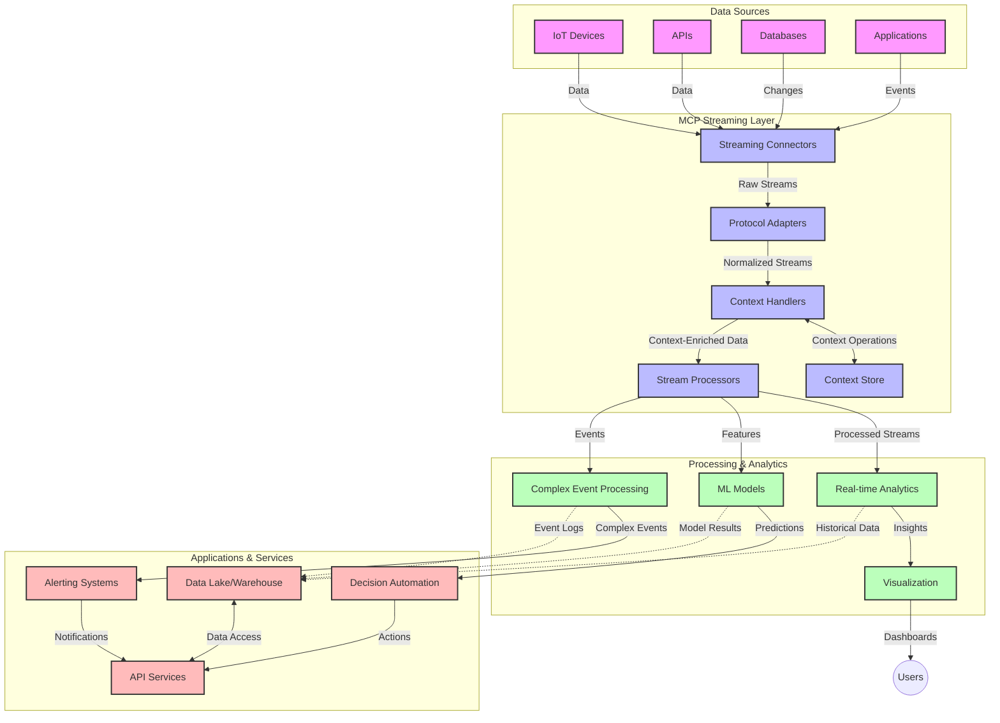

<!--
CO_OP_TRANSLATOR_METADATA:
{
  "original_hash": "195f7287638b77a549acadd96c8f981c",
  "translation_date": "2025-07-14T01:47:45+00:00",
  "source_file": "05-AdvancedTopics/mcp-realtimestreaming/README.md",
  "language_code": "sw"
}
-->
# Model Context Protocol kwa Upelekaji Data wa Wakati Halisi

## Muhtasari

Upelekaji data wa wakati halisi umekuwa muhimu katika dunia ya leo inayotegemea data, ambapo biashara na programu zinahitaji kupata taarifa mara moja ili kufanya maamuzi kwa wakati unaofaa. Model Context Protocol (MCP) ni maendeleo makubwa katika kuboresha michakato hii ya upelekaji wa wakati halisi, kwa kuongeza ufanisi wa usindikaji data, kuhifadhi muktadha muhimu, na kuboresha utendaji wa jumla wa mfumo.

Moduli hii inachunguza jinsi MCP inavyobadilisha upelekaji data wa wakati halisi kwa kutoa njia ya kawaida ya usimamizi wa muktadha kati ya mifano ya AI, majukwaa ya upelekaji, na programu.

## Utangulizi wa Upelekaji Data wa Wakati Halisi

Upelekaji data wa wakati halisi ni mtindo wa kiteknolojia unaowezesha uhamisho, usindikaji, na uchambuzi wa data unaoendelea kadri inavyotengenezwa, kuruhusu mifumo kujibu mara moja kwa taarifa mpya. Tofauti na usindikaji wa kundi unaofanya kazi kwa seti za data zisizobadilika, upelekaji hufanya kazi na data inayosogea, ukitoa maarifa na hatua kwa ucheleweshaji mdogo sana.

### Dhana Muhimu za Upelekaji Data wa Wakati Halisi:

- **Mtiririko Endelevu wa Data**: Data husindikwa kama mfululizo usioisha wa matukio au rekodi.
- **Usindikaji wa Ucheleweshaji Mdogo**: Mifumo imeundwa kupunguza muda kati ya uzalishaji wa data na usindikaji wake.
- **Uwezo wa Kupanuka**: Miundo ya upelekaji inapaswa kushughulikia kiasi na kasi tofauti za data.
- **Uvumilivu wa Hitilafu**: Mifumo inahitaji kuwa imara dhidi ya kushindwa ili kuhakikisha mtiririko wa data haukatiki.
- **Usindikaji Unaohifadhi Hali**: Kuhifadhi muktadha kati ya matukio ni muhimu kwa uchambuzi wenye maana.

### Model Context Protocol na Upelekaji wa Wakati Halisi

Model Context Protocol (MCP) inashughulikia changamoto kadhaa muhimu katika mazingira ya upelekaji wa wakati halisi:

1. **Mfuatano wa Muktadha**: MCP huweka viwango vya jinsi muktadha unavyohifadhiwa kati ya vipengele vya upelekaji vilivyoenea, kuhakikisha mifano ya AI na nodi za usindikaji zinapata muktadha wa kihistoria na mazingira unaohitajika.

2. **Usimamizi Bora wa Hali**: Kwa kutoa mbinu za muundo wa usafirishaji wa muktadha, MCP hupunguza mzigo wa usimamizi wa hali katika njia za upelekaji.

3. **Uwezo wa Kushirikiana**: MCP huunda lugha ya pamoja ya kushirikiana muktadha kati ya teknolojia mbalimbali za upelekaji na mifano ya AI, kuruhusu miundo yenye kubadilika na inayoweza kupanuka.

4. **Muktadha Ulioboreshwa kwa Upelekaji**: Matumizi ya MCP yanaweza kuipa kipaumbele vipengele vya muktadha vinavyohitajika zaidi kwa maamuzi ya wakati halisi, kuboresha utendaji na usahihi.

5. **Usindikaji Unaobadilika**: Kwa usimamizi sahihi wa muktadha kupitia MCP, mifumo ya upelekaji inaweza kubadilisha usindikaji kulingana na hali na mifumo inayobadilika katika data.

Katika programu za kisasa kuanzia mitandao ya sensa za IoT hadi majukwaa ya biashara ya kifedha, muunganiko wa MCP na teknolojia za upelekaji unaruhusu usindikaji wenye akili zaidi, unaojua muktadha, unaoweza kujibu kwa usahihi hali ngumu zinazobadilika kwa wakati halisi.

## Malengo ya Kujifunza

Mwisho wa somo hili, utaweza:

- Kuelewa misingi ya upelekaji data wa wakati halisi na changamoto zake
- Kueleza jinsi Model Context Protocol (MCP) inavyoboreshwa upelekaji data wa wakati halisi
- Kutekeleza suluhisho za upelekaji zenye msingi wa MCP kwa kutumia mifumo maarufu kama Kafka na Pulsar
- Kubuni na kupeleka miundo ya upelekaji yenye uvumilivu wa hitilafu na utendaji wa juu kwa MCP
- Kutumia dhana za MCP katika matumizi ya IoT, biashara ya kifedha, na uchambuzi unaoendeshwa na AI
- Kutathmini mwelekeo mpya na uvumbuzi wa baadaye katika teknolojia za upelekaji zenye msingi wa MCP

### Ufafanuzi na Umuhimu

Upelekaji data wa wakati halisi unahusisha uzalishaji, usindikaji, na utoaji wa data kwa mda mfupi sana wa ucheleweshaji. Tofauti na usindikaji wa kundi, ambapo data hukusanywa na kusindikwa kwa makundi, data ya upelekaji husindikwa hatua kwa hatua inavyowasili, kuruhusu maarifa na hatua za haraka.

Sifa kuu za upelekaji data wa wakati halisi ni:

- **Ucheleweshaji Mdogo**: Kusindika na kuchambua data ndani ya milisekunde hadi sekunde
- **Mtiririko Endelevu**: Mfululizo usiokatika wa data kutoka vyanzo mbalimbali
- **Usindikaji wa Mara Moja**: Kuchambua data inavyowasili badala ya kwa makundi
- **Muundo Unaotegemea Matukio**: Kujibu matukio yanapotokea

### Changamoto katika Upelekaji wa Data wa Kawaida

Njia za kawaida za upelekaji data zinakumbana na vikwazo kadhaa:

1. **Kupoteza Muktadha**: Ugumu wa kuhifadhi muktadha kati ya mifumo iliyosambazwa
2. **Masuala ya Kupanuka**: Changamoto za kupanua ili kushughulikia data yenye kiasi na kasi kubwa
3. **Ugumu wa Muunganiko**: Matatizo ya kushirikiana kati ya mifumo tofauti
4. **Usimamizi wa Ucheleweshaji**: Kuweka uwiano kati ya kasi ya usindikaji na muda wa usindikaji
5. **Ulinganifu wa Data**: Kuhakikisha usahihi na ukamilifu wa data katika mtiririko

## Kuelewa Model Context Protocol (MCP)

### MCP ni Nini?

Model Context Protocol (MCP) ni itifaki ya mawasiliano iliyowekwa viwango ili kuwezesha mwingiliano mzuri kati ya mifano ya AI na programu. Katika muktadha wa upelekaji data wa wakati halisi, MCP hutoa mfumo wa:

- Kuhifadhi muktadha katika njia ya data
- Kuweka viwango vya kubadilishana data
- Kuboresha usafirishaji wa seti kubwa za data
- Kuongeza mawasiliano kati ya mifano na kati ya modeli na programu

### Vipengele Muhimu na Muundo

Muundo wa MCP kwa upelekaji wa wakati halisi unajumuisha vipengele muhimu:

1. **Watunzaji wa Muktadha**: Kusimamia na kuhifadhi taarifa za muktadha katika njia ya upelekaji
2. **Wasindikaji wa Mtiririko**: Kusindika mfululizo wa data unaoingia kwa mbinu zinazojua muktadha
3. **Vibadilishaji vya Itifaki**: Kubadilisha kati ya itifaki tofauti za upelekaji huku wakihifadhi muktadha
4. **Hifadhi ya Muktadha**: Kuhifadhi na kupata taarifa za muktadha kwa ufanisi
5. **Viwango vya Uunganisho wa Upelekaji**: Kuunganishwa na majukwaa mbalimbali ya upelekaji (Kafka, Pulsar, Kinesis, n.k.)



### MCP Inavyoboresha Usimamizi wa Data wa Wakati Halisi

MCP inashughulikia changamoto za upelekaji wa kawaida kwa:

- **Uadilifu wa Muktadha**: Kuhifadhi uhusiano kati ya pointi za data katika njia yote
- **Usafirishaji Ulioboreshwa**: Kupunguza rudufu katika kubadilishana data kupitia usimamizi wa muktadha wenye akili
- **Mawasiliano Yenye Viwango**: Kutoa API zinazolingana kwa vipengele vya upelekaji
- **Kupunguza Ucheleweshaji**: Kupunguza mzigo wa usindikaji kupitia usimamizi bora wa muktadha
- **Kuongeza Uwezo wa Kupanuka**: Kusaidia kupanua kwa usawa huku muktadha ukihifadhiwa

## Muunganiko na Utekelezaji

Mifumo ya upelekaji data wa wakati halisi inahitaji muundo makini na utekelezaji ili kuhifadhi utendaji na uadilifu wa muktadha. Model Context Protocol hutoa njia ya kawaida ya kuunganisha mifano ya AI na teknolojia za upelekaji, kuruhusu njia za usindikaji zenye akili zaidi na zinazojua muktadha.

### Muhtasari wa Muunganiko wa MCP katika Miundo ya Upelekaji

Kutekeleza MCP katika mazingira ya upelekaji wa wakati halisi kunahusisha mambo muhimu:

1. **Uthibitishaji na Usafirishaji wa Muktadha**: MCP hutoa mbinu za ufanisi za kuficha taarifa za muktadha ndani ya vifurushi vya data vya upelekaji, kuhakikisha muktadha muhimu unafuata data katika njia ya usindikaji. Hii inajumuisha viwango vya uthibitishaji vilivyoboreshwa kwa usafirishaji wa upelekaji.

2. **Usindikaji Unaohifadhi Hali**: MCP inaruhusu usindikaji wenye akili zaidi unaohifadhi hali kwa kuhifadhi uwakilishi thabiti wa muktadha kati ya nodi za usindikaji. Hii ni muhimu hasa katika miundo ya upelekaji iliyosambazwa ambapo usimamizi wa hali ni changamoto.

3. **Muda wa Tukio dhidi ya Muda wa Usindikaji**: Matumizi ya MCP katika mifumo ya upelekaji yanapaswa kushughulikia changamoto ya kutofautisha wakati matukio yalitokea na wakati yanaposhughulikiwa. Itifaki inaweza kujumuisha muktadha wa muda unaohifadhi maana ya wakati wa tukio.

4. **Usimamizi wa Mzigo wa Kurudi**: Kwa kuweka viwango vya usimamizi wa muktadha, MCP husaidia kudhibiti mzigo wa kurudi katika mifumo ya upelekaji, kuruhusu vipengele kuwasiliana uwezo wao wa usindikaji na kurekebisha mtiririko ipasavyo.

5. **Dirisha la Muktadha na Ukusanyaji**: MCP hurahisisha operesheni za dirisha zenye ufanisi zaidi kwa kutoa uwakilishi wa muundo wa muktadha wa muda na uhusiano, kuruhusu ukusanyaji wenye maana zaidi kati ya mfululizo wa matukio.

6. **Usindikaji wa Mara-Moja-Kamili**: Katika mifumo ya upelekaji inayohitaji semantiki ya mara-moja-kamili, MCP inaweza kujumuisha metadata ya usindikaji kusaidia kufuatilia na kuthibitisha hali ya usindikaji kati ya vipengele vilivyoenea.

Utekelezaji wa MCP katika teknolojia mbalimbali za upelekaji huunda njia moja ya usimamizi wa muktadha, kupunguza haja ya kuandika msimbo wa muunganiko maalum huku ukiongeza uwezo wa mfumo kuhifadhi muktadha wenye maana wakati data inapopita katika njia.

### MCP katika Mifumo Mbalimbali ya Upelekaji Data

Mifano hii inafuata sifa za MCP za sasa zinazolenga itifaki ya JSON-RPC yenye mbinu tofauti za usafirishaji. Msimbo unaonyesha jinsi unavyoweza kutekeleza usafirishaji maalum unaounganisha majukwaa ya upelekaji kama Kafka na Pulsar huku ukihifadhi ulinganifu kamili na itifaki ya MCP.

Mifano imeundwa kuonyesha jinsi majukwaa ya upelekaji yanavyoweza kuunganishwa na MCP kutoa usindikaji wa data wa wakati halisi huku wakihifadhi uelewa wa muktadha ambao ni msingi wa MCP. Njia hii inahakikisha sampuli za msimbo zinaonyesha hali halisi ya sifa za MCP hadi Juni 2025.

MCP inaweza kuunganishwa na mifumo maarufu ya upelekaji ikiwemo:

#### Muunganiko wa Apache Kafka

```python
import asyncio
import json
from typing import Dict, Any, Optional
from confluent_kafka import Consumer, Producer, KafkaError
from mcp.client import Client, ClientCapabilities
from mcp.core.message import JsonRpcMessage
from mcp.core.transports import Transport

# Custom transport class to bridge MCP with Kafka
class KafkaMCPTransport(Transport):
    def __init__(self, bootstrap_servers: str, input_topic: str, output_topic: str):
        self.bootstrap_servers = bootstrap_servers
        self.input_topic = input_topic
        self.output_topic = output_topic
        self.producer = Producer({'bootstrap.servers': bootstrap_servers})
        self.consumer = Consumer({
            'bootstrap.servers': bootstrap_servers,
            'group.id': 'mcp-client-group',
            'auto.offset.reset': 'earliest'
        })
        self.message_queue = asyncio.Queue()
        self.running = False
        self.consumer_task = None
        
    async def connect(self):
        """Connect to Kafka and start consuming messages"""
        self.consumer.subscribe([self.input_topic])
        self.running = True
        self.consumer_task = asyncio.create_task(self._consume_messages())
        return self
        
    async def _consume_messages(self):
        """Background task to consume messages from Kafka and queue them for processing"""
        while self.running:
            try:
                msg = self.consumer.poll(1.0)
                if msg is None:
                    await asyncio.sleep(0.1)
                    continue
                
                if msg.error():
                    if msg.error().code() == KafkaError._PARTITION_EOF:
                        continue
                    print(f"Consumer error: {msg.error()}")
                    continue
                
                # Parse the message value as JSON-RPC
                try:
                    message_str = msg.value().decode('utf-8')
                    message_data = json.loads(message_str)
                    mcp_message = JsonRpcMessage.from_dict(message_data)
                    await self.message_queue.put(mcp_message)
                except Exception as e:
                    print(f"Error parsing message: {e}")
            except Exception as e:
                print(f"Error in consumer loop: {e}")
                await asyncio.sleep(1)
    
    async def read(self) -> Optional[JsonRpcMessage]:
        """Read the next message from the queue"""
        try:
            message = await self.message_queue.get()
            return message
        except Exception as e:
            print(f"Error reading message: {e}")
            return None
    
    async def write(self, message: JsonRpcMessage) -> None:
        """Write a message to the Kafka output topic"""
        try:
            message_json = json.dumps(message.to_dict())
            self.producer.produce(
                self.output_topic,
                message_json.encode('utf-8'),
                callback=self._delivery_report
            )
            self.producer.poll(0)  # Trigger callbacks
        except Exception as e:
            print(f"Error writing message: {e}")
    
    def _delivery_report(self, err, msg):
        """Kafka producer delivery callback"""
        if err is not None:
            print(f'Message delivery failed: {err}')
        else:
            print(f'Message delivered to {msg.topic()} [{msg.partition()}]')
    
    async def close(self) -> None:
        """Close the transport"""
        self.running = False
        if self.consumer_task:
            self.consumer_task.cancel()
            try:
                await self.consumer_task
            except asyncio.CancelledError:
                pass
        self.consumer.close()
        self.producer.flush()

# Example usage of the Kafka MCP transport
async def kafka_mcp_example():
    # Create MCP client with Kafka transport
    client = Client(
        {"name": "kafka-mcp-client", "version": "1.0.0"},
        ClientCapabilities({})
    )
    
    # Create and connect the Kafka transport
    transport = KafkaMCPTransport(
        bootstrap_servers="localhost:9092",
        input_topic="mcp-responses",
        output_topic="mcp-requests"
    )
    
    await client.connect(transport)
    
    try:
        # Initialize the MCP session
        await client.initialize()
        
        # Example of executing a tool via MCP
        response = await client.execute_tool(
            "process_data",
            {
                "data": "sample data",
                "metadata": {
                    "source": "sensor-1",
                    "timestamp": "2025-06-12T10:30:00Z"
                }
            }
        )
        
        print(f"Tool execution response: {response}")
        
        # Clean shutdown
        await client.shutdown()
    finally:
        await transport.close()

# Run the example
if __name__ == "__main__":
    asyncio.run(kafka_mcp_example())
```

#### Utekelezaji wa Apache Pulsar

```python
import asyncio
import json
import pulsar
from typing import Dict, Any, Optional
from mcp.core.message import JsonRpcMessage
from mcp.core.transports import Transport
from mcp.server import Server, ServerOptions
from mcp.server.tools import Tool, ToolExecutionContext, ToolMetadata

# Create a custom MCP transport that uses Pulsar
class PulsarMCPTransport(Transport):
    def __init__(self, service_url: str, request_topic: str, response_topic: str):
        self.service_url = service_url
        self.request_topic = request_topic
        self.response_topic = response_topic
        self.client = pulsar.Client(service_url)
        self.producer = self.client.create_producer(response_topic)
        self.consumer = self.client.subscribe(
            request_topic,
            "mcp-server-subscription",
            consumer_type=pulsar.ConsumerType.Shared
        )
        self.message_queue = asyncio.Queue()
        self.running = False
        self.consumer_task = None
    
    async def connect(self):
        """Connect to Pulsar and start consuming messages"""
        self.running = True
        self.consumer_task = asyncio.create_task(self._consume_messages())
        return self
    
    async def _consume_messages(self):
        """Background task to consume messages from Pulsar and queue them for processing"""
        while self.running:
            try:
                # Non-blocking receive with timeout
                msg = self.consumer.receive(timeout_millis=500)
                
                # Process the message
                try:
                    message_str = msg.data().decode('utf-8')
                    message_data = json.loads(message_str)
                    mcp_message = JsonRpcMessage.from_dict(message_data)
                    await self.message_queue.put(mcp_message)
                    
                    # Acknowledge the message
                    self.consumer.acknowledge(msg)
                except Exception as e:
                    print(f"Error processing message: {e}")
                    # Negative acknowledge if there was an error
                    self.consumer.negative_acknowledge(msg)
            except Exception as e:
                # Handle timeout or other exceptions
                await asyncio.sleep(0.1)
    
    async def read(self) -> Optional[JsonRpcMessage]:
        """Read the next message from the queue"""
        try:
            message = await self.message_queue.get()
            return message
        except Exception as e:
            print(f"Error reading message: {e}")
            return None
    
    async def write(self, message: JsonRpcMessage) -> None:
        """Write a message to the Pulsar output topic"""
        try:
            message_json = json.dumps(message.to_dict())
            self.producer.send(message_json.encode('utf-8'))
        except Exception as e:
            print(f"Error writing message: {e}")
    
    async def close(self) -> None:
        """Close the transport"""
        self.running = False
        if self.consumer_task:
            self.consumer_task.cancel()
            try:
                await self.consumer_task
            except asyncio.CancelledError:
                pass
        self.consumer.close()
        self.producer.close()
        self.client.close()

# Define a sample MCP tool that processes streaming data
@Tool(
    name="process_streaming_data",
    description="Process streaming data with context preservation",
    metadata=ToolMetadata(
        required_capabilities=["streaming"]
    )
)
async def process_streaming_data(
    ctx: ToolExecutionContext,
    data: str,
    source: str,
    priority: str = "medium"
) -> Dict[str, Any]:
    """
    Process streaming data while preserving context
    
    Args:
        ctx: Tool execution context
        data: The data to process
        source: The source of the data
        priority: Priority level (low, medium, high)
        
    Returns:
        Dict containing processed results and context information
    """
    # Example processing that leverages MCP context
    print(f"Processing data from {source} with priority {priority}")
    
    # Access conversation context from MCP
    conversation_id = ctx.conversation_id if hasattr(ctx, 'conversation_id') else "unknown"
    
    # Return results with enhanced context
    return {
        "processed_data": f"Processed: {data}",
        "context": {
            "conversation_id": conversation_id,
            "source": source,
            "priority": priority,
            "processing_timestamp": ctx.get_current_time_iso()
        }
    }

# Example MCP server implementation using Pulsar transport
async def run_mcp_server_with_pulsar():
    # Create MCP server
    server = Server(
        {"name": "pulsar-mcp-server", "version": "1.0.0"},
        ServerOptions(
            capabilities={"streaming": True}
        )
    )
    
    # Register our tool
    server.register_tool(process_streaming_data)
    
    # Create and connect Pulsar transport
    transport = PulsarMCPTransport(
        service_url="pulsar://localhost:6650",
        request_topic="mcp-requests",
        response_topic="mcp-responses"
    )
    
    try:
        # Start the server with the Pulsar transport
        await server.run(transport)
    finally:
        await transport.close()

# Run the server
if __name__ == "__main__":
    asyncio.run(run_mcp_server_with_pulsar())
```

### Mbinu Bora za Utekelezaji

Unapotekeleza MCP kwa upelekaji wa wakati halisi:

1. **Buni kwa Uvumilivu wa Hitilafu**:
   - Tekeleza usimamizi sahihi wa makosa
   - Tumia safu za ujumbe zilizoshindwa (dead-letter queues)
   - Buni wasindikaji wanaoweza kurudiwa bila madhara (idempotent)

2. **Boresha Utendaji**:
   - Sanidi ukubwa wa buffer unaofaa
   - Tumia kundi la data inapofaa
   - Tekeleza mbinu za kudhibiti mzigo wa kurudi

3. **Fuatilia na Angalia**:
   - Rekodi vipimo vya usindikaji wa mfululizo
   - Fuatilia usambazaji wa muktadha
   - Weka tahadhari kwa matukio yasiyo ya kawaida

4. **Linda Mifuriko Yako**:
   - Tekeleza usimbaji fiche kwa data nyeti
   - Tumia uthibitishaji na idhini
   - Weka udhibiti sahihi wa upatikanaji

### MCP katika IoT na Edge Computing

MCP huongeza ufanisi wa upelekaji wa IoT kwa:

- Kuhifadhi muktadha wa kifaa katika njia ya usindikaji
- Kuruhusu upelekaji wa data kwa ufanisi kutoka edge hadi wingu
- Kusaidia uchambuzi wa wakati halisi wa mfululizo wa data za IoT
- Kurahisisha mawasiliano kati ya vifaa kwa muktadha

Mfano: Mitandao ya Sensor za Miji Smart
```
Sensors → Edge Gateways → MCP Stream Processors → Real-time Analytics → Automated Responses
```

### Nafasi katika Miamala ya Kifedha na Biashara ya Kasi Sana

MCP hutoa faida kubwa kwa upelekaji wa data za kifedha:

- Usindikaji wa ucheleweshaji mdogo sana kwa maamuzi ya biashara
- Kuhifadhi muktadha wa miamala katika usindikaji wote
- Kusaidia usindikaji wa matukio magumu kwa uelewa wa muktadha
- Kuhakikisha usahihi wa data katika mifumo ya biashara iliyosambazwa

### Kuongeza Ufanisi wa Uchambuzi unaoendeshwa na AI

MCP huleta fursa mpya kwa uchambuzi wa upelekaji:

- Mafunzo na utabiri wa modeli kwa wakati halisi
- Kujifunza kwa kuendelea kutoka kwa data ya upelekaji
- Utoaji wa vipengele vinavyojua muktadha
- Mifumo ya utabiri wa modeli nyingi yenye muktadha ulihifadhiwa

## Mwelekeo na Uvumbuzi wa Baadaye

### Mageuzi ya MCP katika Mazingira ya Wakati Halisi

Tukiangalia mbele, tunatarajia MCP itabadilika kushughulikia:

- **Muunganiko wa Kompyuta za Quantum**: Kujiandaa kwa mifumo ya upelekaji inayotumia quantum
- **Usindikaji wa Asili wa Edge**: Kuhamisha usindikaji unaojua muktadha zaidi kwa vifaa vya edge
- **Usimamizi wa Upelekaji Unaojitegemea**: Njia za kujiendesha za njia za upelekaji
- **Upelekaji wa Kifedereshi**: Usindikaji uliosambazwa huku ukihifadhi faragha

### Maendeleo Yanayoweza Kutokea Katika Teknolojia

Teknolojia zinazoibuka zitakazobadilisha MCP ya baadaye ni:

1. **Itifaki za Upelekaji Zilizoboreshwa kwa AI**: Itifaki maalum kwa kazi za AI
2. **Muunganiko wa Kompyuta za Neuromorphic**: Kompyuta zinazotegemea ubongo kwa usindikaji wa mfululizo
3. **Upelekaji Usio na Server**: Upelekaji unaotegemea matukio, unaopanuka bila usimamizi wa miundombinu
4. **Hifadhi za Muktadha Zilizogawanyika**: Usimamizi wa muktadha uliosambazwa duniani kote lakini thabiti

## Mazoezi ya Vitendo

### Zoeezi 1: Kuanzisha Mlolongo wa Upelekaji wa MCP wa Msingi

Katika zoezi hili, utajifunza jinsi ya:
- Kusanidi mazingira ya msingi ya MCP kwa upelekaji
- Kutekeleza watunzaji wa muktadha kwa usindikaji wa mfululizo
- Kupima na kuthibitisha uhifadhi wa muktadha

### Zoeezi 2: Kujenga Dashibodi ya Uchambuzi wa Wakati Halisi

Tengeneza programu kamili inayofanya:
- Kupokea data ya upelekaji kwa kutumia MCP
- Kusindika mfululizo huku ukihifadhi muktadha
- Kuonyesha matokeo kwa wakati halisi

### Zoeezi 3: Kutekeleza Usindikaji wa Matukio Magumu kwa MCP

Zoeezi la juu linalojumuisha:
- Kugundua mifumo katika mfululizo
- Uhusiano wa muktadha kati ya mfululizo mbalimbali
- Kutengeneza matukio magumu yenye muktadha ulihifadhiwa

## Rasilimali Zaidi

- [Model Context Protocol Specification](https://github.com/modelcontextprotocol) - Maelezo rasmi ya MCP na nyaraka
- [Apache Kafka Documentation](https://kafka.apache.org/documentation/) - Jifunze kuhusu Kafka kwa us

**Kiarifu cha Kutotegemea**:  
Hati hii imetafsiriwa kwa kutumia huduma ya tafsiri ya AI [Co-op Translator](https://github.com/Azure/co-op-translator). Ingawa tunajitahidi kwa usahihi, tafadhali fahamu kwamba tafsiri za kiotomatiki zinaweza kuwa na makosa au upungufu wa usahihi. Hati ya asili katika lugha yake ya asili inapaswa kuchukuliwa kama chanzo cha mamlaka. Kwa taarifa muhimu, tafsiri ya kitaalamu inayofanywa na binadamu inapendekezwa. Hatubebei dhamana kwa kutoelewana au tafsiri potofu zinazotokana na matumizi ya tafsiri hii.