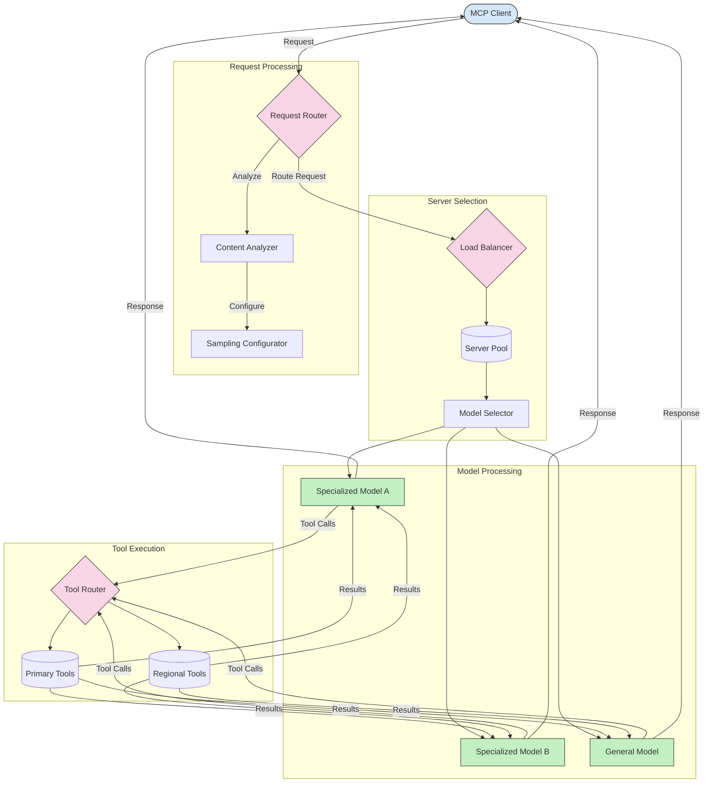

<!--
CO_OP_TRANSLATOR_METADATA:
{
  "original_hash": "a621fc52c7daec552eb8b3b48c0361dd",
  "translation_date": "2025-06-02T19:48:29+00:00",
  "source_file": "05-AdvancedTopics/mcp-routing/README.md",
  "language_code": "sw"
}
-->
## Sampuli na Usanidi wa Routing katika MCP

Sampuli ni sehemu muhimu ya Model Context Protocol (MCP) inayoruhusu usindikaji wa maombi kwa ufanisi na routing. Inahusisha kuchambua maombi yanayoingia ili kubaini modeli au huduma inayofaa zaidi kushughulikia maombi hayo, kwa kuzingatia vigezo mbalimbali kama aina ya maudhui, muktadha wa mtumiaji, na mzigo wa mfumo.

Sampuli na routing zinaweza kuunganishwa kuunda usanidi thabiti unaoimarisha matumizi ya rasilimali na kuhakikisha upatikanaji wa juu. Mchakato wa sampuli unaweza kutumika kuainisha maombi, wakati routing inayaelekeza kwa modeli au huduma zinazofaa.

Mchoro ulio hapa chini unaonyesha jinsi sampuli na routing vinavyofanya kazi pamoja katika usanidi kamili wa MCP:

## Nini kinachofuata

- [Sampling](../mcp-sampling/README.md)

**Kifungu cha kutolewa dhamana**:  
Hati hii imetafsiriwa kwa kutumia huduma ya tafsiri ya AI [Co-op Translator](https://github.com/Azure/co-op-translator). Ingawa tunajitahidi kuhakikisha usahihi, tafadhali fahamu kuwa tafsiri za kiotomatiki zinaweza kuwa na makosa au kasoro. Hati ya asili katika lugha yake ya asili inapaswa kuchukuliwa kama chanzo cha kuaminika. Kwa taarifa muhimu, tafsiri ya kitaalamu ya binadamu inashauriwa. Hatuna dhamana kwa kutoelewana au tafsiri potofu zitokanazo na matumizi ya tafsiri hii.