<!--
CO_OP_TRANSLATOR_METADATA:
{
  "original_hash": "6e562d7e5a77c8982da4aa8f762ad1d8",
  "translation_date": "2025-07-14T03:12:15+00:00",
  "source_file": "05-AdvancedTopics/mcp-security-entra/README.md",
  "language_code": "sw"
}
-->
# Kuweka Usalama katika Mifumo ya AI: Uthibitishaji wa Entra ID kwa Seva za Model Context Protocol

## Utangulizi
Kuweka usalama kwenye seva yako ya Model Context Protocol (MCP) ni muhimu kama kufunga mlango wa mbele wa nyumba yako. Kuacha seva yako ya MCP wazi kunaweka zana na data zako katika hatari ya kufikiwa na watu wasioidhinishwa, jambo ambalo linaweza kusababisha uvunjifu wa usalama. Microsoft Entra ID hutoa suluhisho thabiti la usimamizi wa utambulisho na upatikanaji unaotegemea wingu, kusaidia kuhakikisha kuwa ni watumiaji na programu zilizoidhinishwa tu ndizo zinaweza kuingiliana na seva yako ya MCP. Katika sehemu hii, utajifunza jinsi ya kulinda mifumo yako ya AI kwa kutumia uthibitishaji wa Entra ID.

## Malengo ya Kujifunza
Mwisho wa sehemu hii, utaweza:

- Kuelewa umuhimu wa kuweka usalama kwenye seva za MCP.
- Kueleza misingi ya Microsoft Entra ID na uthibitishaji wa OAuth 2.0.
- Kutambua tofauti kati ya wateja wa umma na wateja wa siri.
- Kutekeleza uthibitishaji wa Entra ID katika hali za seva za MCP za ndani (mteja wa umma) na za mbali (mteja wa siri).
- Kutumia mbinu bora za usalama wakati wa kuunda mifumo ya AI.

## Usalama na MCP

Kama vile hutaki kuacha mlango wa mbele wa nyumba yako wazi, vivyo hivyo, haupaswi kuacha seva yako ya MCP wazi kwa mtu yeyote kuipata. Kuweka usalama kwenye mifumo yako ya AI ni muhimu kwa kujenga programu thabiti, za kuaminika, na salama. Sura hii itakuonyesha jinsi ya kutumia Microsoft Entra ID kuweka usalama kwenye seva zako za MCP, kuhakikisha kuwa ni watumiaji na programu zilizoidhinishwa tu ndizo zinaweza kuingiliana na zana na data zako.

## Kwa Nini Usalama ni Muhimu kwa Seva za MCP

Fikiria seva yako ya MCP ina zana inayoweza kutuma barua pepe au kufikia hifadhidata ya wateja. Seva isiyo na usalama ina maana mtu yeyote anaweza kutumia zana hiyo, na kusababisha upatikanaji usioidhinishwa wa data, barua taka, au shughuli nyingine hatarishi.

Kwa kutekeleza uthibitishaji, unahakikisha kila ombi kwa seva yako linathibitishwa, kuthibitisha utambulisho wa mtumiaji au programu inayofanya ombi. Hii ni hatua ya kwanza na muhimu zaidi katika kuweka usalama kwenye mifumo yako ya AI.

## Utangulizi wa Microsoft Entra ID

[**Microsoft Entra ID**](https://adoption.microsoft.com/microsoft-security/entra/) ni huduma ya usimamizi wa utambulisho na upatikanaji inayotegemea wingu. Fikiria kama mlinzi wa usalama wa jumla kwa programu zako. Huduma hii hushughulikia mchakato mgumu wa kuthibitisha utambulisho wa watumiaji (uthibitishaji) na kuamua wanachoruhusiwa kufanya (idhinishaji).

Kwa kutumia Entra ID, unaweza:

- Kuwezesha kuingia salama kwa watumiaji.
- Kulinda API na huduma.
- Kusimamia sera za upatikanaji kutoka sehemu moja.

Kwa seva za MCP, Entra ID hutoa suluhisho thabiti na linaloaminika kusimamia nani anaweza kufikia uwezo wa seva yako.

---

## Kuelewa Sihiri: Jinsi Uthibitishaji wa Entra ID Unavyofanya Kazi

Entra ID hutumia viwango wazi kama **OAuth 2.0** kushughulikia uthibitishaji. Ingawa maelezo yanaweza kuwa magumu, dhana kuu ni rahisi na inaweza kueleweka kwa mfano.

### Utangulizi Mpole kwa OAuth 2.0: Ufunguo wa Valet

Fikiria OAuth 2.0 kama huduma ya valet kwa gari lako. Unapofika mgahawani, hutoa ufunguo wako mkuu kwa valet. Badala yake, unampa **ufunguo wa valet** wenye ruhusa ndogo—unaweza kuwasha gari na kufunga milango, lakini hauwezi kufungua sanduku la mizigo au kabati la glove.

Katika mfano huu:

- **Wewe** ni **Mtumiaji**.
- **Gari lako** ni **Seva ya MCP** yenye zana na data muhimu.
- **Valet** ni **Microsoft Entra ID**.
- **Msimamizi wa Maegesho** ni **Mteja wa MCP** (programu inayojaribu kufikia seva).
- **Ufunguo wa Valet** ni **Tokeni ya Upatikanaji**.

Tokeni ya upatikanaji ni mfuatano wa maandishi salama ambao mteja wa MCP hupokea kutoka Entra ID baada ya wewe kuingia. Mteja huwasilisha tokeni hii kwa seva ya MCP kila anapofanya ombi. Seva inaweza kuthibitisha tokeni kuhakikisha ombi ni halali na mteja ana ruhusa zinazohitajika, yote haya bila kushughulikia nywila zako halisi.

### Mtiririko wa Uthibitishaji

Hivi ndivyo mchakato unavyofanya kazi kwa vitendo:

```mermaid
sequenceDiagram
    actor User as 👤 User
    participant Client as 🖥️ MCP Client
    participant Entra as 🔐 Microsoft Entra ID
    participant Server as 🔧 MCP Server

    Client->>+User: Please sign in to continue.
    User->>+Entra: Enters credentials (username/password).
    Entra-->>Client: Here is your access token.
    User-->>-Client: (Returns to the application)

    Client->>+Server: I need to use a tool. Here is my access token.
    Server->>+Entra: Is this access token valid?
    Entra-->>-Server: Yes, it is.
    Server-->>-Client: Token is valid. Here is the result of the tool.
```



### Utambulisho wa Maktaba ya Uthibitishaji ya Microsoft (MSAL)

Kabla ya kuingia kwenye msimbo, ni muhimu kutambulisha sehemu muhimu utakayokutana nayo mifano: **Maktaba ya Uthibitishaji ya Microsoft (MSAL)**.

MSAL ni maktaba iliyotengenezwa na Microsoft inayorahisisha sana kwa watengenezaji kushughulikia uthibitishaji. Badala ya wewe kuandika msimbo mgumu wa kushughulikia tokeni za usalama, kusimamia kuingia, na kusasisha vikao, MSAL hufanya kazi hii nzito.

Kutumia maktaba kama MSAL kunapendekezwa sana kwa sababu:

- **Ni Salama:** Inatekeleza itifaki za viwango vya sekta na mbinu bora za usalama, kupunguza hatari za udhaifu katika msimbo wako.
- **Inarahisisha Maendeleo:** Inaficha ugumu wa itifaki za OAuth 2.0 na OpenID Connect, ikikuwezesha kuongeza uthibitishaji thabiti kwa programu yako kwa mistari michache tu ya msimbo.
- **Inadumishwa:** Microsoft inaendelea kudumisha na kusasisha MSAL kukabiliana na vitisho vipya vya usalama na mabadiliko ya jukwaa.

MSAL inaunga mkono lugha na mifumo mingi ya programu, ikiwa ni pamoja na .NET, JavaScript/TypeScript, Python, Java, Go, na majukwaa ya simu kama iOS na Android. Hii inamaanisha unaweza kutumia mifumo ya uthibitishaji inayolingana kote kwenye teknolojia yako.

Ili kujifunza zaidi kuhusu MSAL, unaweza kutembelea [nyaraka rasmi za muhtasari wa MSAL](https://learn.microsoft.com/entra/identity-platform/msal-overview).

---

## Kuweka Usalama kwa Seva Yako ya MCP kwa Entra ID: Mwongozo wa Hatua kwa Hatua

Sasa, tuchunguze jinsi ya kuweka usalama kwenye seva ya MCP ya ndani (inayozungumza kupitia `stdio`) kwa kutumia Entra ID. Mfano huu unatumia **mteja wa umma**, unaofaa kwa programu zinazotumia kwenye kompyuta ya mtumiaji, kama programu ya desktop au seva ya maendeleo ya ndani.

### Hali ya Kwanza: Kuweka Usalama kwa Seva ya MCP ya Ndani (na Mteja wa Umma)

Katika hali hii, tutaangalia seva ya MCP inayotumia ndani, ikizungumza kupitia `stdio`, na kutumia Entra ID kuthibitisha mtumiaji kabla ya kuruhusu upatikanaji wa zana zake. Seva itakuwa na zana moja inayopata taarifa za wasifu wa mtumiaji kutoka Microsoft Graph API.

#### 1. Kuweka Programu kwenye Entra ID

Kabla ya kuandika msimbo wowote, unahitaji kusajili programu yako katika Microsoft Entra ID. Hii inamjulisha Entra ID kuhusu programu yako na kuipa ruhusa ya kutumia huduma ya uthibitishaji.

1. Tembelea **[mlango wa Microsoft Entra](https://entra.microsoft.com/)**.
2. Nenda kwenye **Usajili wa Programu** na bonyeza **Usajili Mpya**.
3. Toa jina la programu yako (mfano, "Seva Yangu ya MCP ya Ndani").
4. Kwa **Aina za akaunti zinazounga mkono**, chagua **Akaunti katika saraka hii ya shirika tu**.
5. Unaweza kuacha **Redirect URI** wazi kwa mfano huu.
6. Bonyeza **Sajili**.

Baada ya kusajili, kumbuka **ID ya Programu (mteja)** na **ID ya Saraka (mpangaji)**. Utahitaji hizi katika msimbo wako.

#### 2. Msimbo: Muhtasari

Tazama sehemu muhimu za msimbo zinazoshughulikia uthibitishaji. Msimbo kamili wa mfano huu upo katika folda ya [Entra ID - Local - WAM](https://github.com/Azure-Samples/mcp-auth-servers/tree/main/src/entra-id-local-wam) kwenye [hifadhidata ya mcp-auth-servers GitHub](https://github.com/Azure-Samples/mcp-auth-servers).

**`AuthenticationService.cs`**

Darasa hili linahusika na kushughulikia mwingiliano na Entra ID.

- **`CreateAsync`**: Njia hii huanzisha `PublicClientApplication` kutoka MSAL. Imewekwa na `clientId` na `tenantId` ya programu yako.
- **`WithBroker`**: Hii inaruhusu matumizi ya broker (kama Windows Web Account Manager), inayotoa uzoefu salama na rahisi wa kuingia mara moja.
- **`AcquireTokenAsync`**: Hii ni njia kuu. Kwanza hujaribu kupata tokeni kimya (bila mtumiaji kuingia tena ikiwa ana kikao halali). Ikiwa tokeni haipatikani kimya, itamwomba mtumiaji kuingia kwa njia ya mwingiliano.

```csharp
// Simplified for clarity
public static async Task<AuthenticationService> CreateAsync(ILogger<AuthenticationService> logger)
{
    var msalClient = PublicClientApplicationBuilder
        .Create(_clientId) // Your Application (client) ID
        .WithAuthority(AadAuthorityAudience.AzureAdMyOrg)
        .WithTenantId(_tenantId) // Your Directory (tenant) ID
        .WithBroker(new BrokerOptions(BrokerOptions.OperatingSystems.Windows))
        .Build();

    // ... cache registration ...

    return new AuthenticationService(logger, msalClient);
}

public async Task<string> AcquireTokenAsync()
{
    try
    {
        // Try silent authentication first
        var accounts = await _msalClient.GetAccountsAsync();
        var account = accounts.FirstOrDefault();

        AuthenticationResult? result = null;

        if (account != null)
        {
            result = await _msalClient.AcquireTokenSilent(_scopes, account).ExecuteAsync();
        }
        else
        {
            // If no account, or silent fails, go interactive
            result = await _msalClient.AcquireTokenInteractive(_scopes).ExecuteAsync();
        }

        return result.AccessToken;
    }
    catch (Exception ex)
    {
        _logger.LogError(ex, "An error occurred while acquiring the token.");
        throw; // Optionally rethrow the exception for higher-level handling
    }
}
```

**`Program.cs`**

Hapa ndipo seva ya MCP inaandaliwa na huduma ya uthibitishaji inaunganishwa.

- **`AddSingleton<AuthenticationService>`**: Hii inasajili `AuthenticationService` kwenye kontena ya utegemezi, ili itumike sehemu nyingine za programu (kama zana yetu).
- **Zana ya `GetUserDetailsFromGraph`**: Zana hii inahitaji mfano wa `AuthenticationService`. Kabla ya kufanya chochote, inaita `authService.AcquireTokenAsync()` kupata tokeni halali ya upatikanaji. Ikiwa uthibitishaji unafanikiwa, inatumia tokeni hiyo kuita Microsoft Graph API na kupata maelezo ya mtumiaji.

```csharp
// Simplified for clarity
[McpServerTool(Name = "GetUserDetailsFromGraph")]
public static async Task<string> GetUserDetailsFromGraph(
    AuthenticationService authService)
{
    try
    {
        // This will trigger the authentication flow
        var accessToken = await authService.AcquireTokenAsync();

        // Use the token to create a GraphServiceClient
        var graphClient = new GraphServiceClient(
            new BaseBearerTokenAuthenticationProvider(new TokenProvider(authService)));

        var user = await graphClient.Me.GetAsync();

        return System.Text.Json.JsonSerializer.Serialize(user);
    }
    catch (Exception ex)
    {
        return $"Error: {ex.Message}";
    }
}
```

#### 3. Jinsi Kazi Zinavyoshirikiana

1. Mteja wa MCP anapojaribu kutumia zana ya `GetUserDetailsFromGraph`, zana hiyo huanza kwa kuita `AcquireTokenAsync`.
2. `AcquireTokenAsync` huamsha maktaba ya MSAL kutafuta tokeni halali.
3. Ikiwa hakuna tokeni, MSAL kupitia broker, itamwomba mtumiaji kuingia kwa akaunti yake ya Entra ID.
4. Mtumiaji anapoingia, Entra ID hutoa tokeni ya upatikanaji.
5. Zana hupokea tokeni na kuitumia kufanya ombi salama kwa Microsoft Graph API.
6. Maelezo ya mtumiaji hurudishwa kwa mteja wa MCP.

Mchakato huu unahakikisha kuwa ni watumiaji waliothibitishwa tu wanaweza kutumia zana, hivyo kuweka usalama kwa seva yako ya MCP ya ndani.

### Hali ya Pili: Kuweka Usalama kwa Seva ya MCP ya Mbali (na Mteja wa Siri)

Seva yako ya MCP ikiwa inafanya kazi kwenye mashine ya mbali (kama seva ya wingu) na kuwasiliana kupitia itifaki kama HTTP Streaming, mahitaji ya usalama ni tofauti. Katika kesi hii, unapaswa kutumia **mteja wa siri** na **Mtiririko wa Msimbo wa Idhini**. Hii ni njia salama zaidi kwa sababu siri za programu hazijawahi kufichuliwa kwa kivinjari.

Mfano huu unatumia seva ya MCP iliyoandikwa kwa TypeScript inayotumia Express.js kushughulikia maombi ya HTTP.

#### 1. Kuweka Programu kwenye Entra ID

Usanidi katika Entra ID ni sawa na mteja wa umma, lakini na tofauti moja muhimu: unahitaji kuunda **siri ya mteja**.

1. Tembelea **[mlango wa Microsoft Entra](https://entra.microsoft.com/)**.
2. Katika usajili wa programu yako, nenda kwenye kichupo cha **Vyeti na siri**.
3. Bonyeza **Siri mpya ya mteja**, toa maelezo, kisha bonyeza **Ongeza**.
4. **Muhimu:** Nakili thamani ya siri mara moja. Hutaweza kuiona tena.
5. Pia unahitaji kusanidi **Redirect URI**. Nenda kwenye kichupo cha **Uthibitishaji**, bonyeza **Ongeza jukwaa**, chagua **Wavuti**, na ingiza redirect URI ya programu yako (mfano, `http://localhost:3001/auth/callback`).

> **⚠️ Kumbuka Muhimu la Usalama:** Kwa programu za uzalishaji, Microsoft inapendekeza sana kutumia mbinu za **uthibitishaji bila siri** kama **Utambulisho ulioendeshwa** au **Ushirikiano wa Utambulisho wa Kazi** badala ya siri za mteja. Siri za mteja zinaweza kuathiriwa au kufichuliwa, na hivyo kusababisha hatari za usalama. Utambulisho ulioendeshwa hutoa njia salama zaidi kwa kuondoa haja ya kuhifadhi nywila kwenye msimbo au usanidi.
>
> Kwa maelezo zaidi kuhusu utambulisho ulioendeshwa na jinsi ya kuutekeleza, angalia [Muhtasari wa utambulisho ulioendeshwa kwa rasilimali za Azure](https://learn.microsoft.com/entra/identity/managed-identities-azure-resources/overview).

#### 2. Msimbo: Muhtasari

Mfano huu unatumia mbinu ya kikao. Mtumiaji anapothibitishwa, seva huhifadhi tokeni ya upatikanaji na tokeni ya kusasisha katika kikao na kumpa mtumiaji tokeni ya kikao. Tokeni hii ya kikao hutumika kwa maombi yanayofuata. Msimbo kamili upo katika folda ya [Entra ID - Confidential client](https://github.com/Azure-Samples/mcp-auth-servers/tree/main/src/entra-id-cca-session) kwenye [hifadhidata ya mcp-auth-servers GitHub](https://github.com/Azure-Samples/mcp-auth-servers).

**`Server.ts`**

Faili hili linaandaa seva ya Express na safu ya usafirishaji ya MCP.

- **`requireBearerAuth`**: Hii ni middleware inayolinda njia za `/sse` na `/message`. Inakagua tokeni halali ya bearer kwenye kichwa cha `Authorization` cha ombi.
- **`EntraIdServerAuthProvider`**: Hii ni darasa maalum linalotekeleza interface ya `McpServerAuthorizationProvider`. Linahusika na kushughulikia mtiririko wa OAuth 2.0.
- **`/auth/callback`**: Njia hii hushughulikia mwelekeo kutoka Entra ID baada ya mtumiaji kuthibitishwa. Hubadilisha msimbo wa idhini kwa tokeni ya upatikanaji na tokeni ya kusasisha.

```typescript
// Simplified for clarity
const app = express();
const { server } = createServer();
const provider = new EntraIdServerAuthProvider();

// Protect the SSE endpoint
app.get("/sse", requireBearerAuth({
  provider,
  requiredScopes: ["User.Read"]
}), async (req, res) => {
  // ... connect to the transport ...
});

// Protect the message endpoint
app.post("/message", requireBearerAuth({
  provider,
  requiredScopes: ["User.Read"]
}), async (req, res) => {
  // ... handle the message ...
});

// Handle the OAuth 2.0 callback
app.get("/auth/callback", (req, res) => {
  provider.handleCallback(req.query.code, req.query.state)
    .then(result => {
      // ... handle success or failure ...
    });
});
```

**`Tools.ts`**

Faili hili linaelezea zana zinazotolewa na seva ya MCP. Zana ya `getUserDetails` ni sawa na ile ya mfano wa awali, lakini hupata tokeni ya upatikanaji kutoka kikao.

```typescript
// Simplified for clarity
server.setRequestHandler(CallToolRequestSchema, async (request) => {
  const { name } = request.params;
  const context = request.params?.context as { token?: string } | undefined;
  const sessionToken = context?.token;

  if (name === ToolName.GET_USER_DETAILS) {
    if (!sessionToken) {
      throw new AuthenticationError("Authentication token is missing or invalid. Ensure the token is provided in the request context.");
    }

    // Get the Entra ID token from the session store
    const tokenData = tokenStore.getToken(sessionToken);
    const entraIdToken = tokenData.accessToken;

    const graphClient = Client.init({
      authProvider: (done) => {
        done(null, entraIdToken);
      }
    });

    const user = await graphClient.api('/me').get();

    // ... return user details ...
  }
});
```

**`auth/EntraIdServerAuthProvider.ts`**

Darasa hili linashughulikia mantiki ya:

- Kumwelekeza mtumiaji kwenye ukurasa wa kuingia wa Entra ID.
- Kubadilisha msimbo wa idhini kwa tokeni ya upatikanaji.
- Kuhifadhi tokeni kwenye `tokenStore`.
- Kusasisha tokeni ya upatikanaji inapochakaa.

#### 3. Jinsi Kazi Zinavyoshirikiana

1. Mtumiaji anapojaribu kuungana na seva ya MCP kwa mara ya kwanza, middleware ya `requireBearerAuth` itaona hana kikao halali na kumwelekeza kwenye ukurasa wa kuingia wa Entra ID.
2. Mtumiaji anaingia kwa akaunti yake ya Entra ID.
3. Entra ID humwelekeza mtumiaji tena kwenye njia ya `/auth/callback` akiwa na msimbo wa idhini.
4. Server hubadilishana msimbo kwa tokeni ya upatikanaji na tokeni ya upya, kuzihifadhi, na kuunda tokeni ya kikao ambayo hutumwa kwa mteja.  
5. Mteja sasa anaweza kutumia tokeni hii ya kikao katika kichwa cha `Authorization` kwa maombi yote yajayo kwa server ya MCP.  
6. Wakati chombo cha `getUserDetails` kinapoitwa, hutumia tokeni ya kikao kutafuta tokeni ya upatikanaji ya Entra ID kisha hutumia hiyo kuita Microsoft Graph API.

Mtiririko huu ni mgumu zaidi kuliko mtiririko wa mteja wa umma, lakini unahitajika kwa vituo vinavyoelekea mtandao wa intaneti. Kwa kuwa server za MCP za mbali zinapatikana kupitia intaneti ya umma, zinahitaji hatua madhubuti za usalama ili kuzuia upatikanaji usioidhinishwa na mashambulizi yanayoweza kutokea.


## Mazoea Bora ya Usalama

- **Daima tumia HTTPS**: Ficha mawasiliano kati ya mteja na server ili kulinda tokeni zisikamatwe.  
- **Tekeleza Udhibiti wa Upatikanaji kwa Misingi ya Nafasi (RBAC)**: Usichunguze tu *ikiwa* mtumiaji ameidhinishwa; chunguza *nini* ana ruhusa ya kufanya. Unaweza kufafanua nafasi katika Entra ID na kuzichunguza kwenye server yako ya MCP.  
- **Fuatilia na fanya ukaguzi**: Rekodi matukio yote ya uthibitishaji ili uweze kugundua na kujibu shughuli za kutiliwa shaka.  
- **Shughulikia ukomo wa viwango na kupunguza mzigo**: Microsoft Graph na API nyingine hutumia ukomo wa viwango ili kuzuia matumizi mabaya. Tekeleza mbinu ya kurudi nyuma kwa mfululizo na mantiki ya jaribio tena kwenye server yako ya MCP kushughulikia kwa heshima majibu ya HTTP 429 (Maombi mengi sana). Fikiria kuhifadhi data inayotumiwa mara kwa mara ili kupunguza wito za API.  
- **Hifadhi tokeni kwa usalama**: Hifadhi tokeni za upatikanaji na tokeni za upya kwa usalama. Kwa programu za eneo la karibu, tumia mifumo ya hifadhi salama ya mfumo. Kwa programu za server, fikiria kutumia hifadhi iliyofichwa au huduma salama za usimamizi wa funguo kama Azure Key Vault.  
- **Shughulikia kumalizika kwa tokeni**: Tokeni za upatikanaji zina muda wa matumizi. Tekeleza upya tokeni moja kwa moja kwa kutumia tokeni za upya ili kudumisha uzoefu wa mtumiaji usioingilia bila hitaji la uthibitishaji tena.  
- **Fikiria kutumia Azure API Management**: Ingawa kutekeleza usalama moja kwa moja kwenye server yako ya MCP kunakupa udhibiti wa kina, Vizingiti vya API kama Azure API Management vinaweza kushughulikia masuala mengi ya usalama moja kwa moja, ikiwa ni pamoja na uthibitishaji, idhini, ukomo wa viwango, na ufuatiliaji. Hutoa safu ya usalama iliyojumuishwa kati ya wateja wako na server zako za MCP. Kwa maelezo zaidi kuhusu kutumia Vizingiti vya API na MCP, angalia [Azure API Management Your Auth Gateway For MCP Servers](https://techcommunity.microsoft.com/blog/integrationsonazureblog/azure-api-management-your-auth-gateway-for-mcp-servers/4402690).


## Muhimu Kuu

- Kuweka server yako ya MCP salama ni muhimu kwa kulinda data na zana zako.  
- Microsoft Entra ID hutoa suluhisho thabiti na linaloweza kupanuka kwa uthibitishaji na idhini.  
- Tumia **mteja wa umma** kwa programu za eneo la karibu na **mteja wa siri** kwa server za mbali.  
- **Mtiririko wa Msimbo wa Idhini** ni chaguo salama zaidi kwa programu za wavuti.


## Zoef

1. Fikiria kuhusu server ya MCP unayoweza kuijenga. Je, itakuwa server ya eneo la karibu au server ya mbali?  
2. Kulingana na jibu lako, ungechagua mteja wa umma au wa siri?  
3. Ni ruhusa gani server yako ya MCP itakayoiomba kwa ajili ya kufanya vitendo dhidi ya Microsoft Graph?


## Mazoezi ya Vitendo

### Zoef 1: Sajili Programu katika Entra ID  
Nenda kwenye lango la Microsoft Entra.  
Sajili programu mpya kwa server yako ya MCP.  
Rekodi Kitambulisho cha Programu (mteja) na Kitambulisho cha Katalogi (mpangaji).

### Zoef 2: Linda Server ya MCP ya Eneo la Karibu (Mteja wa Umma)  
- Fuata mfano wa msimbo kuunganisha MSAL (Maktaba ya Uthibitishaji ya Microsoft) kwa uthibitishaji wa mtumiaji.  
- Jaribu mtiririko wa uthibitishaji kwa kuita chombo cha MCP kinachopata maelezo ya mtumiaji kutoka Microsoft Graph.

### Zoef 3: Linda Server ya MCP ya Mbali (Mteja wa Siri)  
- Sajili mteja wa siri katika Entra ID na tengeneza siri ya mteja.  
- Sanidi server yako ya MCP ya Express.js kutumia Mtiririko wa Msimbo wa Idhini.  
- Jaribu vituo vilivyolindwa na thibitisha upatikanaji unaotegemea tokeni.

### Zoef 4: Tekeleza Mazoea Bora ya Usalama  
- Washa HTTPS kwa server yako ya eneo la karibu au ya mbali.  
- Tekeleza udhibiti wa upatikanaji kwa misingi ya nafasi (RBAC) katika mantiki ya server yako.  
- Ongeza usimamizi wa kumalizika kwa tokeni na hifadhi salama ya tokeni.

## Rasilimali

1. **Nyaraka za Muhtasari wa MSAL**  
   Jifunze jinsi Maktaba ya Uthibitishaji ya Microsoft (MSAL) inavyowezesha upatikanaji salama wa tokeni katika majukwaa mbalimbali:  
   [Muhtasari wa MSAL kwenye Microsoft Learn](https://learn.microsoft.com/en-gb/entra/msal/overview)

2. **Hazina ya Azure-Samples/mcp-auth-servers GitHub**  
   Mifano ya utekelezaji wa server za MCP ikionyesha mitiririko ya uthibitishaji:  
   [Azure-Samples/mcp-auth-servers kwenye GitHub](https://github.com/Azure-Samples/mcp-auth-servers)

3. **Muhtasari wa Vitambulisho Vilivyosimamiwa kwa Rasilimali za Azure**  
   Elewa jinsi ya kuondoa siri kwa kutumia vitambulisho vilivyotengwa na mfumo au mtumiaji:  
   [Muhtasari wa Vitambulisho Vilivyosimamiwa kwenye Microsoft Learn](https://learn.microsoft.com/en-us/entra/identity/managed-identities-azure-resources/)

4. **Azure API Management: Lango Lako la Uthibitishaji kwa Server za MCP**  
   Uchunguzi wa kina wa kutumia APIM kama lango salama la OAuth2 kwa server za MCP:  
   [Azure API Management Your Auth Gateway For MCP Servers](https://techcommunity.microsoft.com/blog/integrationsonazureblog/azure-api-management-your-auth-gateway-for-mcp-servers/4402690)

5. **Rejea ya Ruhusa za Microsoft Graph**  
   Orodha kamili ya ruhusa za kupewa na programu kwa Microsoft Graph:  
   [Rejea ya Ruhusa za Microsoft Graph](https://learn.microsoft.com/zh-tw/graph/permissions-reference)


## Matokeo ya Kujifunza  
Baada ya kukamilisha sehemu hii, utaweza:

- Eleza kwa nini uthibitishaji ni muhimu kwa server za MCP na mtiririko wa AI.  
- Sanidi na usanidi uthibitishaji wa Entra ID kwa matukio ya server za MCP za eneo la karibu na mbali.  
- Chagua aina sahihi ya mteja (umma au siri) kulingana na usambazaji wa server yako.  
- Tekeleza mbinu salama za uandishi wa msimbo, ikiwa ni pamoja na hifadhi ya tokeni na idhini kwa misingi ya nafasi.  
- Linda kwa ujasiri server yako ya MCP na zana zake dhidi ya upatikanaji usioidhinishwa.

## Kinachofuata

- [5.13 Model Context Protocol (MCP) Integration with Azure AI Foundry](../mcp-foundry-agent-integration/README.md)

**Kiarifu cha Kutotegemea**:  
Hati hii imetafsiriwa kwa kutumia huduma ya tafsiri ya AI [Co-op Translator](https://github.com/Azure/co-op-translator). Ingawa tunajitahidi kuhakikisha usahihi, tafadhali fahamu kwamba tafsiri za kiotomatiki zinaweza kuwa na makosa au upungufu wa usahihi. Hati ya asili katika lugha yake ya asili inapaswa kuchukuliwa kama chanzo cha mamlaka. Kwa taarifa muhimu, tafsiri ya kitaalamu inayofanywa na binadamu inashauriwa. Hatuna dhamana kwa kutoelewana au tafsiri potofu zinazotokana na matumizi ya tafsiri hii.