<!--
CO_OP_TRANSLATOR_METADATA:
{
  "original_hash": "6e562d7e5a77c8982da4aa8f762ad1d8",
  "translation_date": "2025-07-02T09:47:59+00:00",
  "source_file": "05-AdvancedTopics/mcp-security-entra/README.md",
  "language_code": "sw"
}
-->
# Kuweka Usalama kwa Mipangilio ya AI: Uthibitishaji wa Entra ID kwa Servers za Model Context Protocol

## Utangulizi  
Kuweka usalama kwa server yako ya Model Context Protocol (MCP) ni muhimu kama kufunga mlango wa mbele wa nyumba yako. Kuacha server yako ya MCP wazi kunaweka zana na data zako katika hatari ya kufikiwa na watu wasioruhusiwa, jambo linaloweza kusababisha uvunjifu wa usalama. Microsoft Entra ID hutoa suluhisho thabiti la usimamizi wa utambulisho na ufikiaji linalotegemea wingu, likisaidia kuhakikisha kuwa watumiaji na programu zilizoidhinishwa tu ndizo zinaweza kuwasiliana na server yako ya MCP. Katika sehemu hii, utajifunza jinsi ya kulinda mipangilio yako ya AI kwa kutumia uthibitishaji wa Entra ID.

## Malengo ya Kujifunza  
Mwisho wa sehemu hii, utaweza:

- Kuelewa umuhimu wa kuweka usalama kwa servers za MCP.  
- Kueleza misingi ya Microsoft Entra ID na uthibitishaji wa OAuth 2.0.  
- Kutambua tofauti kati ya wateja wa umma na wateja wa siri.  
- Kutekeleza uthibitishaji wa Entra ID katika hali za server za MCP za ndani (mteja wa umma) na za mbali (mteja wa siri).  
- Kutumia mbinu bora za usalama wakati wa kuunda mipangilio ya AI.

## Usalama na MCP  

Kama ulivyokuwa hutaki kuacha mlango wa mbele wa nyumba yako wazi, ndivyo unavyopaswa kuepuka kuacha server yako ya MCP wazi kwa mtu yeyote. Kuweka usalama kwa mipangilio yako ya AI ni muhimu kwa kujenga programu thabiti, za kuaminika, na salama. Sura hii itakuonyesha jinsi ya kutumia Microsoft Entra ID kuimarisha usalama wa servers zako za MCP, kuhakikisha kuwa watumiaji na programu zilizoidhinishwa tu ndizo zinaweza kuwasiliana na zana na data zako.

## Kwa Nini Usalama ni Muhimu kwa Servers za MCP  

Fikiria server yako ya MCP ina zana inayoweza kutuma barua pepe au kufikia hifadhidata ya wateja. Server isiyo na usalama ina maana mtu yeyote anaweza kutumia zana hiyo, na kusababisha ufikiaji usioidhinishwa wa data, barua taka, au vitendo vingine vibaya.

Kwa kutekeleza uthibitishaji, unahakikisha kila ombi linalofika kwenye server yako linathibitishwa, kuthibitisha utambulisho wa mtumiaji au programu inayofanya ombi hilo. Hii ni hatua ya kwanza na muhimu zaidi katika kuweka usalama kwa mipangilio yako ya AI.

## Utangulizi wa Microsoft Entra ID  

[**Microsoft Entra ID**](https://adoption.microsoft.com/microsoft-security/entra/) ni huduma ya usimamizi wa utambulisho na ufikiaji inayotegemea wingu. Fikiria kama mlinzi wa usalama wa kawaida kwa programu zako. Huduma hii inashughulikia mchakato mgumu wa kuthibitisha utambulisho wa watumiaji (uthibitishaji) na kuamua kile wanachoruhusiwa kufanya (idhinishaji).

Kwa kutumia Entra ID, unaweza:

- Kuruhusu kuingia salama kwa watumiaji.  
- Kulinda APIs na huduma.  
- Kusimamia sera za ufikiaji kutoka sehemu moja.

Kwa servers za MCP, Entra ID hutoa suluhisho thabiti na linaloaminika sana la kusimamia nani anaweza kufikia uwezo wa server yako.

---

## Kuelewa Sanaa: Jinsi Uthibitishaji wa Entra ID Unavyofanya Kazi  

Entra ID hutumia viwango vya wazi kama **OAuth 2.0** kushughulikia uthibitishaji. Ingawa maelezo yanaweza kuwa magumu, dhana kuu ni rahisi na inaweza kueleweka kwa mfano.

### Utangulizi Mpole kwa OAuth 2.0: Ufunguo wa Valet  

Fikiria OAuth 2.0 kama huduma ya valet kwa gari lako. Unapofika mgahawa, hutoi valet ufunguo wako mkuu. Badala yake, unampa **ufunguo wa valet** wenye ruhusa ndogo—unaweza kuwasha gari na kufunga milango, lakini hauwezi kufungua sanduku la nyuma au kabati la glove.

Katika mfano huu:

- **Wewe** ni **Mtumiaji**.  
- **Gari lako** ni **Server ya MCP** yenye zana na data muhimu.  
- **Valet** ni **Microsoft Entra ID**.  
- **Mhudumu wa Maegesho** ni **Mteja wa MCP** (programu inayojaribu kufikia server).  
- **Ufunguo wa Valet** ni **Tokeni ya Ufikiaji**.

Tokeni ya ufikiaji ni mfululizo salama wa maandishi ambao mteja wa MCP hupokea kutoka Entra ID baada ya wewe kuingia. Kisha mteja huwasilisha tokeni hii kwa server ya MCP kwa kila ombi. Server inaweza kuthibitisha tokeni kuhakikisha ombi ni halali na mteja ana ruhusa zinazohitajika, yote haya bila kushughulikia nywila zako halisi.

### Mtiririko wa Uthibitishaji  

Hivi ndivyo mchakato unavyofanya kazi kwa vitendo:

```mermaid
sequenceDiagram
    actor User as 👤 User
    participant Client as 🖥️ MCP Client
    participant Entra as 🔐 Microsoft Entra ID
    participant Server as 🔧 MCP Server

    Client->>+User: Please sign in to continue.
    User->>+Entra: Enters credentials (username/password).
    Entra-->>Client: Here is your access token.
    User-->>-Client: (Returns to the application)

    Client->>+Server: I need to use a tool. Here is my access token.
    Server->>+Entra: Is this access token valid?
    Entra-->>-Server: Yes, it is.
    Server-->>-Client: Token is valid. Here is the result of the tool.
```



### Utambulisho wa Maktaba ya Uthibitishaji ya Microsoft (MSAL)  

Kabla hatujaingia kwenye msimbo, ni muhimu kutambulisha sehemu muhimu utakayokiona mifano: **Microsoft Authentication Library (MSAL)**.

MSAL ni maktaba iliyotengenezwa na Microsoft ambayo inarahisisha sana kwa watengenezaji kushughulikia uthibitishaji. Badala ya wewe kuandika msimbo mgumu wa kushughulikia tokeni za usalama, kusimamia kuingia, na kuendeleza vikao, MSAL hufanya kazi hizi nzito.

Kutumia maktaba kama MSAL kunapendekezwa sana kwa sababu:

- **Ni Salama:** Inatekeleza itifaki za viwango vya sekta na mbinu bora za usalama, kupunguza hatari ya udhaifu katika msimbo wako.  
- **Inarahisisha Maendeleo:** Inaondoa ugumu wa itifaki za OAuth 2.0 na OpenID Connect, ikiruhusu kuongeza uthibitishaji thabiti kwa programu yako kwa mistari michache tu ya msimbo.  
- **Inadumishwa:** Microsoft inadumisha na kusasisha MSAL kikamilifu kukabiliana na vitisho vipya vya usalama na mabadiliko ya jukwaa.

MSAL inaunga mkono lugha na mifumo mingi ya programu, ikiwa ni pamoja na .NET, JavaScript/TypeScript, Python, Java, Go, na majukwaa ya simu kama iOS na Android. Hii inamaanisha unaweza kutumia mifumo ya uthibitishaji iliyofanana katika teknolojia zako zote.

Kujifunza zaidi kuhusu MSAL, unaweza kutembelea [nyaraka rasmi za MSAL](https://learn.microsoft.com/entra/identity-platform/msal-overview).

---

## Kuweka Usalama kwa Server Yako ya MCP kwa Entra ID: Mwongozo wa Hatua kwa Hatua  

Sasa, tuchukue hatua kwa hatua jinsi ya kuweka usalama kwa server ya MCP ya ndani (inayozungumza kupitia `stdio`) using Entra ID. This example uses a **public client**, which is suitable for applications running on a user's machine, like a desktop app or a local development server.

### Scenario 1: Securing a Local MCP Server (with a Public Client)

In this scenario, we'll look at an MCP server that runs locally, communicates over `stdio`, and uses Entra ID to authenticate the user before allowing access to its tools. The server will have a single tool that fetches the user's profile information from the Microsoft Graph API.

#### 1. Setting Up the Application in Entra ID

Before writing any code, you need to register your application in Microsoft Entra ID. This tells Entra ID about your application and grants it permission to use the authentication service.

1. Navigate to the **[Microsoft Entra portal](https://entra.microsoft.com/)**.
2. Go to **App registrations** and click **New registration**.
3. Give your application a name (e.g., "My Local MCP Server").
4. For **Supported account types**, select **Accounts in this organizational directory only**.
5. You can leave the **Redirect URI** blank for this example.
6. Click **Register**.

Once registered, take note of the **Application (client) ID** and **Directory (tenant) ID**. You'll need these in your code.

#### 2. The Code: A Breakdown

Let's look at the key parts of the code that handle authentication. The full code for this example is available in the [Entra ID - Local - WAM](https://github.com/Azure-Samples/mcp-auth-servers/tree/main/src/entra-id-local-wam) folder of the [mcp-auth-servers GitHub repository](https://github.com/Azure-Samples/mcp-auth-servers).

**`AuthenticationService.cs`**

This class is responsible for handling the interaction with Entra ID.

- **`CreateAsync`**: This method initializes the `PublicClientApplication` from the MSAL (Microsoft Authentication Library). It's configured with your application's `clientId` and `tenantId`.
- **`WithBroker`**: This enables the use of a broker (like the Windows Web Account Manager), which provides a more secure and seamless single sign-on experience.
- **`AcquireTokenAsync`**: Hii ni njia kuu. Kwanza hujaribu kupata tokeni kimya kimya (maana mtumiaji hatahitaji kuingia tena ikiwa tayari ana kikao halali). Ikiwa tokeni ya kimya haiwezi kupatikana, itamwomba mtumiaji aingie kwa njia ya mwingiliano.

```csharp
// Simplified for clarity
public static async Task<AuthenticationService> CreateAsync(ILogger<AuthenticationService> logger)
{
    var msalClient = PublicClientApplicationBuilder
        .Create(_clientId) // Your Application (client) ID
        .WithAuthority(AadAuthorityAudience.AzureAdMyOrg)
        .WithTenantId(_tenantId) // Your Directory (tenant) ID
        .WithBroker(new BrokerOptions(BrokerOptions.OperatingSystems.Windows))
        .Build();

    // ... cache registration ...

    return new AuthenticationService(logger, msalClient);
}

public async Task<string> AcquireTokenAsync()
{
    try
    {
        // Try silent authentication first
        var accounts = await _msalClient.GetAccountsAsync();
        var account = accounts.FirstOrDefault();

        AuthenticationResult? result = null;

        if (account != null)
        {
            result = await _msalClient.AcquireTokenSilent(_scopes, account).ExecuteAsync();
        }
        else
        {
            // If no account, or silent fails, go interactive
            result = await _msalClient.AcquireTokenInteractive(_scopes).ExecuteAsync();
        }

        return result.AccessToken;
    }
    catch (Exception ex)
    {
        _logger.LogError(ex, "An error occurred while acquiring the token.");
        throw; // Optionally rethrow the exception for higher-level handling
    }
}
```

**`Program.cs`**

This is where the MCP server is set up and the authentication service is integrated.

- **`AddSingleton<AuthenticationService>`**: This registers the `AuthenticationService` with the dependency injection container, so it can be used by other parts of the application (like our tool).
- **`GetUserDetailsFromGraph` tool**: This tool requires an instance of `AuthenticationService`. Before it does anything, it calls `authService.AcquireTokenAsync()` kupata tokeni halali ya ufikiaji. Ikiwa uthibitishaji utakuwa wa mafanikio, inatumia tokeni hiyo kupiga API ya Microsoft Graph na kupata maelezo ya mtumiaji.

```csharp
// Simplified for clarity
[McpServerTool(Name = "GetUserDetailsFromGraph")]
public static async Task<string> GetUserDetailsFromGraph(
    AuthenticationService authService)
{
    try
    {
        // This will trigger the authentication flow
        var accessToken = await authService.AcquireTokenAsync();

        // Use the token to create a GraphServiceClient
        var graphClient = new GraphServiceClient(
            new BaseBearerTokenAuthenticationProvider(new TokenProvider(authService)));

        var user = await graphClient.Me.GetAsync();

        return System.Text.Json.JsonSerializer.Serialize(user);
    }
    catch (Exception ex)
    {
        return $"Error: {ex.Message}";
    }
}
```

#### 3. Jinsi Kazi Zinavyoshirikiana  

1. Mteja wa MCP anapojaribu kutumia `GetUserDetailsFromGraph` tool, the tool first calls `AcquireTokenAsync`.
2. `AcquireTokenAsync` triggers the MSAL library to check for a valid token.
3. If no token is found, MSAL, through the broker, will prompt the user to sign in with their Entra ID account.
4. Once the user signs in, Entra ID issues an access token.
5. The tool receives the token and uses it to make a secure call to the Microsoft Graph API.
6. The user's details are returned to the MCP client.

This process ensures that only authenticated users can use the tool, effectively securing your local MCP server.

### Scenario 2: Securing a Remote MCP Server (with a Confidential Client)

When your MCP server is running on a remote machine (like a cloud server) and communicates over a protocol like HTTP Streaming, the security requirements are different. In this case, you should use a **confidential client** and the **Authorization Code Flow**. This is a more secure method because the application's secrets are never exposed to the browser.

This example uses a TypeScript-based MCP server that uses Express.js to handle HTTP requests.

#### 1. Setting Up the Application in Entra ID

The setup in Entra ID is similar to the public client, but with one key difference: you need to create a **client secret**.

1. Navigate to the **[Microsoft Entra portal](https://entra.microsoft.com/)**.
2. In your app registration, go to the **Certificates & secrets** tab.
3. Click **New client secret**, give it a description, and click **Add**.
4. **Important:** Copy the secret value immediately. You will not be able to see it again.
5. You also need to configure a **Redirect URI**. Go to the **Authentication** tab, click **Add a platform**, select **Web**, and enter the redirect URI for your application (e.g., `http://localhost:3001/auth/callback`).

> **⚠️ Important Security Note:** For production applications, Microsoft strongly recommends using **secretless authentication** methods such as **Managed Identity** or **Workload Identity Federation** instead of client secrets. Client secrets pose security risks as they can be exposed or compromised. Managed identities provide a more secure approach by eliminating the need to store credentials in your code or configuration.
>
> For more information about managed identities and how to implement them, see the [Managed identities for Azure resources overview](https://learn.microsoft.com/entra/identity/managed-identities-azure-resources/overview).

#### 2. The Code: A Breakdown

This example uses a session-based approach. When the user authenticates, the server stores the access token and refresh token in a session and gives the user a session token. This session token is then used for subsequent requests. The full code for this example is available in the [Entra ID - Confidential client](https://github.com/Azure-Samples/mcp-auth-servers/tree/main/src/entra-id-cca-session) folder of the [mcp-auth-servers GitHub repository](https://github.com/Azure-Samples/mcp-auth-servers).

**`Server.ts`**

This file sets up the Express server and the MCP transport layer.

- **`requireBearerAuth`**: This is middleware that protects the `/sse` and `/message` endpoints. It checks for a valid bearer token in the `Authorization` header of the request.
- **`EntraIdServerAuthProvider`**: This is a custom class that implements the `McpServerAuthorizationProvider` interface. It's responsible for handling the OAuth 2.0 flow.
- **`/auth/callback`**: Kituo hiki kinashughulikia mwelekeo kutoka Entra ID baada ya mtumiaji kuthibitishwa. Kinabadili msimbo wa idhini kuwa tokeni ya ufikiaji na tokeni ya kuhuisha.

```typescript
// Simplified for clarity
const app = express();
const { server } = createServer();
const provider = new EntraIdServerAuthProvider();

// Protect the SSE endpoint
app.get("/sse", requireBearerAuth({
  provider,
  requiredScopes: ["User.Read"]
}), async (req, res) => {
  // ... connect to the transport ...
});

// Protect the message endpoint
app.post("/message", requireBearerAuth({
  provider,
  requiredScopes: ["User.Read"]
}), async (req, res) => {
  // ... handle the message ...
});

// Handle the OAuth 2.0 callback
app.get("/auth/callback", (req, res) => {
  provider.handleCallback(req.query.code, req.query.state)
    .then(result => {
      // ... handle success or failure ...
    });
});
```

**`Tools.ts`**

This file defines the tools that the MCP server provides. The `getUserDetails` zana ni sawa na ile ya mfano uliopita, lakini inapata tokeni ya ufikiaji kutoka kikao.

```typescript
// Simplified for clarity
server.setRequestHandler(CallToolRequestSchema, async (request) => {
  const { name } = request.params;
  const context = request.params?.context as { token?: string } | undefined;
  const sessionToken = context?.token;

  if (name === ToolName.GET_USER_DETAILS) {
    if (!sessionToken) {
      throw new AuthenticationError("Authentication token is missing or invalid. Ensure the token is provided in the request context.");
    }

    // Get the Entra ID token from the session store
    const tokenData = tokenStore.getToken(sessionToken);
    const entraIdToken = tokenData.accessToken;

    const graphClient = Client.init({
      authProvider: (done) => {
        done(null, entraIdToken);
      }
    });

    const user = await graphClient.api('/me').get();

    // ... return user details ...
  }
});
```

**`auth/EntraIdServerAuthProvider.ts`**

This class handles the logic for:

- Redirecting the user to the Entra ID sign-in page.
- Exchanging the authorization code for an access token.
- Storing the tokens in the `tokenStore`.
- Refreshing the access token when it expires.

#### 3. How It All Works Together

1. When a user first tries to connect to the MCP server, the `requireBearerAuth` middleware will see that they don't have a valid session and will redirect them to the Entra ID sign-in page.
2. The user signs in with their Entra ID account.
3. Entra ID redirects the user back to the `/auth/callback` endpoint with an authorization code.
4. The server exchanges the code for an access token and a refresh token, stores them, and creates a session token which is sent to the client.
5. The client can now use this session token in the `Authorization` header for all future requests to the MCP server.
6. When the `getUserDetails` zana inapoitwa, inatumia tokeni ya kikao kutafuta tokeni ya ufikiaji ya Entra ID kisha kuitumia kupiga API ya Microsoft Graph.

Mtiririko huu ni mgumu zaidi kuliko ule wa mteja wa umma, lakini unahitajika kwa vituo vinavyokabili mtandao. Kwa kuwa servers za MCP za mbali zinaweza kufikiwa kupitia intaneti, zinahitaji hatua kali za usalama ili kuzuia ufikiaji usioidhinishwa na mashambulizi yanayoweza kutokea.

## Mbinu Bora za Usalama  

- **Tumia HTTPS kila wakati**: Ficha mawasiliano kati ya mteja na server ili kuzuia tokeni kugongwa.  
- **Tekeleza Udhibiti wa Ufikiaji kwa Misingi ya Nafasi (RBAC)**: Usichunguze tu *ikiwa* mtumiaji amethibitishwa; chunguza *nini* anaruhusiwa kufanya. Unaweza kufafanua nafasi katika Entra ID na kuzichunguza kwenye server yako ya MCP.  
- **Fuatilia na fanya ukaguzi**: Andika matukio yote ya uthibitishaji ili uweze kugundua na kujibu shughuli zenye shaka.  
- **Shughulikia mipaka ya kasi na kupunguza mzigo**: Microsoft Graph na APIs nyingine zina mipaka ya kasi kuzuia matumizi mabaya. Tekeleza mbinu za kurudia na kupunguza mzigo kwa heshima ya HTTP 429 (Maombi mengi sana). Fikiria kuhifadhi data inayotumiwa mara kwa mara ili kupunguza wito wa API.  
- **Hifadhi tokeni kwa usalama**: Hifadhi tokeni za ufikiaji na tokeni za kuhuisha kwa usalama. Kwa programu za ndani, tumia mbinu salama za kuhifadhi za mfumo. Kwa programu za server, fikiria kutumia uhifadhi uliofungwa au huduma za usimamizi wa funguo kama Azure Key Vault.  
- **Shughulikia kumalizika kwa tokeni**: Tokeni za ufikiaji zina muda wa matumizi. Tekeleza kuhuisha tokeni moja kwa moja kwa kutumia tokeni za kuhuisha ili kuweka uzoefu wa mtumiaji bila kuhitaji kuingia tena.  
- **Fikiria kutumia Azure API Management**: Ingawa kuweka usalama moja kwa moja kwenye server yako ya MCP kunakupa udhibiti wa kina, API Gateways kama Azure API Management zinaweza kushughulikia masuala mengi ya usalama moja kwa moja, ikiwa ni pamoja na uthibitishaji, idhini, mipaka ya kasi, na ufuatiliaji. Zinatoa tabaka la usalama lililo katikati kati ya wateja wako na servers zako za MCP. Kwa maelezo zaidi kuhusu kutumia API Gateways na MCP, angalia [Azure API Management Your Auth Gateway For MCP Servers](https://techcommunity.microsoft.com/blog/integrationsonazureblog/azure-api-management-your-auth-gateway-for-mcp-servers/4402690).

## Muhimu wa Kumbuka  

- Kuweka usalama kwa server yako ya MCP ni muhimu kwa kulinda data na zana zako.  
- Microsoft Entra ID hutoa suluhisho thabiti na linaloweza kupanuka kwa uthibitishaji na idhini.  
- Tumia **mteja wa umma** kwa programu za ndani na **mteja wa siri** kwa servers za mbali.  
- **Mtiririko wa Msimbo wa Idhini** ni chaguo salama zaidi kwa programu za wavuti.

## Zoef

1. Fikiria kuhusu server ya MCP unayoweza kuijenga. Je, itakuwa server ya ndani au ya mbali?  
2. Kulingana na jibu lako, ungechagua mteja wa umma au mteja wa siri?  
3. Ni ruhusa gani server yako ya MCP itakayoiomba kwa ajili ya kufanya vitendo dhidi ya Microsoft Graph?

## Mazoezi ya Vitendo  

### Zoef 1: Sajili Programu katika Entra ID  
Tembelea lango la Microsoft Entra.  
Sajili programu mpya kwa server yako ya MCP.  
Andika Application (client) ID na Directory (tenant) ID.

### Zoef 2: Weka Usalama kwa Server ya MCP ya Ndani (Mteja wa Umma)  
- Fuata mfano wa msimbo kuingiza MSAL (Microsoft Authentication Library) kwa uthibitishaji wa mtumiaji.  
- Jaribu mtiririko wa uthibitishaji kwa kupiga zana ya MCP inayopata maelezo ya mtumiaji kutoka Microsoft Graph.

### Zoef 3: Weka Usalama kwa Server ya MCP ya Mbali (Mteja wa Siri)  
- Sajili mteja wa siri katika Entra ID na tengeneza siri ya mteja.  
- Sanidi server yako ya Express.js MCP kutumia Mtiririko wa Msimbo wa Idhini.  
- Jaribu vituo vilivyo na ulinzi na thibitisha ufikiaji kwa tokeni.

### Zoef 4: Tumia Mbinu Bora za Usalama  
- Washa HTTPS kwa server yako ya ndani au ya mbali.  
- Tekeleza udhibiti wa ufikiaji kwa misingi ya nafasi (RBAC) katika mantiki ya server yako.  
- Ongeza usimamizi wa kumalizika kwa tokeni na uhifadhi salama wa tokeni.

## Rasilimali  

1. **Nyaraka za Muhtasari wa MSAL**  
   Jifunze jinsi Microsoft Authentication Library (MSAL) inavyorahisisha upokeaji wa tokeni salama katika majukwaa mbalimbali:  
   [Muhtasari wa MSAL kwenye Microsoft Learn](https://learn.microsoft.com/en-gb/entra/msal/overview)

2. **Azure-Samples/mcp-auth-servers GitHub Repository**  
   Mifano ya utekelezaji wa servers za MCP zinazoonyesha mtiririko wa uthibitishaji:  
   [Azure-Samples/mcp-auth-servers kwenye GitHub](https://github.com/Azure-Samples/mcp-auth-servers)

3. **Muhtasari wa Managed Identities kwa Rasilimali za Azure**  
   Elewa jinsi ya kuondoa siri kwa kutumia utambulisho uliosimamiwa na mfumo au mtumiaji:  
   [Muhtasari wa Managed Identities kwenye Microsoft Learn](https://learn.microsoft.com/en-us/entra/identity/managed-identities-azure-resources/)

4. **Azure API Management: Mlango Wako wa Uthibitishaji kwa Servers za MCP**  
   Uchambuzi wa kina wa kutumia APIM kama lango la usalama la OAuth2 kwa servers za MCP:  
   [Azure API Management Your Auth Gateway For MCP Servers](https://techcommunity.microsoft.com/blog/integrationsonazureblog/azure-api-management-your-auth-gateway-for-mcp-servers/4402690)

5. **Rejea ya Ruhusa za Microsoft Graph**  
   Orodha kamili ya ruhusa za kupewa na programu kwa Microsoft Graph:  
   [Rejea ya Ruhusa za Microsoft Graph](https://learn.microsoft.com/zh-tw/graph/permissions-reference)

## Matokeo ya Kujifunza  
Baada ya kumaliza sehemu hii, utaweza:

- Kueleza kwa nini uthibitishaji ni muhimu kwa servers za MCP na mipangilio ya AI.  
- Kusanidi na kuanzisha uthibitishaji wa Entra ID kwa hali za server za MCP za ndani na mbali.  
- Kuchagua aina sahihi ya mteja (umma au siri) kulingana na usanidi wa server yako.  
- Kutekeleza mbinu salama za uandishi wa msimbo, ikiwa ni pamoja na uhifadhi wa tokeni na idhini kwa misingi ya nafasi.  
- Kulinda kwa ujasiri server yako ya MCP na zana zake dhidi ya ufikiaji usioidhinishwa.

## Kile Kinachofuata  

- [5.13 Model Context Protocol (MCP) Integration with Azure AI Foundry](../mcp-foundry-agent-integration/README.md)

**Kauli ya Msamaha**:  
Hati hii imetafsiriwa kwa kutumia huduma ya tafsiri ya AI [Co-op Translator](https://github.com/Azure/co-op-translator). Ingawa tunajitahidi kwa usahihi, tafadhali fahamu kwamba tafsiri za moja kwa moja zinaweza kuwa na makosa au upungufu wa usahihi. Hati ya asili katika lugha yake ya asili inapaswa kuchukuliwa kama chanzo cha mamlaka. Kwa taarifa muhimu, tafsiri ya kitaalamu ya binadamu inapendekezwa. Hatubebwi dhamana kwa maelewano au tafsiri potofu zinazotokana na matumizi ya tafsiri hii.