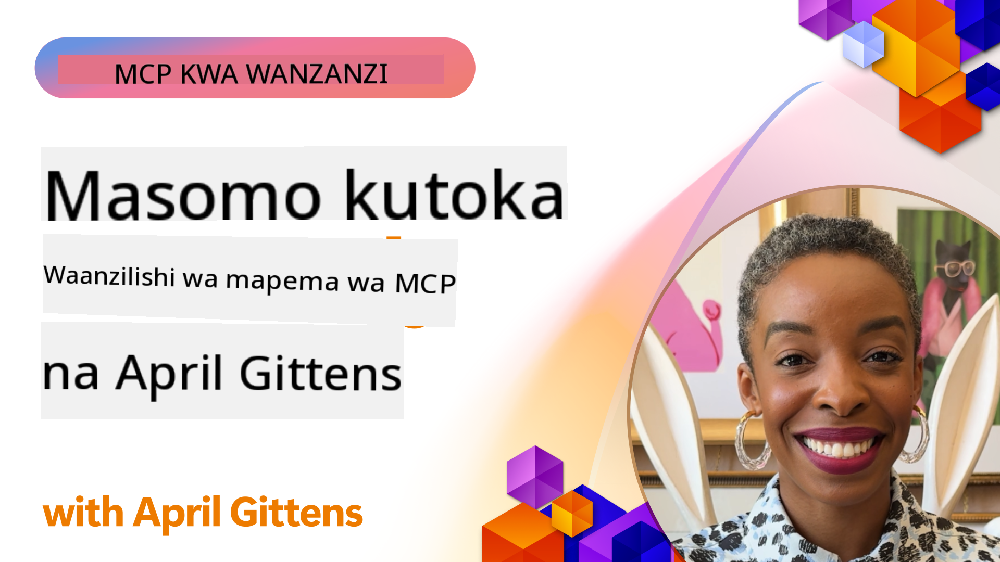

<!--
CO_OP_TRANSLATOR_METADATA:
{
  "original_hash": "41f16dac486d2086a53bc644a01cbe42",
  "translation_date": "2025-08-19T14:27:44+00:00",
  "source_file": "07-LessonsfromEarlyAdoption/README.md",
  "language_code": "sw"
}
-->
# 🌟 Masomo Kutoka kwa Watumiaji wa Awali

[](https://youtu.be/jds7dSmNptE)

_(Bofya picha hapo juu kutazama video ya somo hili)_

## 🎯 Yaliyomo Katika Moduli Hii

Moduli hii inachunguza jinsi mashirika halisi na watengenezaji wanavyotumia Model Context Protocol (MCP) kushughulikia changamoto za kweli na kuendesha ubunifu. Kupitia masomo ya kina ya kesi na miradi ya vitendo, utagundua jinsi MCP inavyowezesha ujumuishaji wa AI ulio salama na unaoweza kupanuka, unaounganisha mifano ya lugha, zana, na data za biashara.

### 📚 Tazama MCP Ikifanya Kazi

Unataka kuona kanuni hizi zikitekelezwa kwenye zana tayari za uzalishaji? Angalia [**MCP Servers 10 za Microsoft Zinazobadilisha Uzalishaji wa Watengenezaji**](microsoft-mcp-servers.md), ambayo inaonyesha MCP servers halisi za Microsoft unazoweza kutumia leo.

## Muhtasari

Somo hili linachunguza jinsi watumiaji wa awali walivyotumia Model Context Protocol (MCP) kushughulikia changamoto za ulimwengu wa kweli na kuendesha ubunifu katika sekta mbalimbali. Kupitia masomo ya kina ya kesi na miradi ya vitendo, utaona jinsi MCP inavyowezesha ujumuishaji wa AI ulio sanifu, salama, na unaoweza kupanuka—unaounganisha mifano mikubwa ya lugha, zana, na data za biashara katika mfumo mmoja. Utapata uzoefu wa vitendo wa kubuni na kujenga suluhisho za msingi wa MCP, kujifunza kutoka kwa mifumo ya utekelezaji iliyothibitishwa, na kugundua mbinu bora za kupeleka MCP katika mazingira ya uzalishaji. Somo pia linaangazia mwelekeo unaoibuka, mwelekeo wa baadaye, na rasilimali za chanzo huria ili kukusaidia kubaki mbele katika teknolojia ya MCP na mfumo wake unaoendelea.

## Malengo ya Kujifunza

- Kuchambua utekelezaji wa MCP wa ulimwengu wa kweli katika sekta mbalimbali  
- Kubuni na kujenga programu kamili za msingi wa MCP  
- Kuchunguza mwelekeo unaoibuka na mwelekeo wa baadaye katika teknolojia ya MCP  
- Kutumia mbinu bora katika hali halisi za maendeleo  

## Utekelezaji wa MCP wa Ulimwengu wa Kweli

### Kesi ya Kwanza: Uboreshaji wa Usaidizi wa Wateja wa Biashara

Kampuni ya kimataifa ilitekeleza suluhisho la msingi wa MCP ili kusanifisha mwingiliano wa AI katika mifumo yao ya usaidizi wa wateja. Hii iliwasaidia:

- Kuunda kiolesura sanifu kwa watoa huduma mbalimbali wa LLM  
- Kudumisha usimamizi wa maelezo sanifu katika idara zote  
- Kutekeleza udhibiti wa usalama na uzingatiaji wa sheria  
- Kubadilisha kwa urahisi kati ya mifano tofauti ya AI kulingana na mahitaji maalum  

**Utekelezaji wa Kiufundi:**

```python
# Python MCP server implementation for customer support
import logging
import asyncio
from modelcontextprotocol import create_server, ServerConfig
from modelcontextprotocol.server import MCPServer
from modelcontextprotocol.transports import create_http_transport
from modelcontextprotocol.resources import ResourceDefinition
from modelcontextprotocol.prompts import PromptDefinition
from modelcontextprotocol.tool import ToolDefinition

# Configure logging
logging.basicConfig(level=logging.INFO)

async def main():
    # Create server configuration
    config = ServerConfig(
        name="Enterprise Customer Support Server",
        version="1.0.0",
        description="MCP server for handling customer support inquiries"
    )
    
    # Initialize MCP server
    server = create_server(config)
    
    # Register knowledge base resources
    server.resources.register(
        ResourceDefinition(
            name="customer_kb",
            description="Customer knowledge base documentation"
        ),
        lambda params: get_customer_documentation(params)
    )
    
    # Register prompt templates
    server.prompts.register(
        PromptDefinition(
            name="support_template",
            description="Templates for customer support responses"
        ),
        lambda params: get_support_templates(params)
    )
    
    # Register support tools
    server.tools.register(
        ToolDefinition(
            name="ticketing",
            description="Create and update support tickets"
        ),
        handle_ticketing_operations
    )
    
    # Start server with HTTP transport
    transport = create_http_transport(port=8080)
    await server.run(transport)

if __name__ == "__main__":
    asyncio.run(main())
```

**Matokeo:** Upunguzaji wa gharama za mifano kwa 30%, uboreshaji wa uthabiti wa majibu kwa 45%, na uzingatiaji ulioboreshwa katika shughuli za kimataifa.

### Kesi ya Pili: Msaidizi wa Uchunguzi wa Afya

Mtoa huduma wa afya alitengeneza miundombinu ya MCP ili kuunganisha mifano mbalimbali ya AI ya matibabu huku wakihakikisha data nyeti ya wagonjwa inalindwa:

- Kubadilisha kwa urahisi kati ya mifano ya matibabu ya jumla na maalum  
- Udhibiti mkali wa faragha na nyayo za ukaguzi  
- Ujumuishaji na mifumo iliyopo ya Rekodi za Kielektroniki za Afya (EHR)  
- Uhandisi wa maelezo sanifu kwa istilahi za matibabu  

**Utekelezaji wa Kiufundi:**

```csharp
// C# MCP host application implementation in healthcare application
using Microsoft.Extensions.DependencyInjection;
using ModelContextProtocol.SDK.Client;
using ModelContextProtocol.SDK.Security;
using ModelContextProtocol.SDK.Resources;

public class DiagnosticAssistant
{
    private readonly MCPHostClient _mcpClient;
    private readonly PatientContext _patientContext;
    
    public DiagnosticAssistant(PatientContext patientContext)
    {
        _patientContext = patientContext;
        
        // Configure MCP client with healthcare-specific settings
        var clientOptions = new ClientOptions
        {
            Name = "Healthcare Diagnostic Assistant",
            Version = "1.0.0",
            Security = new SecurityOptions
            {
                Encryption = EncryptionLevel.Medical,
                AuditEnabled = true
            }
        };
        
        _mcpClient = new MCPHostClientBuilder()
            .WithOptions(clientOptions)
            .WithTransport(new HttpTransport("https://healthcare-mcp.example.org"))
            .WithAuthentication(new HIPAACompliantAuthProvider())
            .Build();
    }
    
    public async Task<DiagnosticSuggestion> GetDiagnosticAssistance(
        string symptoms, string patientHistory)
    {
        // Create request with appropriate resources and tool access
        var resourceRequest = new ResourceRequest
        {
            Name = "patient_records",
            Parameters = new Dictionary<string, object>
            {
                ["patientId"] = _patientContext.PatientId,
                ["requestingProvider"] = _patientContext.ProviderId
            }
        };
        
        // Request diagnostic assistance using appropriate prompt
        var response = await _mcpClient.SendPromptRequestAsync(
            promptName: "diagnostic_assistance",
            parameters: new Dictionary<string, object>
            {
                ["symptoms"] = symptoms,
                patientHistory = patientHistory,
                relevantGuidelines = _patientContext.GetRelevantGuidelines()
            });
            
        return DiagnosticSuggestion.FromMCPResponse(response);
    }
}
```

**Matokeo:** Mapendekezo bora ya uchunguzi kwa madaktari huku yakidumisha uzingatiaji kamili wa HIPAA na kupunguza kwa kiasi kikubwa mabadiliko ya muktadha kati ya mifumo.

### Kesi ya Tatu: Uchambuzi wa Hatari katika Huduma za Kifedha

Taasis ya kifedha ilitekeleza MCP ili kusanifisha michakato yao ya uchambuzi wa hatari katika idara tofauti:

- Kuunda kiolesura sanifu kwa mifano ya hatari ya mikopo, kugundua udanganyifu, na uwekezaji  
- Kutekeleza udhibiti mkali wa ufikiaji na toleo la mifano  
- Kuhakikisha ukaguzi wa mapendekezo yote ya AI  
- Kudumisha muundo wa data sanifu katika mifumo mbalimbali  

**Utekelezaji wa Kiufundi:**

```java
// Java MCP server for financial risk assessment
import org.mcp.server.*;
import org.mcp.security.*;

public class FinancialRiskMCPServer {
    public static void main(String[] args) {
        // Create MCP server with financial compliance features
        MCPServer server = new MCPServerBuilder()
            .withModelProviders(
                new ModelProvider("risk-assessment-primary", new AzureOpenAIProvider()),
                new ModelProvider("risk-assessment-audit", new LocalLlamaProvider())
            )
            .withPromptTemplateDirectory("./compliance/templates")
            .withAccessControls(new SOCCompliantAccessControl())
            .withDataEncryption(EncryptionStandard.FINANCIAL_GRADE)
            .withVersionControl(true)
            .withAuditLogging(new DatabaseAuditLogger())
            .build();
            
        server.addRequestValidator(new FinancialDataValidator());
        server.addResponseFilter(new PII_RedactionFilter());
        
        server.start(9000);
        
        System.out.println("Financial Risk MCP Server running on port 9000");
    }
}
```

**Matokeo:** Uzingatiaji wa sheria ulioboreshwa, mzunguko wa kupeleka mifano kwa kasi ya 40%, na uthabiti wa tathmini ya hatari katika idara zote.

### Kesi ya Nne: Microsoft Playwright MCP Server kwa Uendeshaji wa Kivinjari

Microsoft ilitengeneza [Playwright MCP server](https://github.com/microsoft/playwright-mcp) kuwezesha uendeshaji wa kivinjari ulio salama na sanifu kupitia Model Context Protocol. Server hii tayari kwa uzalishaji inaruhusu mawakala wa AI na LLMs kuingiliana na vivinjari vya wavuti kwa njia iliyodhibitiwa, inayoweza kukaguliwa, na inayoweza kupanuliwa—ikifanikisha matumizi kama vile majaribio ya wavuti yaliyojiendesha, uchimbaji wa data, na michakato ya mwisho hadi mwisho.

> **🎯 Zana Tayari kwa Uzalishaji**  
>  
> Kesi hii inaonyesha MCP server halisi unayoweza kutumia leo! Jifunze zaidi kuhusu Playwright MCP Server na MCP servers nyingine 9 tayari kwa uzalishaji katika [**Mwongozo wa MCP Servers wa Microsoft**](microsoft-mcp-servers.md#8--playwright-mcp-server).

**Vipengele Muhimu:**
- Hutoa uwezo wa uendeshaji wa kivinjari (urambazaji, kujaza fomu, kuchukua picha za skrini, n.k.) kama zana za MCP  
- Hutekeleza udhibiti mkali wa ufikiaji na kuweka kwenye sandbox ili kuzuia vitendo visivyoidhinishwa  
- Hutoa kumbukumbu za ukaguzi za kina kwa mwingiliano wote wa kivinjari  
- Inasaidia ujumuishaji na Azure OpenAI na watoa huduma wengine wa LLM kwa uendeshaji unaoendeshwa na mawakala  
- Inawezesha uwezo wa kuvinjari wa GitHub Copilot's Coding Agent  

**Utekelezaji wa Kiufundi:**

```typescript
// TypeScript: Registering Playwright browser automation tools in an MCP server
import { createServer, ToolDefinition } from 'modelcontextprotocol';
import { launch } from 'playwright';

const server = createServer({
  name: 'Playwright MCP Server',
  version: '1.0.0',
  description: 'MCP server for browser automation using Playwright'
});

// Register a tool for navigating to a URL and capturing a screenshot
server.tools.register(
  new ToolDefinition({
    name: 'navigate_and_screenshot',
    description: 'Navigate to a URL and capture a screenshot',
    parameters: {
      url: { type: 'string', description: 'The URL to visit' }
    }
  }),
  async ({ url }) => {
    const browser = await launch();
    const page = await browser.newPage();
    await page.goto(url);
    const screenshot = await page.screenshot();
    await browser.close();
    return { screenshot };
  }
);

// Start the MCP server
server.listen(8080);
```

**Matokeo:**

- Uendeshaji wa kivinjari wa programu kwa mawakala wa AI na LLMs ulio salama  
- Kupunguza juhudi za majaribio ya mwongozo na kuboresha chanjo ya majaribio kwa programu za wavuti  
- Kutoa mfumo unaoweza kutumika tena na kupanuliwa kwa ujumuishaji wa zana za msingi wa kivinjari katika mazingira ya biashara  
- Inawezesha uwezo wa kuvinjari wa GitHub Copilot  

**Marejeo:**

- [Playwright MCP Server GitHub Repository](https://github.com/microsoft/playwright-mcp)  
- [Microsoft AI and Automation Solutions](https://azure.microsoft.com/en-us/products/ai-services/)  

### Kesi ya Tano: Azure MCP – Model Context Protocol ya Daraja la Biashara kama Huduma

Azure MCP Server ([https://aka.ms/azmcp](https://aka.ms/azmcp)) ni utekelezaji wa Microsoft wa MCP wa daraja la biashara, uliosimamiwa, ulioundwa kutoa uwezo wa server za MCP zinazoweza kupanuka, salama, na zinazozingatia sheria kama huduma ya wingu. Azure MCP inawawezesha mashirika kupeleka, kusimamia, na kuunganisha server za MCP haraka na huduma za Azure AI, data, na usalama, kupunguza mzigo wa uendeshaji na kuharakisha kupitishwa kwa AI.

> **🎯 Zana Tayari kwa Uzalishaji**  
>  
> Hii ni MCP server halisi unayoweza kutumia leo! Jifunze zaidi kuhusu Azure AI Foundry MCP Server katika [**Mwongozo wa MCP Servers wa Microsoft**](microsoft-mcp-servers.md).  

**Vipengele Muhimu:**
- Ukaribishaji wa server za MCP ulio simamiwa kikamilifu na upanuzi wa ndani, ufuatiliaji, na usalama  
- Ujumuishaji wa asili na Azure OpenAI, Azure AI Search, na huduma nyingine za Azure  
- Uthibitishaji wa biashara na idhini kupitia Microsoft Entra ID  
- Msaada kwa zana maalum, violezo vya maelezo, na viunganishi vya rasilimali  
- Uzingatiaji wa mahitaji ya usalama wa biashara na udhibiti wa sheria  

**Utekelezaji wa Kiufundi:**

```yaml
# Example: Azure MCP server deployment configuration (YAML)
apiVersion: mcp.microsoft.com/v1
kind: McpServer
metadata:
  name: enterprise-mcp-server
spec:
  modelProviders:
    - name: azure-openai
      type: AzureOpenAI
      endpoint: https://<your-openai-resource>.openai.azure.com/
      apiKeySecret: <your-azure-keyvault-secret>
  tools:
    - name: document_search
      type: AzureAISearch
      endpoint: https://<your-search-resource>.search.windows.net/
      apiKeySecret: <your-azure-keyvault-secret>
  authentication:
    type: EntraID
    tenantId: <your-tenant-id>
  monitoring:
    enabled: true
    logAnalyticsWorkspace: <your-log-analytics-id>
```

**Matokeo:**  
- Kupunguza muda wa thamani kwa miradi ya AI ya biashara kwa kutoa jukwaa la MCP server lililo tayari kutumika na linalozingatia sheria  
- Kurahisisha ujumuishaji wa LLMs, zana, na vyanzo vya data vya biashara  
- Kuboresha usalama, ufuatiliaji, na ufanisi wa uendeshaji kwa mzigo wa kazi wa MCP  
- Kuboresha ubora wa msimbo kwa kutumia mbinu bora za Azure SDK na mifumo ya uthibitishaji ya sasa  

**Marejeo:**  
- [Azure MCP Documentation](https://aka.ms/azmcp)  
- [Azure MCP Server GitHub Repository](https://github.com/Azure/azure-mcp)  
- [Azure AI Services](https://azure.microsoft.com/en-us/products/ai-services/)  
- [Microsoft MCP Center](https://mcp.azure.com)  
> **🎯 Zana Tayari kwa Uzalishaji**
> 
> Hii ni seva halisi ya MCP unayoweza kutumia leo! Jifunze zaidi kuhusu Seva ya MCP ya Microsoft Learn Docs katika [**Mwongozo wa Seva za MCP za Microsoft**](microsoft-mcp-servers.md#1--microsoft-learn-docs-mcp-server).
**Sifa Muhimu:**
- Ufikiaji wa papo hapo wa nyaraka rasmi za Microsoft, nyaraka za Azure, na nyaraka za Microsoft 365
- Uwezo wa juu wa utafutaji wa kisemantiki unaoelewa muktadha na nia
- Taarifa zinazosasishwa kila wakati kadri maudhui ya Microsoft Learn yanapochapishwa
- Ufunikaji wa kina katika Microsoft Learn, nyaraka za Azure, na vyanzo vya Microsoft 365
- Hutoa vipande vya maudhui vya ubora wa juu hadi 10 pamoja na vichwa vya makala na URL

**Kwa Nini Ni Muhimu:**
- Hutatua tatizo la "maarifa ya AI yaliyopitwa na wakati" kwa teknolojia za Microsoft
- Inahakikisha wasaidizi wa AI wanapata vipengele vya hivi karibuni vya .NET, C#, Azure, na Microsoft 365
- Inatoa taarifa rasmi, ya kuaminika kwa ajili ya kizazi sahihi cha msimbo
- Muhimu kwa watengenezaji wanaofanya kazi na teknolojia za Microsoft zinazobadilika haraka

**Matokeo:**
- Usahihi ulioboreshwa sana wa msimbo unaozalishwa na AI kwa teknolojia za Microsoft
- Kupunguza muda unaotumika kutafuta nyaraka za sasa na mbinu bora
- Kuongeza tija ya watengenezaji kwa upatikanaji wa nyaraka zinazojali muktadha
- Ujumuishaji usio na mshono na mchakato wa kazi wa maendeleo bila kuondoka kwenye IDE

**Marejeleo:**
- [Microsoft Learn Docs MCP Server GitHub Repository](https://github.com/MicrosoftDocs/mcp)
- [Microsoft Learn Documentation](https://learn.microsoft.com/)

## Miradi ya Vitendo

### Mradi 1: Jenga Seva ya MCP ya Watoa Huduma Wengi

**Lengo:** Unda seva ya MCP inayoweza kuelekeza maombi kwa watoa huduma wa mifano ya AI mbalimbali kulingana na vigezo maalum.

**Mahitaji:**

- Iunge mkono angalau watoa huduma watatu tofauti wa mifano (mfano, OpenAI, Anthropic, mifano ya ndani)
- Tekeleza utaratibu wa kuelekeza kulingana na metadata ya maombi
- Unda mfumo wa usanidi wa kusimamia sifa za watoa huduma
- Ongeza mfumo wa kuhifadhi data ili kuboresha utendaji na gharama
- Jenga dashibodi rahisi ya kufuatilia matumizi

**Hatua za Utekelezaji:**

1. Sanidi miundombinu ya msingi ya seva ya MCP
2. Tekeleza adapta za watoa huduma kwa kila huduma ya mfano wa AI
3. Unda mantiki ya kuelekeza kulingana na sifa za maombi
4. Ongeza mifumo ya kuhifadhi data kwa maombi ya mara kwa mara
5. Tengeneza dashibodi ya kufuatilia
6. Fanya majaribio na mifumo mbalimbali ya maombi

**Teknolojia:** Chagua kati ya Python (.NET/Java/Python kulingana na upendeleo wako), Redis kwa kuhifadhi data, na mfumo rahisi wa wavuti kwa dashibodi.

### Mradi 2: Mfumo wa Usimamizi wa Maandishi ya Biashara

**Lengo:** Kuendeleza mfumo wa msingi wa MCP wa kusimamia, kuweka matoleo, na kupeleka violezo vya maandishi katika shirika.

**Mahitaji:**

- Unda hifadhi kuu ya violezo vya maandishi
- Tekeleza mifumo ya kuweka matoleo na mchakato wa idhini
- Jenga uwezo wa kupima violezo kwa pembejeo za mfano
- Tengeneza udhibiti wa ufikiaji kulingana na majukumu
- Unda API ya kupata na kupeleka violezo

**Hatua za Utekelezaji:**

1. Buni mpangilio wa hifadhidata kwa ajili ya kuhifadhi violezo
2. Unda API ya msingi kwa operesheni za CRUD za violezo
3. Tekeleza mfumo wa kuweka matoleo
4. Jenga mchakato wa idhini
5. Tengeneza mfumo wa kupima violezo
6. Unda kiolesura rahisi cha wavuti kwa usimamizi
7. Unganisha na seva ya MCP

**Teknolojia:** Chaguo lako la mfumo wa nyuma, hifadhidata ya SQL au NoSQL, na mfumo wa mbele kwa kiolesura cha usimamizi.

### Mradi 3: Jukwaa la Kizazi cha Maudhui Linalotegemea MCP

**Lengo:** Jenga jukwaa la kizazi cha maudhui linalotumia MCP kutoa matokeo thabiti kwa aina tofauti za maudhui.

**Mahitaji:**

- Iunge mkono miundo mbalimbali ya maudhui (machapisho ya blogu, mitandao ya kijamii, nakala za masoko)
- Tekeleza kizazi kinachotegemea violezo na chaguo za ubinafsishaji
- Unda mfumo wa mapitio na maoni ya maudhui
- Fuatilia vipimo vya utendaji wa maudhui
- Iunge mkono kuweka matoleo na mabadiliko ya maudhui

**Hatua za Utekelezaji:**

1. Sanidi miundombinu ya mteja wa MCP
2. Unda violezo kwa aina tofauti za maudhui
3. Jenga mfumo wa kizazi cha maudhui
4. Tekeleza mfumo wa mapitio
5. Tengeneza mfumo wa kufuatilia vipimo
6. Unda kiolesura cha mtumiaji kwa usimamizi wa violezo na kizazi cha maudhui

**Teknolojia:** Lugha yako unayoipendelea ya programu, mfumo wa wavuti, na mfumo wa hifadhidata.

## Mwelekeo wa Baadaye wa Teknolojia ya MCP

### Mwelekeo Unaibuka

1. **MCP ya Njia Nyingi**
   - Upanuzi wa MCP ili kusanifisha mwingiliano na mifano ya picha, sauti, na video
   - Maendeleo ya uwezo wa kufikiri kati ya njia tofauti
   - Miundo sanifu ya maandishi kwa njia tofauti

2. **Miundombinu ya MCP ya Shirikishi**
   - Mitandao ya MCP iliyosambazwa inayoweza kushiriki rasilimali kati ya mashirika
   - Itifaki sanifu za kushiriki mifano kwa usalama
   - Mbinu za kompyuta zinazohifadhi faragha

3. **Masoko ya MCP**
   - Mifumo ya kushiriki na kupata mapato kutoka kwa violezo na programu-jalizi za MCP
   - Michakato ya uhakikisho wa ubora na vyeti
   - Ujumuishaji na masoko ya mifano

4. **MCP kwa Kompyuta ya Edge**
   - Marekebisho ya viwango vya MCP kwa vifaa vya ukingo vilivyo na rasilimali chache
   - Itifaki zilizoboreshwa kwa mazingira ya kipimo data cha chini
   - Utekelezaji maalum wa MCP kwa mifumo ya IoT

5. **Mifumo ya Udhibiti**
   - Maendeleo ya viendelezi vya MCP kwa ajili ya kufuata kanuni
   - Njia sanifu za ukaguzi na violesura vya kuelezea
   - Ujumuishaji na mifumo inayoibuka ya usimamizi wa AI

### Suluhisho za MCP kutoka Microsoft

Microsoft na Azure zimeunda hifadhi kadhaa za chanzo huria kusaidia watengenezaji kutekeleza MCP katika hali mbalimbali:

#### Shirika la Microsoft

1. [playwright-mcp](https://github.com/microsoft/playwright-mcp) - Seva ya MCP ya Playwright kwa ajili ya kiotomatiki cha kivinjari na majaribio
2. [files-mcp-server](https://github.com/microsoft/files-mcp-server) - Utekelezaji wa seva ya MCP ya OneDrive kwa majaribio ya ndani na michango ya jamii
3. [NLWeb](https://github.com/microsoft/NlWeb) - NLWeb ni mkusanyiko wa itifaki wazi na zana zinazohusiana za chanzo huria. Lengo lake kuu ni kuanzisha safu ya msingi kwa Wavuti ya AI

#### Shirika la Azure-Samples

1. [mcp](https://github.com/Azure-Samples/mcp) - Viungo vya sampuli, zana, na rasilimali za kujenga na kuunganisha seva za MCP kwenye Azure kwa kutumia lugha mbalimbali
2. [mcp-auth-servers](https://github.com/Azure-Samples/mcp-auth-servers) - Seva za MCP za marejeleo zinazoonyesha uthibitishaji na vipimo vya sasa vya Model Context Protocol
3. [remote-mcp-functions](https://github.com/Azure-Samples/remote-mcp-functions) - Ukurasa wa kutua kwa utekelezaji wa Seva za MCP za Mbali katika Azure Functions na viungo kwa hifadhi maalum za lugha
4. [remote-mcp-functions-python](https://github.com/Azure-Samples/remote-mcp-functions-python) - Kiolezo cha kuanza haraka kwa kujenga na kupeleka seva za MCP za mbali kwa kutumia Azure Functions na Python
5. [remote-mcp-functions-dotnet](https://github.com/Azure-Samples/remote-mcp-functions-dotnet) - Kiolezo cha kuanza haraka kwa kujenga na kupeleka seva za MCP za mbali kwa kutumia Azure Functions na .NET/C#
6. [remote-mcp-functions-typescript](https://github.com/Azure-Samples/remote-mcp-functions-typescript) - Kiolezo cha kuanza haraka kwa kujenga na kupeleka seva za MCP za mbali kwa kutumia Azure Functions na TypeScript
7. [remote-mcp-apim-functions-python](https://github.com/Azure-Samples/remote-mcp-apim-functions-python) - Azure API Management kama Lango la AI kwa seva za MCP za Mbali kwa kutumia Python
8. [AI-Gateway](https://github.com/Azure-Samples/AI-Gateway) - Majaribio ya APIM ❤️ AI ikiwa ni pamoja na uwezo wa MCP, kuunganisha na Azure OpenAI na AI Foundry

Hifadhi hizi hutoa utekelezaji mbalimbali, violezo, na rasilimali za kufanya kazi na Model Context Protocol katika lugha tofauti za programu na huduma za Azure. Zinashughulikia hali mbalimbali za matumizi kuanzia utekelezaji wa seva za msingi hadi uthibitishaji, upelekaji wa wingu, na hali za ujumuishaji wa biashara.

#### Saraka ya Rasilimali za MCP

Saraka ya [MCP Resources](https://github.com/microsoft/mcp/tree/main/Resources) katika hifadhi rasmi ya Microsoft MCP inatoa mkusanyiko wa sampuli za rasilimali, violezo vya maandishi, na ufafanuzi wa zana kwa matumizi na seva za Model Context Protocol. Saraka hii imeundwa kusaidia watengenezaji kuanza haraka na MCP kwa kutoa vipengele vya kujengwa upya na mifano bora ya mazoezi kwa:

- **Violezo vya Maandishi:** Violezo vya maandishi vilivyotayarishwa kwa kazi za kawaida za AI na hali, ambavyo vinaweza kubadilishwa kwa utekelezaji wako wa seva ya MCP.
- **Ufafanuzi wa Zana:** Mifano ya miundo ya zana na metadata ili kusanifisha ujumuishaji wa zana na uanzishaji katika seva tofauti za MCP.
- **Sampuli za Rasilimali:** Mifano ya ufafanuzi wa rasilimali kwa kuunganisha na vyanzo vya data, API, na huduma za nje ndani ya mfumo wa MCP.
- **Utekelezaji wa Marejeleo:** Sampuli za vitendo zinazoonyesha jinsi ya kuunda na kupanga rasilimali, maandishi, na zana katika miradi halisi ya MCP.

Rasilimali hizi zinaharakisha maendeleo, kukuza usanifishaji, na kusaidia kuhakikisha mazoea bora wakati wa kujenga na kupeleka suluhisho za msingi za MCP.

#### Saraka ya Rasilimali za MCP

- [MCP Resources (Sample Prompts, Tools, and Resource Definitions)](https://github.com/microsoft/mcp/tree/main/Resources)

### Fursa za Utafiti

- Mbinu bora za uboreshaji wa maandishi ndani ya mifumo ya MCP
- Miundo ya usalama kwa ajili ya upelekaji wa MCP wa wateja wengi
- Upimaji wa utendaji kati ya utekelezaji tofauti wa MCP
- Mbinu za uthibitishaji rasmi kwa seva za MCP

## Hitimisho

Model Context Protocol (MCP) inaunda haraka mustakabali wa ujumuishaji wa AI uliosanifishwa, salama, na unaoweza kushirikiana katika sekta mbalimbali. Kupitia masomo ya kesi na miradi ya vitendo katika somo hili, umeona jinsi watumiaji wa awali—ikiwa ni pamoja na Microsoft na Azure—wanavyotumia MCP kutatua changamoto za ulimwengu halisi, kuharakisha upitishaji wa AI, na kuhakikisha uzingatiaji, usalama, na uwezo wa kupanuka. Mbinu ya moduli ya MCP inawawezesha mashirika kuunganisha mifano mikubwa ya lugha, zana, na data za biashara katika mfumo mmoja, unaoweza kukaguliwa. Kadri MCP inavyoendelea kubadilika, kushiriki na jamii, kuchunguza rasilimali za chanzo huria, na kutumia mazoea bora kutakuwa muhimu kwa kujenga suluhisho thabiti, tayari kwa siku zijazo za AI.

## Rasilimali za Ziada

- [MCP Foundry GitHub Repository](https://github.com/azure-ai-foundry/mcp-foundry)
- [Foundry MCP Playground](https://github.com/azure-ai-foundry/foundry-mcp-playground)
- [Integrating Azure AI Agents with MCP (Microsoft Foundry Blog)](https://devblogs.microsoft.com/foundry/integrating-azure-ai-agents-mcp/)
- [MCP GitHub Repository (Microsoft)](https://github.com/microsoft/mcp)
- [MCP Resources Directory (Sample Prompts, Tools, and Resource Definitions)](https://github.com/microsoft/mcp/tree/main/Resources)
- [MCP Community & Documentation](https://modelcontextprotocol.io/introduction)
- [Azure MCP Documentation](https://aka.ms/azmcp)
- [Playwright MCP Server GitHub Repository](https://github.com/microsoft/playwright-mcp)
- [Files MCP Server (OneDrive)](https://github.com/microsoft/files-mcp-server)
- [Azure-Samples MCP](https://github.com/Azure-Samples/mcp)
- [MCP Auth Servers (Azure-Samples)](https://github.com/Azure-Samples/mcp-auth-servers)
- [Remote MCP Functions (Azure-Samples)](https://github.com/Azure-Samples/remote-mcp-functions)
- [Remote MCP Functions Python (Azure-Samples)](https://github.com/Azure-Samples/remote-mcp-functions-python)
- [Remote MCP Functions .NET (Azure-Samples)](https://github.com/Azure-Samples/remote-mcp-functions-dotnet)
- [Remote MCP Functions TypeScript (Azure-Samples)](https://github.com/Azure-Samples/remote-mcp-functions-typescript)
- [Remote MCP APIM Functions Python (Azure-Samples)](https://github.com/Azure-Samples/remote-mcp-apim-functions-python)
- [AI-Gateway (Azure-Samples)](https://github.com/Azure-Samples/AI-Gateway)
- [Microsoft AI and Automation Solutions](https://azure.microsoft.com/en-us/products/ai-services/)

## Mazoezi

1. Changanua moja ya masomo ya kesi na pendekeza mbinu mbadala ya utekelezaji.
2. Chagua moja ya mawazo ya mradi na unda maelezo ya kiufundi ya kina.
3. Fanya utafiti wa sekta ambayo haijashughulikiwa katika masomo ya kesi na eleza jinsi MCP inaweza kushughulikia changamoto zake maalum.
4. Chunguza moja ya mwelekeo wa baadaye na unda dhana ya kiendelezi kipya cha MCP ili kuunga mkono. 

Ifuatayo: [Microsoft MCP Server](../07-LessonsfromEarlyAdoption/microsoft-mcp-servers.md)

**Kanusho**:  
Hati hii imetafsiriwa kwa kutumia huduma ya tafsiri ya AI [Co-op Translator](https://github.com/Azure/co-op-translator). Ingawa tunajitahidi kuhakikisha usahihi, tafadhali fahamu kuwa tafsiri za kiotomatiki zinaweza kuwa na makosa au kutokuwa sahihi. Hati ya asili katika lugha yake ya awali inapaswa kuzingatiwa kama chanzo cha mamlaka. Kwa taarifa muhimu, inashauriwa kutumia huduma ya tafsiri ya kibinadamu ya kitaalamu. Hatutawajibika kwa maelewano mabaya au tafsiri zisizo sahihi zinazotokana na matumizi ya tafsiri hii.