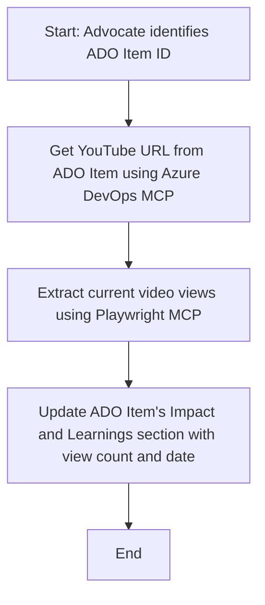

<!--
CO_OP_TRANSLATOR_METADATA:
{
  "original_hash": "14a2dfbea55ef735660a06bd6bdfe5f3",
  "translation_date": "2025-06-13T21:37:47+00:00",
  "source_file": "09-CaseStudy/UpdateADOItemsFromYT.md",
  "language_code": "sw"
}
-->
# Case Study: Kusasisha Vipengele vya Azure DevOps Kutoka Data ya YouTube kwa MCP

> **Disclaimer:** Kuna zana na ripoti zilizopo mtandaoni zinazoweza kuendesha mchakato wa kusasisha vipengele vya Azure DevOps kwa data kutoka majukwaa kama YouTube. Hali ifuatayo imetolewa kama mfano tu wa matumizi ili kuonyesha jinsi zana za MCP zinaweza kutumika kwa kazi za uendeshaji otomatiki na ushirikiano.

## Muhtasari

Utafiti huu wa kesi unaonyesha mfano mmoja wa jinsi Model Context Protocol (MCP) na zana zake zinaweza kutumika kuendesha mchakato wa kusasisha vipengele vya kazi vya Azure DevOps (ADO) kwa taarifa zinazotokana na majukwaa ya mtandaoni, kama YouTube. Hali iliyobainishwa ni mfano mmoja tu wa uwezo mpana wa zana hizi, ambazo zinaweza kubadilishwa kwa mahitaji mengi ya uendeshaji otomatiki yanayofanana.

Katika mfano huu, Mwakilishi anafuatilia vikao vya mtandaoni kwa kutumia vipengele vya ADO, ambapo kila kipengele kina URL ya video ya YouTube. Kwa kutumia zana za MCP, Mwakilishi anaweza kuweka vipengele vya ADO hadi tarehe na takwimu za hivi karibuni za video, kama idadi ya watazamaji, kwa njia inayoweza kurudiwa na otomatiki. Njia hii inaweza kutumika kwa matumizi mengine ambapo taarifa kutoka vyanzo vya mtandaoni zinahitajika kuunganishwa na ADO au mifumo mingine.

## Hali

Mwakilishi anahusika na kufuatilia athari za vikao vya mtandaoni na ushirikiano wa jamii. Kila kikao kinaandikwa kama kipengele cha kazi cha ADO katika mradi wa 'DevRel', na kipengele hicho kina sehemu ya URL ya video ya YouTube. Ili kutoa ripoti sahihi ya wigo wa kikao, Mwakilishi anahitaji kusasisha kipengele cha ADO kwa idadi ya sasa ya watazamaji wa video na tarehe ambayo taarifa hii ilipatikana.

## Zana Zilizotumika

- [Azure DevOps MCP](https://github.com/microsoft/azure-devops-mcp): Inaruhusu upatikanaji wa programu na masasisho ya vipengele vya kazi vya ADO kupitia MCP.
- [Playwright MCP](https://github.com/microsoft/playwright-mcp): Inautomatia hatua za kivinjari kuchukua data ya moja kwa moja kutoka kurasa za wavuti, kama takwimu za video za YouTube.

## Mchakato Hatua kwa Hatua

1. **Tambua Kipengele cha ADO**: Anza na ID ya kipengele cha kazi cha ADO (mfano, 1234) katika mradi wa 'DevRel'.
2. **Pata URL ya YouTube**: Tumia zana ya Azure DevOps MCP kupata URL ya YouTube kutoka kwa kipengele cha kazi.
3. **Chukua Idadi ya Watazamaji wa Video**: Tumia zana ya Playwright MCP kuvinjari URL ya YouTube na kuchukua idadi ya sasa ya watazamaji.
4. **Sasisha Kipengele cha ADO**: Andika idadi ya hivi karibuni ya watazamaji na tarehe ya upatikanaji katika sehemu ya 'Impact and Learnings' ya kipengele cha kazi cha ADO kwa kutumia zana ya Azure DevOps MCP.

## Mfano wa Ombi

```bash
- Work with the ADO Item ID: 1234
- The project is '2025-Awesome'
- Get the YouTube URL for the ADO item
- Use Playwright to get the current views from the YouTube video
- Update the ADO item with the current video views and the updated date of the information
```

## Mchoro wa Mtiririko wa Mermaid



## Utekelezaji wa Kiufundi

- **Uendeshaji wa MCP**: Mchakato unaendeshwa na seva ya MCP, inayoratibu matumizi ya zana za Azure DevOps MCP na Playwright MCP.
- **Uendeshaji Otomatiki**: Mchakato unaweza kuanzishwa kwa mkono au kupanga ili uendeshwe mara kwa mara kuweka vipengele vya ADO hadi tarehe.
- **Uwezo wa Kupanua**: Mfano huu unaweza kupanuliwa kusasisha vipengele vya ADO kwa takwimu nyingine za mtandaoni (mfano, likes, maoni) au kutoka majukwaa mengine.

## Matokeo na Athari

- **Ufanisi**: Kupunguza juhudi za mkono kwa Mawakilishi kwa kuendesha upatikanaji na usasishaji wa takwimu za video kwa njia otomatiki.
- **Usahihi**: Kuhakikisha vipengele vya ADO vinaonyesha data ya hivi karibuni inayopatikana kutoka vyanzo vya mtandaoni.
- **Kurudiwa**: Kutoa mchakato unaoweza kutumika tena kwa hali zinazofanana zinazohusisha vyanzo vingine vya data au takwimu.

## Marejeleo

- [Azure DevOps MCP](https://github.com/microsoft/azure-devops-mcp)
- [Playwright MCP](https://github.com/microsoft/playwright-mcp)
- [Model Context Protocol (MCP)](https://modelcontextprotocol.io/)

**Kiarifu**:  
Hati hii imetafsiriwa kwa kutumia huduma ya tafsiri ya AI [Co-op Translator](https://github.com/Azure/co-op-translator). Ingawa tunajitahidi kwa usahihi, tafadhali fahamu kwamba tafsiri za kiotomatiki zinaweza kuwa na makosa au kasoro. Hati ya asili katika lugha yake ya asili inapaswa kuchukuliwa kama chanzo cha mamlaka. Kwa taarifa muhimu, tafsiri ya kitaalamu ya binadamu inapendekezwa. Hatubeba dhamana kwa kutoelewana au tafsiri potofu zitokanazo na matumizi ya tafsiri hii.