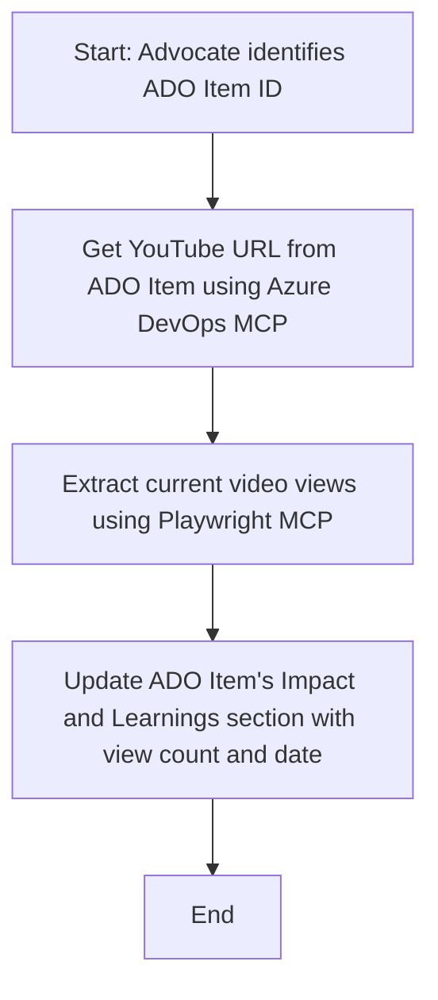

<!--
CO_OP_TRANSLATOR_METADATA:
{
  "original_hash": "14a2dfbea55ef735660a06bd6bdfe5f3",
  "translation_date": "2025-07-14T06:14:38+00:00",
  "source_file": "09-CaseStudy/UpdateADOItemsFromYT.md",
  "language_code": "sw"
}
-->
# Case Study: Kusasisha Vitu vya Azure DevOps Kutoka Data ya YouTube kwa MCP

> **Disclaimer:** Kuna zana na ripoti za mtandaoni zilizopo ambazo zinaweza kuendesha mchakato wa kusasisha vitu vya Azure DevOps kwa data kutoka kwenye majukwaa kama YouTube. Mfano ufuatao umetolewa kama kesi ya matumizi tu kuonyesha jinsi zana za MCP zinavyoweza kutumika kwa kazi za uendeshaji na muunganisho.

## Muhtasari

Kesi hii inaonyesha mfano mmoja wa jinsi Model Context Protocol (MCP) na zana zake zinavyoweza kutumika kuendesha mchakato wa kusasisha vitu vya kazi vya Azure DevOps (ADO) kwa taarifa zinazopatikana kutoka majukwaa ya mtandaoni, kama YouTube. Hali iliyotajwa ni mfano mmoja tu wa uwezo mpana wa zana hizi, ambazo zinaweza kubadilishwa kwa mahitaji mengine ya uendeshaji yanayofanana.

Katika mfano huu, Msimamizi anafuatilia vikao vya mtandaoni kwa kutumia vitu vya ADO, ambapo kila kitu kina URL ya video ya YouTube. Kwa kutumia zana za MCP, Msimamizi anaweza kuweka vitu vya ADO kuwa vya kisasa kwa takwimu za video kama idadi ya maoni, kwa njia inayoweza kurudiwa na kiotomatiki. Njia hii inaweza kutumika kwa matumizi mengine ambapo taarifa kutoka vyanzo vya mtandaoni zinahitaji kuunganishwa kwenye ADO au mifumo mingine.

## Hali ya Kesi

Msimamizi anahusika na kufuatilia athari za vikao vya mtandaoni na ushirikiano wa jamii. Kila kikao kinaandikwa kama kitu cha kazi cha ADO katika mradi wa 'DevRel', na kitu cha kazi kina sehemu ya URL ya video ya YouTube. Ili kutoa ripoti sahihi ya usambazaji wa kikao, Msimamizi anahitaji kusasisha kitu cha ADO kwa idadi ya sasa ya maoni ya video na tarehe taarifa hii ilipatikana.

## Zana Zinazotumika

- [Azure DevOps MCP](https://github.com/microsoft/azure-devops-mcp): Inaruhusu upatikanaji wa programu na masasisho ya vitu vya kazi vya ADO kupitia MCP.
- [Playwright MCP](https://github.com/microsoft/playwright-mcp): Inaendesha vitendo vya kivinjari kuondoa data ya moja kwa moja kutoka kwenye kurasa za wavuti, kama takwimu za video za YouTube.

## Mchakato Hatua kwa Hatua

1. **Tambua Kitu cha ADO**: Anza na kitambulisho cha kitu cha kazi cha ADO (mfano, 1234) katika mradi wa 'DevRel'.
2. **Pata URL ya YouTube**: Tumia zana ya Azure DevOps MCP kupata URL ya YouTube kutoka kwenye kitu cha kazi.
3. **Chukua Idadi ya Maoni ya Video**: Tumia zana ya Playwright MCP kuvinjari URL ya YouTube na kutoa idadi ya sasa ya maoni.
4. **Sasisha Kitu cha ADO**: Andika idadi ya maoni ya hivi karibuni na tarehe ya upatikanaji katika sehemu ya 'Impact and Learnings' ya kitu cha kazi cha ADO kwa kutumia zana ya Azure DevOps MCP.

## Mfano wa Amri

```bash
- Work with the ADO Item ID: 1234
- The project is '2025-Awesome'
- Get the YouTube URL for the ADO item
- Use Playwright to get the current views from the YouTube video
- Update the ADO item with the current video views and the updated date of the information
```

## Mchoro wa Mtiririko wa Mermaid



## Utekelezaji wa Kiufundi

- **Uendeshaji wa MCP**: Mchakato unaendeshwa na seva ya MCP, inayoratibu matumizi ya zana za Azure DevOps MCP na Playwright MCP.
- **Uendeshaji wa Kiotomatiki**: Mchakato unaweza kuanzishwa kwa mkono au kupanga kuendeshwa kwa vipindi ili kuweka vitu vya ADO kuwa vya kisasa.
- **Uwezo wa Kupanua**: Mfano huu unaweza kupanuliwa kusasisha vitu vya ADO kwa takwimu nyingine za mtandaoni (mfano, idadi ya likes, maoni) au kutoka majukwaa mengine.

## Matokeo na Athari

- **Ufanisi**: Kupunguza juhudi za mikono kwa Wasimamizi kwa kuendesha upatikanaji na usasishaji wa takwimu za video kiotomatiki.
- **Usahihi**: Kuhakikisha vitu vya ADO vinaonyesha data ya hivi karibuni inayopatikana kutoka vyanzo vya mtandaoni.
- **Kurudiwa**: Kutoa mchakato unaoweza kutumika tena kwa hali zinazofanana zinazohusisha vyanzo vingine vya data au takwimu.

## Marejeleo

- [Azure DevOps MCP](https://github.com/microsoft/azure-devops-mcp)
- [Playwright MCP](https://github.com/microsoft/playwright-mcp)
- [Model Context Protocol (MCP)](https://modelcontextprotocol.io/)

**Kiarifu cha Kutotegemea**:  
Hati hii imetafsiriwa kwa kutumia huduma ya tafsiri ya AI [Co-op Translator](https://github.com/Azure/co-op-translator). Ingawa tunajitahidi kwa usahihi, tafadhali fahamu kwamba tafsiri za kiotomatiki zinaweza kuwa na makosa au upungufu wa usahihi. Hati ya asili katika lugha yake ya asili inapaswa kuchukuliwa kama chanzo cha mamlaka. Kwa taarifa muhimu, tafsiri ya kitaalamu inayofanywa na binadamu inapendekezwa. Hatubebei dhamana kwa kutoelewana au tafsiri potofu zinazotokana na matumizi ya tafsiri hii.