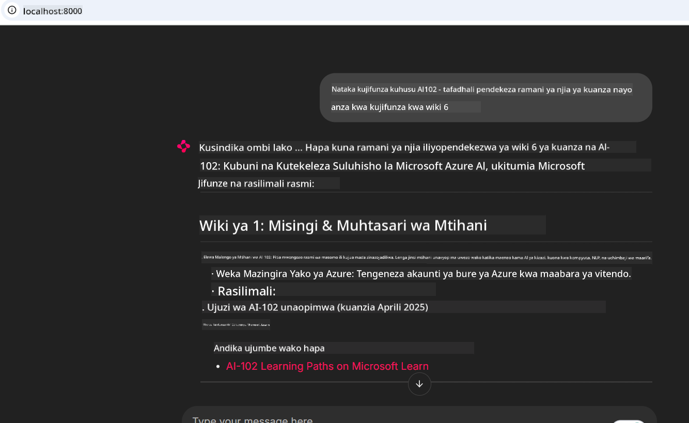

<!--
CO_OP_TRANSLATOR_METADATA:
{
  "original_hash": "4319d291c9d124ecafea52b3d04bfa0e",
  "translation_date": "2025-07-14T06:28:01+00:00",
  "source_file": "09-CaseStudy/docs-mcp/README.md",
  "language_code": "sw"
}
-->
# Uchunguzi wa Kesi: Kuunganishwa na Microsoft Learn Docs MCP Server kutoka kwa Mteja

Je, umewahi kujikuta ukitafuta kati ya tovuti za nyaraka, Stack Overflow, na tabo zisizoisha za injini za utafutaji, huku ukijaribu kutatua tatizo kwenye msimbo wako? Labda unatumia monitor ya pili kwa ajili ya nyaraka pekee, au unabadilisha mara kwa mara kati ya IDE yako na kivinjari. Je, singekuwa bora ikiwa ungeweza kuleta nyaraka moja kwa moja kwenye mtiririko wako wa kazi—zikijumuishwa kwenye programu zako, IDE yako, au hata zana zako za kawaida? Katika uchunguzi huu wa kesi, tutaangalia jinsi ya kufanya hivyo kwa kuunganishwa moja kwa moja na Microsoft Learn Docs MCP server kutoka kwa programu yako ya mteja.

## Muhtasari

Maendeleo ya kisasa siyo tu kuandika msimbo—ni kuhusu kupata taarifa sahihi kwa wakati unaofaa. Nyaraka zipo kila mahali, lakini mara chache zinapatikana pale unaponahitaji zaidi: ndani ya zana na mtiririko wako wa kazi. Kwa kuingiza upatikanaji wa nyaraka moja kwa moja kwenye programu zako, unaweza kuokoa muda, kupunguza kubadilisha muktadha, na kuongeza ufanisi. Katika sehemu hii, tutakuonyesha jinsi ya kuunganisha mteja na Microsoft Learn Docs MCP server, ili upate nyaraka za wakati halisi, zinazozingatia muktadha, bila kuondoka kwenye programu yako.

Tutapitia hatua za kuanzisha muunganisho, kutuma ombi, na kushughulikia majibu yanayotiririka kwa ufanisi. Njia hii si tu huondoa usumbufu katika mtiririko wako wa kazi bali pia hufungua mlango wa kujenga zana za maendeleo zenye akili zaidi na msaada zaidi.

## Malengo ya Kujifunza

Kwa nini tunafanya hivi? Kwa sababu uzoefu bora wa mtengenezaji ni ule unaoondoa vikwazo. Fikiria dunia ambapo mhariri wako wa msimbo, chatbot, au programu ya wavuti inaweza kujibu maswali yako ya nyaraka mara moja, ikitumia maudhui ya hivi karibuni kutoka Microsoft Learn. Mwishoni mwa sura hii, utajua jinsi ya:

- Kuelewa misingi ya mawasiliano kati ya MCP server na mteja kwa nyaraka
- Kutekeleza programu ya console au wavuti kuunganishwa na Microsoft Learn Docs MCP server
- Kutumia wateja wa HTTP wanaotiririsha kwa ajili ya upatikanaji wa nyaraka za wakati halisi
- Kurekodi na kufasiri majibu ya nyaraka katika programu yako

Utaona jinsi ujuzi huu utakavyokusaidia kujenga zana ambazo si tu zinajibu, bali ni za kweli kuingiliana na zinaelewa muktadha.

## Hali ya Kesi 1 - Upataji wa Nyaraka za Wakati Halisi kwa MCP

Katika hali hii, tutakuonyesha jinsi ya kuunganisha mteja na Microsoft Learn Docs MCP server, ili upate nyaraka za wakati halisi, zinazozingatia muktadha, bila kuondoka kwenye programu yako.

Tuweke hili kwenye vitendo. Kazi yako ni kuandika programu inayounganisha na Microsoft Learn Docs MCP server, kuitisha zana ya `microsoft_docs_search`, na kurekodi majibu yanayotiririka kwenye console.

### Kwa nini njia hii?
Kwa sababu ni msingi wa kujenga muunganisho wa hali ya juu—iwe unataka kuendesha chatbot, kiendelezi cha IDE, au dashibodi ya wavuti.

Utapata msimbo na maelekezo ya hali hii katika folda ya [`solution`](./solution/README.md) ndani ya uchunguzi huu wa kesi. Hatua zitakuongoza katika kuanzisha muunganisho:
- Tumia MCP SDK rasmi na mteja wa HTTP unaoweza kutiririsha kwa muunganisho
- Ita zana ya `microsoft_docs_search` na parameteri ya utafutaji kupata nyaraka
- Tekeleza kurekodi sahihi na kushughulikia makosa
- Tengeneza kiolesura cha console kinachowezesha watumiaji kuingiza maswali mengi ya utafutaji

Hali hii inaonyesha jinsi ya:
- Kuungana na Docs MCP server
- Kutuma ombi la utafutaji
- Kuchambua na kuchapisha matokeo

Hivi ndivyo suluhisho linavyoweza kuonekana linapotekelezwa:

```
Prompt> What is Azure Key Vault?
Answer> Azure Key Vault is a cloud service for securely storing and accessing secrets. ...
```

Hapo chini ni mfano mdogo wa suluhisho. Msimbo kamili na maelezo yapo katika folda ya suluhisho.

<details>
<summary>Python</summary>

```python
import asyncio
from mcp.client.streamable_http import streamablehttp_client
from mcp import ClientSession

async def main():
    async with streamablehttp_client("https://learn.microsoft.com/api/mcp") as (read_stream, write_stream, _):
        async with ClientSession(read_stream, write_stream) as session:
            await session.initialize()
            result = await session.call_tool("microsoft_docs_search", {"query": "Azure Functions best practices"})
            print(result.content)

if __name__ == "__main__":
    asyncio.run(main())
```

- Kwa utekelezaji kamili na kurekodi, angalia [`scenario1.py`](../../../../09-CaseStudy/docs-mcp/solution/python/scenario1.py).
- Kwa maelekezo ya usakinishaji na matumizi, angalia faili la [`README.md`](./solution/python/README.md) katika folda hiyo hiyo.
</details>

## Hali ya Kesi 2 - Programu ya Wavuti ya Kizazi cha Mpango wa Masomo Inayoshirikiana na MCP

Katika hali hii, utajifunza jinsi ya kuingiza Docs MCP kwenye mradi wa maendeleo ya wavuti. Lengo ni kuwezesha watumiaji kutafuta nyaraka za Microsoft Learn moja kwa moja kutoka kwenye kiolesura cha wavuti, na kufanya nyaraka zipatikane mara moja ndani ya programu yako au tovuti.

Utaona jinsi ya:
- Kuanzisha programu ya wavuti
- Kuungana na Docs MCP server
- Kushughulikia maingizo ya mtumiaji na kuonyesha matokeo

Hivi ndivyo suluhisho linavyoweza kuonekana linapotekelezwa:

```
User> I want to learn about AI102 - so suggest the roadmap to get it started from learn for 6 weeks

Assistant> Here’s a detailed 6-week roadmap to start your preparation for the AI-102: Designing and Implementing a Microsoft Azure AI Solution certification, using official Microsoft resources and focusing on exam skills areas:

---
## Week 1: Introduction & Fundamentals
- **Understand the Exam**: Review the [AI-102 exam skills outline](https://learn.microsoft.com/en-us/credentials/certifications/exams/ai-102/).
- **Set up Azure**: Sign up for a free Azure account if you don't have one.
- **Learning Path**: [Introduction to Azure AI services](https://learn.microsoft.com/en-us/training/modules/intro-to-azure-ai/)
- **Focus**: Get familiar with Azure portal, AI capabilities, and necessary tools.

....more weeks of the roadmap...

Let me know if you want module-specific recommendations or need more customized weekly tasks!
```

Hapo chini ni mfano mdogo wa suluhisho. Msimbo kamili na maelezo yapo katika folda ya suluhisho.



<details>
<summary>Python (Chainlit)</summary>

Chainlit ni mfumo wa kujenga programu za wavuti za AI zinazozungumza. Hufanya iwe rahisi kuunda chatbots na wasaidizi wanaoweza kuitisha zana za MCP na kuonyesha matokeo kwa wakati halisi. Ni bora kwa majaribio ya haraka na violesura vinavyopendeza kwa watumiaji.

```python
import chainlit as cl
import requests

MCP_URL = "https://learn.microsoft.com/api/mcp"

@cl.on_message
def handle_message(message):
    query = {"question": message}
    response = requests.post(MCP_URL, json=query)
    if response.ok:
        result = response.json()
        cl.Message(content=result.get("answer", "No answer found.")).send()
    else:
        cl.Message(content="Error: " + response.text).send()
```

- Kwa utekelezaji kamili, angalia [`scenario2.py`](../../../../09-CaseStudy/docs-mcp/solution/python/scenario2.py).
- Kwa maelekezo ya usanidi na kuendesha, angalia [`README.md`](./solution/python/README.md).
</details>

## Hali ya Kesi 3: Nyaraka Ndani ya Mhariri na MCP Server katika VS Code

Ikiwa unataka kupata Microsoft Learn Docs moja kwa moja ndani ya VS Code (badala ya kubadilisha tabo za kivinjari), unaweza kutumia MCP server ndani ya mhariri wako. Hii inakuwezesha:
- Kutafuta na kusoma nyaraka ndani ya VS Code bila kuondoka kwenye mazingira yako ya kuandika msimbo.
- Kurejelea nyaraka na kuingiza viungo moja kwa moja kwenye README au faili za kozi.
- Kutumia GitHub Copilot na MCP pamoja kwa mtiririko wa kazi wa nyaraka unaotumia AI kwa urahisi.

**Utaona jinsi ya:**
- Kuongeza faili halali `.vscode/mcp.json` kwenye mzizi wa eneo lako la kazi (angalia mfano hapa chini).
- Kufungua paneli ya MCP au kutumia orodha ya amri katika VS Code kutafuta na kuingiza nyaraka.
- Kurejelea nyaraka moja kwa moja katika faili zako za markdown unapoendelea na kazi.
- Kuchanganya mtiririko huu na GitHub Copilot kwa ufanisi zaidi.

Hapa kuna mfano wa jinsi ya kusanidi MCP server katika VS Code:

```json
{
  "servers": {
    "LearnDocsMCP": {
      "url": "https://learn.microsoft.com/api/mcp"
    }
  }
}
```

</details>

> Kwa mwongozo wa kina wenye picha na hatua kwa hatua, angalia [`README.md`](./solution/scenario3/README.md).


Njia hii ni bora kwa yeyote anayeunda kozi za kiufundi, kuandika nyaraka, au kuendeleza msimbo unaohitaji marejeleo mara kwa mara.

## Muhimu wa Kumbuka

Kuunganisha nyaraka moja kwa moja kwenye zana zako siyo tu urahisi—ni mabadiliko makubwa kwa ufanisi. Kwa kuunganishwa na Microsoft Learn Docs MCP server kutoka kwa mteja wako, unaweza:

- Kuondoa kubadilisha muktadha kati ya msimbo na nyaraka
- Kupata nyaraka za kisasa, zinazozingatia muktadha kwa wakati halisi
- Kujenga zana za maendeleo zenye akili zaidi na zinazojibu kwa ufanisi

Ujuzi huu utakusaidia kuunda suluhisho ambazo si tu zinafanya kazi vizuri, bali pia ni za kufurahisha kutumia.

## Rasilimali Zaidi

Ili kuongeza uelewa wako, chunguza rasilimali rasmi hizi:

- [Microsoft Learn Docs MCP Server (GitHub)](https://github.com/MicrosoftDocs/mcp)
- [Anza na Azure MCP Server (mcp-python)](https://learn.microsoft.com/en-us/azure/developer/azure-mcp-server/get-started#create-the-python-app)
- [Azure MCP Server ni Nini?](https://learn.microsoft.com/en-us/azure/developer/azure-mcp-server/)
- [Utangulizi wa Model Context Protocol (MCP)](https://modelcontextprotocol.io/introduction)
- [Ongeza plugins kutoka MCP Server (Python)](https://learn.microsoft.com/en-us/semantic-kernel/concepts/plugins/adding-mcp-plugins)

**Kiarifu cha Kutotegemea**:  
Hati hii imetafsiriwa kwa kutumia huduma ya tafsiri ya AI [Co-op Translator](https://github.com/Azure/co-op-translator). Ingawa tunajitahidi kwa usahihi, tafadhali fahamu kwamba tafsiri za kiotomatiki zinaweza kuwa na makosa au upungufu wa usahihi. Hati ya asili katika lugha yake ya asili inapaswa kuchukuliwa kama chanzo cha mamlaka. Kwa taarifa muhimu, tafsiri ya kitaalamu inayofanywa na binadamu inapendekezwa. Hatubebei dhamana kwa kutoelewana au tafsiri potofu zinazotokana na matumizi ya tafsiri hii.