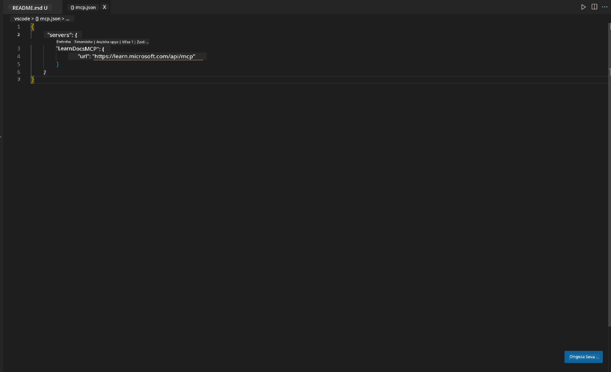
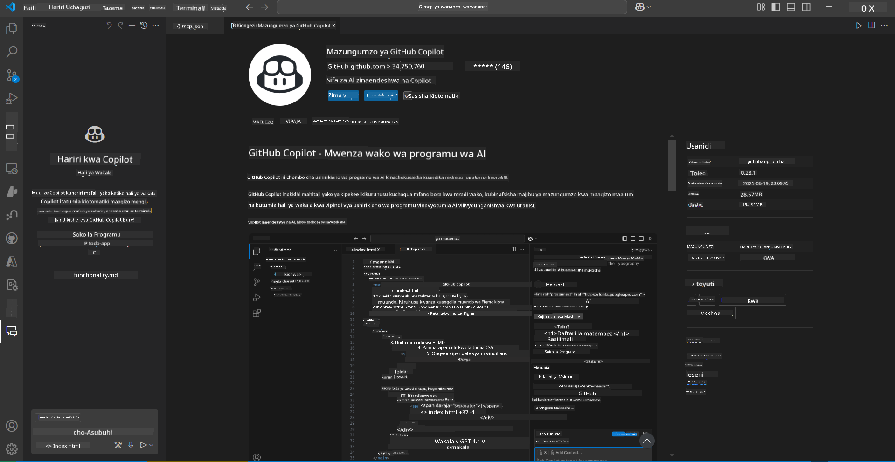
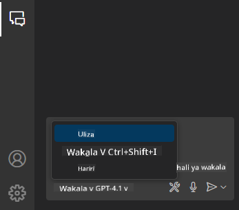
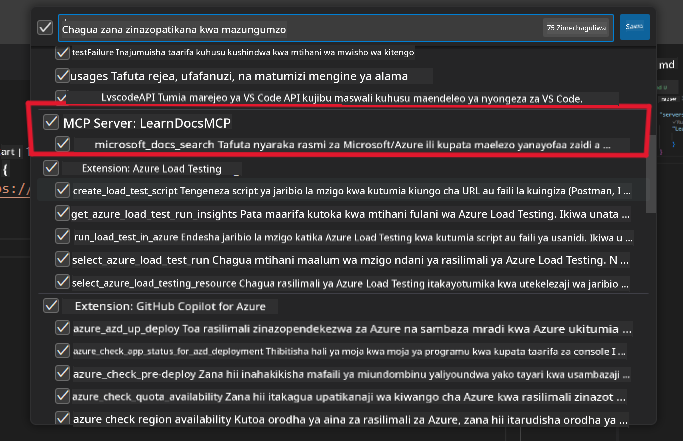
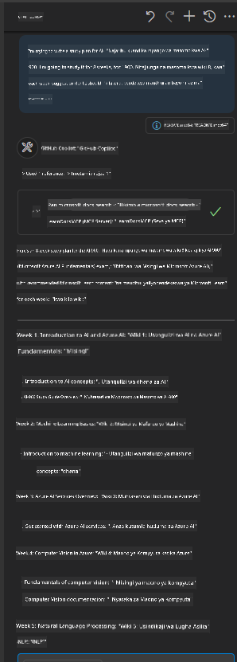
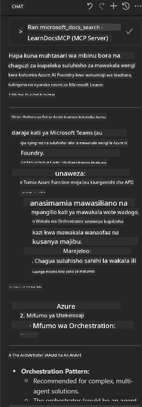

<!--
CO_OP_TRANSLATOR_METADATA:
{
  "original_hash": "db532b1ec386c9ce38c791653dc3c881",
  "translation_date": "2025-07-14T06:54:46+00:00",
  "source_file": "09-CaseStudy/docs-mcp/solution/scenario3/README.md",
  "language_code": "sw"
}
-->
# Scenario 3: Nyaraka Ndani ya Mhariri kwa MCP Server katika VS Code

## Muhtasari

Katika hali hii, utajifunza jinsi ya kuleta Microsoft Learn Docs moja kwa moja ndani ya mazingira yako ya Visual Studio Code kwa kutumia MCP server. Badala ya kubadilisha tabo za kivinjari kila mara kutafuta nyaraka, unaweza kufikia, kutafuta, na kurejelea nyaraka rasmi moja kwa moja ndani ya mhariri wako. Njia hii huongeza ufanisi wa kazi yako, inakuweka makini, na kuwezesha muunganisho mzuri na zana kama GitHub Copilot.

- Tafuta na soma nyaraka ndani ya VS Code bila kuondoka kwenye mazingira yako ya kuandika msimbo.
- Rejelea nyaraka na weka viungo moja kwa moja kwenye README au faili za kozi zako.
- Tumia GitHub Copilot na MCP pamoja kwa mtiririko wa kazi unaotumia AI kwa urahisi.

## Malengo ya Kujifunza

Mwisho wa sura hii, utaelewa jinsi ya kusanidi na kutumia MCP server ndani ya VS Code ili kuboresha mtiririko wako wa nyaraka na maendeleo. Utaweza:

- Sanidi eneo lako la kazi kutumia MCP server kwa ajili ya kutafuta nyaraka.
- Tafuta na weka nyaraka moja kwa moja kutoka ndani ya VS Code.
- Changanya nguvu ya GitHub Copilot na MCP kwa mtiririko wa kazi wenye tija zaidi unaosaidiwa na AI.

Ujuzi huu utakusaidia kubaki makini, kuboresha ubora wa nyaraka, na kuongeza tija yako kama msanidi au mwandishi wa kiufundi.

## Suluhisho

Ili kupata ufikiaji wa nyaraka ndani ya mhariri, utafuata hatua kadhaa zinazounganisha MCP server na VS Code pamoja na GitHub Copilot. Suluhisho hili ni bora kwa waandishi wa kozi, waandishi wa nyaraka, na wasanidi wanaotaka kubaki makini ndani ya mhariri wakati wakifanya kazi na nyaraka na Copilot.

- Ongeza viungo vya rejeleo haraka kwenye README wakati wa kuandika kozi au nyaraka za mradi.
- Tumia Copilot kuunda msimbo na MCP kupata na kutaja nyaraka zinazohusiana mara moja.
- Bakia makini ndani ya mhariri wako na ongeza tija.

### Mwongozo wa Hatua kwa Hatua

Ili kuanza, fuata hatua hizi. Kwa kila hatua, unaweza kuongeza picha kutoka kwenye folda ya assets kuonyesha mchakato kwa njia ya kuona.

1. **Ongeza usanidi wa MCP:**
   Katika mzizi wa mradi wako, tengeneza faili `.vscode/mcp.json` na ongeza usanidi ufuatao:
   ```json
   {
     "servers": {
       "LearnDocsMCP": {
         "url": "https://learn.microsoft.com/api/mcp"
       }
     }
   }
   ```
   Usanidi huu unaeleza VS Code jinsi ya kuunganishwa na [`Microsoft Learn Docs MCP server`](https://github.com/MicrosoftDocs/mcp).
   
   
    
2. **Fungua paneli ya GitHub Copilot Chat:**
   Ikiwa bado huna ugani wa GitHub Copilot umewekwa, nenda kwenye sehemu ya Extensions ndani ya VS Code na uweke. Unaweza kuipakua moja kwa moja kutoka [Visual Studio Code Marketplace](https://marketplace.visualstudio.com/items?itemName=GitHub.copilot-chat). Kisha, fungua paneli ya Copilot Chat kutoka kwenye sidebar.

   

3. **Washa mode ya agent na hakiki zana:**
   Katika paneli ya Copilot Chat, washa mode ya agent.

   

   Baada ya kuwasha mode ya agent, hakiki kuwa MCP server imeorodheshwa kama moja ya zana zinazopatikana. Hii inahakikisha kuwa agent wa Copilot anaweza kufikia server ya nyaraka kupata taarifa zinazohitajika.
   
   
4. **Anza mazungumzo mapya na omba msaada kutoka kwa agent:**
   Fungua mazungumzo mapya katika paneli ya Copilot Chat. Sasa unaweza kumuuliza agent maswali yako kuhusu nyaraka. Agent atatumia MCP server kupata na kuonyesha nyaraka zinazohusiana za Microsoft Learn moja kwa moja ndani ya mhariri wako.

   - *"Najaribu kuandika mpango wa masomo kwa mada X. Nitajifunza kwa wiki 8, kwa kila wiki, pendekeza maudhui ninayopaswa kuchukua."*

   

5. **Uchunguzi wa Moja kwa Moja:**

   > Hebu tuchukue uchunguzi wa moja kwa moja kutoka sehemu ya [#get-help](https://discord.gg/D6cRhjHWSC) katika Azure AI Foundry Discord ([tazama ujumbe wa asili](https://discord.com/channels/1113626258182504448/1385498306720829572)):
   
   *"Natafuta majibu juu ya jinsi ya kupeleka suluhisho la mawakala wengi lenye mawakala wa AI waliotengenezwa kwenye Azure AI Foundry. Naona hakuna njia ya moja kwa moja ya kupeleka, kama vile njia za Copilot Studio. Basi, ni njia gani tofauti za kufanya upeleka huu kwa watumiaji wa biashara kuingiliana na kufanikisha kazi?
Kuna makala nyingi/blogu zinazosema tunaweza kutumia huduma ya Azure Bot kufanya kazi hii ambayo inaweza kutumika kama daraja kati ya MS Teams na Azure AI Foundry Agents, je, hii itafanya kazi ikiwa nitasanidi bot ya Azure inayounganisha na Orchestrator Agent kwenye Azure AI Foundry kupitia Azure function kufanya upangaji au nahitaji kuunda Azure function kwa kila wakala wa AI katika suluhisho la mawakala wengi kufanya upangaji kwenye Bot framework? Mapendekezo mengine yanakaribishwa sana."*

   

   Agent atajibu kwa viungo vya nyaraka zinazohusiana na muhtasari, ambavyo unaweza kisha kuingiza moja kwa moja kwenye faili zako za markdown au kutumia kama rejeleo katika msimbo wako.
   
### Maswali ya Mfano

Hapa kuna baadhi ya maswali ya mfano unayoweza kujaribu. Maswali haya yataonyesha jinsi MCP server na Copilot vinaweza kufanya kazi pamoja kutoa nyaraka na rejeleo za haraka, zenye muktadha, bila kuondoka VS Code:

- "Nionyeshe jinsi ya kutumia vichocheo vya Azure Functions."
- "Weka kiungo cha nyaraka rasmi za Azure Key Vault."
- "Ni mbinu bora za kulinda rasilimali za Azure ni zipi?"
- "Tafuta mwongozo wa kuanza haraka kwa huduma za Azure AI."

Maswali haya yataonyesha jinsi MCP server na Copilot vinaweza kufanya kazi pamoja kutoa nyaraka na rejeleo za haraka, zenye muktadha, bila kuondoka VS Code.

---

**Kiarifu cha Kutotegemea**:  
Hati hii imetafsiriwa kwa kutumia huduma ya tafsiri ya AI [Co-op Translator](https://github.com/Azure/co-op-translator). Ingawa tunajitahidi kwa usahihi, tafadhali fahamu kwamba tafsiri za kiotomatiki zinaweza kuwa na makosa au upungufu wa usahihi. Hati ya asili katika lugha yake ya asili inapaswa kuchukuliwa kama chanzo cha mamlaka. Kwa taarifa muhimu, tafsiri ya kitaalamu inayofanywa na binadamu inapendekezwa. Hatubebei dhamana kwa kutoelewana au tafsiri potofu zinazotokana na matumizi ya tafsiri hii.