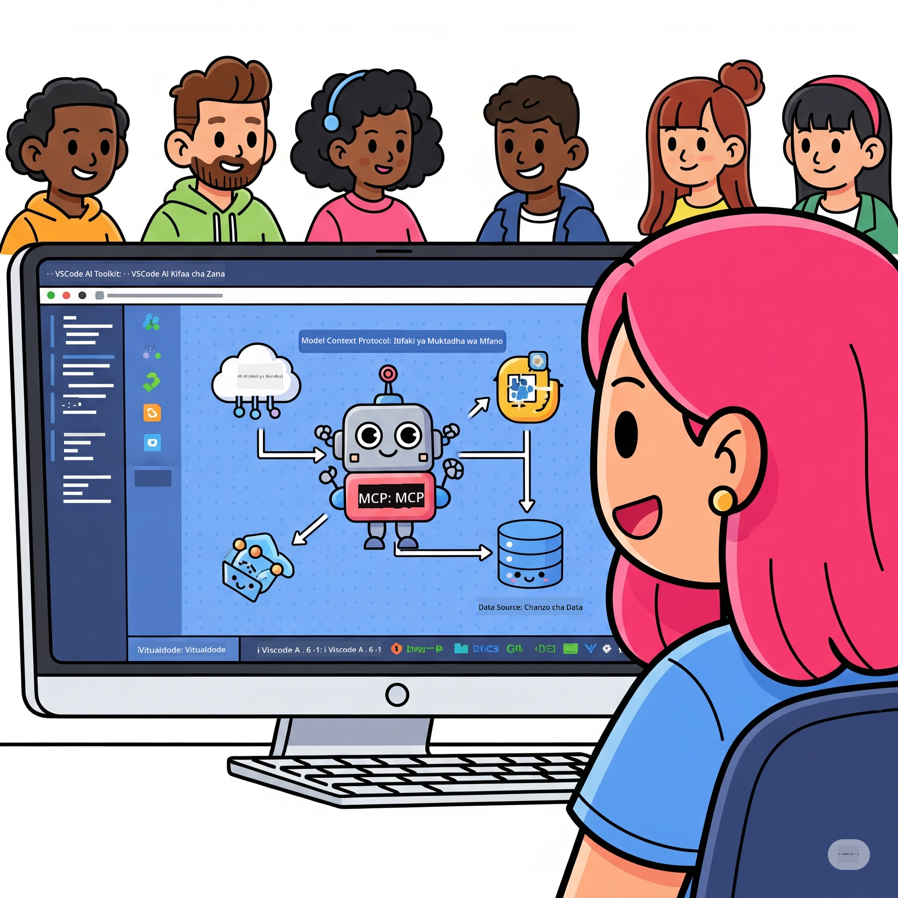

<!--
CO_OP_TRANSLATOR_METADATA:
{
  "original_hash": "787440926586cd064b0899fd1c514f52",
  "translation_date": "2025-06-10T05:02:49+00:00",
  "source_file": "10-StreamliningAIWorkflowsBuildingAnMCPServerWithAIToolkit/README.md",
  "language_code": "sw"
}
-->
# Kuboresha Mipango ya AI: Kujenga Server ya MCP kwa AI Toolkit

## 🎯 Muhtasari

Karibu kwenye **Warsha ya Model Context Protocol (MCP)**! Warsha hii ya vitendo inachanganya teknolojia mbili za kisasa kuboresha maendeleo ya programu za AI:

- **🔗 Model Context Protocol (MCP)**: Kiwango wazi cha kuunganisha zana za AI kwa urahisi
- **🛠️ AI Toolkit kwa Visual Studio Code (AITK)**: Kiongezi chenye nguvu cha maendeleo ya AI kutoka Microsoft

### 🎓 Utajifunza Nini

Mwisho wa warsha hii, utakuwa mtaalamu wa kujenga programu za akili zinazounganisha modeli za AI na zana na huduma halisi. Kuanzia upimaji wa moja kwa moja hadi muunganisho wa API maalum, utapata ujuzi wa kutatua changamoto za biashara ngumu.

## 🏗️ Teknolojia Zinazotumika

### 🔌 Model Context Protocol (MCP)

MCP ni **"USB-C ya AI"** - kiwango cha ulimwengu kinachounganisha modeli za AI na zana na vyanzo vya data vya nje.

**✨ Sifa Muhimu:**
- 🔄 **Muunganisho wa Kiwango**: Kiolesura cha kawaida kwa muunganisho wa zana za AI
- 🏛️ **Mimambo Inayobadilika**: Server za ndani na za mbali kupitia stdio/SSE
- 🧰 **Ecosystem Tajiri**: Zana, maelekezo, na rasilimali zote ndani ya itifaki moja
- 🔒 **Tayari kwa Biashara**: Usalama na kuaminika vilivyojengwa ndani

**🎯 Kwa Nini MCP ni Muhimu:**
Kama vile USB-C ilivyopunguza machafuko ya nyaya, MCP inafanikisha kuondoa ugumu wa muunganisho wa AI. Itifaki moja, fursa zisizo na kikomo.

### 🤖 AI Toolkit kwa Visual Studio Code (AITK)

Kiongezi kikuu cha maendeleo ya AI cha Microsoft kinachobadilisha VS Code kuwa kituo cha nguvu cha AI.

**🚀 Uwezo Msingi:**
- 📦 **Katalogi ya Modeli**: Upatikanaji wa modeli kutoka Azure AI, GitHub, Hugging Face, Ollama
- ⚡ **Utambuzi wa Ndani**: Uendeshaji ulioimarishwa kwa CPU/GPU/NPU kwa ONNX
- 🏗️ **Mjenzi wa Wakala**: Ujenzi wa mawakala wa AI kwa picha na muunganisho wa MCP
- 🎭 **Msaada wa Multi-Modal**: Nakala, picha, na matokeo yaliyoandaliwa

**💡 Manufaa ya Maendeleo:**
- Uanzishaji wa modeli bila usumbufu
- Uhandisi wa maelekezo kwa picha
- Eneo la majaribio la wakati halisi
- Muunganisho laini wa server za MCP

## 📚 Safari ya Kujifunza

### [🚀 Moduli 1: Misingi ya AI Toolkit](./lab1/README.md)
**Muda**: Dakika 15
- 🛠️ Sakinisha na sanifu AI Toolkit kwa VS Code
- 🗂️ Chunguza Katalogi ya Modeli (modeli 100+ kutoka GitHub, ONNX, OpenAI, Anthropic, Google)
- 🎮 Jifunze kutumia Eneo la Majaribio la Moja kwa Moja
- 🤖 Jenga wakala wako wa kwanza wa AI kwa Agent Builder
- 📊 Pima utendaji wa modeli kwa vipimo vilivyojengwa (F1, umuhimu, ufanano, muendelezo)
- ⚡ Jifunze usindikaji wa kundi na msaada wa multi-modal

**🎯 Matokeo ya Kujifunza**: Tengeneza wakala wa AI unaofanya kazi kwa uelewa kamili wa uwezo wa AITK

### [🌐 Moduli 2: MCP na Misingi ya AI Toolkit](./lab2/README.md)
**Muda**: Dakika 20
- 🧠 Fahamu usanifu na dhana za Model Context Protocol (MCP)
- 🌐 Chunguza mazingira ya server za MCP za Microsoft
- 🤖 Jenga wakala wa otomatiki wa kivinjari kwa kutumia Playwright MCP server
- 🔧 Unganisha server za MCP na AI Toolkit Agent Builder
- 📊 Sanifu na jaribu zana za MCP ndani ya mawakala yako
- 🚀 Hamisha na tuma mawakala yanayotumia nguvu ya MCP kwa matumizi ya uzalishaji

**🎯 Matokeo ya Kujifunza**: Tumia wakala wa AI aliyeimarishwa na zana za nje kupitia MCP

### [🔧 Moduli 3: Maendeleo ya Juu ya MCP na AI Toolkit](./lab3/README.md)
**Muda**: Dakika 20
- 💻 Tengeneza server za MCP maalum kwa kutumia AI Toolkit
- 🐍 Sanifu na tumia MCP Python SDK ya hivi karibuni (v1.9.3)
- 🔍 Sanidi na tumia MCP Inspector kwa uchunguzi wa makosa
- 🛠️ Jenga Server ya Hali ya Hewa ya MCP kwa mbinu za kitaalamu za uchunguzi
- 🧪 Fanya uchunguzi wa server za MCP katika mazingira ya Agent Builder na Inspector

**🎯 Matokeo ya Kujifunza**: Tengeneza na fanyia uchunguzi server za MCP maalum kwa zana za kisasa

### [🐙 Moduli 4: Maendeleo ya Vitendo ya MCP - Server Maalum ya GitHub Clone](./lab4/README.md)
**Muda**: Dakika 30
- 🏗️ Jenga Server halisi ya GitHub Clone MCP kwa michakato ya maendeleo
- 🔄 Tekeleza kunakili hifadhidata kwa busara na uthibitisho wa makosa
- 📁 Tengeneza usimamizi wa saraka kwa akili na muunganisho wa VS Code
- 🤖 Tumia GitHub Copilot Agent Mode na zana maalum za MCP
- 🛡️ Tumia uaminifu wa viwanda na usaidizi wa majukwaa mbalimbali

**🎯 Matokeo ya Kujifunza**: Tumia server ya MCP inayostahili uzalishaji inayorahisisha michakato halisi ya maendeleo

## 💡 Matumizi Halisi na Athari

### 🏢 Matumizi ya Biashara

#### 🔄 Uendeshaji wa DevOps
Badilisha mtiririko wako wa maendeleo kwa otomatiki yenye akili:
- **Usimamizi Mwerevu wa Hifadhidata**: Mapitio ya msimbo na maamuzi ya kuunganisha kwa AI
- **CI/CD Mwerevu**: Uboreshaji wa mchakato wa moja kwa moja kulingana na mabadiliko ya msimbo
- **Uainishaji wa Masuala**: Uainishaji wa hitilafu na ugawaji wa kazi moja kwa moja

#### 🧪 Mapinduzi ya Udhibiti wa Ubora
Boresha upimaji kwa otomatiki ya AI:
- **Uundaji wa Vipimo vya Kitaalamu**: Tengeneza suite za majaribio kwa moja kwa moja
- **Upimaji wa Mabadiliko ya Visual**: Kugundua mabadiliko ya UI kwa AI
- **Ufuatiliaji wa Utendaji**: Kugundua na kutatua matatizo mapema

#### 📊 Akili katika Mipangilio ya Data
Jenga mitiririko bora ya usindikaji data:
- **Mchakato wa ETL unaobadilika**: Mabadiliko ya data yanayojiboresha yenyewe
- **Ugunduzi wa Tofauti**: Ufuatiliaji wa ubora wa data kwa wakati halisi
- **Usimamizi Mwerevu wa Mtiririko**: Usimamizi wa mtiririko wa data kwa busara

#### 🎧 Kuboresha Uzoefu wa Wateja
Tengeneza mwingiliano bora na wateja:
- **Msaada Unaojali Muktadha**: Wakala wa AI wenye ufikiaji wa historia ya mteja
- **Utatuzi wa Masuala kwa Mbele**: Huduma za wateja zinazotabiri matatizo
- **Muunganisho wa Njia Nyingi**: Uzoefu wa AI uliounganishwa kwenye majukwaa yote

## 🛠️ Mahitaji na Usanidi

### 💻 Mahitaji ya Mfumo

| Sehemu | Mahitaji | Maelezo |
|-----------|-------------|-------|
| **Mfumo wa Uendeshaji** | Windows 10+, macOS 10.15+, Linux | Mfumo wowote wa kisasa |
| **Visual Studio Code** | Toleo thabiti la hivi karibuni | Inahitajika kwa AITK |
| **Node.js** | v18.0+ na npm | Kwa maendeleo ya server za MCP |
| **Python** | 3.10+ | Hiari kwa server za MCP za Python |
| **Kumbukumbu** | RAM 8GB angalau | Inapendekezwa 16GB kwa modeli za ndani |

### 🔧 Mazingira ya Maendeleo

#### Upanuzi wa VS Code Unaopendekezwa
- **AI Toolkit** (ms-windows-ai-studio.windows-ai-studio)
- **Python** (ms-python.python)
- **Python Debugger** (ms-python.debugpy)
- **GitHub Copilot** (GitHub.copilot) - Hiari lakini inasaidia

#### Zana Za Hiari
- **uv**: Meneja wa kisasa wa vifurushi vya Python
- **MCP Inspector**: Zana ya uchunguzi wa makosa kwa server za MCP
- **Playwright**: Kwa mifano ya otomatiki ya wavuti

## 🎖️ Matokeo ya Kujifunza na Njia ya Cheti

### 🏆 Orodha ya Ujuzi wa Kitaalamu

Kwa kukamilisha warsha hii, utakuwa mtaalamu wa:

#### 🎯 Ujuzi Msingi
- [ ] **Uwezo wa Itifaki ya MCP**: Uelewa wa kina wa usanifu na mifumo ya utekelezaji
- [ ] **Utaalamu wa AITK**: Matumizi ya kitaalamu ya AI Toolkit kwa maendeleo ya haraka
- [ ] **Maendeleo ya Server Maalum**: Kujenga, kutuma, na kudumisha server za MCP kwa uzalishaji
- [ ] **Ubora wa Muunganisho wa Zana**: Kuunganisha AI kwa urahisi na mitiririko ya maendeleo iliyopo
- [ ] **Matumizi ya Ujuzi Kutatua Changamoto**: Kutumia ujuzi uliopatikana kwa changamoto halisi za biashara

#### 🔧 Ujuzi wa Kiufundi
- [ ] Sanidi na tumia AI Toolkit katika VS Code
- [ ] Tengeneza na sanifu server za MCP maalum
- [ ] Unganisha Modeli za GitHub na usanifu wa MCP
- [ ] Jenga mitiririko ya upimaji wa moja kwa moja kwa Playwright
- [ ] Tuma mawakala wa AI kwa matumizi ya uzalishaji
- [ ] Fanyia uchunguzi na boresha utendaji wa server za MCP

#### 🚀 Uwezo wa Juu
- [ ] Panga usanifu wa muunganisho wa AI wa kiwango cha biashara
- [ ] Tekeleza mbinu bora za usalama kwa programu za AI
- [ ] Buni usanifu wa server za MCP unaoweza kupanuka
- [ ] Tengeneza minyororo ya zana maalum kwa maeneo fulani
- [ ] Fundisha wengine katika maendeleo ya AI asilia

## 📖 Rasilimali Zaidi
- [MCP Specification](https://modelcontextprotocol.io/docs)
- [AI Toolkit GitHub Repository](https://github.com/microsoft/vscode-ai-toolkit)
- [Sample MCP Servers Collection](https://github.com/modelcontextprotocol/servers)
- [Best Practices Guide](https://modelcontextprotocol.io/docs/best-practices)

---

**🚀 Tayari kubadilisha njia unavyofanya maendeleo ya AI?**

Tujenge pamoja mustakabali wa programu za akili kwa MCP na AI Toolkit!

**Kisahili Translation:**

**Kangisho:**  
Hati hii imetafsiriwa kwa kutumia huduma ya utafsiri ya AI [Co-op Translator](https://github.com/Azure/co-op-translator). Ingawa tunajitahidi kufanikisha usahihi, tafadhali fahamu kwamba tafsiri za kiotomatiki zinaweza kuwa na makosa au upungufu wa usahihi. Hati ya asili katika lugha yake ya asili inapaswa kuzingatiwa kama chanzo halali. Kwa taarifa muhimu, tafsiri ya kitaalamu inayofanywa na binadamu inapendekezwa. Hatubeba dhamana yoyote kwa kutoelewana au tafsiri potofu zinazotokana na matumizi ya tafsiri hii.