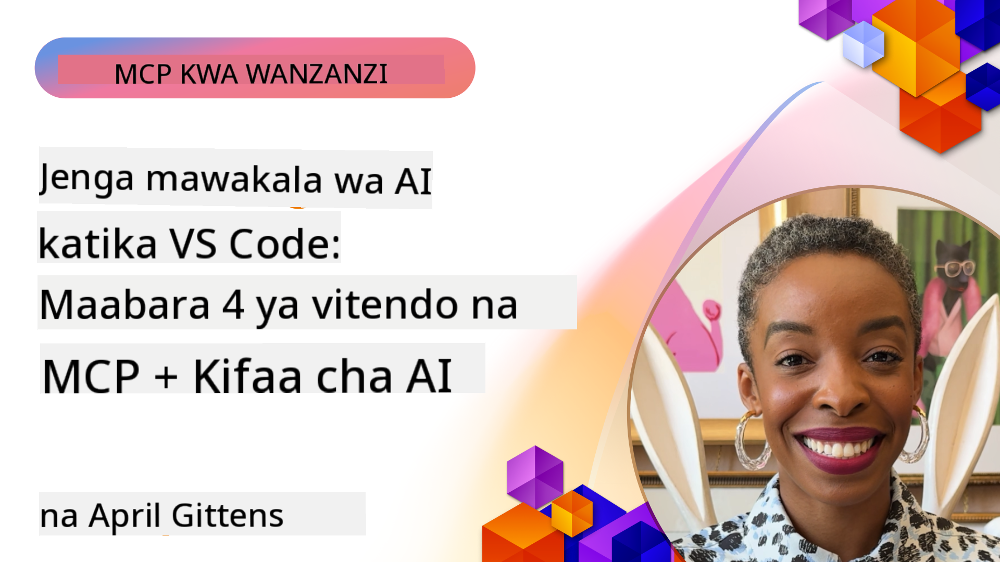

<!--
CO_OP_TRANSLATOR_METADATA:
{
  "original_hash": "1b000fd6e1b04c047578bfc5d07d54eb",
  "translation_date": "2025-08-18T19:09:52+00:00",
  "source_file": "10-StreamliningAIWorkflowsBuildingAnMCPServerWithAIToolkit/README.md",
  "language_code": "sw"
}
-->
# Kuwezesha Mifumo ya AI: Kujenga Seva ya MCP kwa Kutumia AI Toolkit

## 🎯 Muhtasari

_(Bofya picha hapo juu kutazama video ya somo hili)_

Karibu kwenye **Warsha ya Model Context Protocol (MCP)**! Warsha hii ya vitendo inachanganya teknolojia mbili za kisasa ili kubadilisha jinsi programu za AI zinavyotengenezwa:

- **🔗 Model Context Protocol (MCP)**: Kiwango cha wazi kwa ushirikiano wa zana za AI bila mshono
- **🛠️ AI Toolkit kwa Visual Studio Code (AITK)**: Kiendelezi chenye nguvu cha Microsoft kwa maendeleo ya AI

### 🎓 Unachojifunza

Ifikapo mwisho wa warsha hii, utakuwa na ujuzi wa kujenga programu za akili za bandia zinazounganisha mifano ya AI na zana na huduma za ulimwengu halisi. Kuanzia majaribio ya kiotomatiki hadi ujumuishaji wa API maalum, utapata ujuzi wa vitendo wa kutatua changamoto ngumu za biashara.

## 🏗️ Teknolojia Zinazotumika

### 🔌 Model Context Protocol (MCP)

MCP ni **"USB-C ya AI"** - kiwango cha ulimwengu kinachounganisha mifano ya AI na vyanzo vya data na zana za nje.

**✨ Vipengele Muhimu:**

- 🔄 **Ujumuishaji wa Kawaida**: Kiolesura cha ulimwengu kwa miunganisho ya zana za AI
- 🏛️ **Miundo Inayobadilika**: Seva za ndani na za mbali kupitia usafirishaji wa stdio/SSE
- 🧰 **Mfumo Tajiri**: Zana, maelekezo, na rasilimali zote katika itifaki moja
- 🔒 **Tayari kwa Biashara**: Usalama na uaminifu vilivyojengwa ndani

**🎯 Kwa Nini MCP Ni Muhimu:**
Kama vile USB-C ilivyomaliza machafuko ya nyaya, MCP inamaliza ugumu wa ujumuishaji wa AI. Itifaki moja, uwezekano usio na kikomo.

### 🤖 AI Toolkit kwa Visual Studio Code (AITK)

Kiendelezi cha Microsoft kwa maendeleo ya AI kinachogeuza VS Code kuwa kituo cha nguvu cha AI.

**🚀 Uwezo wa Msingi:**

- 📦 **Katalogi ya Mifano**: Pata mifano kutoka Azure AI, GitHub, Hugging Face, Ollama
- ⚡ **Utekelezaji wa Ndani**: Uboreshaji wa ONNX kwa CPU/GPU/NPU
- 🏗️ **Mjenzi wa Mawakala**: Maendeleo ya mawakala wa AI kwa kutumia ujumuishaji wa MCP
- 🎭 **Msaada wa Aina Nyingi**: Maandishi, maono, na matokeo yaliyopangwa

**💡 Faida za Maendeleo:**

- Utekelezaji wa mifano bila usanidi
- Uhandisi wa maelekezo wa kuona
- Uwanja wa majaribio wa wakati halisi
- Ujumuishaji wa seva ya MCP bila mshono

## 📚 Safari ya Kujifunza

### [🚀 Moduli ya 1: Misingi ya AI Toolkit](./lab1/README.md)

**Muda**: Dakika 15

- 🛠️ Sakinisha na usanidi AI Toolkit kwa VS Code
- 🗂️ Chunguza Katalogi ya Mifano (mifano 100+ kutoka GitHub, ONNX, OpenAI, Anthropic, Google)
- 🎮 Jifunze kutumia Uwanja wa Majaribio wa Kimaingiliano kwa majaribio ya mifano ya wakati halisi
- 🤖 Jenga wakala wako wa kwanza wa AI kwa kutumia Mjenzi wa Mawakala
- 📊 Pima utendaji wa mifano kwa kutumia vipimo vilivyojengwa ndani (F1, umuhimu, kufanana, mshikamano)
- ⚡ Jifunze uwezo wa usindikaji wa kundi na msaada wa aina nyingi

**🎯 Matokeo ya Kujifunza**: Unda wakala wa AI anayefanya kazi na uelewa wa kina wa uwezo wa AITK

### [🌐 Moduli ya 2: Misingi ya MCP na AI Toolkit](./lab2/README.md)

**Muda**: Dakika 20

- 🧠 Jifunze usanifu na dhana za Model Context Protocol (MCP)
- 🌐 Chunguza mfumo wa seva za MCP wa Microsoft
- 🤖 Jenga wakala wa kiotomatiki wa kivinjari kwa kutumia seva ya MCP ya Playwright
- 🔧 Unganisha seva za MCP na Mjenzi wa Mawakala wa AI Toolkit
- 📊 Sanidi na jaribu zana za MCP ndani ya mawakala wako
- 🚀 Hamisha na peleka mawakala wenye nguvu za MCP kwa matumizi ya uzalishaji

**🎯 Matokeo ya Kujifunza**: Peleka wakala wa AI aliyeimarishwa na zana za nje kupitia MCP

### [🔧 Moduli ya 3: Maendeleo ya Juu ya MCP na AI Toolkit](./lab3/README.md)

**Muda**: Dakika 20

- 💻 Unda seva maalum za MCP kwa kutumia AI Toolkit
- 🐍 Sanidi na tumia MCP Python SDK ya hivi karibuni (v1.9.3)
- 🔍 Sanidi na tumia MCP Inspector kwa ajili ya ufuatiliaji wa hitilafu
- 🛠️ Jenga Seva ya Hali ya Hewa ya MCP kwa kutumia mbinu za kitaalamu za ufuatiliaji wa hitilafu
- 🧪 Fuata hitilafu za seva za MCP katika mazingira ya Mjenzi wa Mawakala na MCP Inspector

**🎯 Matokeo ya Kujifunza**: Tengeneza na fuatilia hitilafu za seva maalum za MCP kwa kutumia zana za kisasa

### [🐙 Moduli ya 4: Maendeleo ya Vitendo ya MCP - Seva Maalum ya GitHub Clone](./lab4/README.md)

**Muda**: Dakika 30

- 🏗️ Jenga Seva ya MCP ya GitHub Clone kwa ajili ya kazi za maendeleo
- 🔄 Tekeleza uzazi wa hifadhi wenye akili na uthibitishaji na usimamizi wa hitilafu
- 📁 Unda usimamizi wa saraka wenye akili na ujumuishaji wa VS Code
- 🤖 Tumia Hali ya Wakala wa GitHub Copilot na zana maalum za MCP
- 🛡️ Tumia uaminifu wa kiwango cha uzalishaji na utangamano wa majukwaa mbalimbali

**🎯 Matokeo ya Kujifunza**: Peleka seva ya MCP inayofaa kwa uzalishaji inayorahisisha kazi halisi za maendeleo

## 💡 Matumizi Halisi na Athari

### 🏢 Matumizi ya Kibiashara

#### 🔄 Kiotomatiki cha DevOps

Badilisha mtiririko wako wa maendeleo kwa kiotomatiki chenye akili:

- **Usimamizi wa Hifadhi Mahiri**: Mapitio ya msimbo yanayoendeshwa na AI na maamuzi ya kuunganisha
- **CI/CD Mahiri**: Uboreshaji wa kiotomatiki wa bomba kulingana na mabadiliko ya msimbo
- **Uainishaji wa Masuala**: Uainishaji wa hitilafu kiotomatiki na ugawaji

#### 🧪 Mapinduzi ya Udhibiti wa Ubora

Inua majaribio kwa kiotomatiki kinachoendeshwa na AI:

- **Uzalishaji wa Majaribio Mahiri**: Unda seti za majaribio kamili kiotomatiki
- **Majaribio ya Mabadiliko ya Kijicho**: Kugundua mabadiliko ya UI kwa kutumia AI
- **Ufuatiliaji wa Utendaji**: Utambuzi wa masuala kwa njia ya proakti na utatuzi

#### 📊 Akili ya Mifumo ya Data

Jenga mifumo ya usindikaji wa data yenye akili zaidi:

- **Michakato ya ETL Inayobadilika**: Mabadiliko ya data yanayojiboresha yenyewe
- **Utambuzi wa Hitilafu**: Ufuatiliaji wa ubora wa data kwa wakati halisi
- **Usimamizi wa Mtiririko wa Data**: Usimamizi wa mtiririko wa data wenye akili

#### 🎧 Uboreshaji wa Uzoefu wa Wateja

Unda mwingiliano bora wa wateja:

- **Msaada Unaotambua Muktadha**: Mawakala wa AI wenye ufikiaji wa historia ya mteja
- **Utatuzi wa Masuala kwa Njia ya Proakti**: Huduma ya wateja inayotabiri
- **Ujumuishaji wa Njia Nyingi**: Uzoefu wa AI uliofungamana kwenye majukwaa yote

## 🛠️ Mahitaji ya Awali na Usanidi

### 💻 Mahitaji ya Mfumo

| Sehemu | Mahitaji | Maelezo |
|--------|----------|----------|
| **Mfumo wa Uendeshaji** | Windows 10+, macOS 10.15+, Linux | Mfumo wowote wa kisasa |
| **Visual Studio Code** | Toleo la hivi karibuni | Inahitajika kwa AITK |
| **Node.js** | v18.0+ na npm | Kwa maendeleo ya seva za MCP |
| **Python** | 3.10+ | Hiari kwa seva za MCP za Python |
| **Kumbukumbu** | RAM ya 8GB angalau | 16GB inapendekezwa kwa mifano ya ndani |

### 🔧 Mazingira ya Maendeleo

#### Viendelezi Vinavyopendekezwa vya VS Code

- **AI Toolkit** (ms-windows-ai-studio.windows-ai-studio)
- **Python** (ms-python.python)
- **Python Debugger** (ms-python.debugpy)
- **GitHub Copilot** (GitHub.copilot) - Hiari lakini muhimu

#### Zana za Hiari

- **uv**: Meneja wa kisasa wa vifurushi vya Python
- **MCP Inspector**: Zana ya kuona kwa ajili ya ufuatiliaji wa hitilafu za seva za MCP
- **Playwright**: Kwa mifano ya kiotomatiki ya wavuti

## 🎖️ Matokeo ya Kujifunza na Njia ya Vyeti

### 🏆 Orodha ya Ujuzi wa Msingi

Kwa kukamilisha warsha hii, utapata ujuzi wa:

#### 🎯 Uwezo wa Msingi

- [ ] **Ustadi wa Itifaki ya MCP**: Uelewa wa kina wa usanifu na mifumo ya utekelezaji
- [ ] **Ustadi wa AITK**: Matumizi ya kiwango cha mtaalamu wa AI Toolkit kwa maendeleo ya haraka
- [ ] **Maendeleo ya Seva Maalum**: Jenga, peleka, na udumishe seva za MCP za uzalishaji
- [ ] **Ujumuishaji wa Zana**: Unganisha AI bila mshono na mtiririko wa kazi uliopo
- [ ] **Matumizi ya Utatuzi wa Shida**: Tumia ujuzi uliopatikana kutatua changamoto halisi za biashara

#### 🔧 Ujuzi wa Kiufundi

- [ ] Sanidi na usanidi AI Toolkit katika VS Code
- [ ] Buni na utekeleze seva maalum za MCP
- [ ] Unganisha Mifano ya GitHub na usanifu wa MCP
- [ ] Jenga mtiririko wa majaribio wa kiotomatiki kwa kutumia Playwright
- [ ] Peleka mawakala wa AI kwa matumizi ya uzalishaji
- [ ] Fuata hitilafu na boresha utendaji wa seva za MCP

#### 🚀 Uwezo wa Juu

- [ ] Sanifu ujumuishaji wa AI wa kiwango cha biashara
- [ ] Tekeleza mbinu bora za usalama kwa programu za AI
- [ ] Buni miundo ya seva za MCP inayoweza kupanuka
- [ ] Unda minyororo ya zana maalum kwa nyanja fulani
- [ ] Fundisha wengine katika maendeleo ya AI asilia

## 📖 Rasilimali za Ziada

- [MCP Specification](https://modelcontextprotocol.io/docs)
- [AI Toolkit GitHub Repository](https://github.com/microsoft/vscode-ai-toolkit)
- [Mkusanyiko wa Seva za MCP za Mfano](https://github.com/modelcontextprotocol/servers)
- [Mwongozo wa Mbinu Bora](https://modelcontextprotocol.io/docs/best-practices)

---

**🚀 Tayari kubadilisha mtiririko wako wa maendeleo ya AI?**

Tujenge mustakabali wa programu za akili za bandia pamoja na MCP na AI Toolkit!

**Kanusho**:  
Hati hii imetafsiriwa kwa kutumia huduma ya kutafsiri ya AI [Co-op Translator](https://github.com/Azure/co-op-translator). Ingawa tunajitahidi kuhakikisha usahihi, tafadhali fahamu kuwa tafsiri za kiotomatiki zinaweza kuwa na makosa au kutokuwa sahihi. Hati ya asili katika lugha yake ya awali inapaswa kuzingatiwa kama chanzo cha mamlaka. Kwa taarifa muhimu, tafsiri ya kitaalamu ya binadamu inapendekezwa. Hatutawajibika kwa kutoelewana au tafsiri zisizo sahihi zinazotokana na matumizi ya tafsiri hii.