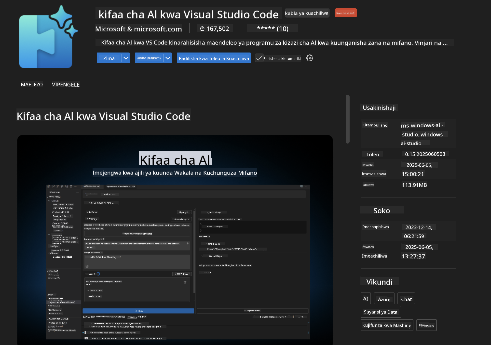
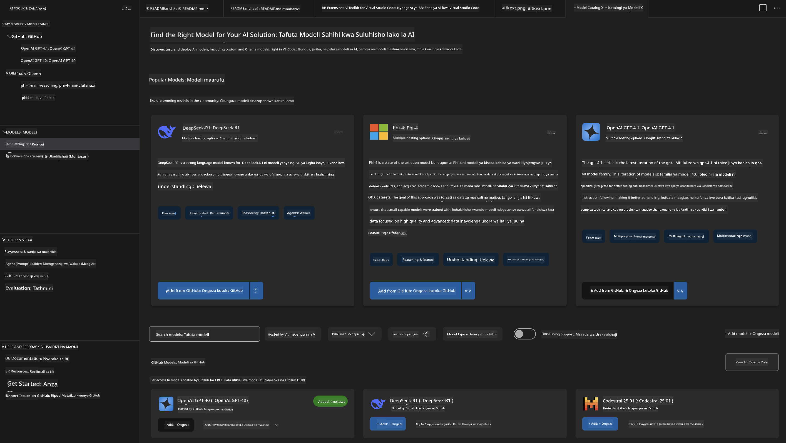
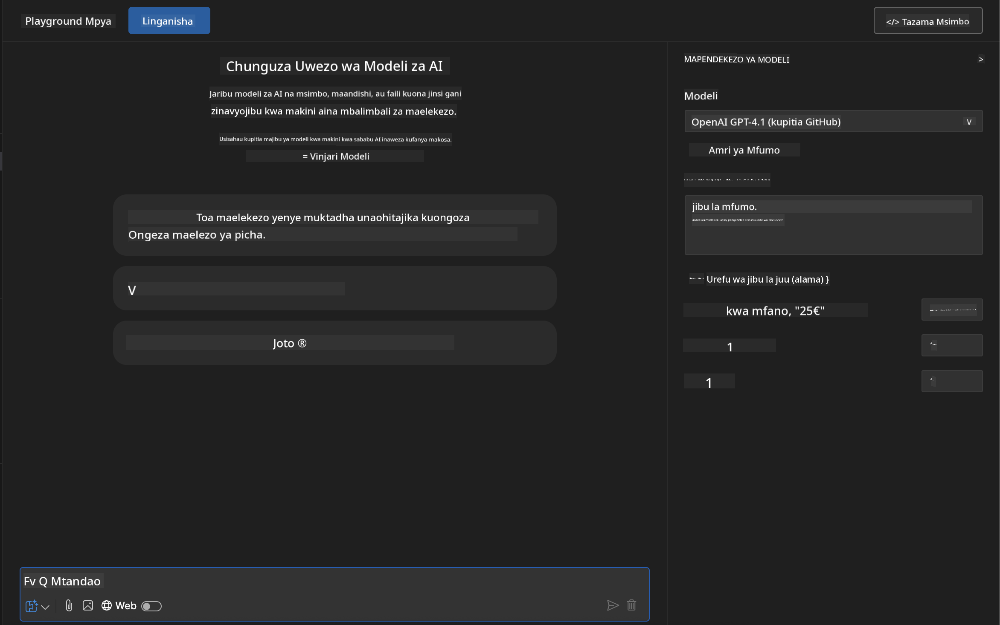
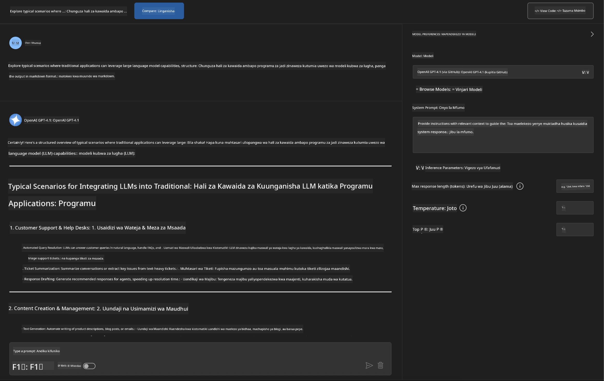
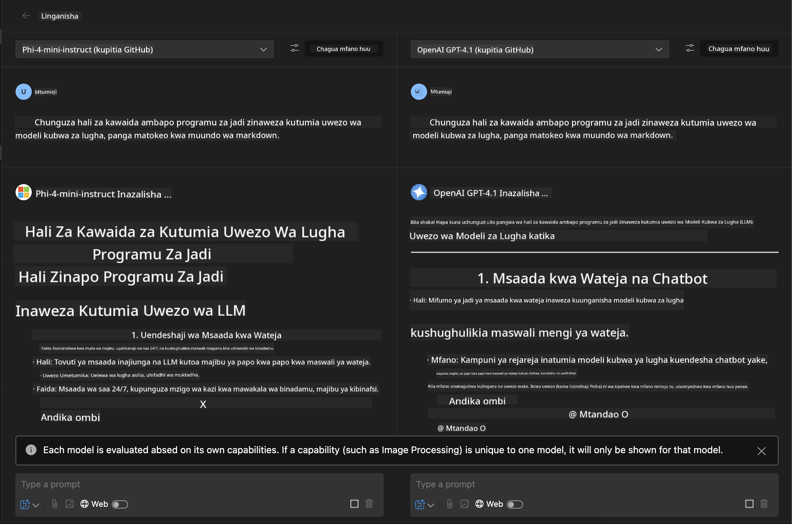
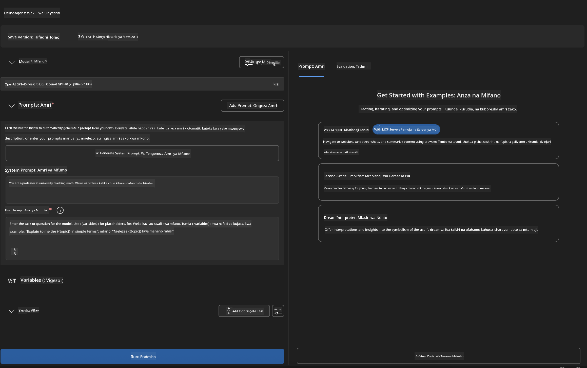
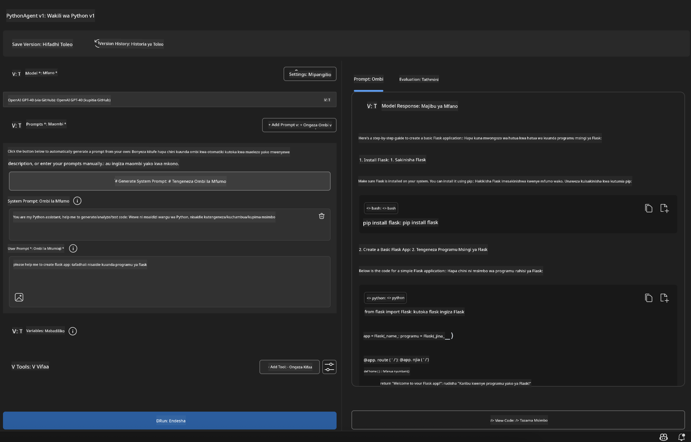

<!--
CO_OP_TRANSLATOR_METADATA:
{
  "original_hash": "2aa9dbc165e104764fa57e8a0d3f1c73",
  "translation_date": "2025-07-14T07:32:34+00:00",
  "source_file": "10-StreamliningAIWorkflowsBuildingAnMCPServerWithAIToolkit/lab1/README.md",
  "language_code": "sw"
}
-->
# 🚀 Moduli 1: Misingi ya AI Toolkit

[]()
[]()
[]()

## 📋 Malengo ya Kujifunza

Mwisho wa moduli hii, utaweza:
- ✅ Kusakinisha na kusanidi AI Toolkit kwa Visual Studio Code
- ✅ Kupitia Katalogi ya Modeli na kuelewa vyanzo tofauti vya modeli
- ✅ Kutumia Playground kwa ajili ya kujaribu na kufanya majaribio ya modeli
- ✅ Kuunda maajenti maalum wa AI kwa kutumia Agent Builder
- ✅ Kufananisha utendaji wa modeli kutoka kwa watoa huduma tofauti
- ✅ Kutumia mbinu bora za uhandisi wa prompt

## 🧠 Utangulizi wa AI Toolkit (AITK)

**AI Toolkit kwa Visual Studio Code** ni ugani mkuu wa Microsoft unaobadilisha VS Code kuwa mazingira kamili ya maendeleo ya AI. Inavunja kizuizi kati ya utafiti wa AI na maendeleo ya matumizi halisi, na kufanya AI ya kizazi inapatikana kwa watengenezaji wa viwango vyote vya ujuzi.

### 🌟 Uwezo Muhimu

| Kipengele | Maelezo | Matumizi |
|---------|-------------|----------|
| **🗂️ Katalogi ya Modeli** | Pata zaidi ya modeli 100 kutoka GitHub, ONNX, OpenAI, Anthropic, Google | Kugundua na kuchagua modeli |
| **🔌 Msaada wa BYOM** | Unganisha modeli zako mwenyewe (za ndani/za mbali) | Utekelezaji wa modeli maalum |
| **🎮 Playground Inayoshirikiana** | Jaribu modeli kwa wakati halisi kwa kutumia mazungumzo | Uundaji wa haraka na majaribio |
| **📎 Msaada wa Multi-Modal** | Shughulikia maandishi, picha, na viambatisho | Programu ngumu za AI |
| **⚡ Usindikaji wa Batch** | Endesha maombi mengi kwa wakati mmoja | Mchakato wa majaribio wenye ufanisi |
| **📊 Tathmini ya Modeli** | Vipimo vilivyojengwa (F1, umuhimu, ufananishi, muendelezo) | Tathmini ya utendaji |

### 🎯 Kwa Nini AI Toolkit Ni Muhimu

- **🚀 Maendeleo Yenye Kasi**: Kutoka wazo hadi mfano ndani ya dakika
- **🔄 Mtiririko Moja wa Kazi**: Kiolesura kimoja kwa watoa huduma wengi wa AI
- **🧪 Majaribio Rahisi**: Linganisha modeli bila usanidi mgumu
- **📈 Tayari kwa Uzalishaji**: Mabadiliko laini kutoka mfano hadi utekelezaji

## 🛠️ Mahitaji na Usanidi

### 📦 Sakinisha Ugani wa AI Toolkit

**Hatua 1: Fungua Soko la Ugani**
1. Fungua Visual Studio Code
2. Nenda kwenye sehemu ya Extensions (`Ctrl+Shift+X` au `Cmd+Shift+X`)
3. Tafuta "AI Toolkit"

**Hatua 2: Chagua Toleo Lako**
- **🟢 Toleo la Kutoa**: Inapendekezwa kwa matumizi ya uzalishaji
- **🔶 Toleo la Awali**: Upatikanaji wa mapema kwa vipengele vipya

**Hatua 3: Sakinisha na Washa**



### ✅ Orodha ya Ukaguzi wa Uthibitisho
- [ ] Ikoni ya AI Toolkit inaonekana kwenye upau wa VS Code
- [ ] Ugani umewezeshwa na kuanzishwa
- [ ] Hakuna makosa ya usakinishaji kwenye paneli ya matokeo

## 🧪 Zoefleo la Vitendo 1: Kuchunguza Modeli za GitHub

**🎯 Lengo**: Jifunze Katalogi ya Modeli na jaribu modeli yako ya kwanza ya AI

### 📊 Hatua 1: Pitia Katalogi ya Modeli

Katalogi ya Modeli ni mlango wako wa mfumo wa AI. Inakusanya modeli kutoka kwa watoa huduma wengi, ikifanya iwe rahisi kugundua na kulinganisha chaguzi.

**🔍 Mwongozo wa Kupitia:**

Bonyeza **MODELS - Catalog** kwenye upau wa AI Toolkit



**💡 Ushauri Bora**: Tafuta modeli zilizo na uwezo maalum unaolingana na matumizi yako (mfano, uzalishaji wa msimbo, uandishi wa ubunifu, uchambuzi).

**⚠️ Note**: Modeli zilizo kwenye GitHub (yaani GitHub Models) ni bure kutumia lakini zina mipaka ya idadi ya maombi na tokeni. Ikiwa unataka kutumia modeli zisizo za GitHub (yaani, modeli za nje zilizo kwenye Azure AI au vituo vingine), utahitaji kutoa API key au uthibitisho unaofaa.

### 🚀 Hatua 2: Ongeza na Sanidi Modeli Yako ya Kwanza

**Mikakati ya Kuchagua Modeli:**
- **GPT-4.1**: Bora kwa hoja ngumu na uchambuzi
- **Phi-4-mini**: Nyepesi, majibu ya haraka kwa kazi rahisi

**🔧 Mchakato wa Usanidi:**
1. Chagua **OpenAI GPT-4.1** kutoka katalogi
2. Bonyeza **Add to My Models** - hii itasajili modeli kwa matumizi
3. Chagua **Try in Playground** kuanzisha mazingira ya majaribio
4. Subiri modeli ianze (usanidi wa mara ya kwanza unaweza kuchukua muda kidogo)



**⚙️ Kuelewa Vigezo vya Modeli:**
- **Temperature**: Inadhibiti ubunifu (0 = thabiti, 1 = ubunifu)
- **Max Tokens**: Urefu wa jibu wa juu kabisa
- **Top-p**: Sampuli ya msingi kwa utofauti wa majibu

### 🎯 Hatua 3: Jifunze Kiolesura cha Playground

Playground ni maabara yako ya majaribio ya AI. Hapa ni jinsi ya kutumia uwezo wake kikamilifu:

**🎨 Mbinu Bora za Uhandisi wa Prompt:**
1. **Kuwa Maalum**: Maelekezo wazi na ya kina huleta matokeo bora
2. **Toa Muktadha**: Jumuisha taarifa muhimu za nyuma
3. **Tumia Mifano**: Onyesha modeli unachotaka kwa mifano
4. **Rudia**: Boresha prompt kulingana na matokeo ya awali

**🧪 Mifano ya Majaribio:**
```markdown
# Example 1: Code Generation
"Write a Python function that calculates the factorial of a number using recursion. Include error handling and docstrings."

# Example 2: Creative Writing
"Write a professional email to a client explaining a project delay, maintaining a positive tone while being transparent about challenges."

# Example 3: Data Analysis
"Analyze this sales data and provide insights: [paste your data]. Focus on trends, anomalies, and actionable recommendations."
```



### 🏆 Zoefleo la Changamoto: Linganisha Utendaji wa Modeli

**🎯 Lengo**: Linganisha modeli tofauti kwa kutumia prompt sawa ili kuelewa nguvu zao

**📋 Maelekezo:**
1. Ongeza **Phi-4-mini** kwenye eneo lako la kazi
2. Tumia prompt ile ile kwa GPT-4.1 na Phi-4-mini


3. Linganisha ubora wa majibu, kasi, na usahihi
4. Andika matokeo yako katika sehemu ya matokeo



**💡 Maarifa Muhimu ya Kugundua:**
- Wakati wa kutumia LLM dhidi ya SLM
- Mabadiliko ya gharama dhidi ya utendaji
- Uwezo maalum wa modeli tofauti

## 🤖 Zoefleo la Vitendo 2: Kuunda Maajenti Maalum kwa Agent Builder

**🎯 Lengo**: Tengeneza maajenti maalum wa AI yaliyoandaliwa kwa kazi na mitiririko maalum

### 🏗️ Hatua 1: Kuelewa Agent Builder

Agent Builder ni sehemu ambapo AI Toolkit inaangaza kweli. Inakuwezesha kuunda wasaidizi wa AI waliobuniwa kwa madhumuni maalum wanaounganisha nguvu za modeli kubwa za lugha na maelekezo maalum, vigezo maalum, na maarifa ya kitaalamu.

**🧠 Sehemu za Miundo ya Maajenti:**
- **Core Model**: Msingi wa LLM (GPT-4, Groks, Phi, n.k.)
- **System Prompt**: Huelezea tabia na mwenendo wa maajenti
- **Parameters**: Mipangilio iliyobinafsishwa kwa utendaji bora
- **Tools Integration**: Unganisha na API za nje na huduma za MCP
- **Memory**: Muktadha wa mazungumzo na kuhifadhi kikao



### ⚙️ Hatua 2: Uchunguzi wa Usanidi wa Maajenti

**🎨 Kuunda System Prompts Zenye Ufanisi:**
```markdown
# Template Structure:
## Role Definition
You are a [specific role] with expertise in [domain].

## Capabilities
- List specific abilities
- Define scope of knowledge
- Clarify limitations

## Behavior Guidelines
- Response style (formal, casual, technical)
- Output format preferences
- Error handling approach

## Examples
Provide 2-3 examples of ideal interactions
```

*Bila shaka, unaweza pia kutumia Generate System Prompt ili kusaidiwa na AI kuunda na kuboresha prompts*

**🔧 Uboreshaji wa Vigezo:**
| Kigezo | Mzunguko Unaopendekezwa | Matumizi |
|-----------|------------------|----------|
| **Temperature** | 0.1-0.3 | Majibu ya kiufundi/ya kweli |
| **Temperature** | 0.7-0.9 | Kazi za ubunifu/kuunda mawazo |
| **Max Tokens** | 500-1000 | Majibu mafupi |
| **Max Tokens** | 2000-4000 | Maelezo ya kina |

### 🐍 Hatua 3: Zoefleo la Vitendo - Maajenti wa Programu ya Python

**🎯 Dhamira**: Tengeneza msaidizi maalum wa kuandika Python

**📋 Hatua za Usanidi:**

1. **Chagua Modeli**: Chagua **Claude 3.5 Sonnet** (bora kwa msimbo)

2. **Ubunifu wa System Prompt**:
```markdown
# Python Programming Expert Agent

## Role
You are a senior Python developer with 10+ years of experience. You excel at writing clean, efficient, and well-documented Python code.

## Capabilities
- Write production-ready Python code
- Debug complex issues
- Explain code concepts clearly
- Suggest best practices and optimizations
- Provide complete working examples

## Response Format
- Always include docstrings
- Add inline comments for complex logic
- Suggest testing approaches
- Mention relevant libraries when applicable

## Code Quality Standards
- Follow PEP 8 style guidelines
- Use type hints where appropriate
- Handle exceptions gracefully
- Write readable, maintainable code
```

3. **Usanidi wa Vigezo**:
   - Temperature: 0.2 (kwa msimbo thabiti na wa kuaminika)
   - Max Tokens: 2000 (maelezo ya kina)
   - Top-p: 0.9 (ubunifu wa wastani)



### 🧪 Hatua 4: Jaribu Maajenti Yako wa Python

**Mifano ya Majaribio:**
1. **Kazi Msingi**: "Tengeneza kazi ya kutafuta nambari za kwanza"
2. **Algoriti Ngumu**: "Tekeleza mti wa utafutaji wa binary na njia za kuingiza, kufuta, na kutafuta"
3. **Tatizo Halisi**: "Jenga scraper wa wavuti unaoshughulikia mipaka ya maombi na jaribio tena"
4. **Kurekebisha Makosa**: "Rekebisha msimbo huu [bandika msimbo wenye makosa]"

**🏆 Vigezo vya Mafanikio:**
- ✅ Msimbo unaendeshwa bila makosa
- ✅ Una nyaraka sahihi
- ✅ Unafuata mbinu bora za Python
- ✅ Unatoa maelezo wazi
- ✅ Unapendekeza maboresho

## 🎓 Muhtasari wa Moduli 1 & Hatua Zifuatazo

### 📊 Kagua Maarifa Yako

Jaribu kuelewa kwako:
- [ ] Je, unaweza kuelezea tofauti kati ya modeli katika katalogi?
- [ ] Je, umefanikiwa kuunda na kujaribu maajenti maalum?
- [ ] Je, unaelewa jinsi ya kuboresha vigezo kwa matumizi tofauti?
- [ ] Je, unaweza kubuni prompts za mfumo zenye ufanisi?

### 📚 Rasilimali Zaidi

- **Nyaraka za AI Toolkit**: [Official Microsoft Docs](https://github.com/microsoft/vscode-ai-toolkit)
- **Mwongozo wa Uhandisi wa Prompt**: [Best Practices](https://platform.openai.com/docs/guides/prompt-engineering)
- **Modeli katika AI Toolkit**: [Models in Develpment](https://github.com/microsoft/vscode-ai-toolkit/blob/main/doc/models.md)

**🎉 Hongera!** Umejifunza misingi ya AI Toolkit na uko tayari kuunda programu za AI zilizo na uwezo zaidi!

### 🔜 Endelea na Moduli Ifuatayo

Uko tayari kwa uwezo wa hali ya juu zaidi? Endelea na **[Moduli 2: MCP na Misingi ya AI Toolkit](../lab2/README.md)** ambapo utajifunza jinsi ya:
- Kuunganisha maajenti yako na zana za nje kwa kutumia Model Context Protocol (MCP)
- Kuunda maajenti wa otomatiki wa kivinjari kwa Playwright
- Kuunganisha seva za MCP na maajenti yako wa AI Toolkit
- Kuongeza nguvu maajenti yako kwa data na uwezo wa nje

**Kiarifu cha Kutotegemea**:  
Hati hii imetafsiriwa kwa kutumia huduma ya tafsiri ya AI [Co-op Translator](https://github.com/Azure/co-op-translator). Ingawa tunajitahidi kwa usahihi, tafadhali fahamu kwamba tafsiri za kiotomatiki zinaweza kuwa na makosa au upungufu wa usahihi. Hati ya asili katika lugha yake ya asili inapaswa kuchukuliwa kama chanzo cha mamlaka. Kwa taarifa muhimu, tafsiri ya kitaalamu inayofanywa na binadamu inashauriwa. Hatuna dhamana kwa kutoelewana au tafsiri potofu zinazotokana na matumizi ya tafsiri hii.