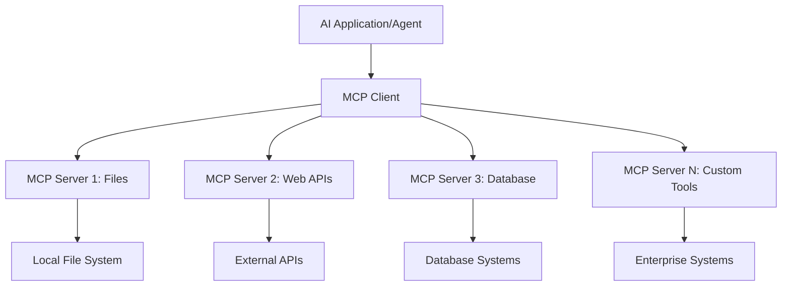

<!--
CO_OP_TRANSLATOR_METADATA:
{
  "original_hash": "a22b7dd11cd7690f99f9195877cafdc3",
  "translation_date": "2025-06-10T05:55:57+00:00",
  "source_file": "10-StreamliningAIWorkflowsBuildingAnMCPServerWithAIToolkit/lab2/README.md",
  "language_code": "sw"
}
-->
# 🌐 Moduli 2: MCP na Msingi wa AI Toolkit

[]()
[]()
[]()

## 📋 Malengo ya Kujifunza

Mwisho wa moduli hii, utaweza:
- ✅ Kuelewa usanifu na faida za Model Context Protocol (MCP)
- ✅ Kuchunguza mazingira ya seva za MCP za Microsoft
- ✅ Kuunganisha seva za MCP na AI Toolkit Agent Builder
- ✅ Kujenga wakala wa otomatiki wa kivinjari kwa kutumia Playwright MCP
- ✅ Kusanidi na kujaribu zana za MCP ndani ya maajenti yako
- ✅ Kusafirisha na kupeleka maajenti yanayotumia MCP kwa matumizi ya uzalishaji

## 🎯 Kuendelea na Moduli 1

Katika Moduli 1, tulijifunza misingi ya AI Toolkit na kuunda Wakala wetu wa kwanza wa Python. Sasa tutaongeza nguvu maajenti yako kwa kuziunganisha na zana na huduma za nje kupitia **Model Context Protocol (MCP)** ya kisasa.

Fikiria kama kuboresha kutoka kalkuleta ya kawaida hadi kompyuta kamili - maajenti yako ya AI yatapata uwezo wa:
- 🌐 Kivinjari na kuingiliana na tovuti
- 📁 Kupata na kusimamia faili
- 🔧 Kuunganisha na mifumo ya biashara
- 📊 Kuchakata data za wakati halisi kutoka API

## 🧠 Kuelewa Model Context Protocol (MCP)

### 🔍 MCP ni Nini?

Model Context Protocol (MCP) ni **"USB-C kwa matumizi ya AI"** - kiwango cha wazi cha kisasa kinachounganisha Modeli Kubwa za Lugha (LLMs) na zana za nje, vyanzo vya data, na huduma. Kama USB-C ilivyotatua machafuko ya nyaya kwa kuleta kiunganishi kimoja, MCP hutatua changamoto za kuunganisha AI kwa itifaki moja ya kawaida.

### 🎯 Tatizo MCP Linatatua

**Kabla ya MCP:**
- 🔧 Uunganishaji maalum kwa kila zana
- 🔄 Kufungiwa kwa muuzaji kwa suluhisho za kipekee  
- 🔒 Hatari za usalama kutokana na muunganisho wa muda mfupi
- ⏱️ Miezi ya maendeleo kwa uunganishaji wa msingi

**Kwa MCP:**
- ⚡ Unganisha zana kwa urahisi
- 🔄 Usanifu huru wa muuzaji
- 🛡️ Mbinu bora za usalama zilizoingizwa
- 🚀 Dakika chache kuongeza uwezo mpya

### 🏗️ Usanifu wa MCP kwa Undani

MCP hutumia **usanifu wa mteja-seva** unaounda mfumo salama na unaoweza kupanuka:



**🔧 Vipengele Muhimu:**

| Kipengele | Nafasi | Mifano |
|-----------|--------|--------|
| **MCP Hosts** | Programu zinazotumia huduma za MCP | Claude Desktop, VS Code, AI Toolkit |
| **MCP Clients** | Wasimamia itifaki (1:1 na seva) | Zimejengwa ndani ya programu mwenyeji |
| **MCP Servers** | Hutoa uwezo kupitia itifaki ya kawaida | Playwright, Files, Azure, GitHub |
| **Transport Layer** | Njia za mawasiliano | stdio, HTTP, WebSockets |

## 🏢 Mazingira ya Seva za MCP ya Microsoft

Microsoft inaongoza mazingira ya MCP na seti kamili ya seva za kiwango cha biashara zinazoshughulikia mahitaji halisi ya biashara.

### 🌟 Seva za MCP za Microsoft Zinazojulikana

#### 1. ☁️ Azure MCP Server
**🔗 Repository**: [azure/azure-mcp](https://github.com/azure/azure-mcp)  
**🎯 Kusudi**: Usimamizi kamili wa rasilimali za Azure na ushirikiano wa AI

**✨ Sifa Muhimu:**
- Utoaji wa miundombinu kwa njia ya maelekezo
- Ufuatiliaji wa rasilimali kwa wakati halisi
- Mapendekezo ya kupunguza gharama
- Ukaguzi wa uzingatiaji wa usalama

**🚀 Matumizi:**
- Miundombinu kama Msimbo kwa msaada wa AI
- Kupandisha rasilimali kiotomatiki
- Kuboresha gharama za wingu
- Uendeshaji wa kazi za DevOps kiotomatiki

#### 2. 📊 Microsoft Dataverse MCP
**📚 Nyaraka**: [Microsoft Dataverse Integration](https://go.microsoft.com/fwlink/?linkid=2320176)  
**🎯 Kusudi**: Kiolesura cha lugha ya asili kwa data za biashara

**✨ Sifa Muhimu:**
- Maswali ya hifadhidata kwa lugha ya asili
- Uelewa wa muktadha wa biashara
- Violezo vya maombi maalum
- Usimamizi wa data za biashara

**🚀 Matumizi:**
- Ripoti za akili ya biashara
- Uchambuzi wa data za wateja
- Uelewa wa mchakato wa mauzo
- Maswali ya data za uzingatiaji

#### 3. 🌐 Playwright MCP Server
**🔗 Repository**: [microsoft/playwright-mcp](https://github.com/microsoft/playwright-mcp)  
**🎯 Kusudi**: Uendeshaji wa kivinjari na mwingiliano wa wavuti

**✨ Sifa Muhimu:**
- Uendeshaji wa kivinjari mbalimbali (Chrome, Firefox, Safari)
- Kugundua vipengele kwa akili
- Kurekodi picha na PDF
- Ufuatiliaji wa trafiki ya mtandao

**🚀 Matumizi:**
- Mtiririko wa majaribio ya otomatiki
- Kuchakata wavuti na kutoa data
- Ufuatiliaji wa UI/UX
- Uendeshaji wa uchambuzi wa ushindani

#### 4. 📁 Files MCP Server
**🔗 Repository**: [microsoft/files-mcp-server](https://github.com/microsoft/files-mcp-server)  
**🎯 Kusudi**: Uendeshaji wa mfumo wa faili kwa akili

**✨ Sifa Muhimu:**
- Usimamizi wa faili kwa maelekezo
- Mlinganifu wa maudhui
- Uunganishaji wa udhibiti wa toleo
- Utoaji wa metadata

**🚀 Matumizi:**
- Usimamizi wa nyaraka
- Kuandaa hifadhidata za msimbo
- Mtiririko wa kuchapisha maudhui
- Usimamizi wa faili za mchakato wa data

#### 5. 📝 MarkItDown MCP Server
**🔗 Repository**: [microsoft/markitdown](https://github.com/microsoft/markitdown)  
**🎯 Kusudi**: Usindikaji na uhariri wa Markdown wa hali ya juu

**✨ Sifa Muhimu:**
- Uchambuzi wa Markdown tajiri
- Kubadilisha muundo (MD ↔ HTML ↔ PDF)
- Uchambuzi wa muundo wa maudhui
- Usindikaji wa templeti

**🚀 Matumizi:**
- Mtiririko wa nyaraka za kiufundi
- Mfumo wa usimamizi wa maudhui
- Utoaji wa ripoti
- Uendeshaji wa hifadhidata ya maarifa

#### 6. 📈 Clarity MCP Server
**📦 Pakiti**: [@microsoft/clarity-mcp-server](https://www.npmjs.com/package/@microsoft/clarity-mcp-server)  
**🎯 Kusudi**: Uchambuzi wa wavuti na tabia za watumiaji

**✨ Sifa Muhimu:**
- Uchambuzi wa ramani za joto
- Rekodi za vikao vya watumiaji
- Vipimo vya utendaji
- Uchambuzi wa njia za mabadiliko

**🚀 Matumizi:**
- Kuboresha tovuti
- Utafiti wa uzoefu wa mtumiaji
- Uchambuzi wa majaribio ya A/B
- Dashibodi za akili ya biashara

### 🌍 Mazingira ya Jamii

Zaidi ya seva za Microsoft, mazingira ya MCP yanajumuisha:
- **🐙 GitHub MCP**: Usimamizi wa hifadhidata na uchambuzi wa msimbo
- **🗄️ Database MCPs**: Uunganishaji wa PostgreSQL, MySQL, MongoDB
- **☁️ Cloud Provider MCPs**: Zana za AWS, GCP, Digital Ocean
- **📧 Communication MCPs**: Uunganishaji wa Slack, Teams, Barua pepe

## 🛠️ Maabara ya Vitendo: Kujenga Wakala wa Otomatiki wa Kivinjari

**🎯 Lengo la Mradi**: Tengeneza wakala wa akili wa otomatiki wa kivinjari kwa kutumia seva ya Playwright MCP ambayo inaweza kuvinjari tovuti, kutoa taarifa, na kufanya mwingiliano mgumu wa wavuti.

### 🚀 Awamu ya 1: Kuanzisha Msingi wa Wakala

#### Hatua 1: Anzisha Wakala Wako
1. **Fungua AI Toolkit Agent Builder**  
2. **Unda Wakala Mpya** kwa usanidi ufuatao:  
   - **Jina**: `BrowserAgent`
   - **Model**: Choose GPT-4o 


### 🔧 Phase 2: MCP Integration Workflow

#### Step 3: Add MCP Server Integration
1. **Navigate to Tools Section** in Agent Builder
2. **Click "Add Tool"** to open the integration menu
3. **Select "MCP Server"** from available options


**🔍 Understanding Tool Types:**
- **Built-in Tools**: Pre-configured AI Toolkit functions
- **MCP Servers**: External service integrations
- **Custom APIs**: Your own service endpoints
- **Function Calling**: Direct model function access

#### Step 4: MCP Server Selection
1. **Choose "MCP Server"** option to proceed


2. **Browse MCP Catalog** to explore available integrations


### 🎮 Phase 3: Playwright MCP Configuration

#### Step 5: Select and Configure Playwright
1. **Click "Use Featured MCP Servers"** to access Microsoft's verified servers
2. **Select "Playwright"** from the featured list
3. **Accept Default MCP ID** or customize for your environment


#### Step 6: Enable Playwright Capabilities
**🔑 Critical Step**: Select **ALL** available Playwright methods for maximum functionality


**🛠️ Essential Playwright Tools:**
- **Navigation**: `goto`, `goBack`, `goForward`, `reload`
- **Interaction**: `click`, `fill`, `press`, `hover`, `drag`
- **Extraction**: `textContent`, `innerHTML`, `getAttribute`
- **Validation**: `isVisible`, `isEnabled`, `waitForSelector`
- **Capture**: `screenshot`, `pdf`, `video`
- **Network**: `setExtraHTTPHeaders`, `route`, `waitForResponse`

#### Hatua 7: Thibitisha Mafanikio ya Uunganisho  
**✅ Dalili za Mafanikio:**  
- Zana zote zinaonekana katika kiolesura cha Agent Builder  
- Hakuna ujumbe wa makosa kwenye jopo la uunganisho  
- Hali ya seva ya Playwright inaonyesha "Connected"  


**🔧 Kutatua Matatizo ya Kawaida:**  
- **Muunganisho Umeshindikana**: Angalia muunganisho wa intaneti na mipangilio ya firewall  
- **Zana Hazipo**: Hakikisha uwezo wote ulichaguliwa wakati wa usanidi  
- **Makosa ya Ruhusa**: Hakiki kama VS Code ina ruhusa zinazohitajika za mfumo

### 🎯 Awamu ya 4: Uhandisi wa Maombi ya Juu

#### Hatua 8: Tengeneza Maombi ya Mfumo yenye Akili  
Tengeneza maombi ya hali ya juu yanayotumia uwezo kamili wa Playwright:

```markdown
# Web Automation Expert System Prompt

## Core Identity
You are an advanced web automation specialist with deep expertise in browser automation, web scraping, and user experience analysis. You have access to Playwright tools for comprehensive browser control.

## Capabilities & Approach
### Navigation Strategy
- Always start with screenshots to understand page layout
- Use semantic selectors (text content, labels) when possible
- Implement wait strategies for dynamic content
- Handle single-page applications (SPAs) effectively

### Error Handling
- Retry failed operations with exponential backoff
- Provide clear error descriptions and solutions
- Suggest alternative approaches when primary methods fail
- Always capture diagnostic screenshots on errors

### Data Extraction
- Extract structured data in JSON format when possible
- Provide confidence scores for extracted information
- Validate data completeness and accuracy
- Handle pagination and infinite scroll scenarios

### Reporting
- Include step-by-step execution logs
- Provide before/after screenshots for verification
- Suggest optimizations and alternative approaches
- Document any limitations or edge cases encountered

## Ethical Guidelines
- Respect robots.txt and rate limiting
- Avoid overloading target servers
- Only extract publicly available information
- Follow website terms of service
```

#### Hatua 9: Tengeneza Maombi ya Mtumiaji Yanayobadilika  
Tengeneza maombi yanayoonyesha uwezo mbalimbali:

**🌐 Mfano wa Uchambuzi wa Wavuti:**  
```markdown
Navigate to github.com/kinfey and provide a comprehensive analysis including:
1. Repository structure and organization
2. Recent activity and contribution patterns  
3. Documentation quality assessment
4. Technology stack identification
5. Community engagement metrics
6. Notable projects and their purposes

Include screenshots at key steps and provide actionable insights.
```


### 🚀 Awamu ya 5: Utekelezaji na Upimaji

#### Hatua 10: Endesha Otomatiki Yako ya Kwanza  
1. **Bonyeza "Run"** kuanzisha mfululizo wa otomatiki  
2. **Fuatilia Utekelezaji kwa Wakati Halisi**:  
   - Kivinjari cha Chrome kinaanzishwa moja kwa moja  
   - Wakala huvinjari tovuti lengwa  
   - Picha za skrini zinachukuliwa kila hatua kuu  
   - Matokeo ya uchambuzi hutiririka kwa wakati halisi  


#### Hatua 11: Changanua Matokeo na Maarifa  
Pitia uchambuzi kamili katika kiolesura cha Agent Builder:


### 🌟 Awamu ya 6: Uwezo wa Juu na Utekelezaji

#### Hatua 12: Hamisha na Peleka Kwenye Uzalishaji  
Agent Builder inaunga mkono njia mbalimbali za utekelezaji:


## 🎓 Muhtasari wa Moduli 2 & Hatua Zifuatazo

### 🏆 Mafanikio Yamepatikana: Mtaalamu wa Uunganishaji wa MCP

**✅ Ujuzi Uliyopata:**
- [ ] Kuelewa usanifu na faida za MCP  
- [ ] Kupitia mazingira ya seva za MCP za Microsoft  
- [ ] Kuunganisha Playwright MCP na AI Toolkit  
- [ ] Kujenga maajenti wa otomatiki wa kivinjari yenye ustadi  
- [ ] Uhandisi wa maombi wa hali ya juu kwa otomatiki wa wavuti

### 📚 Rasilimali Zaidi

- **🔗 MCP Specification**: [Official Protocol Documentation](https://modelcontextprotocol.io/)  
- **🛠️ Playwright API**: [Complete Method Reference](https://playwright.dev/docs/api/class-playwright)  
- **🏢 Microsoft MCP Servers**: [Enterprise Integration Guide](https://github.com/microsoft/mcp-servers)  
- **🌍 Community Examples**: [MCP Server Gallery](https://github.com/modelcontextprotocol/servers)

**🎉 Hongera!** Umefanikiwa kujifunza uunganishaji wa MCP na sasa unaweza kujenga maajenti wa AI tayari kwa uzalishaji wenye uwezo wa kutumia zana za nje!

### 🔜 Endelea na Moduli Ifuatayo

Uko tayari kuongeza ujuzi wako wa MCP? Endelea na **[Moduli 3: Maendeleo ya Juu ya MCP na AI Toolkit](../lab3/README.md)** ambapo utajifunza jinsi ya:
- Kuunda seva zako maalum za MCP  
- Kusanidi na kutumia SDK mpya ya MCP Python  
- Kuweka MCP Inspector kwa ajili ya utatuzi  
- Kuwa mtaalamu wa michakato ya maendeleo ya seva za MCP  
- Kujenga Seva ya Hali ya Hewa ya MCP kutoka mwanzo

**Kumbusho**:  
Hati hii imetafsiriwa kwa kutumia huduma ya tafsiri ya AI [Co-op Translator](https://github.com/Azure/co-op-translator). Ingawa tunajitahidi kwa usahihi, tafadhali fahamu kuwa tafsiri za moja kwa moja zinaweza kuwa na makosa au kasoro. Hati ya asili katika lugha yake ya asili inapaswa kuzingatiwa kama chanzo cha mamlaka. Kwa taarifa muhimu, tafsiri ya kitaalamu inayofanywa na binadamu inapendekezwa. Hatubebeki dhamana kwa maelezo potofu au tafsiri zisizo sahihi zinazotokana na matumizi ya tafsiri hii.