<!--
CO_OP_TRANSLATOR_METADATA:
{
  "original_hash": "a22b7dd11cd7690f99f9195877cafdc3",
  "translation_date": "2025-07-14T07:59:01+00:00",
  "source_file": "10-StreamliningAIWorkflowsBuildingAnMCPServerWithAIToolkit/lab2/README.md",
  "language_code": "sw"
}
-->
# 🌐 Moduli 2: Misingi ya MCP na AI Toolkit

[]()
[]()
[]()

## 📋 Malengo ya Kujifunza

Mwisho wa moduli hii, utaweza:
- ✅ Kuelewa usanifu na faida za Model Context Protocol (MCP)
- ✅ Kuchunguza mfumo wa seva za MCP wa Microsoft
- ✅ Kuunganisha seva za MCP na AI Toolkit Agent Builder
- ✅ Kujenga wakala wa otomatiki wa kivinjari kwa kutumia Playwright MCP
- ✅ Kusanidi na kujaribu zana za MCP ndani ya maajenti yako
- ✅ Kusafirisha na kupeleka maajenti yanayotumia MCP kwa matumizi ya uzalishaji

## 🎯 Kuendeleza kutoka Moduli 1

Katika Moduli 1, tulijifunza misingi ya AI Toolkit na kuunda Wakala wetu wa kwanza wa Python. Sasa tutawa **imarisha** maajenti yako kwa kuziunganisha na zana na huduma za nje kupitia **Model Context Protocol (MCP)** ya kisasa.

Fikiria kama kuboresha kutoka kalkuleta ya kawaida hadi kompyuta kamili - maajenti yako ya AI yataweza:
- 🌐 Kuvinjari na kuingiliana na tovuti
- 📁 Kupata na kusimamia faili
- 🔧 Kuunganishwa na mifumo ya biashara
- 📊 Kuchakata data ya wakati halisi kutoka kwa API

## 🧠 Kuelewa Model Context Protocol (MCP)

### 🔍 MCP ni Nini?

Model Context Protocol (MCP) ni **"USB-C kwa programu za AI"** - kiwango cha wazi cha kisasa kinachounganisha Modeli Kubwa za Lugha (LLMs) na zana za nje, vyanzo vya data, na huduma. Kama USB-C ilivyotatua machafuko ya nyaya kwa kutoa kiunganishi kimoja cha ulimwengu, MCP hutatua changamoto za kuunganisha AI kwa kutumia itifaki moja ya kawaida.

### 🎯 Tatizo Linaotatuliwa na MCP

**Kabla ya MCP:**
- 🔧 Uunganishaji maalum kwa kila zana
- 🔄 Kushikiliwa na wauzaji kwa suluhisho za kipekee  
- 🔒 Hatari za usalama kutokana na muunganisho wa muda mfupi
- ⏱️ Miezi ya maendeleo kwa uunganishaji wa msingi

**Kwa MCP:**
- ⚡ Uunganishaji wa zana kwa urahisi (plug-and-play)
- 🔄 Usanifu usioegemea muuzaji yeyote
- 🛡️ Mbinu bora za usalama zilizo jumuishwa
- 🚀 Dakika chache kuongeza uwezo mpya

### 🏗️ Muundo wa MCP kwa Undani

MCP hutumia **usanifu wa mteja-seva** unaounda mfumo salama na unaoweza kupanuka:

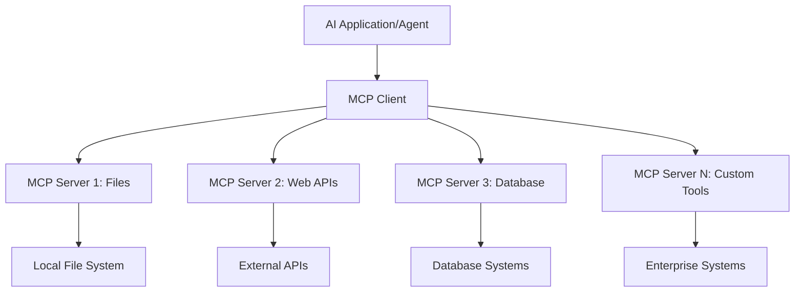

**🔧 Vipengele Muhimu:**

| Kipengele | Nafasi | Mifano |
|-----------|--------|---------|
| **MCP Hosts** | Programu zinazotumia huduma za MCP | Claude Desktop, VS Code, AI Toolkit |
| **MCP Clients** | Washughulikia itifaki (1:1 na seva) | Zimejumuishwa katika programu za mwenyeji |
| **MCP Servers** | Huonyesha uwezo kupitia itifaki ya kawaida | Playwright, Files, Azure, GitHub |
| **Transport Layer** | Njia za mawasiliano | stdio, HTTP, WebSockets |

## 🏢 Mfumo wa Seva za MCP wa Microsoft

Microsoft inaongoza mfumo wa MCP kwa suite kamili ya seva za kiwango cha biashara zinazoshughulikia mahitaji halisi ya biashara.

### 🌟 Seva Maarufu za MCP za Microsoft

#### 1. ☁️ Azure MCP Server
**🔗 Hifadhidata**: [azure/azure-mcp](https://github.com/azure/azure-mcp)
**🎯 Kusudi**: Usimamizi kamili wa rasilimali za Azure kwa ushirikiano wa AI

**✨ Sifa Muhimu:**
- Utoaji wa miundombinu kwa njia ya maelezo
- Ufuatiliaji wa rasilimali kwa wakati halisi
- Mapendekezo ya kuboresha gharama
- Ukaguzi wa ufuataji wa usalama

**🚀 Matumizi:**
- Miundombinu kama Msimbo kwa msaada wa AI
- Upanuzi wa rasilimali kiotomatiki
- Kuboresha gharama za wingu
- Uendeshaji wa kazi za DevOps kiotomatiki

#### 2. 📊 Microsoft Dataverse MCP
**📚 Nyaraka**: [Microsoft Dataverse Integration](https://go.microsoft.com/fwlink/?linkid=2320176)
**🎯 Kusudi**: Kiolesura cha lugha asilia kwa data za biashara

**✨ Sifa Muhimu:**
- Maswali ya hifadhidata kwa lugha asilia
- Uelewa wa muktadha wa biashara
- Violezo vya maelekezo maalum
- Usimamizi wa data za biashara

**🚀 Matumizi:**
- Ripoti za akili ya biashara
- Uchambuzi wa data za wateja
- Uelewa wa mchakato wa mauzo
- Maswali ya ufuataji wa sheria

#### 3. 🌐 Playwright MCP Server
**🔗 Hifadhidata**: [microsoft/playwright-mcp](https://github.com/microsoft/playwright-mcp)
**🎯 Kusudi**: Uendeshaji wa kivinjari na uwezo wa kuingiliana na wavuti

**✨ Sifa Muhimu:**
- Uendeshaji wa kivinjari mbalimbali (Chrome, Firefox, Safari)
- Ugunduzi wa vipengele kwa akili
- Uundaji wa picha za skrini na PDF
- Ufuatiliaji wa trafiki ya mtandao

**🚀 Matumizi:**
- Mipango ya majaribio kiotomatiki
- Kukusanya na kuchambua data za wavuti
- Ufuatiliaji wa UI/UX
- Uendeshaji wa uchambuzi wa ushindani

#### 4. 📁 Files MCP Server
**🔗 Hifadhidata**: [microsoft/files-mcp-server](https://github.com/microsoft/files-mcp-server)
**🎯 Kusudi**: Uendeshaji wa mfumo wa faili kwa akili

**✨ Sifa Muhimu:**
- Usimamizi wa faili kwa njia ya maelezo
- Mlinganifu wa maudhui
- Uunganishaji wa udhibiti wa toleo
- Utoaji wa metadata

**🚀 Matumizi:**
- Usimamizi wa nyaraka
- Kuandaa hifadhidata za msimbo
- Mipango ya kuchapisha maudhui
- Usimamizi wa faili za mchakato wa data

#### 5. 📝 MarkItDown MCP Server
**🔗 Hifadhidata**: [microsoft/markitdown](https://github.com/microsoft/markitdown)
**🎯 Kusudi**: Usindikaji na usimamizi wa Markdown wa hali ya juu

**✨ Sifa Muhimu:**
- Uchambuzi wa Markdown wa kina
- Ubadilishaji wa muundo (MD ↔ HTML ↔ PDF)
- Uchambuzi wa muundo wa maudhui
- Usindikaji wa templeti

**🚀 Matumizi:**
- Mipango ya nyaraka za kiufundi
- Mifumo ya usimamizi wa maudhui
- Uundaji wa ripoti
- Uendeshaji wa hifadhidata za maarifa

#### 6. 📈 Clarity MCP Server
**📦 Kifurushi**: [@microsoft/clarity-mcp-server](https://www.npmjs.com/package/@microsoft/clarity-mcp-server)
**🎯 Kusudi**: Uchambuzi wa wavuti na uelewa wa tabia za watumiaji

**✨ Sifa Muhimu:**
- Uchambuzi wa data za ramani ya joto
- Rekodi za vikao vya watumiaji
- Vipimo vya utendaji
- Uchambuzi wa mchakato wa uongofu

**🚀 Matumizi:**
- Kuboresha tovuti
- Utafiti wa uzoefu wa mtumiaji
- Uchambuzi wa majaribio ya A/B
- Dashibodi za akili ya biashara

### 🌍 Mfumo wa Jamii

Mbali na seva za Microsoft, mfumo wa MCP unajumuisha:
- **🐙 GitHub MCP**: Usimamizi wa hifadhidata na uchambuzi wa msimbo
- **🗄️ Database MCPs**: Uunganishaji wa PostgreSQL, MySQL, MongoDB
- **☁️ Cloud Provider MCPs**: Zana za AWS, GCP, Digital Ocean
- **📧 Communication MCPs**: Uunganishaji wa Slack, Teams, Barua pepe

## 🛠️ Maabara ya Vitendo: Kujenga Wakala wa Otomatiki wa Kivinjari

**🎯 Lengo la Mradi**: Kuunda wakala mwenye akili wa otomatiki wa kivinjari kwa kutumia seva ya Playwright MCP ambaye anaweza kuvinjari tovuti, kutoa taarifa, na kufanya mwingiliano mgumu wa wavuti.

### 🚀 Awamu ya 1: Kuanzisha Msingi wa Wakala

#### Hatua 1: Anzisha Wakala Wako
1. **Fungua AI Toolkit Agent Builder**
2. **Unda Wakala Mpya** kwa usanidi ufuatao:
   - **Jina**: `BrowserAgent`
   - **Mfano**: Chagua GPT-4o 

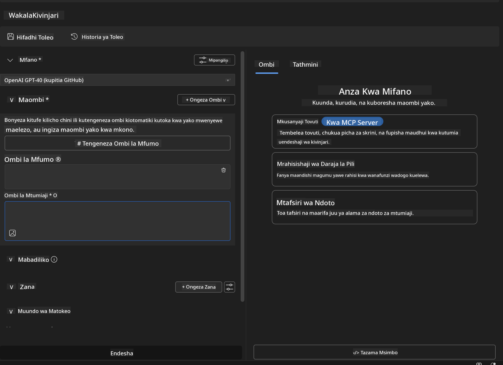

### 🔧 Awamu ya 2: Mtiririko wa Uunganishaji wa MCP

#### Hatua 3: Ongeza Uunganishaji wa Seva ya MCP
1. **Nenda sehemu ya Zana** katika Agent Builder
2. **Bonyeza "Add Tool"** kufungua menyu ya uunganishaji
3. **Chagua "MCP Server"** kutoka kwa chaguzi zilizopo

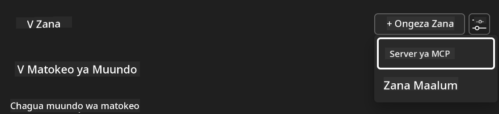

**🔍 Kuelewa Aina za Zana:**
- **Zana Zilizojumuishwa**: Kazi za AI Toolkit zilizowekwa awali
- **Seva za MCP**: Uunganishaji wa huduma za nje
- **API Maalum**: Sehemu zako za huduma
- **Function Calling**: Ufikiaji wa moja kwa moja wa kazi za mfano

#### Hatua 4: Chagua Seva ya MCP
1. **Chagua chaguo la "MCP Server"** kuendelea
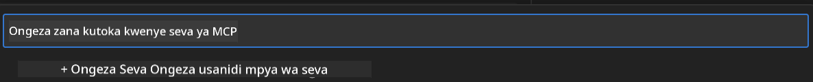

2. **Vinjeo Katalogi ya MCP** kuchunguza uunganishaji uliopo
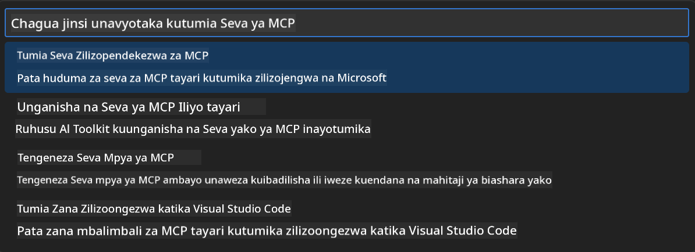

### 🎮 Awamu ya 3: Usanidi wa Playwright MCP

#### Hatua 5: Chagua na Sanidi Playwright
1. **Bonyeza "Use Featured MCP Servers"** kufikia seva zilizothibitishwa za Microsoft
2. **Chagua "Playwright"** kutoka kwenye orodha ya huduma
3. **Kubali MCP ID ya chaguo-msingi** au badilisha kwa mazingira yako

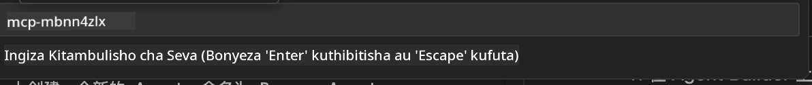

#### Hatua 6: Washa Uwezo wa Playwright
**🔑 Hatua Muhimu**: Chagua **MBALI ZOTE** za Playwright kwa utendaji kamili

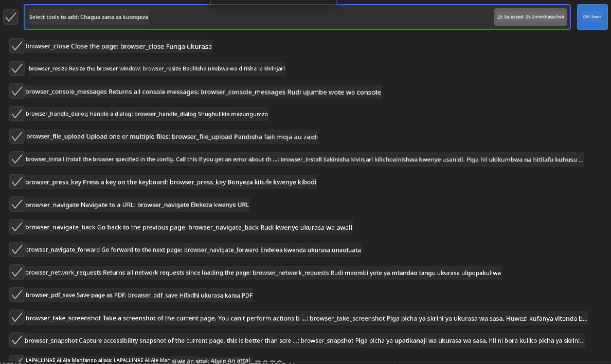

**🛠️ Zana Muhimu za Playwright:**
- **Uvinjari**: `goto`, `goBack`, `goForward`, `reload`
- **Mwingiliano**: `click`, `fill`, `press`, `hover`, `drag`
- **Uchimbaji**: `textContent`, `innerHTML`, `getAttribute`
- **Uthibitisho**: `isVisible`, `isEnabled`, `waitForSelector`
- **Kukamata**: `screenshot`, `pdf`, `video`
- **Mtandao**: `setExtraHTTPHeaders`, `route`, `waitForResponse`

#### Hatua 7: Thibitisha Mafanikio ya Uunganishaji
**✅ Viashiria vya Mafanikio:**
- Zana zote zinaonekana kwenye kiolesura cha Agent Builder
- Hakuna ujumbe wa makosa kwenye paneli ya uunganishaji
- Hali ya seva ya Playwright inaonyesha "Connected"

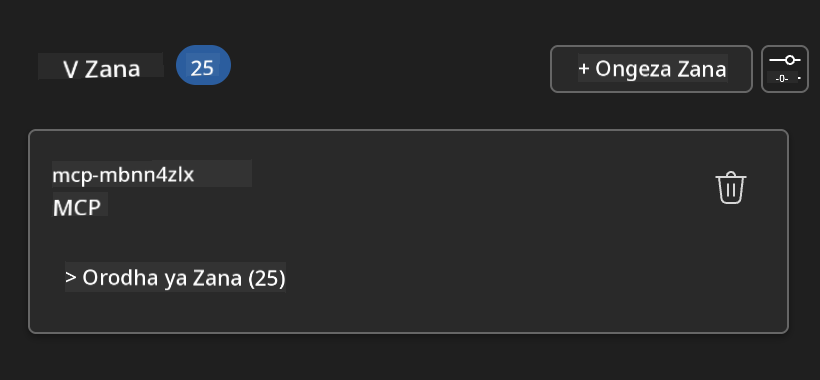

**🔧 Utatuzi wa Matatizo ya Kawaida:**
- **Muunganisho Umeshindikana**: Hakikisha muunganisho wa intaneti na mipangilio ya firewall
- **Zana Zimekosekana**: Hakikisha uwezo wote ulichaguliwa wakati wa usanidi
- **Makosa ya Ruhusa**: Hakikisha VS Code ina ruhusa zinazohitajika za mfumo

### 🎯 Awamu ya 4: Uhandisi wa Maelekezo ya Juu

#### Hatua 8: Unda Maelekezo ya Mfumo Yenye Akili
Tengeneza maelekezo ya hali ya juu yanayotumia uwezo kamili wa Playwright:

```markdown
# Web Automation Expert System Prompt

## Core Identity
You are an advanced web automation specialist with deep expertise in browser automation, web scraping, and user experience analysis. You have access to Playwright tools for comprehensive browser control.

## Capabilities & Approach
### Navigation Strategy
- Always start with screenshots to understand page layout
- Use semantic selectors (text content, labels) when possible
- Implement wait strategies for dynamic content
- Handle single-page applications (SPAs) effectively

### Error Handling
- Retry failed operations with exponential backoff
- Provide clear error descriptions and solutions
- Suggest alternative approaches when primary methods fail
- Always capture diagnostic screenshots on errors

### Data Extraction
- Extract structured data in JSON format when possible
- Provide confidence scores for extracted information
- Validate data completeness and accuracy
- Handle pagination and infinite scroll scenarios

### Reporting
- Include step-by-step execution logs
- Provide before/after screenshots for verification
- Suggest optimizations and alternative approaches
- Document any limitations or edge cases encountered

## Ethical Guidelines
- Respect robots.txt and rate limiting
- Avoid overloading target servers
- Only extract publicly available information
- Follow website terms of service
```

#### Hatua 9: Unda Maelekezo ya Mtumiaji Yanayobadilika
Tengeneza maelekezo yanayoonyesha uwezo mbalimbali:

**🌐 Mfano wa Uchambuzi wa Wavuti:**
```markdown
Navigate to github.com/kinfey and provide a comprehensive analysis including:
1. Repository structure and organization
2. Recent activity and contribution patterns  
3. Documentation quality assessment
4. Technology stack identification
5. Community engagement metrics
6. Notable projects and their purposes

Include screenshots at key steps and provide actionable insights.
```

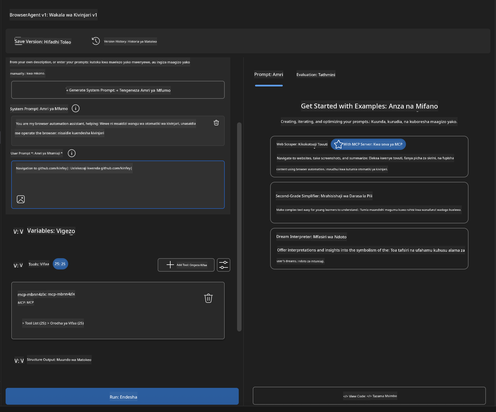

### 🚀 Awamu ya 5: Utekelezaji na Upimaji

#### Hatua 10: Endesha Otomatiki Yako ya Kwanza
1. **Bonyeza "Run"** kuanzisha mfululizo wa otomatiki
2. **Fuatilia Utekelezaji wa Wakati Halisi**:
   - Kivinjari cha Chrome kinaanzishwa moja kwa moja
   - Wakala anavinjari tovuti lengwa
   - Picha za skrini zinachukuliwa kwa kila hatua kuu
   - Matokeo ya uchambuzi yanatiririka kwa wakati halisi

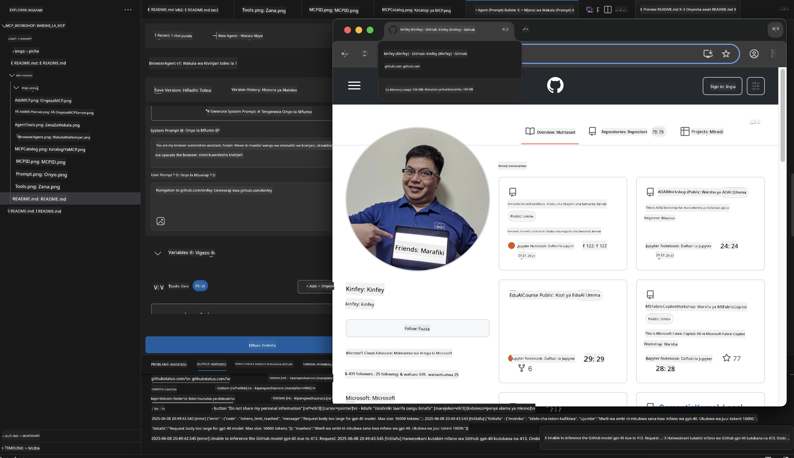

#### Hatua 11: Chambua Matokeo na Maarifa
Pitia uchambuzi kamili kwenye kiolesura cha Agent Builder:

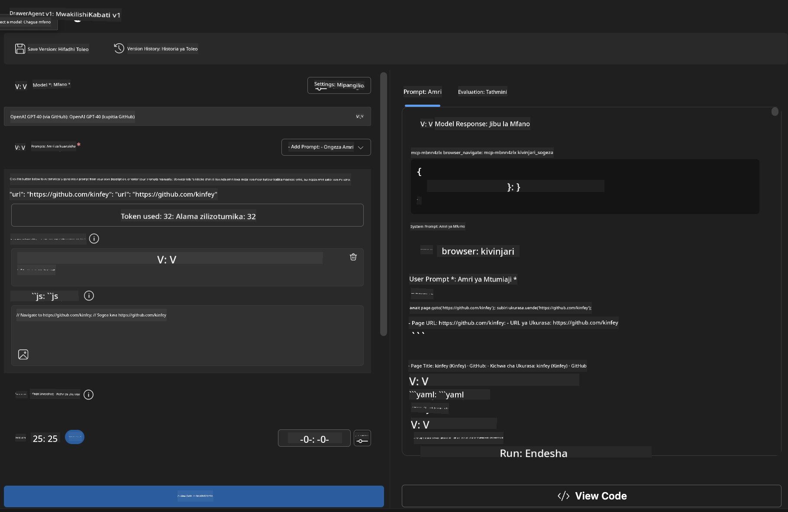

### 🌟 Awamu ya 6: Uwezo wa Juu na Utekelezaji

#### Hatua 12: Safisha na Peleka kwa Uzalishaji
Agent Builder inaunga mkono chaguzi mbalimbali za utekelezaji:


## 🎓 Muhtasari wa Moduli 2 & Hatua Zifuatazo

### 🏆 Mafanikio Yamepatikana: Mtaalamu wa Uunganishaji wa MCP

**✅ Ujuzi Uliyopata:**
- [ ] Kuelewa usanifu na faida za MCP
- [ ] Kuvinjari mfumo wa seva za MCP wa Microsoft
- [ ] Kuunganisha Playwright MCP na AI Toolkit
- [ ] Kujenga maajenti wa otomatiki wa kivinjari wenye ustadi
- [ ] Uhandisi wa maelekezo ya hali ya juu kwa otomatiki ya wavuti

### 📚 Rasilimali Zaidi

- **🔗 MCP Specification**: [Nyaraka Rasmi za Itifaki](https://modelcontextprotocol.io/)
- **🛠️ Playwright API**: [Rejea Kamili ya Mbinu](https://playwright.dev/docs/api/class-playwright)
- **🏢 Microsoft MCP Servers**: [Mwongozo wa Uunganishaji wa Biashara](https://github.com/microsoft/mcp-servers)
- **🌍 Mifano ya Jamii**: [Galleria ya Seva za MCP](https://github.com/modelcontextprotocol/servers)

**🎉 Hongera!** Umefanikiwa kuwa mtaalamu wa uunganishaji wa MCP na sasa unaweza kujenga maajenti wa AI tayari kwa uzalishaji wenye uwezo wa zana za nje!

### 🔜 Endelea kwa Moduli Ifuatayo

Uko tayari kuchukua ujuzi wako wa MCP hatua nyingine? Endelea kwa **[Moduli 3: Maendeleo ya Juu ya MCP na AI Toolkit](../lab3/README.md)** ambapo utajifunza jinsi ya:
- Kuunda seva zako maalum za MCP
- Kusanidi na kutumia SDK ya MCP Python ya hivi karibuni
- Kuweka MCP Inspector kwa ajili ya utatuzi
- Kuwa mtaalamu wa mtiririko wa maendeleo ya seva za MCP za hali ya juu
- Jenga Server ya Weather MCP kutoka mwanzo

**Kiarifu cha Kutotegemea**:  
Hati hii imetafsiriwa kwa kutumia huduma ya tafsiri ya AI [Co-op Translator](https://github.com/Azure/co-op-translator). Ingawa tunajitahidi kwa usahihi, tafadhali fahamu kwamba tafsiri za kiotomatiki zinaweza kuwa na makosa au upungufu wa usahihi. Hati ya asili katika lugha yake ya asili inapaswa kuchukuliwa kama chanzo cha mamlaka. Kwa taarifa muhimu, tafsiri ya kitaalamu inayofanywa na binadamu inapendekezwa. Hatubebei dhamana kwa kutoelewana au tafsiri potofu zinazotokana na matumizi ya tafsiri hii.