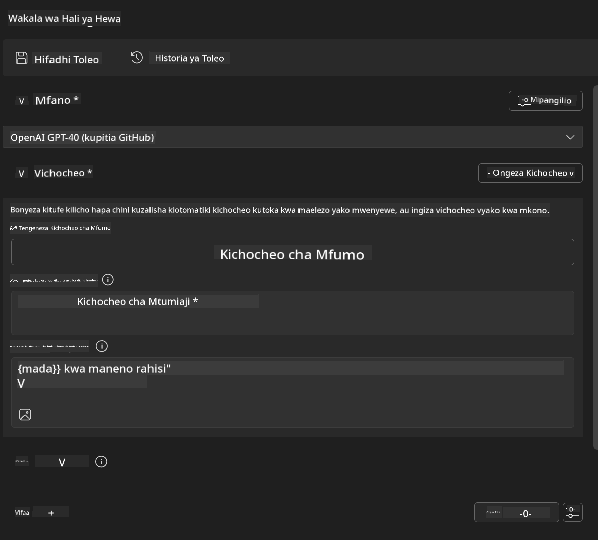
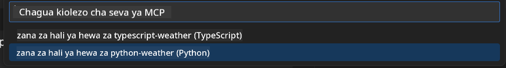
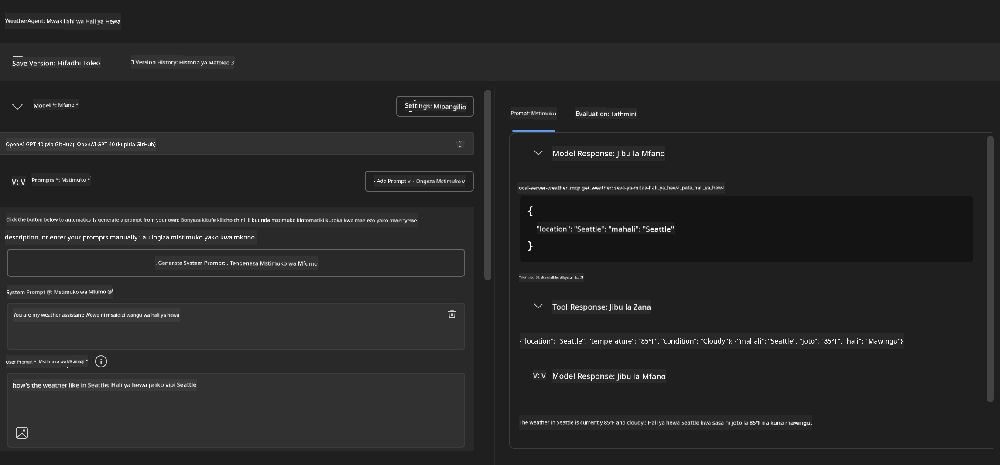
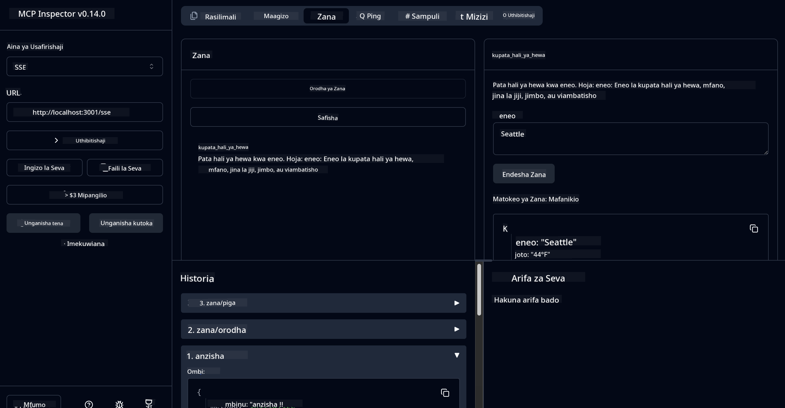

<!--
CO_OP_TRANSLATOR_METADATA:
{
  "original_hash": "dd8da3f75addcef453fe11f02a270217",
  "translation_date": "2025-07-14T08:17:59+00:00",
  "source_file": "10-StreamliningAIWorkflowsBuildingAnMCPServerWithAIToolkit/lab3/README.md",
  "language_code": "sw"
}
-->
# 🔧 Moduli 3: Maendeleo ya MCP ya Juu kwa AI Toolkit


## 🎯 Malengo ya Kujifunza

Mwisho wa maabara hii, utaweza:

- ✅ Kuunda seva za MCP za kawaida kwa kutumia AI Toolkit
- ✅ Kusanidi na kutumia toleo la hivi karibuni la MCP Python SDK (v1.9.3)
- ✅ Kuweka na kutumia MCP Inspector kwa ajili ya utatuzi wa makosa
- ✅ Kutatua matatizo ya seva za MCP katika mazingira ya Agent Builder na Inspector
- ✅ Kuelewa taratibu za maendeleo ya seva za MCP za hali ya juu

## 📋 Mahitaji ya Awali

- Kumaliza Maabara 2 (Misingi ya MCP)
- VS Code na ugani wa AI Toolkit umewekwa
- Mazingira ya Python 3.10+
- Node.js na npm kwa ajili ya usanidi wa Inspector

## 🏗️ Kile Ukitakachojenga

Katika maabara hii, utaunda **Seva ya MCP ya Hali ya Hewa** inayonyesha:
- Utekelezaji wa seva ya MCP ya kawaida
- Muunganisho na AI Toolkit Agent Builder
- Taratibu za kitaalamu za utatuzi wa makosa
- Matumizi ya kisasa ya MCP SDK

---

## 🔧 Muhtasari wa Vipengele Muhimu

### 🐍 MCP Python SDK
MCP Python SDK ni msingi wa kujenga seva za MCP za kawaida. Utatumia toleo 1.9.3 lenye uwezo wa kuboresha utatuzi wa makosa.

### 🔍 MCP Inspector
Chombo chenye nguvu cha utatuzi wa makosa kinachotoa:
- Ufuatiliaji wa seva kwa wakati halisi
- Uonyesho wa utekelezaji wa zana
- Ukaguzi wa maombi/jawabu ya mtandao
- Mazingira ya majaribio ya mwingiliano

---

## 📖 Utekelezaji Hatua kwa Hatua

### Hatua 1: Unda WeatherAgent katika Agent Builder

1. **Anzisha Agent Builder** katika VS Code kupitia ugani wa AI Toolkit
2. **Unda wakala mpya** kwa usanidi ufuatao:
   - Jina la Wakala: `WeatherAgent`



### Hatua 2: Anzisha Mradi wa Seva ya MCP

1. **Nenda kwenye Tools** → **Add Tool** katika Agent Builder
2. **Chagua "MCP Server"** kutoka kwa chaguzi zilizopo
3. **Chagua "Create A new MCP Server"**
4. **Chagua kiolezo cha `python-weather`**
5. **Pata jina seva yako:** `weather_mcp`



### Hatua 3: Fungua na Kagua Mradi

1. **Fungua mradi uliotengenezwa** katika VS Code
2. **Pitia muundo wa mradi:**
   ```
   weather_mcp/
   ├── src/
   │   ├── __init__.py
   │   └── server.py
   ├── inspector/
   │   ├── package.json
   │   └── package-lock.json
   ├── .vscode/
   │   ├── launch.json
   │   └── tasks.json
   ├── pyproject.toml
   └── README.md
   ```

### Hatua 4: Sasisha MCP SDK kwa Toleo la Hivi Karibuni

> **🔍 Kwa Nini Kusasisha?** Tunataka kutumia toleo la hivi karibuni la MCP SDK (v1.9.3) na huduma ya Inspector (0.14.0) kwa vipengele vilivyoboreshwa na uwezo bora wa utatuzi wa makosa.

#### 4a. Sasisha Mategemeo ya Python

**Hariri `pyproject.toml`:** sasisha [./code/weather_mcp/pyproject.toml](../../../../10-StreamliningAIWorkflowsBuildingAnMCPServerWithAIToolkit/lab3/code/weather_mcp/pyproject.toml)

#### 4b. Sasisha Usanidi wa Inspector

**Hariri `inspector/package.json`:** sasisha [./code/weather_mcp/inspector/package.json](../../../../10-StreamliningAIWorkflowsBuildingAnMCPServerWithAIToolkit/lab3/code/weather_mcp/inspector/package.json)

#### 4c. Sasisha Mategemeo ya Inspector

**Hariri `inspector/package-lock.json`:** sasisha [./code/weather_mcp/inspector/package-lock.json](../../../../10-StreamliningAIWorkflowsBuildingAnMCPServerWithAIToolkit/lab3/code/weather_mcp/inspector/package-lock.json)

> **📝 Kumbuka:** Faili hili lina maelezo mengi ya utegemezi. Hapa chini ni muundo muhimu - maudhui kamili yanahakikisha utatuzi sahihi wa utegemezi.

> **⚡ Kifungo Kamili cha Pakiti:** Faili kamili ya package-lock.json ina mistari takriban 3000 ya maelezo ya utegemezi. Hapo juu inaonyesha muundo muhimu - tumia faili iliyotolewa kwa utatuzi kamili wa utegemezi.

### Hatua 5: Sanidi Utatuzi wa VS Code

*Kumbuka: Tafadhali nakili faili katika njia iliyotajwa ili kubadilisha faili ya ndani inayolingana*

#### 5a. Sasisha Usanidi wa Anzisha

**Hariri `.vscode/launch.json`:**

```json
{
  "version": "0.2.0",
  "configurations": [
    {
      "name": "Attach to Local MCP",
      "type": "debugpy",
      "request": "attach",
      "connect": {
        "host": "localhost",
        "port": 5678
      },
      "presentation": {
        "hidden": true
      },
      "internalConsoleOptions": "neverOpen",
      "postDebugTask": "Terminate All Tasks"
    },
    {
      "name": "Launch Inspector (Edge)",
      "type": "msedge",
      "request": "launch",
      "url": "http://localhost:6274?timeout=60000&serverUrl=http://localhost:3001/sse#tools",
      "cascadeTerminateToConfigurations": [
        "Attach to Local MCP"
      ],
      "presentation": {
        "hidden": true
      },
      "internalConsoleOptions": "neverOpen"
    },
    {
      "name": "Launch Inspector (Chrome)",
      "type": "chrome",
      "request": "launch",
      "url": "http://localhost:6274?timeout=60000&serverUrl=http://localhost:3001/sse#tools",
      "cascadeTerminateToConfigurations": [
        "Attach to Local MCP"
      ],
      "presentation": {
        "hidden": true
      },
      "internalConsoleOptions": "neverOpen"
    }
  ],
  "compounds": [
    {
      "name": "Debug in Agent Builder",
      "configurations": [
        "Attach to Local MCP"
      ],
      "preLaunchTask": "Open Agent Builder",
    },
    {
      "name": "Debug in Inspector (Edge)",
      "configurations": [
        "Launch Inspector (Edge)",
        "Attach to Local MCP"
      ],
      "preLaunchTask": "Start MCP Inspector",
      "stopAll": true
    },
    {
      "name": "Debug in Inspector (Chrome)",
      "configurations": [
        "Launch Inspector (Chrome)",
        "Attach to Local MCP"
      ],
      "preLaunchTask": "Start MCP Inspector",
      "stopAll": true
    }
  ]
}
```

**Hariri `.vscode/tasks.json`:**

```
{
  "version": "2.0.0",
  "tasks": [
    {
      "label": "Start MCP Server",
      "type": "shell",
      "command": "python -m debugpy --listen 127.0.0.1:5678 src/__init__.py sse",
      "isBackground": true,
      "options": {
        "cwd": "${workspaceFolder}",
        "env": {
          "PORT": "3001"
        }
      },
      "problemMatcher": {
        "pattern": [
          {
            "regexp": "^.*$",
            "file": 0,
            "location": 1,
            "message": 2
          }
        ],
        "background": {
          "activeOnStart": true,
          "beginsPattern": ".*",
          "endsPattern": "Application startup complete|running"
        }
      }
    },
    {
      "label": "Start MCP Inspector",
      "type": "shell",
      "command": "npm run dev:inspector",
      "isBackground": true,
      "options": {
        "cwd": "${workspaceFolder}/inspector",
        "env": {
          "CLIENT_PORT": "6274",
          "SERVER_PORT": "6277",
        }
      },
      "problemMatcher": {
        "pattern": [
          {
            "regexp": "^.*$",
            "file": 0,
            "location": 1,
            "message": 2
          }
        ],
        "background": {
          "activeOnStart": true,
          "beginsPattern": "Starting MCP inspector",
          "endsPattern": "Proxy server listening on port"
        }
      },
      "dependsOn": [
        "Start MCP Server"
      ]
    },
    {
      "label": "Open Agent Builder",
      "type": "shell",
      "command": "echo ${input:openAgentBuilder}",
      "presentation": {
        "reveal": "never"
      },
      "dependsOn": [
        "Start MCP Server"
      ],
    },
    {
      "label": "Terminate All Tasks",
      "command": "echo ${input:terminate}",
      "type": "shell",
      "problemMatcher": []
    }
  ],
  "inputs": [
    {
      "id": "openAgentBuilder",
      "type": "command",
      "command": "ai-mlstudio.agentBuilder",
      "args": {
        "initialMCPs": [ "local-server-weather_mcp" ],
        "triggeredFrom": "vsc-tasks"
      }
    },
    {
      "id": "terminate",
      "type": "command",
      "command": "workbench.action.tasks.terminate",
      "args": "terminateAll"
    }
  ]
}
```

---

## 🚀 Kuendesha na Kupima Seva Yako ya MCP

### Hatua 6: Sakinisha Mategemeo

Baada ya kufanya mabadiliko ya usanidi, endesha amri zifuatazo:

**Sakinisha mategemeo ya Python:**
```bash
uv sync
```

**Sakinisha mategemeo ya Inspector:**
```bash
cd inspector
npm install
```

### Hatua 7: Tatua Makosa kwa Agent Builder

1. **Bonyeza F5** au tumia usanidi wa **"Debug in Agent Builder"**
2. **Chagua usanidi wa mchanganyiko** kutoka kwenye paneli ya utatuzi
3. **Subiri seva ianze** na Agent Builder ifunguke
4. **Jaribu seva yako ya weather MCP** kwa maswali ya lugha ya asili

Ingiza maelekezo kama haya

SYSTEM_PROMPT

```
You are my weather assistant
```

USER_PROMPT

```
How's the weather like in Seattle
```



### Hatua 8: Tatua Makosa kwa MCP Inspector

1. **Tumia usanidi wa "Debug in Inspector"** (Edge au Chrome)
2. **Fungua kiolesura cha Inspector** kwa `http://localhost:6274`
3. **Chunguza mazingira ya majaribio ya mwingiliano:**
   - Tazama zana zilizopo
   - Jaribu utekelezaji wa zana
   - Fuatilia maombi ya mtandao
   - Tatua matatizo ya majibu ya seva



---

## 🎯 Matokeo Muhimu ya Kujifunza

Kwa kumaliza maabara hii, umefanya:

- [x] **Kuunda seva ya MCP ya kawaida** kwa kutumia violezo vya AI Toolkit
- [x] **Kusasaisha hadi toleo la hivi karibuni la MCP SDK** (v1.9.3) kwa utendaji ulioboreshwa
- [x] **Kusanidi taratibu za kitaalamu za utatuzi wa makosa** kwa Agent Builder na Inspector
- [x] **Kuweka MCP Inspector** kwa ajili ya majaribio ya seva ya mwingiliano
- [x] **Kuwa mtaalamu wa usanidi wa utatuzi wa VS Code** kwa maendeleo ya MCP

## 🔧 Vipengele vya Juu Vilivyogunduliwa

| Kipengele | Maelezo | Matumizi |
|---------|-------------|----------|
| **MCP Python SDK v1.9.3** | Utekelezaji wa itifaki ya hivi karibuni | Maendeleo ya seva za kisasa |
| **MCP Inspector 0.14.0** | Chombo cha utatuzi wa makosa cha mwingiliano | Majaribio ya seva kwa wakati halisi |
| **Utatuzi wa VS Code** | Mazingira ya maendeleo yaliyojumuishwa | Taratibu za kitaalamu za utatuzi |
| **Muunganisho wa Agent Builder** | Muunganisho wa moja kwa moja na AI Toolkit | Majaribio ya wakala kutoka mwanzo hadi mwisho |

## 📚 Rasilimali Zaidi

- [MCP Python SDK Documentation](https://modelcontextprotocol.io/docs/sdk/python)
- [AI Toolkit Extension Guide](https://code.visualstudio.com/docs/ai/ai-toolkit)
- [VS Code Debugging Documentation](https://code.visualstudio.com/docs/editor/debugging)
- [Model Context Protocol Specification](https://modelcontextprotocol.io/docs/concepts/architecture)

---

**🎉 Hongera!** Umefanikiwa kumaliza Maabara 3 na sasa unaweza kuunda, kutatua matatizo, na kupeleka seva za MCP za kawaida kwa kutumia taratibu za maendeleo za kitaalamu.

### 🔜 Endelea na Moduli Ifuatayo

Uko tayari kutumia ujuzi wako wa MCP katika mtiririko halisi wa maendeleo? Endelea na **[Moduli 4: Maendeleo ya Vitendo ya MCP - Seva ya Kurejesha GitHub ya Kawaida](../lab4/README.md)** ambapo utajifunza:
- Kujenga seva ya MCP inayotumika kiutendaji inayojumuisha shughuli za hifadhidata za GitHub
- Kutekeleza utendaji wa kunakili hifadhidata za GitHub kupitia MCP
- Kuunganisha seva za MCP za kawaida na VS Code na GitHub Copilot Agent Mode
- Kupima na kupeleka seva za MCP za kawaida katika mazingira ya uzalishaji
- Kujifunza uendeshaji wa kiotomatiki wa taratibu kwa waendelezaji

**Kiarifu cha Kutotegemea**:  
Hati hii imetafsiriwa kwa kutumia huduma ya tafsiri ya AI [Co-op Translator](https://github.com/Azure/co-op-translator). Ingawa tunajitahidi kwa usahihi, tafadhali fahamu kwamba tafsiri za kiotomatiki zinaweza kuwa na makosa au upungufu wa usahihi. Hati ya asili katika lugha yake ya asili inapaswa kuchukuliwa kama chanzo cha mamlaka. Kwa taarifa muhimu, tafsiri ya kitaalamu inayofanywa na binadamu inapendekezwa. Hatubebei dhamana kwa kutoelewana au tafsiri potofu zinazotokana na matumizi ya tafsiri hii.