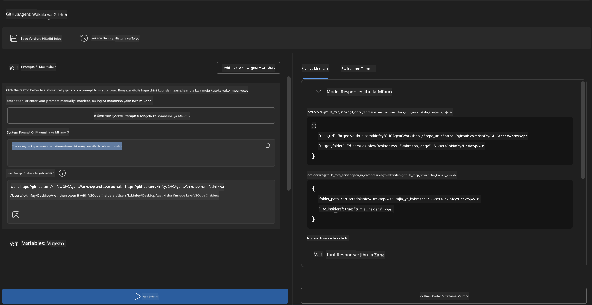
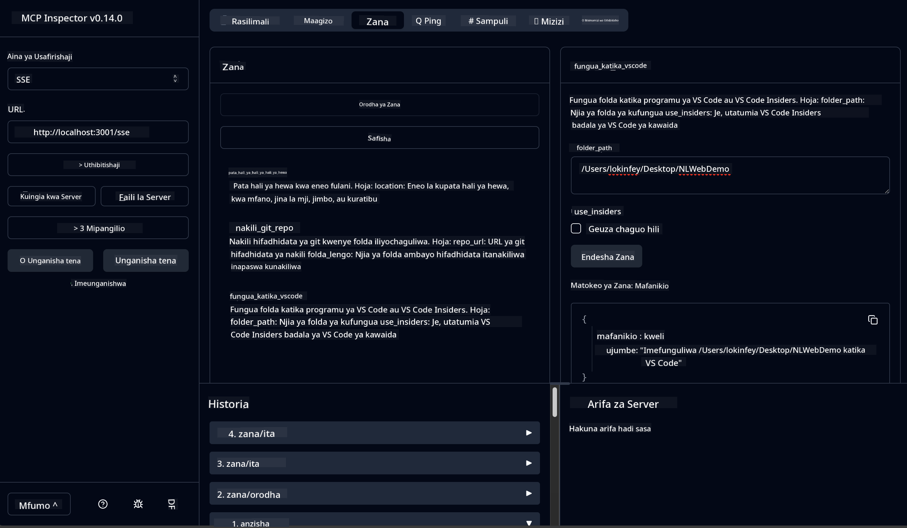

<!--
CO_OP_TRANSLATOR_METADATA:
{
  "original_hash": "f83bc722dc758efffd68667d6a1db470",
  "translation_date": "2025-06-10T06:55:16+00:00",
  "source_file": "10-StreamliningAIWorkflowsBuildingAnMCPServerWithAIToolkit/lab4/README.md",
  "language_code": "sw"
}
-->
# 🐙 Moduli 4: Maendeleo ya Vitendo ya MCP - Server ya Kigezo ya GitHub ya Kipekee


> **⚡ Anza Haraka:** Tengeneza server ya MCP inayoweza kutumika moja kwa moja inayochukua nakala za GitHub na kuunganishwa na VS Code kwa dakika 30 tu!

## 🎯 Malengo ya Kujifunza

Mwisho wa maabara hii, utaweza:

- ✅ Kuunda server ya MCP ya kipekee kwa mtiririko halisi wa maendeleo
- ✅ Kutekeleza uwezo wa kunakili hifadhidata za GitHub kupitia MCP
- ✅ Kuunganisha server za MCP za kipekee na VS Code na Agent Builder
- ✅ Kutumia GitHub Copilot Agent Mode na zana za MCP za kipekee
- ✅ Kupima na kupeleka server za MCP za kipekee kwenye mazingira ya uzalishaji

## 📋 Mahitaji ya Awali

- Kumaliza maabara 1-3 (misingi ya MCP na maendeleo ya hali ya juu)
- Usajili wa GitHub Copilot ([usajili wa bure upo](https://github.com/github-copilot/signup))
- VS Code yenye AI Toolkit na ugani wa GitHub Copilot
- Git CLI imewekwa na kusanidiwa

## 🏗️ Muhtasari wa Mradi

### **Changamoto ya Maendeleo Halisi**
Kama watengenezaji, mara nyingi tunatumia GitHub kunakili hifadhidata na kuzifungua kwenye VS Code au VS Code Insiders. Mchakato huu wa mikono unahusisha:
1. Kufungua terminal/command prompt
2. Kuenda kwenye saraka inayotakiwa
3. Kutumia amri ya `git clone`
4. Kufungua VS Code kwenye saraka iliyonakiliwa

**Suluhisho letu la MCP linahakikisha kila kitu kinatokea kwa amri moja mahiri!**

### **Utajenga Nini**
Server ya **GitHub Clone MCP** (`git_mcp_server`) inayotoa:

| Kipengele | Maelezo | Faida |
|---------|-------------|---------|
| 🔄 **Kukokotoa Hifadhidata kwa Hekima** | Nakili hifadhidata za GitHub na uhakiki | Ukaguzi wa makosa kiotomatiki |
| 📁 **Usimamizi wa Saraka kwa Hekima** | Angalia na tengeneza saraka kwa usalama | Huzuia kufutwa kwa faili zilizopo |
| 🚀 **Muunganisho wa VS Code kwa Majukwaa Mbalimbali** | Fungua miradi kwenye VS Code/Insiders | Kuendelea kwa kazi bila usumbufu |
| 🛡️ **Usimamizi Imara wa Makosa** | Shughulikia matatizo ya mtandao, ruhusa, na njia | Uaminifu kwa mazingira ya uzalishaji |

---

## 📖 Hatua kwa Hatua ya Utekelezaji

### Hatua 1: Unda GitHub Agent katika Agent Builder

1. **Anzisha Agent Builder** kupitia ugani wa AI Toolkit
2. **Unda agent mpya** kwa usanidi ufuatao:
   ```
   Agent Name: GitHubAgent
   ```

3. **Anzisha server ya MCP ya kipekee:**
   - Nenda **Zana** → **Ongeza Zana** → **Server ya MCP**
   - Chagua **"Unda Server Mpya wa MCP"**
   - Chagua **kiolezo cha Python** kwa ufanisi mkubwa
   - **Jina la Server:** `git_mcp_server`

### Hatua 2: Sanidi GitHub Copilot Agent Mode

1. **Fungua GitHub Copilot** ndani ya VS Code (Ctrl/Cmd + Shift + P → "GitHub Copilot: Open")
2. **Chagua Modeli ya Agent** kwenye kiolesura cha Copilot
3. **Chagua modeli ya Claude 3.7** kwa uwezo wa hali ya juu wa kuelewa
4. **Washa muunganisho wa MCP** kwa upatikanaji wa zana

> **💡 Ushauri wa Mtaalamu:** Claude 3.7 hutoa uelewa bora wa mtiririko wa maendeleo na mifumo ya usimamizi wa makosa.

### Hatua 3: Tekeleza Kazi Kuu ya Server ya MCP

**Tumia maelekezo haya ya kina na GitHub Copilot Agent Mode:**

```
Create two MCP tools with the following comprehensive requirements:

🔧 TOOL A: clone_repository
Requirements:
- Clone any GitHub repository to a specified local folder
- Return the absolute path of the successfully cloned project
- Implement comprehensive validation:
  ✓ Check if target directory already exists (return error if exists)
  ✓ Validate GitHub URL format (https://github.com/user/repo)
  ✓ Verify git command availability (prompt installation if missing)
  ✓ Handle network connectivity issues
  ✓ Provide clear error messages for all failure scenarios

🚀 TOOL B: open_in_vscode
Requirements:
- Open specified folder in VS Code or VS Code Insiders
- Cross-platform compatibility (Windows/Linux/macOS)
- Use direct application launch (not terminal commands)
- Auto-detect available VS Code installations
- Handle cases where VS Code is not installed
- Provide user-friendly error messages

Additional Requirements:
- Follow MCP 1.9.3 best practices
- Include proper type hints and documentation
- Implement logging for debugging purposes
- Add input validation for all parameters
- Include comprehensive error handling
```

### Hatua 4: Jaribu Server Yako ya MCP

#### 4a. Jaribu katika Agent Builder

1. **Anzisha usanidi wa debug** kwa Agent Builder
2. **Sanidi agent yako na maelekezo haya ya mfumo:**

```
SYSTEM_PROMPT:
You are my intelligent coding repository assistant. You help developers efficiently clone GitHub repositories and set up their development environment. Always provide clear feedback about operations and handle errors gracefully.
```

3. **Jaribu kwa hali halisi za mtumiaji:**

```
USER_PROMPT EXAMPLES:

Scenario : Basic Clone and Open
"Clone {Your GitHub Repo link such as https://github.com/kinfey/GHCAgentWorkshop
 } and save to {The global path you specify}, then open it with VS Code Insiders"
```



**Matokeo Yanayotarajiwa:**
- ✅ Kunakili kwa mafanikio na uthibitisho wa njia
- ✅ Kuzindua VS Code kiotomatiki
- ✅ Ujumbe wazi wa makosa kwa hali zisizo halali
- ✅ Usimamizi mzuri wa kesi za pembezoni

#### 4b. Jaribu katika MCP Inspector



---

**🎉 Hongera!** Umefanikiwa kuunda server ya MCP inayotumika kwa vitendo, inayotatua changamoto halisi za mtiririko wa maendeleo. Server yako ya kipekee ya kunakili GitHub inaonyesha nguvu ya MCP katika kuendeleza na kuongeza tija ya watengenezaji.

### 🏆 Mafanikio Yamepatikana:
- ✅ **MCP Developer** - Umeunda server ya MCP ya kipekee
- ✅ **Workflow Automator** - Umeboresha michakato ya maendeleo  
- ✅ **Integration Expert** - Umeunganisha zana nyingi za maendeleo
- ✅ **Production Ready** - Umetengeneza suluhisho zinazoweza kupelekwa

---

## 🎓 Kumaliza Warsha: Safari Yako na Model Context Protocol

**Mhusika wa Warsha,**

Hongera kwa kumaliza moduli zote nne za warsha ya Model Context Protocol! Umefikia hatua kubwa kuanzia kuelewa misingi ya AI Toolkit hadi kuunda server za MCP zinazotumika uzalishaji na kutatua changamoto halisi za maendeleo.

### 🚀 Muhtasari wa Njia Yako ya Kujifunza:

**[Moduli 1](../lab1/README.md)**: Ulianza kwa kuchunguza misingi ya AI Toolkit, upimaji wa modeli, na kuunda agent yako ya kwanza ya AI.

**[Moduli 2](../lab2/README.md)**: Ulijifunza usanifu wa MCP, kuunganisha Playwright MCP, na kuunda agent wa otomatiki wa kivinjari.

**[Moduli 3](../lab3/README.md)**: Ulipata ujuzi wa maendeleo ya server za MCP za kipekee na kuimarisha zana za uchunguzi makosa.

**[Moduli 4](../lab4/README.md)**: Sasa umeweka yote katika matumizi kwa kuunda zana ya otomatiki ya mtiririko wa hifadhidata za GitHub.

### 🌟 Umejifunza Nini:

- ✅ **Ecosystem ya AI Toolkit**: Modeli, agent, na mifumo ya muunganisho
- ✅ **Usanifu wa MCP**: Muundo wa mteja-server, itifaki za usafirishaji, na usalama
- ✅ **Zana za Mtaalamu**: Kutoka Playground hadi Inspector na kupeleka uzalishaji
- ✅ **Maendeleo Maalum**: Kujenga, kupima, na kupeleka server zako za MCP
- ✅ **Matumizi ya Vitendo**: Kutatua changamoto halisi za mtiririko wa kazi kwa AI

### 🔮 Hatua Zako Zifuatazo:

1. **Jenga Server Yako ya MCP**: Tumia ujuzi huu kuunda otomatiki wa mtiririko wako wa kipekee
2. **Jiunge na Jamii ya MCP**: Shiriki kazi zako na jifunze kutoka kwa wengine
3. **Chunguza Muunganisho wa Juu**: Unganisha server za MCP na mifumo ya kampuni
4. **Changia Chanzo Huria**: Saidia kuboresha zana na nyaraka za MCP

Kumbuka, warsha hii ni mwanzo tu. Eneo la Model Context Protocol linaendelea kukua kwa kasi, na sasa umewezeshwa kuwa mstari wa mbele wa zana za maendeleo zinazoendeshwa na AI.

**Asante kwa kushiriki na kujitolea kujifunza!**

Tunatumai warsha hii imechochea mawazo yatakayobadilisha jinsi unavyotengeneza na kuingiliana na zana za AI katika safari yako ya maendeleo.

**Furahia kuandika programu!**

---

**Kiarifu**:  
Hati hii imetafsiriwa kwa kutumia huduma ya tafsiri ya AI [Co-op Translator](https://github.com/Azure/co-op-translator). Ingawa tunajitahidi kwa usahihi, tafadhali fahamu kwamba tafsiri za moja kwa moja zinaweza kuwa na makosa au upungufu wa usahihi. Hati asili katika lugha yake ya asili inapaswa kuchukuliwa kama chanzo cha mamlaka. Kwa taarifa muhimu, tafsiri ya kitaalamu na ya binadamu inapendekezwa. Hatubebeki dhima kwa kutoelewana au tafsiri potofu zinazotokana na matumizi ya tafsiri hii.