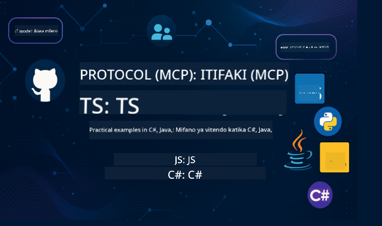

<!--
CO_OP_TRANSLATOR_METADATA:
{
  "original_hash": "db69f754d127d295e6449e29c08ed5c8",
  "translation_date": "2025-09-15T20:54:32+00:00",
  "source_file": "README.md",
  "language_code": "sw"
}
-->
 

Fuata hatua hizi kuanza kutumia rasilimali hizi:
1. **Fork Hifadhi**: Bonyeza 
2. **Clone Hifadhi**:   `git clone https://github.com/microsoft/mcp-for-beginners.git`
3. [**Jiunge na Azure AI Foundry Discord na kutana na wataalamu na watengenezaji wenzako**](https://discord.com/invite/ByRwuEEgH4)

### 🌐 Msaada wa Lugha Nyingi

#### Inasaidiwa kupitia GitHub Action (Imefanywa Kiotomatiki & Daima Imeboreshwa)

 [Arabic](../ar/README.md) | [Bengali](../bn/README.md) | [Bulgarian](../bg/README.md) | [Burmese (Myanmar)](../my/README.md) | [Chinese (Simplified)](../zh/README.md) | [Chinese (Traditional, Hong Kong)](../hk/README.md) | [Chinese (Traditional, Macau)](../mo/README.md) | [Chinese (Traditional, Taiwan)](../tw/README.md) | [Croatian](../hr/README.md) | [Czech](../cs/README.md) | [Danish](../da/README.md) | [Dutch](../nl/README.md) | [Finnish](../fi/README.md) | [French](../fr/README.md) | [German](../de/README.md) | [Greek](../el/README.md) | [Hebrew](../he/README.md) | [Hindi](../hi/README.md) | [Hungarian](../hu/README.md) | [Indonesian](../id/README.md) | [Italian](../it/README.md) | [Japanese](../ja/README.md) | [Korean](../ko/README.md) | [Malay](../ms/README.md) | [Marathi](../mr/README.md) | [Nepali](../ne/README.md) | [Norwegian](../no/README.md) | [Persian (Farsi)](../fa/README.md) | [Polish](../pl/README.md) | [Portuguese (Brazil)](../br/README.md) | [Portuguese (Portugal)](../pt/README.md) | [Punjabi (Gurmukhi)](../pa/README.md) | [Romanian](../ro/README.md) | [Russian](../ru/README.md) | [Serbian (Cyrillic)](../sr/README.md) | [Slovak](../sk/README.md) | [Slovenian](../sl/README.md) | [Spanish](../es/README.md) | [Swahili](./README.md) | [Swedish](../sv/README.md) | [Tagalog (Filipino)](../tl/README.md) | [Thai](../th/README.md) | [Turkish](../tr/README.md) | [Ukrainian](../uk/README.md) | [Urdu](../ur/README.md) | [Vietnamese](../vi/README.md)

# 🚀 Mtaala wa Model Context Protocol (MCP) kwa Anayeanza

## **Jifunze MCP kwa Mifano ya Vitendo ya Nambari katika C#, Java, JavaScript, Rust, Python, na TypeScript**

## 🧠 Muhtasari wa Mtaala wa Model Context Protocol

**Model Context Protocol (MCP)** ni mfumo wa kisasa ulioundwa kuunda viwango vya mawasiliano kati ya mifano ya AI na programu za wateja. Mtaala huu wa chanzo huria unatoa njia ya kujifunza iliyopangwa, ikijumuisha mifano ya vitendo ya nambari na matumizi halisi, katika lugha maarufu za programu kama C#, Java, JavaScript, TypeScript, na Python.

Ikiwa wewe ni mtengenezaji wa AI, mbunifu wa mifumo, au mhandisi wa programu, mwongozo huu ni rasilimali yako kamili ya kufahamu misingi ya MCP na mikakati ya utekelezaji.

## 🔗 Rasilimali Rasmi za MCP

- 📘 [MCP Documentation](https://modelcontextprotocol.io/) – Mafunzo ya kina na miongozo ya watumiaji  
- 📜 [MCP Specification](https://modelcontextprotocol.io/docs/) – Muundo wa itifaki na marejeleo ya kiufundi  
- 📜 [Original MCP Specification](https://spec.modelcontextprotocol.io/) – Marejeleo ya kiufundi ya awali (yanaweza kuwa na maelezo ya ziada)  
- 🧑‍💻 [MCP GitHub Repository](https://github.com/modelcontextprotocol) – SDKs za chanzo huria, zana, na mifano ya nambari
- 🌐 [MCP Community](https://github.com/orgs/modelcontextprotocol/discussions) – Jiunge na mijadala na changia kwa jamii

## 🧭 Muhtasari wa Mtaala wa MCP

### 📚 Muundo Kamili wa Mtaala

| Moduli | Mada | Maelezo | Kiungo |
|--------|-------|-------------|------|
| **Moduli 1-3: Misingi** | | | |
| 00 | Utangulizi wa MCP | Muhtasari wa Model Context Protocol na umuhimu wake katika mifumo ya AI | [Soma zaidi](./00-Introduction/README.md) |
| 01 | Ufafanuzi wa Dhana za Msingi | Uchunguzi wa kina wa dhana za msingi za MCP | [Soma zaidi](./01-CoreConcepts/README.md) |
| 02 | Usalama katika MCP | Vitisho vya usalama na mbinu bora | [Soma zaidi](./02-Security/README.md) |
| 03 | Kuanza na MCP | Usanidi wa mazingira, seva/mteja wa msingi, ujumuishaji | [Soma zaidi](./03-GettingStarted/README.md) |
| **Moduli 3: Kujenga Seva na Mteja wa Kwanza** | | | |
| 3.1 | Seva ya Kwanza | Unda seva yako ya kwanza ya MCP | [Mwongozo](./03-GettingStarted/01-first-server/README.md) |
| 3.2 | Mteja wa Kwanza | Tengeneza mteja wa msingi wa MCP | [Mwongozo](./03-GettingStarted/02-client/README.md) |
| 3.3 | Mteja na LLM | Jumuisha mifano mikubwa ya lugha | [Mwongozo](./03-GettingStarted/03-llm-client/README.md) |
| 3.4 | Ujumuishaji wa VS Code | Tumia seva za MCP katika VS Code | [Mwongozo](./03-GettingStarted/04-vscode/README.md) |
| 3.5 | Seva ya stdio | Unda seva kwa kutumia usafirishaji wa stdio | [Mwongozo](./03-GettingStarted/05-stdio-server/README.md) |
| 3.6 | Ustream wa HTTP | Tekeleza ustream wa HTTP katika MCP | [Mwongozo](./03-GettingStarted/06-http-streaming/README.md) |
| 3.7 | Zana ya AI | Tumia Zana ya AI na MCP | [Mwongozo](./03-GettingStarted/07-aitk/README.md) |
| 3.8 | Upimaji | Pima utekelezaji wa seva yako ya MCP | [Mwongozo](./03-GettingStarted/08-testing/README.md) |
| 3.9 | Uwekaji | Weka seva za MCP katika uzalishaji | [Mwongozo](./03-GettingStarted/09-deployment/README.md) |
| **Moduli 4-5: Vitendo & Juu Zaidi** | | | |
| 04 | Utekelezaji wa Vitendo | SDKs, urekebishaji, upimaji, templeti za maelekezo zinazoweza kutumika tena | [Soma zaidi](./04-PracticalImplementation/README.md) |
| 05 | Mada za Juu katika MCP | AI ya njia nyingi, upanuzi, matumizi ya biashara | [Soma zaidi](./05-AdvancedTopics/README.md) |
| 5.1 | Ujumuishaji wa Azure | Ujumuishaji wa MCP na Azure | [Mwongozo](./05-AdvancedTopics/mcp-integration/README.md) |
| 5.2 | Njia Nyingi | Kufanya kazi na njia nyingi | [Mwongozo](./05-AdvancedTopics/mcp-multi-modality/README.md) |
| 5.3 | Demo ya OAuth2 | Tekeleza uthibitishaji wa OAuth2 | [Mwongozo](./05-AdvancedTopics/mcp-oauth2-demo/README.md) |
| 5.4 | Muktadha wa Mizizi | Fahamu na tekeleza muktadha wa mizizi | [Mwongozo](./05-AdvancedTopics/mcp-root-contexts/README.md) |
| 5.5 | Uelekezaji | Mikakati ya uelekezaji wa MCP | [Mwongozo](./05-AdvancedTopics/mcp-routing/README.md) |
| 5.6 | Sampuli | Mbinu za sampuli katika MCP | [Mwongozo](./05-AdvancedTopics/mcp-sampling/README.md) |
| 5.7 | Upanuzi | Panua utekelezaji wa MCP | [Mwongozo](./05-AdvancedTopics/mcp-scaling/README.md) |
| 5.8 | Usalama | Mazingatio ya usalama wa juu | [Mwongozo](./05-AdvancedTopics/mcp-security/README.md) |
| 5.9 | Utafutaji wa Wavuti | Tekeleza uwezo wa utafutaji wa wavuti | [Mwongozo](./05-AdvancedTopics/web-search-mcp/README.md) |
| 5.10 | Ustream wa Wakati Halisi | Jenga utendaji wa ustream wa wakati halisi | [Mwongozo](./05-AdvancedTopics/mcp-realtimestreaming/README.md) |
| 5.11 | Utafutaji wa Wakati Halisi | Tekeleza utafutaji wa wakati halisi | [Mwongozo](./05-AdvancedTopics/mcp-realtimesearch/README.md) |
| 5.12 | Uthibitishaji wa Entra ID | Uthibitishaji na Microsoft Entra ID | [Mwongozo](./05-AdvancedTopics/mcp-security-entra/README.md) |
| 5.13 | Ujumuishaji wa Foundry | Jumuisha na Azure AI Foundry | [Mwongozo](./05-AdvancedTopics/mcp-foundry-agent-integration/README.md) |
| 5.14 | Uhandisi wa Muktadha | Mbinu za uhandisi wa muktadha bora | [Mwongozo](./05-AdvancedTopics/mcp-contextengineering/README.md) |
| 5.15 | Usafirishaji wa MCP wa Kawaida | Utekelezaji wa Usafirishaji wa Kawaida | [Mwongozo](./05-AdvancedTopics/mcp-transport/README.md) |

| **Moduli 6-10: Jamii & Mbinu Bora** | | | |
| 06 | Michango ya Jamii | Jinsi ya kuchangia kwa mfumo wa MCP | [Mwongozo](./06-CommunityContributions/README.md) |
| 07 | Maarifa kutoka kwa Matumizi ya Mapema | Hadithi za utekelezaji wa ulimwengu halisi | [Mwongozo](./07-LessonsFromEarlyAdoption/README.md) |
| 08 | Mbinu Bora za MCP | Utendaji, uvumilivu wa makosa, ustahimilivu | [Mwongozo](./08-BestPractices/README.md) |
| 09 | Uchunguzi wa Kesi za MCP | Mifano ya utekelezaji wa vitendo | [Mwongozo](./09-CaseStudy/README.md) |
| 10 | Warsha ya Vitendo | Kujenga Seva ya MCP na Zana ya AI | [Maabara](./10-StreamliningAIWorkflowsBuildingAnMCPServerWithAIToolkit/README.md) |

### 💻 Miradi ya Mifano ya Nambari

#### Sampuli za Msingi za MCP Calculator

| Lugha | Maelezo | Kiungo |
|----------|-------------|------|
| C# | Mfano wa Seva ya MCP | [Tazama Nambari](./03-GettingStarted/samples/csharp/README.md) |
| Java | MCP Calculator | [Tazama Nambari](./03-GettingStarted/samples/java/calculator/README.md) |
| JavaScript | Demo ya MCP | [Tazama Nambari](./03-GettingStarted/samples/javascript/README.md) |
| Python | Seva ya MCP | [Tazama Nambari](../../03-GettingStarted/samples/python/mcp_calculator_server.py) |
| TypeScript | Mfano wa MCP | [Tazama Nambari](./03-GettingStarted/samples/typescript/README.md) |
| Rust | Mfano wa MCP | [Tazama Nambari](./03-GettingStarted/samples/rust/README.md) |
#### Utekelezaji wa Juu wa MCP

| Lugha | Maelezo | Kiungo |
|-------|---------|--------|
| C# | Mfano wa Juu | [View Code](./04-PracticalImplementation/samples/csharp/README.md) |
| Java na Spring | Mfano wa Programu ya Kontena | [View Code](./04-PracticalImplementation/samples/java/containerapp/README.md) |
| JavaScript | Mfano wa Juu | [View Code](./04-PracticalImplementation/samples/javascript/README.md) |
| Python | Utekelezaji wa Kiwango cha Juu | [View Code](../../04-PracticalImplementation/samples/python/READMEmd) |
| TypeScript | Mfano wa Kontena | [View Code](./04-PracticalImplementation/samples/typescript/README.md) |

## 🎯 Mahitaji ya Awali ya Kujifunza MCP

Ili kufaidika zaidi na mtaala huu, unapaswa kuwa na:

- Ujuzi wa msingi wa programu katika angalau moja ya lugha zifuatazo: C#, Java, JavaScript, Python, au TypeScript
- Uelewa wa modeli ya mteja-server na API
- Ufahamu wa dhana za REST na HTTP
- (Hiari) Msingi wa dhana za AI/ML

- Kujiunga na mijadala ya jamii kwa msaada

## 📚 Mwongozo wa Kujifunza & Rasilimali

Hifadhi hii inajumuisha rasilimali kadhaa za kukusaidia kuvinjari na kujifunza kwa ufanisi:

### Mwongozo wa Kujifunza

Mwongozo wa kina [Study Guide](./study_guide.md) unapatikana kukusaidia kuvinjari hifadhi hii kwa ufanisi. Mwongozo unajumuisha:

- Ramani ya mtaala inayoonyesha mada zote zinazoshughulikiwa
- Ufafanuzi wa kina wa kila sehemu ya hifadhi
- Mwongozo wa jinsi ya kutumia miradi ya mfano
- Njia za kujifunza zinazopendekezwa kwa viwango tofauti vya ujuzi
- Rasilimali za ziada za kuimarisha safari yako ya kujifunza

### Changelog

Tunadumisha [Changelog](./changelog.md) ya kina inayofuatilia masasisho yote muhimu ya vifaa vya mtaala, ikiwa ni pamoja na:

- Nyongeza mpya za maudhui
- Mabadiliko ya muundo
- Uboreshaji wa vipengele
- Masasisho ya nyaraka

## 🛠️ Jinsi ya Kutumia Mtaala Huu kwa Ufanisi

Kila somo katika mwongozo huu linajumuisha:

1. Maelezo wazi ya dhana za MCP  
2. Mifano ya moja kwa moja ya msimbo katika lugha mbalimbali  
3. Mazoezi ya kujenga programu halisi za MCP  
4. Rasilimali za ziada kwa wanaojifunza wa kiwango cha juu  

## Matukio 

### [MCP Dev Days Julai 2025](https://developer.microsoft.com/en-us/reactor/series/S-1563/)
#### [➡️Tazama kwa Mahitaji - MCP Dev Days](https://developer.microsoft.com/en-us/reactor/series/S-1563/)
Jiandae kwa siku mbili za maarifa ya kina ya kiufundi, muunganisho wa jamii, na kujifunza kwa vitendo katika MCP Dev Days, tukio la mtandaoni lililojitolea kwa Model Context Protocol (MCP) — kiwango kipya kinachounganisha mifano ya AI na zana wanazotegemea.

Unaweza kutazama MCP Dev Days kwa kujisajili kwenye ukurasa wetu wa tukio: https://aka.ms/mcpdevdays. 

#### [Siku ya 1: Uzalishaji wa MCP, Zana za Maendeleo, & Jamii:](https://developer.microsoft.com/en-us/reactor/series/S-1563/)

Ni kuhusu kuwawezesha watengenezaji kutumia MCP katika mtiririko wao wa kazi wa maendeleo na kusherehekea jamii ya ajabu ya MCP. Tutakuwa na wanajamii na washirika kama Arcade, Block, Okta, na Neon kuona jinsi wanavyoshirikiana na Microsoft kuunda mfumo wa MCP wazi na unaoweza kupanuka. 

- Maonyesho halisi ya VS Code, Visual Studio, GitHub Copilot, na zana maarufu za jamii  
- Mtiririko wa kazi wa maendeleo unaoendeshwa na muktadha  
- Vipindi vinavyoongozwa na jamii na maarifa  

Ikiwa unaanza tu na MCP au tayari unajenga nayo, Siku ya 1 itatoa msukumo na hatua za kuchukua.

#### [Siku ya 2: Jenga Seva za MCP kwa Ujasiri](https://developer.microsoft.com/en-us/reactor/series/S-1563/)

Ni kwa wajenzi wa MCP. Tutachunguza kwa kina mikakati ya utekelezaji na mazoea bora ya kuunda seva za MCP na kuunganisha MCP katika mtiririko wako wa kazi wa AI.

#### Mada zinajumuisha:

- Kujenga Seva za MCP na kuzihusisha katika uzoefu wa mawakala  
- Maendeleo yanayoendeshwa na maelekezo  
- Mazoea bora ya usalama  
- Kutumia vipengele kama Functions, ACA, na API Management  
- Ulinganifu wa rejista na zana (1P + 3P)  

Ikiwa wewe ni mtengenezaji, mjenzi wa zana, au mkakati wa bidhaa za AI, siku hii imejaa maarifa unayohitaji kujenga suluhisho za MCP zinazoweza kupanuka, salama, na tayari kwa siku zijazo.

### MCP Boot Camp Agosti 2025
Jifunze katika vipindi vya video vya kina jinsi ya kuunda seva za MCP, kuunganisha na VS Code, na kupeleka kitaalamu kwenye Azure kulingana na maudhui kutoka mtaala wa MCP kwa Kompyuta. Ondoka na ujuzi wa vitendo katika teknolojia ambayo kampuni kubwa tayari zinatumia.

#### [➡️Tazama kwa Mahitaji MCP Bootcamp | Kiingereza](https://developer.microsoft.com/en-us/reactor/series/s-1568/)
#### [➡️Tazama kwa Mahitaji MCP Bootcamp | Brasil](https://developer.microsoft.com/en-us/reactor/series/S-1566/)
#### [➡️Tazama kwa Mahitaji MCP Bootcamp | Kihispania](https://developer.microsoft.com/en-us/reactor/series/S-1567/)

### Jifunze MCP na C# - Mfululizo wa Mafunzo
Jifunze kuhusu Model Context Protocol (MCP), mfumo wa kisasa ulioundwa kuunda kiwango cha mawasiliano kati ya mifano ya AI na programu za wateja. Kupitia kipindi hiki kinachofaa kwa wanaoanza, tutakutambulisha kwa MCP na kukuongoza kuunda seva yako ya kwanza ya MCP.  
#### C#: [https://aka.ms/letslearnmcp-csharp](https://aka.ms/letslearnmcp-csharp)  
#### Java: [https://aka.ms/letslearnmcp-java](https://aka.ms/letslearnmcp-java)  
#### JavaScript: [https://aka.ms/letslearnmcp-javascript](https://aka.ms/letslearnmcp-javascript)  
#### Python: [https://aka.ms/letslearnmcp-python](https://aka.ms/letslearnmcp-python)  

## 🌟 Shukrani za Jamii

Shukrani kwa Microsoft Valued Professional [Shivam Goyal](https://www.linkedin.com/in/shivam2003/) kwa kuchangia mifano muhimu ya msimbo.  

## 📜 Taarifa ya Leseni

Maudhui haya yamepewa leseni chini ya **Leseni ya MIT**. Kwa masharti na hali, angalia [LICENSE](../../LICENSE).

## 🤝 Miongozo ya Mchango

Mradi huu unakaribisha michango na mapendekezo. Michango mingi inahitaji ukubali Mkataba wa Leseni ya Mchango (CLA) unaoeleza kuwa una haki ya, na kwa kweli unatoa, haki kwetu kutumia mchango wako. Kwa maelezo zaidi, tembelea  
<https://cla.opensource.microsoft.com>.  

Unapowasilisha ombi la kuvuta, bot ya CLA itaamua kiotomatiki ikiwa unahitaji kutoa CLA na kupamba PR ipasavyo (mfano, ukaguzi wa hali, maoni). Fuata tu maagizo yaliyotolewa na bot. Utahitaji kufanya hivyo mara moja tu katika hifadhi zote zinazotumia CLA yetu.  

Mradi huu umechukua [Microsoft Open Source Code of Conduct](https://opensource.microsoft.com/codeofconduct/).  
Kwa maelezo zaidi angalia [Maswali Yanayoulizwa Mara kwa Mara ya Kanuni za Maadili](https://opensource.microsoft.com/codeofconduct/faq/) au wasiliana na [opencode@microsoft.com](mailto:opencode@microsoft.com) kwa maswali au maoni ya ziada.  

## 📂 Muundo wa Hifadhi

Hifadhi imepangwa kama ifuatavyo:

- **Mtaala wa Msingi (00-10)**: Maudhui kuu yaliyopangwa katika moduli kumi mfululizo  
- **images/**: Michoro na vielelezo vinavyotumika katika mtaala  
- **translations/**: Usaidizi wa lugha nyingi na tafsiri za kiotomatiki  
- **translated_images/**: Matoleo yaliyotafsiriwa ya michoro na vielelezo  
- **study_guide.md**: Mwongozo wa kina wa kuvinjari hifadhi  
- **changelog.md**: Rekodi ya mabadiliko yote muhimu ya vifaa vya mtaala  
- **mcp.json**: Faili ya usanidi wa maelezo ya MCP  
- **CODE_OF_CONDUCT.md, LICENSE, SECURITY.md, SUPPORT.md**: Nyaraka za usimamizi wa mradi  

## 🎒 Kozi Nyingine
Timu yetu inazalisha kozi nyingine! Angalia:  

- [AI Agents For Beginners](https://github.com/microsoft/ai-agents-for-beginners?WT.mc_id=academic-105485-koreyst)  
- [Generative AI for Beginners using .NET](https://github.com/microsoft/Generative-AI-for-beginners-dotnet?WT.mc_id=academic-105485-koreyst)  
- [Generative AI for Beginners using JavaScript](https://github.com/microsoft/generative-ai-with-javascript?WT.mc_id=academic-105485-koreyst)  
- [Generative AI for Beginners](https://github.com/microsoft/generative-ai-for-beginners?WT.mc_id=academic-105485-koreyst)  
- [Generative AI for Beginners using Java](https://github.com/microsoft/generative-ai-for-beginners-java?WT.mc_id=academic-105485-koreyst)  
- [ML for Beginners](https://aka.ms/ml-beginners?WT.mc_id=academic-105485-koreyst)  
- [Data Science for Beginners](https://aka.ms/datascience-beginners?WT.mc_id=academic-105485-koreyst)  
- [AI for Beginners](https://aka.ms/ai-beginners?WT.mc_id=academic-105485-koreyst)  
- [Cybersecurity for Beginners](https://github.com/microsoft/Security-101?WT.mc_id=academic-96948-sayoung)  
- [Web Dev for Beginners](https://aka.ms/webdev-beginners?WT.mc_id=academic-105485-koreyst)  
- [IoT for Beginners](https://aka.ms/iot-beginners?WT.mc_id=academic-105485-koreyst)  
- [XR Development for Beginners](https://github.com/microsoft/xr-development-for-beginners?WT.mc_id=academic-105485-koreyst)  
- [Mastering GitHub Copilot for AI Paired Programming](https://aka.ms/GitHubCopilotAI?WT.mc_id=academic-105485-koreyst)  
- [Mastering GitHub Copilot for C#/.NET Developers](https://github.com/microsoft/mastering-github-copilot-for-dotnet-csharp-developers?WT.mc_id=academic-105485-koreyst)  
- [Choose Your Own Copilot Adventure](https://github.com/microsoft/CopilotAdventures?WT.mc_id=academic-105485-koreyst)  

## ™️ Taarifa ya Alama ya Biashara

Mradi huu unaweza kuwa na alama za biashara au nembo za miradi, bidhaa, au huduma. Matumizi yaliyoidhinishwa ya alama za biashara au nembo za Microsoft yanapaswa kufuata na lazima yafuate  
[Microsoft's Trademark & Brand Guidelines](https://www.microsoft.com/legal/intellectualproperty/trademarks/usage/general).  
Matumizi ya alama za biashara au nembo za Microsoft katika matoleo yaliyorekebishwa ya mradi huu hayapaswi kusababisha mkanganyiko au kuashiria udhamini wa Microsoft.  
Matumizi yoyote ya alama za biashara au nembo za wahusika wengine yanapaswa kufuata sera za wahusika hao.  

---

**Kanusho**:  
Hati hii imetafsiriwa kwa kutumia huduma ya kutafsiri ya AI [Co-op Translator](https://github.com/Azure/co-op-translator). Ingawa tunajitahidi kuhakikisha usahihi, tafadhali fahamu kuwa tafsiri za kiotomatiki zinaweza kuwa na makosa au kutokuwa sahihi. Hati ya asili katika lugha yake ya awali inapaswa kuzingatiwa kama chanzo cha mamlaka. Kwa taarifa muhimu, tafsiri ya kitaalamu ya binadamu inapendekezwa. Hatutawajibika kwa kutokuelewana au tafsiri zisizo sahihi zinazotokana na matumizi ya tafsiri hii.