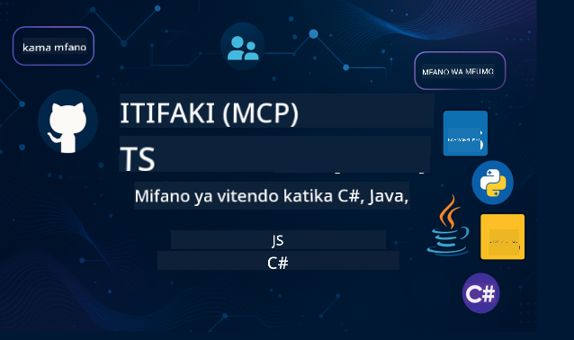

<!--
CO_OP_TRANSLATOR_METADATA:
{
  "original_hash": "2a21391378c12ecfef50f866329dfde0",
  "translation_date": "2025-05-17T05:32:16+00:00",
  "source_file": "README.md",
  "language_code": "sw"
}
-->

Fuata hatua hizi ili kuanza kutumia rasilimali hizi:
1. **Gawa Hifadhi**: Bofya 
2. **Nakili Hifadhi**: `git clone https://github.com/microsoft/mcp-for-beginners.git`
3. [**Jiunge na Microsoft Azure AI Foundry Discord na kutana na wataalamu na waendelezaji wenzako**](https://discord.com/invite/ByRwuEEgH4)

### 🌐 Msaada wa Lugha Nyingi

#### Inasaidiwa kupitia GitHub Action (Inajitegemea & Inasasishwa Kila Wakati)
[French](../fr/README.md) | [Spanish](../es/README.md) | [German](../de/README.md) | [Russian](../ru/README.md) | [Arabic](../ar/README.md) | [Persian (Farsi)](../fa/README.md) | [Urdu](../ur/README.md) | [Chinese (Simplified)](../zh/README.md) | [Chinese (Traditional, Macau)](../mo/README.md) | [Chinese (Traditional, Hong Kong)](../hk/README.md) | [Chinese (Traditional, Taiwan)](../tw/README.md) | [Japanese](../ja/README.md) | [Korean](../ko/README.md) | [Hindi](../hi/README.md) | [Bengali](../bn/README.md) | [Marathi](../mr/README.md) | [Nepali](../ne/README.md) | [Punjabi (Gurmukhi)](../pa/README.md) | [Portuguese (Portugal)](../pt/README.md) | [Portuguese (Brazil)](../br/README.md) | [Italian](../it/README.md) | [Polish](../pl/README.md) | [Turkish](../tr/README.md) | [Greek](../el/README.md) | [Thai](../th/README.md) | [Swedish](../sv/README.md) | [Danish](../da/README.md) | [Norwegian](../no/README.md) | [Finnish](../fi/README.md) | [Dutch](../nl/README.md) | [Hebrew](../he/README.md) | [Vietnamese](../vi/README.md) | [Indonesian](../id/README.md) | [Malay](../ms/README.md) | [Tagalog (Filipino)](../tl/README.md) | [Kiswahili](./README.md) | [Hungarian](../hu/README.md) | [Czech](../cs/README.md) | [Slovak](../sk/README.md) | [Romanian](../ro/README.md) | [Bulgarian](../bg/README.md) | [Serbian (Cyrillic)](../sr/README.md) | [Croatian](../hr/README.md) | [Slovenian](../sl/README.md)
# 🚀 Mwongozo wa Mwisho kwa Mtaala wa Model Context Protocol (MCP) kwa Anayeanza

## **Jifunze MCP kwa Mifano ya Vitendo ya Nambari katika C#, Java, JavaScript, Python, na TypeScript**

## 🧠 Muhtasari wa Mtaala wa Model Context Protocol

**Model Context Protocol (MCP)** ni mfumo wa kisasa ulioundwa kwa ajili ya kusanifisha maingiliano kati ya mifano ya AI na programu za wateja. Mtaala huu wa chanzo huria unatoa njia ya kujifunza iliyopangiliwa, ikiwa na mifano ya nambari ya vitendo na matumizi halisi ya ulimwengu, katika lugha maarufu za programu kama C#, Java, JavaScript, TypeScript, na Python.

Iwapo wewe ni msanidi wa AI, mbunifu wa mifumo, au mhandisi wa programu, mwongozo huu ni rasilimali yako ya kina kwa kufahamu misingi ya MCP na mikakati ya utekelezaji.

## 🔗 Rasilimali Rasmi za MCP

- 📘 [MCP Documentation](https://modelcontextprotocol.io/) – Mafunzo ya kina na miongozo ya watumiaji  
- 📜 [MCP Specification](https://spec.modelcontextprotocol.io/) – Muundo wa itifaki na marejeo ya kiufundi  
- 🧑‍💻 [MCP GitHub Repository](https://github.com/modelcontextprotocol) – SDKs za chanzo huria, zana, na mifano ya nambari  

## 🧭 Muundo Kamili wa Mtaala wa MCP

### 📌 [Utangulizi wa MCP](./00-Introduction/README.md)

- Model Context Protocol ni nini?
- Kwa nini usanifishaji ni muhimu katika mifumo ya AI
- Matumizi ya vitendo na faida za MCP

### 🧩 [Mafunzo ya Misingi](./01-CoreConcepts/README.md)

- Kuelewa usanifu wa mteja-server katika MCP
- Vipengele muhimu vya itifaki: maombi, majibu, na schemas
- Mifumo ya ujumbe na ubadilishanaji wa data ya MCP

### 🔐 [Usalama katika MCP](./02-Security/readme.md)

- Kutambua vitisho vya usalama katika mifumo inayotumia MCP
- Mbinu na taratibu bora za kulinda utekelezaji

### 🚀 [Kuanza na MCP](./03-GettingStarted/README.md)

- Usanidi wa mazingira na usanidi
- Kuunda seva na wateja wa msingi wa MCP
- Kuingiza MCP na programu zilizopo

#### 🧮 Miradi ya Mfano wa Calculator wa MCP:

  
<strong>Chunguza Utekelezaji wa Nambari kwa Lugha</strong>

  - [Mfano wa Seva ya MCP ya C#](./03-GettingStarted/samples/csharp/README.md)
  - [Java MCP Calculator](./03-GettingStarted/samples/java/calculator/README.md)
  - [JavaScript MCP Demo](./03-GettingStarted/samples/javascript/README.md)
  - [Python MCP Server](../../03-GettingStarted/samples/python/mcp_calculator_server.py)
  - [Mfano wa TypeScript MCP](./03-GettingStarted/samples/typescript/README.md)

### 🛠️ [Utekelezaji wa Vitendo](./04-PracticalImplementation/README.md)

- Kutumia SDKs katika lugha tofauti
- Kudebug, kujaribu, na kuthibitisha
- Kuunda templates za maelekezo zinazoweza kutumika tena na michakato

#### 💡 Miradi ya Calculator ya MCP ya Juu:

  
<strong>Chunguza Sampuli za Juu</strong>

  - [Sampuli ya Juu ya C#](./04-PracticalImplementation/samples/csharp/README.md)
  - [Mfano wa Programu ya Java Container](./04-PracticalImplementation/samples/java/containerapp/README.md)
  - [Sampuli ya Juu ya JavaScript](./04-PracticalImplementation/samples/javascript/README.md)
  - [Utekelezaji Mgumu wa Python](../../04-PracticalImplementation/samples/python/mcp_sample.py)
  - [Sampuli ya TypeScript Container](./04-PracticalImplementation/samples/typescript/README.md)

### 🎓 [Mada za Juu katika MCP](./05-AdvancedTopics/README.md)

- Michakato ya AI ya aina nyingi na uwezo wa kupanuka
- Mikakati ya kuongeza usalama
- MCP katika mifumo ya biashara

### 🌍 [Michango ya Jamii](./06-CommunityContributions/README.md)

- Jinsi ya kuchangia nambari na nyaraka
- Kushirikiana kupitia GitHub
- Maboresho na maoni yanayotokana na jamii

### 📈 [Maarifa kutoka kwa Kupitishwa Mapema](./07-CaseStudies/README.md)

- Utekelezaji halisi na kile kilichofanya kazi
- Kujenga na kutekeleza suluhisho za msingi za MCP
- Mwelekeo na ramani ya barabara ya baadaye

### 📏 [Taratibu Bora kwa MCP](./08-BestPractices/README.md)

- Kurekebisha na kuboresha utendaji
- Kubuni mifumo ya MCP inayostahimili makosa
- Mikakati ya kupima na ustahimilivu

### 📊 [Uchunguzi wa Kesi za MCP](./09-CaseStudy/Readme.md)

- Uchunguzi wa kina katika usanifu wa suluhisho za MCP
- Ramani za utekelezaji na vidokezo vya ujumuishaji
- Michoro iliyo na maelezo na mwongozo wa mradi

## 🎯 Mahitaji ya Kujifunza MCP

Ili kufaidika zaidi na mtaala huu, unapaswa kuwa na:

- Ujuzi wa msingi wa C#, Java, au Python
- Uelewa wa mfano wa mteja-server na API
- (Hiari) Uzoefu na dhana za kujifunza kwa mashine

## 🛠️ Jinsi ya Kutumia Mtaala Huu Kwa Ufanisi

Kila somo katika mwongozo huu linajumuisha:

1. Maelezo wazi ya dhana za MCP  
2. Mifano ya nambari hai katika lugha nyingi  
3. Mazoezi ya kujenga programu halisi za MCP  
4. Rasilimali za ziada kwa wanaojifunza wa hali ya juu  

## 📜 Taarifa ya Leseni

Yaliyomo yamepewa leseni chini ya **Leseni ya MIT**. Kwa masharti na hali, angalia [LICENSE](../../LICENSE).

## 🤝 Miongozo ya Michango

Mradi huu unakaribisha michango na mapendekezo. Michango mingi inahitaji kukubaliana na Mkataba wa Leseni ya Mchangiaji (CLA) unaosema kuwa una haki, na kweli unatoa, haki za kutumia mchango wako. Kwa maelezo zaidi, tembelea <https://cla.opensource.microsoft.com>.

Unapowasilisha ombi la kuvuta, bot ya CLA itaamua kiotomatiki ikiwa unahitaji kutoa CLA na kupamba PR ipasavyo (mfano, ukaguzi wa hali, maoni). Fuata tu maelekezo yaliyotolewa na bot. Utahitaji kufanya hivi mara moja tu katika repos zote zinazotumia CLA yetu.

Mradi huu umechukua [Microsoft Open Source Code of Conduct](https://opensource.microsoft.com/codeofconduct/).
Kwa maelezo zaidi angalia [Maswali Yanayoulizwa Mara kwa Mara kuhusu Kanuni za Maadili](https://opensource.microsoft.com/codeofconduct/faq/) au
wasiliana na [opencode@microsoft.com](mailto:opencode@microsoft.com) kwa maswali au maoni ya ziada.

## ™️ Taarifa ya Alama ya Biashara

Mradi huu unaweza kuwa na alama za biashara au nembo za miradi, bidhaa, au huduma. Matumizi yaliyoidhinishwa ya alama za biashara au nembo za Microsoft yanapaswa kufuata
[Miongozo ya Alama ya Biashara na Alama za Microsoft](https://www.microsoft.com/legal/intellectualproperty/trademarks/usage/general).
Matumizi ya alama za biashara au nembo za Microsoft katika matoleo yaliyobadilishwa ya mradi huu hayapaswi kusababisha mkanganyiko au kuashiria udhamini wa Microsoft.
Matumizi yoyote ya alama za biashara au nembo za wahusika wengine yanapaswa kufuata sera za wahusika hao.

**Kanusho**: 
Hati hii imetafsiriwa kwa kutumia huduma ya tafsiri ya AI [Co-op Translator](https://github.com/Azure/co-op-translator). Ingawa tunajitahidi kwa usahihi, tafadhali fahamu kuwa tafsiri za kiotomatiki zinaweza kuwa na makosa au kutokuwa sahihi. Hati ya asili katika lugha yake ya kiasili inapaswa kuzingatiwa kama chanzo cha mamlaka. Kwa habari muhimu, tafsiri ya kibinadamu ya kitaalamu inapendekezwa. Hatutawajibika kwa kutokuelewana au tafsiri potofu zinazotokana na matumizi ya tafsiri hii.