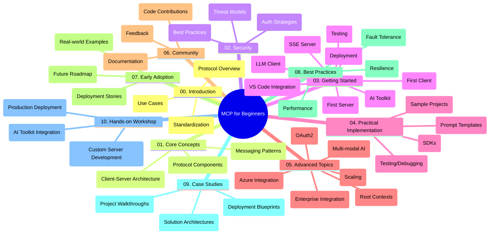

<!--
CO_OP_TRANSLATOR_METADATA:
{
  "original_hash": "a607d4febc94caee9a12b77795f7fc9a",
  "translation_date": "2025-06-11T16:49:06+00:00",
  "source_file": "study_guide.md",
  "language_code": "sw"
}
-->
# Model Context Protocol (MCP) kwa Waanzilishi - Mwongozo wa Kujifunza

Mwongozo huu wa kujifunza unatoa muhtasari wa muundo na maudhui ya hazina ya "Model Context Protocol (MCP) kwa Waanzilishi". Tumia mwongozo huu kuvinjari hazina kwa ufanisi na kutumia vyema rasilimali zilizopo.

## Muhtasari wa Hazina

Model Context Protocol (MCP) ni mfumo uliopangwa kwa viwango vya mawasiliano kati ya mifano ya AI na programu za wateja. Hazina hii inatoa mtaala kamili wenye mifano ya vitendo ya msimbo kwa C#, Java, JavaScript, Python, na TypeScript, iliyoundwa kwa watengenezaji wa AI, wabunifu wa mifumo, na wahandisi wa programu.

## Ramani ya Mtaala ya Kuona

## Muundo wa Hazina

Hazina imegawanyika katika sehemu kumi kuu, kila moja ikiwa na mwelekeo tofauti wa MCP:

1. **Utangulizi (00-Introduction/)**
   - Muhtasari wa Model Context Protocol
   - Kwa nini kuweka viwango ni muhimu katika mizunguko ya AI
   - Matumizi halisi na faida zake

2. **Misingi Muhimu (01-CoreConcepts/)**
   - Muundo wa mteja-mtumiaji
   - Vipengele muhimu vya itifaki
   - Mifumo ya ujumbe katika MCP

3. **Usalama (02-Security/)**
   - Vitisho vya usalama katika mifumo inayotumia MCP
   - Mbinu bora za kuhakikisha usalama wa utekelezaji
   - Mikakati ya uthibitishaji na ruhusa

4. **Kuanza (03-GettingStarted/)**
   - Kuandaa na kusanidi mazingira
   - Kuunda seva na wateja wa MCP wa msingi
   - Kuunganisha na programu zilizopo
   - Sehemu ndogo za seva ya kwanza, mteja wa kwanza, mteja wa LLM, muunganisho wa VS Code, seva ya SSE, AI Toolkit, upimaji, na uenezaji

5. **Utekelezaji wa Vitendo (04-PracticalImplementation/)**
   - Kutumia SDK katika lugha tofauti za programu
   - Mbinu za utatuzi, upimaji, na uthibitishaji
   - Kuunda templeti za maelekezo na mizunguko inayoweza kutumika tena
   - Miradi ya mfano yenye mifano ya utekelezaji

6. **Mada za Juu Zaidi (05-AdvancedTopics/)**
   - Mizunguko ya AI yenye njia nyingi na uwezekano wa kupanuka
   - Mikakati salama ya kupanua matumizi
   - MCP katika mazingira ya biashara
   - Mada maalum ikiwa ni pamoja na muunganisho wa Azure, njia nyingi, OAuth2, muktadha wa mizizi, uelekezaji, sampuli, kupanua, usalama, muunganisho wa utafutaji mtandaoni, na uenezaji wa mtiririko.

7. **Michango ya Jumuiya (06-CommunityContributions/)**
   - Jinsi ya kuchangia msimbo na nyaraka
   - Kushirikiana kupitia GitHub
   - Maboresho na maoni yanayotokana na jumuiya

8. **Mafunzo Kutoka kwa Watumiaji wa Mapema (07-LessonsfromEarlyAdoption/)**
   - Utekelezaji halisi na hadithi za mafanikio
   - Kujenga na kueneza suluhisho za MCP
   - Mwelekeo na ramani ya siku za usoni

9. **Mifano Bora (08-BestPractices/)**
   - Uboreshaji wa utendaji na ufanisi
   - Kubuni mifumo ya MCP inayostahimili hitilafu
   - Mbinu za upimaji na ustahimilivu

10. **Mifano ya Kesi (09-CaseStudy/)**
    - Uchunguzi wa kina wa miundo ya suluhisho za MCP
    - Mipango ya uenezaji na vidokezo vya muunganisho
    - Michoro iliyoelezewa na maelezo ya mradi

11. **Warsha ya Vitendo (10-StreamliningAIWorkflowsBuildingAnMCPServerWithAIToolkit/)**
    - Warsha ya vitendo kamili inayochanganya MCP na AI Toolkit ya Microsoft kwa VS Code
    - Kujenga programu za akili zinazounganisha mifano ya AI na zana halisi
    - Moduli za vitendo zinazojumuisha misingi, uundaji wa seva maalum, na mikakati ya uenezaji wa uzalishaji

## Miradi ya Mfano

Hazina ina miradi mingi ya mfano inayoonyesha utekelezaji wa MCP katika lugha tofauti za programu:

### Mifano ya Msingi ya Kihesabu ya MCP
- Mfano wa Seva ya MCP kwa C#
- Kihesabu cha MCP cha Java
- Onyesho la MCP la JavaScript
- Seva ya MCP ya Python
- Mfano wa MCP wa TypeScript

### Miradi ya Kihesabu ya Juu Zaidi ya MCP
- Mfano wa Juu wa C#
- Mfano wa Programu ya Kontena ya Java
- Mfano wa Juu wa JavaScript
- Utekelezaji Changamano wa Python
- Mfano wa Kontena wa TypeScript

## Rasilimali Zaidi

Hazina ina rasilimali za ziada:

- **Folda ya Picha**: Ina michoro na picha zinazotumika katika mtaala mzima
- **Tafsiri**: Msaada wa lugha nyingi kwa tafsiri za moja kwa moja za nyaraka
- **Rasilimali Rasmi za MCP**:
  - [MCP Documentation](https://modelcontextprotocol.io/)
  - [MCP Specification](https://spec.modelcontextprotocol.io/)
  - [MCP GitHub Repository](https://github.com/modelcontextprotocol)

## Jinsi ya Kutumia Hazina Hii

1. **Kujifunza kwa Mfuatano**: Fuata sura kwa mpangilio (00 hadi 10) kwa uzoefu wa kujifunza uliopangwa.
2. **Kuzingatia Lugha Maalum**: Ikiwa unavutiwa na lugha fulani ya programu, tembelea folda za mifano kwa utekelezaji katika lugha unayopendelea.
3. **Utekelezaji wa Vitendo**: Anza na sehemu ya "Getting Started" kuandaa mazingira yako na kuunda seva na mteja wako wa kwanza wa MCP.
4. **Uchunguzi wa Juu**: Ukishajifunza misingi, chunguza mada za juu zaidi ili kupanua maarifa yako.
5. **Ushiriki wa Jumuiya**: Jiunge na [Azure AI Foundry Discord](https://discord.com/invite/ByRwuEEgH4) kuungana na wataalamu na watengenezaji wenzako.

## Kuchangia

Hazina hii inakaribisha michango kutoka kwa jumuiya. Angalia sehemu ya Michango ya Jumuiya kwa mwongozo wa jinsi ya kuchangia.

---

*Mwongozo huu wa kujifunza ulitengenezwa Juni 11, 2025, na unatoa muhtasari wa hazina hadi tarehe hiyo. Maudhui ya hazina yanaweza kuwa yamebadilika tangu wakati huo.*

**Kiarifu**:  
Nyaraka hii imetafsiriwa kwa kutumia huduma ya tafsiri ya AI [Co-op Translator](https://github.com/Azure/co-op-translator). Ingawa tunajitahidi kuhakikisha usahihi, tafadhali fahamu kuwa tafsiri za kiotomatiki zinaweza kuwa na makosa au upungufu wa usahihi. Nyaraka ya asili katika lugha yake ya asili inapaswa kuchukuliwa kama chanzo cha mamlaka. Kwa taarifa muhimu, tafsiri ya kitaalamu na ya binadamu inashauriwa. Hatubebwi na lawama kwa maelewano au tafsiri potofu zitokanazo na matumizi ya tafsiri hii.