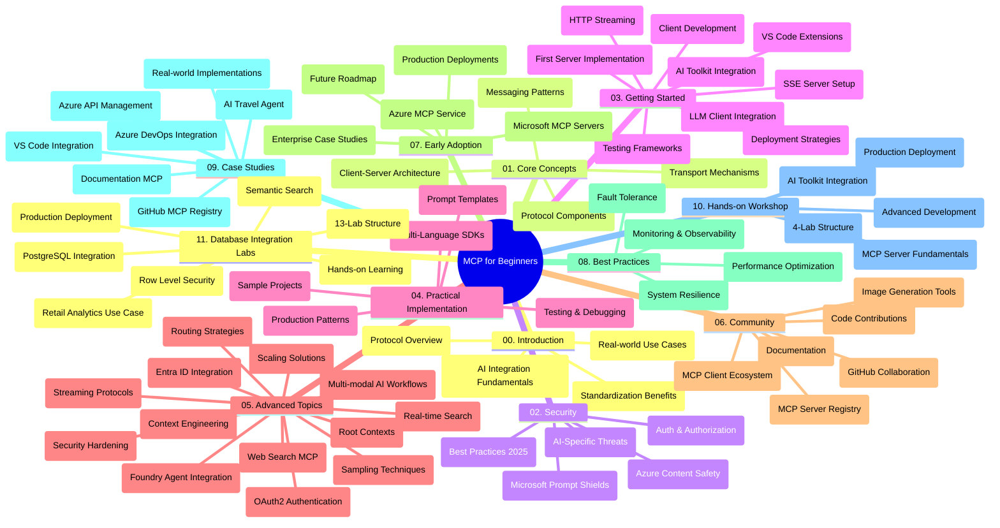

<!--
CO_OP_TRANSLATOR_METADATA:
{
  "original_hash": "aa1ce97bc694b08faf3018bab6d275b9",
  "translation_date": "2025-09-30T21:26:45+00:00",
  "source_file": "study_guide.md",
  "language_code": "sw"
}
-->
# Mwongozo wa Kujifunza - Model Context Protocol (MCP) kwa Anayeanza

Mwongozo huu wa kujifunza unatoa muhtasari wa muundo wa hifadhi na maudhui ya mtaala wa "Model Context Protocol (MCP) kwa Anayeanza". Tumia mwongozo huu kuvinjari hifadhi kwa ufanisi na kufaidika zaidi na rasilimali zilizopo.

## Muhtasari wa Hifadhi

Model Context Protocol (MCP) ni mfumo wa kawaida wa mawasiliano kati ya mifumo ya AI na programu za wateja. Awali uliundwa na Anthropic, MCP sasa unadumishwa na jamii pana ya MCP kupitia shirika rasmi la GitHub. Hifadhi hii inatoa mtaala wa kina wenye mifano ya vitendo ya msimbo katika C#, Java, JavaScript, Python, na TypeScript, iliyoundwa kwa ajili ya watengenezaji wa AI, wasanifu wa mifumo, na wahandisi wa programu.

## Ramani ya Mtaala wa Picha

## Muundo wa Hifadhi

Hifadhi imepangwa katika sehemu kuu kumi na moja, kila moja ikilenga vipengele tofauti vya MCP:

1. **Utangulizi (00-Introduction/)**
   - Muhtasari wa Model Context Protocol
   - Kwa nini viwango ni muhimu katika mifumo ya AI
   - Matumizi ya vitendo na faida

2. **Misingi ya Kati (01-CoreConcepts/)**
   - Muundo wa mteja-server
   - Vipengele muhimu vya itifaki
   - Mifumo ya ujumbe katika MCP

3. **Usalama (02-Security/)**
   - Vitisho vya usalama katika mifumo inayotumia MCP
   - Mbinu bora za kulinda utekelezaji
   - Mikakati ya uthibitishaji na idhini
   - **Nyaraka za Usalama za Kina**:
     - MCP Security Best Practices 2025
     - Mwongozo wa Utekelezaji wa Usalama wa Azure Content
     - Udhibiti na Mbinu za Usalama za MCP
     - Mwongozo wa Haraka wa Mbinu Bora za MCP
   - **Mada Muhimu za Usalama**:
     - Mashambulizi ya sindano ya maelezo na sumu ya zana
     - Utekaji wa vikao na matatizo ya naibu aliyepotoshwa
     - Udhaifu wa kupitisha tokeni
     - Ruhusa nyingi na udhibiti wa ufikiaji
     - Usalama wa mnyororo wa ugavi kwa vipengele vya AI
     - Ujumuishaji wa Microsoft Prompt Shields

4. **Kuanza (03-GettingStarted/)**
   - Usanidi wa mazingira na usanifu
   - Kuunda seva na wateja wa MCP wa msingi
   - Ujumuishaji na programu zilizopo
   - Inajumuisha sehemu za:
     - Utekelezaji wa seva ya kwanza
     - Uundaji wa mteja
     - Ujumuishaji wa mteja wa LLM
     - Ujumuishaji wa VS Code
     - Seva ya Matukio Yanayotumwa na Seva (SSE)
     - Ustreaming wa HTTP
     - Ujumuishaji wa AI Toolkit
     - Mikakati ya majaribio
     - Miongozo ya kupeleka

5. **Utekelezaji wa Vitendo (04-PracticalImplementation/)**
   - Kutumia SDKs katika lugha tofauti za programu
   - Mbinu za urekebishaji, majaribio, na uthibitishaji
   - Kuunda templeti za maelezo zinazoweza kutumika tena na mifumo ya kazi
   - Miradi ya mfano yenye mifano ya utekelezaji

6. **Mada za Juu (05-AdvancedTopics/)**
   - Mbinu za uhandisi wa muktadha
   - Ujumuishaji wa wakala wa Foundry
   - Mifumo ya kazi ya AI ya njia nyingi
   - Maonyesho ya uthibitishaji wa OAuth2
   - Uwezo wa utafutaji wa wakati halisi
   - Ustreaming wa wakati halisi
   - Utekelezaji wa muktadha wa mizizi
   - Mikakati ya uelekezaji
   - Mbinu za sampuli
   - Mbinu za kupanua
   - Masuala ya usalama
   - Ujumuishaji wa usalama wa Entra ID
   - Ujumuishaji wa utafutaji wa wavuti

7. **Michango ya Jamii (06-CommunityContributions/)**
   - Jinsi ya kuchangia msimbo na nyaraka
   - Kushirikiana kupitia GitHub
   - Uboreshaji unaoendeshwa na jamii na maoni
   - Kutumia wateja mbalimbali wa MCP (Claude Desktop, Cline, VSCode)
   - Kufanya kazi na seva maarufu za MCP ikiwa ni pamoja na uzalishaji wa picha

8. **Masomo kutoka kwa Matumizi ya Mapema (07-LessonsfromEarlyAdoption/)**
   - Utekelezaji wa ulimwengu halisi na hadithi za mafanikio
   - Kujenga na kupeleka suluhisho zinazotumia MCP
   - Mwelekeo na ramani ya siku zijazo
   - **Mwongozo wa Seva za MCP za Microsoft**: Mwongozo wa kina wa seva 10 za MCP za Microsoft tayari kwa uzalishaji ikiwa ni pamoja na:
     - Microsoft Learn Docs MCP Server
     - Azure MCP Server (viunganishi 15+ maalum)
     - GitHub MCP Server
     - Azure DevOps MCP Server
     - MarkItDown MCP Server
     - SQL Server MCP Server
     - Playwright MCP Server
     - Dev Box MCP Server
     - Azure AI Foundry MCP Server
     - Microsoft 365 Agents Toolkit MCP Server

9. **Mbinu Bora (08-BestPractices/)**
   - Urekebishaji wa utendaji na uboreshaji
   - Kubuni mifumo ya MCP inayostahimili hitilafu
   - Mikakati ya majaribio na ustahimilivu

10. **Masomo ya Kesi (09-CaseStudy/)**
    - **Masomo saba ya kina ya kesi** yanayoonyesha utofauti wa MCP katika hali mbalimbali:
    - **Wakala wa Safari za AI wa Azure**: Uratibu wa wakala wengi na Azure OpenAI na AI Search
    - **Ujumuishaji wa Azure DevOps**: Kuendesha michakato ya kazi kwa sasisho za data za YouTube
    - **Urejeshaji wa Nyaraka wa Wakati Halisi**: Mteja wa Python console na ustreaming wa HTTP
    - **Kizalishaji cha Mpango wa Kujifunza wa Maingiliano**: Programu ya wavuti ya Chainlit na AI ya mazungumzo
    - **Nyaraka Ndani ya Mhariri**: Ujumuishaji wa VS Code na mifumo ya kazi ya GitHub Copilot
    - **Usimamizi wa API ya Azure**: Ujumuishaji wa API ya biashara na uundaji wa seva ya MCP
    - **Usajili wa MCP wa GitHub**: Maendeleo ya mfumo wa ikolojia na jukwaa la ujumuishaji wa wakala
    - Mifano ya utekelezaji inayojumuisha ujumuishaji wa biashara, tija ya watengenezaji, na maendeleo ya mfumo wa ikolojia

11. **Warsha ya Vitendo (10-StreamliningAIWorkflowsBuildingAnMCPServerWithAIToolkit/)**
    - Warsha ya vitendo ya kina inayochanganya MCP na AI Toolkit
    - Kujenga programu za akili zinazounganisha mifumo ya AI na zana za ulimwengu halisi
    - Moduli za vitendo zinazofunika misingi, maendeleo ya seva maalum, na mikakati ya kupeleka uzalishaji
    - **Muundo wa Maabara**:
      - Maabara 1: Misingi ya Seva ya MCP
      - Maabara 2: Maendeleo ya Juu ya Seva ya MCP
      - Maabara 3: Ujumuishaji wa AI Toolkit
      - Maabara 4: Upelekaji wa Uzalishaji na Upanuzi
    - Njia ya kujifunza kwa msingi wa maabara yenye maagizo ya hatua kwa hatua

12. **Maabara za Ujumuishaji wa Hifadhidata ya Seva ya MCP (11-MCPServerHandsOnLabs/)**
    - **Njia ya kujifunza ya maabara 13 ya kina** ya kujenga seva za MCP tayari kwa uzalishaji na ujumuishaji wa PostgreSQL
    - **Utekelezaji wa uchanganuzi wa rejareja wa ulimwengu halisi** kwa kutumia kesi ya matumizi ya Zava Retail
    - **Mifumo ya daraja la biashara** ikiwa ni pamoja na Usalama wa Kiwango cha Safu (RLS), utafutaji wa semantiki, na ufikiaji wa data wa wateja wengi
    - **Muundo Kamili wa Maabara**:
      - **Maabara 00-03: Misingi** - Utangulizi, Muundo, Usalama, Usanidi wa Mazingira
      - **Maabara 04-06: Kujenga Seva ya MCP** - Muundo wa Hifadhidata, Utekelezaji wa Seva ya MCP, Maendeleo ya Zana
      - **Maabara 07-09: Vipengele vya Juu** - Utafutaji wa Semantiki, Majaribio na Urekebishaji, Ujumuishaji wa VS Code
      - **Maabara 10-12: Uzalishaji na Mbinu Bora** - Upelekaji, Ufuatiliaji, Uboreshaji
    - **Teknolojia Zinazoshughulikiwa**: Mfumo wa FastMCP, PostgreSQL, Azure OpenAI, Azure Container Apps, Application Insights
    - **Matokeo ya Kujifunza**: Seva za MCP tayari kwa uzalishaji, mifumo ya ujumuishaji wa hifadhidata, uchanganuzi unaotumia AI, usalama wa biashara

## Rasilimali za Ziada

Hifadhi inajumuisha rasilimali za kusaidia:

- **Folda ya Picha**: Inayo michoro na vielelezo vinavyotumika katika mtaala
- **Tafsiri**: Usaidizi wa lugha nyingi na tafsiri za kiotomatiki za nyaraka
- **Rasilimali Rasmi za MCP**:
  - [MCP Documentation](https://modelcontextprotocol.io/)
  - [MCP Specification](https://spec.modelcontextprotocol.io/)
  - [MCP GitHub Repository](https://github.com/modelcontextprotocol)

## Jinsi ya Kutumia Hifadhi Hii

1. **Kujifunza kwa Mpangilio**: Fuata sura kwa mpangilio (00 hadi 11) kwa uzoefu wa kujifunza ulioandaliwa.
2. **Kuzingatia Lugha Maalum**: Ikiwa unavutiwa na lugha fulani ya programu, chunguza folda za sampuli kwa utekelezaji katika lugha unayopendelea.
3. **Utekelezaji wa Vitendo**: Anza na sehemu ya "Kuanza" ili kusanidi mazingira yako na kuunda seva na mteja wako wa kwanza wa MCP.
4. **Uchunguzi wa Juu**: Ukishazoea misingi, chunguza mada za juu ili kupanua maarifa yako.
5. **Ushirikiano wa Jamii**: Jiunge na jamii ya MCP kupitia mijadala ya GitHub na vituo vya Discord ili kuungana na wataalamu na watengenezaji wenzako.

## Wateja na Zana za MCP

Mtaala unashughulikia wateja na zana mbalimbali za MCP:

1. **Wateja Rasmi**:
   - Visual Studio Code
   - MCP katika Visual Studio Code
   - Claude Desktop
   - Claude katika VSCode
   - Claude API

2. **Wateja wa Jamii**:
   - Cline (kulingana na terminal)
   - Cursor (mhariri wa msimbo)
   - ChatMCP
   - Windsurf

3. **Zana za Usimamizi wa MCP**:
   - MCP CLI
   - MCP Manager
   - MCP Linker
   - MCP Router

## Seva Maarufu za MCP

Hifadhi inatambulisha seva mbalimbali za MCP, ikiwa ni pamoja na:

1. **Seva Rasmi za MCP za Microsoft**:
   - Microsoft Learn Docs MCP Server
   - Azure MCP Server (viunganishi 15+ maalum)
   - GitHub MCP Server
   - Azure DevOps MCP Server
   - MarkItDown MCP Server
   - SQL Server MCP Server
   - Playwright MCP Server
   - Dev Box MCP Server
   - Azure AI Foundry MCP Server
   - Microsoft 365 Agents Toolkit MCP Server

2. **Seva za Marejeleo Rasmi**:
   - Filesystem
   - Fetch
   - Memory
   - Sequential Thinking

3. **Uzalishaji wa Picha**:
   - Azure OpenAI DALL-E 3
   - Stable Diffusion WebUI
   - Replicate

4. **Zana za Maendeleo**:
   - Git MCP
   - Terminal Control
   - Code Assistant

5. **Seva Maalum**:
   - Salesforce
   - Microsoft Teams
   - Jira & Confluence

## Kuchangia

Hifadhi hii inakaribisha michango kutoka kwa jamii. Tazama sehemu ya Michango ya Jamii kwa mwongozo wa jinsi ya kuchangia kwa ufanisi katika mfumo wa ikolojia wa MCP.

## Mabadiliko

| Tarehe | Mabadiliko |
|-------|------------||
| Septemba 29, 2025 | - Imeongeza sehemu ya 11-MCPServerHandsOnLabs yenye njia ya kujifunza ya maabara 13 ya ujumuishaji wa hifadhidata - Imeboresha Ramani ya Mtaala wa Picha ili kujumuisha Maabara za Ujumuishaji wa Hifadhidata - Imeimarisha muundo wa hifadhi ili kuonyesha sehemu kuu kumi na moja - Imeongeza maelezo ya kina ya ujumuishaji wa PostgreSQL, kesi ya matumizi ya uchanganuzi wa rejareja, na mifumo ya biashara - Imeboresha mwongozo wa urambazaji ili kujumuisha sehemu 00-11 |
| Septemba 26, 2025 | - Imeongeza somo la kesi la Usajili wa MCP wa GitHub katika sehemu ya 09-CaseStudy - Imeboresha Masomo ya Kesi ili kuonyesha masomo saba ya kina - Imeimarisha maelezo ya masomo ya kesi na maelezo maalum ya utekelezaji - Imeboresha Ramani ya Mtaala wa Picha ili kujumuisha Usajili wa MCP wa GitHub - Imebadilisha muundo wa mwongozo wa kujifunza ili kuonyesha mwelekeo wa maendeleo ya mfumo wa ikolojia |
| Julai 18, 2025 | - Imeboresha muundo wa hifadhi ili kujumuisha Mwongozo wa Seva za MCP za Microsoft - Imeongeza orodha ya kina ya seva 10 za MCP za Microsoft tayari kwa uzalishaji - Imeimarisha sehemu ya Seva Maarufu za MCP na Seva Rasmi za MCP za Microsoft - Imeboresha sehemu ya Masomo ya Kesi na mifano halisi ya faili - Imeongeza maelezo ya Muundo wa Maabara kwa Warsha ya Vitendo |
| Julai 16, 2025 | - Imeboresha muundo wa hifadhi ili kuonyesha maudhui ya sasa - Imeongeza sehemu ya Wateja na Zana za MCP - Imeongeza sehemu ya Seva Maarufu za MCP - Imeboresha Ramani ya Mtaala wa Picha na mada zote za sasa - Imeimarisha sehemu ya Mada za Juu na maeneo yote maalum - Imeboresha Masomo ya Kesi ili kuonyesha mifano halisi - Imefafanua asili ya MCP kama ilivyoundwa na Anthropic |
| Juni 11, 2025 | - Uundaji wa awali wa mwongozo wa kujifunza - Imeongeza Ramani ya Mtaala wa Picha - Imeelezea muundo wa hifadhi - Imejumuisha miradi ya mfano na rasilimali za ziada |

---

*Mwongozo huu wa kujifunza ulisasishwa mnamo Septemba 29, 2025, na unatoa muhtasari wa hifadhi kama ilivyokuwa tarehe hiyo. Maudhui ya hifadhi yanaweza kusasishwa baada ya tarehe hii.*

---

**Kanusho**:  
Hati hii imetafsiriwa kwa kutumia huduma ya tafsiri ya AI [Co-op Translator](https://github.com/Azure/co-op-translator). Ingawa tunajitahidi kwa usahihi, tafadhali fahamu kuwa tafsiri za kiotomatiki zinaweza kuwa na makosa au kutokuwa sahihi. Hati ya asili katika lugha yake ya awali inapaswa kuzingatiwa kama chanzo cha mamlaka. Kwa taarifa muhimu, tafsiri ya kitaalamu ya binadamu inapendekezwa. Hatutawajibika kwa kutoelewana au tafsiri zisizo sahihi zinazotokana na matumizi ya tafsiri hii.