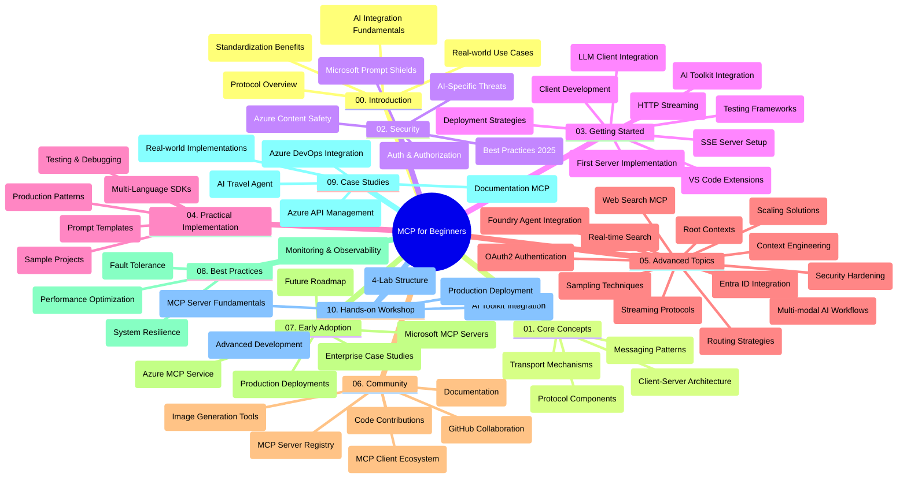

<!--
CO_OP_TRANSLATOR_METADATA:
{
  "original_hash": "e2c6ed897fa98fa08e0146101776c7ff",
  "translation_date": "2025-07-18T10:15:32+00:00",
  "source_file": "study_guide.md",
  "language_code": "sw"
}
-->
# Itifaki ya Muktadha wa Mfano (MCP) kwa Waanzilishi - Mwongozo wa Kusoma

Mwongozo huu wa kusoma unatoa muhtasari wa muundo na yaliyomo kwenye hifadhidata ya "Model Context Protocol (MCP) for Beginners". Tumia mwongozo huu kuvinjari hifadhidata kwa ufanisi na kufaidika zaidi na rasilimali zilizopo.

## Muhtasari wa Hifadhidata

Model Context Protocol (MCP) ni mfumo uliopangwa kwa ajili ya mwingiliano kati ya mifano ya AI na programu za wateja. Awali ulianzishwa na Anthropic, MCP sasa unadumishwa na jamii pana ya MCP kupitia shirika rasmi la GitHub. Hifadhidata hii inatoa mtaala kamili wenye mifano ya vitendo ya msimbo katika C#, Java, JavaScript, Python, na TypeScript, iliyoundwa kwa waendelezaji wa AI, wahandisi wa mifumo, na wahandisi wa programu.

## Ramani ya Mtaala ya Kuona

## Muundo wa Hifadhidata

Hifadhidata imepangwa katika sehemu kumi kuu, kila moja ikilenga nyanja tofauti za MCP:

1. **Utangulizi (00-Introduction/)**
   - Muhtasari wa Itifaki ya Muktadha wa Mfano
   - Kwa nini kuweka viwango ni muhimu katika mizunguko ya AI
   - Matumizi halisi na faida zake

2. **Madhumuni Muhimu (01-CoreConcepts/)**
   - Muundo wa mteja-mtumiaji
   - Vipengele muhimu vya itifaki
   - Mifumo ya ujumbe katika MCP

3. **Usalama (02-Security/)**
   - Vitisho vya usalama katika mifumo inayotumia MCP
   - Mbinu bora za kuhakikisha usalama wa utekelezaji
   - Mikakati ya uthibitishaji na idhini
   - **Nyaraka Kamili za Usalama**:
     - Mbinu Bora za Usalama za MCP 2025
     - Mwongozo wa Utekelezaji wa Usalama wa Azure Content
     - Udhibiti na Mbinu za Usalama za MCP
     - Marejeleo ya Mbinu Bora za MCP
   - **Mada Muhimu za Usalama**:
     - Mashambulizi ya sindano ya maelekezo na sumu ya zana
     - Uvunjaji wa kikao na matatizo ya mwakilishi aliyepotoshwa
     - Udhaifu wa kupitisha tokeni
     - Ruhusa kupita kiasi na udhibiti wa upatikanaji
     - Usalama wa mnyororo wa ugavi kwa vipengele vya AI
     - Uunganisho wa Microsoft Prompt Shields

4. **Kuanzia (03-GettingStarted/)**
   - Kuandaa na kusanidi mazingira
   - Kuunda seva na wateja wa MCP wa msingi
   - Uunganisho na programu zilizopo
   - Inajumuisha sehemu za:
     - Utekelezaji wa seva ya kwanza
     - Uendelezaji wa mteja
     - Uunganisho wa mteja wa LLM
     - Uunganisho wa VS Code
     - Seva ya Matukio Yanayotumwa (SSE)
     - Upelekaji wa data kwa HTTP
     - Uunganisho wa AI Toolkit
     - Mikakati ya upimaji
     - Miongozo ya usambazaji

5. **Utekelezaji wa Vitendo (04-PracticalImplementation/)**
   - Kutumia SDK katika lugha mbalimbali za programu
   - Mbinu za kutatua matatizo, upimaji, na uthibitishaji
   - Kuunda templeti za maelekezo zinazoweza kutumika tena na michakato
   - Miradi ya mfano yenye mifano ya utekelezaji

6. **Mada za Juu (05-AdvancedTopics/)**
   - Mbinu za uhandisi wa muktadha
   - Uunganisho wa wakala wa Foundry
   - Michakato ya AI yenye njia nyingi
   - Maonyesho ya uthibitishaji wa OAuth2
   - Uwezo wa utafutaji wa wakati halisi
   - Upelekaji wa data wa wakati halisi
   - Utekelezaji wa muktadha wa mizizi
   - Mikakati ya upitishaji
   - Mbinu za sampuli
   - Mbinu za kupanua
   - Masuala ya usalama
   - Uunganisho wa usalama wa Entra ID
   - Uunganisho wa utafutaji wa wavuti

7. **Michango ya Jamii (06-CommunityContributions/)**
   - Jinsi ya kuchangia msimbo na nyaraka
   - Kushirikiana kupitia GitHub
   - Maboresho na maoni yanayotokana na jamii
   - Kutumia wateja mbalimbali wa MCP (Claude Desktop, Cline, VSCode)
   - Kufanya kazi na seva maarufu za MCP ikijumuisha uzalishaji wa picha

8. **Mafunzo Kutoka kwa Watumiaji wa Awali (07-LessonsfromEarlyAdoption/)**
   - Utekelezaji halisi na hadithi za mafanikio
   - Kujenga na kusambaza suluhisho za MCP
   - Mwelekeo na ramani ya mustakabali
   - **Mwongozo wa Seva za Microsoft MCP**: Mwongozo kamili wa seva 10 za Microsoft MCP zinazotumika uzalishaji ikijumuisha:
     - Microsoft Learn Docs MCP Server
     - Azure MCP Server (viunganishi maalum 15+)
     - GitHub MCP Server
     - Azure DevOps MCP Server
     - MarkItDown MCP Server
     - SQL Server MCP Server
     - Playwright MCP Server
     - Dev Box MCP Server
     - Azure AI Foundry MCP Server
     - Microsoft 365 Agents Toolkit MCP Server

9. **Mbinu Bora (08-BestPractices/)**
   - Uboreshaji wa utendaji na ufanisi
   - Kubuni mifumo ya MCP inayostahimili hitilafu
   - Mikakati ya upimaji na ustahimilivu

10. **Mifano ya Kesi (09-CaseStudy/)**
    - Mfano wa uunganisho wa Azure API Management
    - Mfano wa utekelezaji wa wakala wa usafiri
    - Uunganisho wa Azure DevOps na masasisho ya YouTube
    - Mifano ya utekelezaji wa MCP yenye nyaraka za kina
    - Mifano ya utekelezaji yenye maelezo ya kina

11. **Warsha ya Vitendo (10-StreamliningAIWorkflowsBuildingAnMCPServerWithAIToolkit/)**
    - Warsha kamili ya vitendo inayochanganya MCP na AI Toolkit
    - Kujenga programu za akili zinazounganisha mifano ya AI na zana halisi
    - Moduli za vitendo zinazojumuisha misingi, uendelezaji wa seva maalum, na mikakati ya usambazaji uzalishaji
    - **Muundo wa Maabara**:
      - Maabara 1: Misingi ya Seva ya MCP
      - Maabara 2: Uendelezaji wa Seva ya MCP wa Juu
      - Maabara 3: Uunganisho wa AI Toolkit
      - Maabara 4: Usambazaji wa Uzalishaji na Upanuzi
    - Mbinu ya kujifunza kwa maabara yenye maelekezo hatua kwa hatua

## Rasilimali Zaidi

Hifadhidata ina rasilimali za ziada:

- **Folda ya Picha**: Ina michoro na maelezo yanayotumika katika mtaala mzima
- **Tafsiri**: Msaada wa lugha nyingi kwa tafsiri za moja kwa moja za nyaraka
- **Rasilimali Rasmi za MCP**:
  - [MCP Documentation](https://modelcontextprotocol.io/)
  - [MCP Specification](https://spec.modelcontextprotocol.io/)
  - [MCP GitHub Repository](https://github.com/modelcontextprotocol)

## Jinsi ya Kutumia Hifadhidata Hii

1. **Kujifunza kwa Mfuatano**: Fuata sura kwa mpangilio (00 hadi 10) kwa uzoefu wa kujifunza uliopangwa.
2. **Kuzingatia Lugha Mahususi**: Ikiwa unavutiwa na lugha fulani ya programu, chunguza folda za mifano kwa utekelezaji katika lugha unayopendelea.
3. **Utekelezaji wa Vitendo**: Anza na sehemu ya "Kuanzia" kuandaa mazingira yako na kuunda seva na mteja wako wa MCP wa kwanza.
4. **Uchunguzi wa Juu**: Ukijua misingi, chunguza mada za juu ili kupanua maarifa yako.
5. **Ushirikiano wa Jamii**: Jiunge na jamii ya MCP kupitia mijadala ya GitHub na chaneli za Discord kuungana na wataalamu na waendelezaji wenzako.

## Wateja na Zana za MCP

Mtaala unahusisha wateja na zana mbalimbali za MCP:

1. **Wateja Rasmi**:
   - Visual Studio Code
   - MCP katika Visual Studio Code
   - Claude Desktop
   - Claude katika VSCode
   - Claude API

2. **Wateja wa Jamii**:
   - Cline (inayotumia terminal)
   - Cursor (mhariri wa msimbo)
   - ChatMCP
   - Windsurf

3. **Zana za Usimamizi wa MCP**:
   - MCP CLI
   - MCP Manager
   - MCP Linker
   - MCP Router

## Seva Maarufu za MCP

Hifadhidata inatambulisha seva mbalimbali za MCP, zikiwemo:

1. **Seva Rasmi za Microsoft MCP**:
   - Microsoft Learn Docs MCP Server
   - Azure MCP Server (viunganishi maalum 15+)
   - GitHub MCP Server
   - Azure DevOps MCP Server
   - MarkItDown MCP Server
   - SQL Server MCP Server
   - Playwright MCP Server
   - Dev Box MCP Server
   - Azure AI Foundry MCP Server
   - Microsoft 365 Agents Toolkit MCP Server

2. **Seva za Marejeleo Rasmi**:
   - Filesystem
   - Fetch
   - Memory
   - Sequential Thinking

3. **Uzalishaji wa Picha**:
   - Azure OpenAI DALL-E 3
   - Stable Diffusion WebUI
   - Replicate

4. **Zana za Maendeleo**:
   - Git MCP
   - Terminal Control
   - Code Assistant

5. **Seva Maalum**:
   - Salesforce
   - Microsoft Teams
   - Jira & Confluence

## Kuchangia

Hifadhidata hii inakaribisha michango kutoka kwa jamii. Angalia sehemu ya Michango ya Jamii kwa mwongozo wa jinsi ya kuchangia kwa ufanisi katika mfumo wa MCP.

## Mabadiliko

| Tarehe | Mabadiliko |
|--------|-----------|
| Julai 18, 2025 | - Imesasisha muundo wa hifadhidata kuhusiana na Mwongozo wa Seva za Microsoft MCP - Imeongeza orodha kamili ya seva 10 za Microsoft MCP zinazotumika uzalishaji - Imeboresha sehemu ya Seva Maarufu za MCP kwa Seva Rasmi za Microsoft MCP - Imesasisha sehemu ya Mifano ya Kesi na mifano halisi ya faili - Imeongeza maelezo ya Muundo wa Maabara kwa Warsha ya Vitendo |
| Julai 16, 2025 | - Imesasisha muundo wa hifadhidata kuonyesha yaliyomo ya sasa - Imeongeza sehemu ya Wateja na Zana za MCP - Imeongeza sehemu ya Seva Maarufu za MCP - Imesasisha Ramani ya Mtaala ya Kuona na mada zote za sasa - Imeboresha sehemu ya Mada za Juu na maeneo yote maalum - Imesasisha Mifano ya Kesi kuonyesha mifano halisi - Imefafanua asili ya MCP kama iliyoanzishwa na Anthropic |
| Juni 11, 2025 | - Uundaji wa mwongozo wa kusoma - Imeongeza Ramani ya Mtaala ya Kuona - Imeeleza muundo wa hifadhidata - Imejumuisha miradi ya mfano na rasilimali za ziada |

---

*Mwongozo huu wa kusoma ulisasishwa tarehe Julai 18, 2025, na unatoa muhtasari wa hifadhidata hadi tarehe hiyo. Yaliyomo katika hifadhidata yanaweza kusasishwa baada ya tarehe hii.*

**Kiarifu cha Kutotegemea**:  
Hati hii imetafsiriwa kwa kutumia huduma ya tafsiri ya AI [Co-op Translator](https://github.com/Azure/co-op-translator). Ingawa tunajitahidi kwa usahihi, tafadhali fahamu kwamba tafsiri za kiotomatiki zinaweza kuwa na makosa au upungufu wa usahihi. Hati ya asili katika lugha yake ya asili inapaswa kuchukuliwa kama chanzo cha mamlaka. Kwa taarifa muhimu, tafsiri ya kitaalamu inayofanywa na binadamu inapendekezwa. Hatubebei dhamana kwa kutoelewana au tafsiri potofu zinazotokana na matumizi ya tafsiri hii.