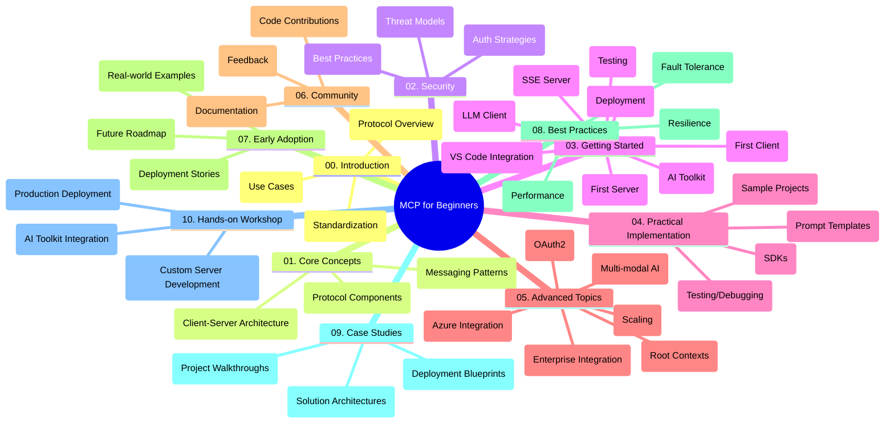

<!--
CO_OP_TRANSLATOR_METADATA:
{
  "original_hash": "a607d4febc94caee9a12b77795f7fc9a",
  "translation_date": "2025-07-13T15:17:16+00:00",
  "source_file": "study_guide.md",
  "language_code": "sw"
}
-->
# Model Context Protocol (MCP) kwa Waanzilishi - Mwongozo wa Kujifunza

Mwongozo huu wa kujifunza unatoa muhtasari wa muundo na yaliyomo kwenye hifadhidata ya "Model Context Protocol (MCP) kwa Waanzilishi". Tumia mwongozo huu kuvinjari hifadhidata kwa ufanisi na kufaidika zaidi na rasilimali zilizopo.

## Muhtasari wa Hifadhidata

Model Context Protocol (MCP) ni mfumo uliopangwa kwa ajili ya mwingiliano kati ya mifano ya AI na programu za wateja. Hifadhidata hii inatoa mtaala kamili wenye mifano ya vitendo ya msimbo katika C#, Java, JavaScript, Python, na TypeScript, iliyoundwa kwa waendelezaji wa AI, wahandisi wa mifumo, na wahandisi wa programu.

## Ramani ya Mtaala ya Kuona

## Muundo wa Hifadhidata

Hifadhidata imepangwa katika sehemu kumi kuu, kila moja ikilenga nyanja tofauti za MCP:

1. **Utangulizi (00-Introduction/)**
   - Muhtasari wa Model Context Protocol
   - Kwa nini ulinganifu ni muhimu katika mizunguko ya AI
   - Matumizi halisi na faida zake

2. **Misingi Muhimu (01-CoreConcepts/)**
   - Muundo wa mteja-mtumiaji
   - Vipengele muhimu vya itifaki
   - Mifumo ya ujumbe katika MCP

3. **Usalama (02-Security/)**
   - Vitisho vya usalama katika mifumo inayotumia MCP
   - Mbinu bora za kuhakikisha usalama wa utekelezaji
   - Mikakati ya uthibitishaji na idhini

4. **Kuanzia (03-GettingStarted/)**
   - Kuandaa na kusanidi mazingira
   - Kuunda seva na wateja wa MCP wa msingi
   - Uunganishaji na programu zilizopo
   - Sehemu ndogo kwa seva ya kwanza, mteja wa kwanza, mteja wa LLM, uunganishaji wa VS Code, seva ya SSE, AI Toolkit, upimaji, na uenezaji

5. **Utekelezaji wa Vitendo (04-PracticalImplementation/)**
   - Kutumia SDK katika lugha mbalimbali za programu
   - Mbinu za kutatua matatizo, upimaji, na uthibitishaji
   - Kuunda templeti za maelekezo zinazoweza kutumika tena na mtiririko wa kazi
   - Miradi ya mfano yenye mifano ya utekelezaji

6. **Mada za Juu (05-AdvancedTopics/)**
   - Mtiririko wa kazi wa AI wa aina nyingi na upanuzi wake
   - Mikakati salama ya kupanua mfumo
   - MCP katika mifumo ya biashara
   - Mada maalum ikijumuisha uunganishaji wa Azure, aina nyingi, OAuth2, muktadha wa mizizi, usambazaji, sampuli, upanuzi, usalama, uunganishaji wa utafutaji mtandaoni, na utiririshaji.

7. **Michango ya Jamii (06-CommunityContributions/)**
   - Jinsi ya kuchangia msimbo na nyaraka
   - Kushirikiana kupitia GitHub
   - Maboresho na maoni yanayotokana na jamii

8. **Mafunzo Kutoka kwa Watumiaji wa Awali (07-LessonsfromEarlyAdoption/)**
   - Utekelezaji halisi na hadithi za mafanikio
   - Kujenga na kueneza suluhisho za MCP
   - Mwelekeo na ramani ya mustakabali

9. **Mbinu Bora (08-BestPractices/)**
   - Uboreshaji wa utendaji na ufanisi
   - Kubuni mifumo ya MCP inayostahimili hitilafu
   - Mikakati ya upimaji na ustahimilivu

10. **Mifano ya Kesi (09-CaseStudy/)**
    - Uchunguzi wa kina wa usanifu wa suluhisho za MCP
    - Ramani za uenezaji na vidokezo vya uunganishaji
    - Michoro iliyoelezwa na maelezo ya miradi

11. **Warsha ya Vitendo (10-StreamliningAIWorkflowsBuildingAnMCPServerWithAIToolkit/)**
    - Warsha kamili ya vitendo inayochanganya MCP na AI Toolkit ya Microsoft kwa VS Code
    - Kujenga programu za akili zinazounganisha mifano ya AI na zana halisi
    - Moduli za vitendo zinazojumuisha misingi, maendeleo ya seva maalum, na mikakati ya uenezaji wa uzalishaji

## Miradi ya Mfano

Hifadhidata ina miradi mingi ya mfano inayonyesha utekelezaji wa MCP katika lugha mbalimbali za programu:

### Mifano ya Msingi ya Kihesabu ya MCP
- Mfano wa Seva ya MCP kwa C#
- Kihesabu cha MCP cha Java
- Onyesho la MCP la JavaScript
- Seva ya MCP ya Python
- Mfano wa MCP wa TypeScript

### Miradi ya Juu ya Kihesabu ya MCP
- Mfano wa Juu wa C#
- Mfano wa Programu ya Kontena ya Java
- Mfano wa Juu wa JavaScript
- Utekelezaji Changamano wa Python
- Mfano wa Kontena wa TypeScript

## Rasilimali Zaidi

Hifadhidata ina rasilimali za ziada:

- **Folda ya Picha**: Ina michoro na maelezo yanayotumika katika mtaala mzima
- **Tafsiri**: Msaada wa lugha nyingi kwa tafsiri za moja kwa moja za nyaraka
- **Rasilimali Rasmi za MCP**:
  - [MCP Documentation](https://modelcontextprotocol.io/)
  - [MCP Specification](https://spec.modelcontextprotocol.io/)
  - [MCP GitHub Repository](https://github.com/modelcontextprotocol)

## Jinsi ya Kutumia Hifadhidata Hii

1. **Kujifunza kwa Mfuatano**: Fuata sura kwa mpangilio (00 hadi 10) kwa uzoefu wa kujifunza uliopangwa.
2. **Kuzingatia Lugha Mahususi**: Ikiwa unavutiwa na lugha fulani ya programu, chunguza folda za mifano kwa utekelezaji katika lugha unayopendelea.
3. **Utekelezaji wa Vitendo**: Anza na sehemu ya "Kuanzia" kuandaa mazingira yako na kuunda seva na mteja wako wa kwanza wa MCP.
4. **Uchunguzi wa Juu**: Ukijua misingi, chunguza mada za juu ili kuongeza maarifa yako.
5. **Ushirikiano wa Jamii**: Jiunge na [Azure AI Foundry Discord](https://discord.com/invite/ByRwuEEgH4) kuungana na wataalamu na waendelezaji wenzako.

## Michango

Hifadhidata hii inakaribisha michango kutoka kwa jamii. Angalia sehemu ya Michango ya Jamii kwa mwongozo wa jinsi ya kuchangia.

---

*Mwongozo huu wa kujifunza ulitengenezwa Juni 11, 2025, na unatoa muhtasari wa hifadhidata hadi tarehe hiyo. Yaliyomo katika hifadhidata yanaweza kuwa yamebadilika tangu wakati huo.*

**Kiarifu cha Kutotegemea**:  
Hati hii imetafsiriwa kwa kutumia huduma ya tafsiri ya AI [Co-op Translator](https://github.com/Azure/co-op-translator). Ingawa tunajitahidi kwa usahihi, tafadhali fahamu kwamba tafsiri za kiotomatiki zinaweza kuwa na makosa au upungufu wa usahihi. Hati ya asili katika lugha yake ya asili inapaswa kuchukuliwa kama chanzo cha mamlaka. Kwa taarifa muhimu, tafsiri ya kitaalamu inayofanywa na binadamu inashauriwa. Hatuna dhamana kwa kutoelewana au tafsiri potofu zinazotokana na matumizi ya tafsiri hii.