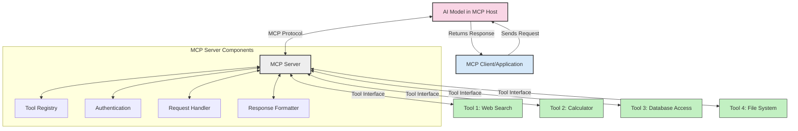
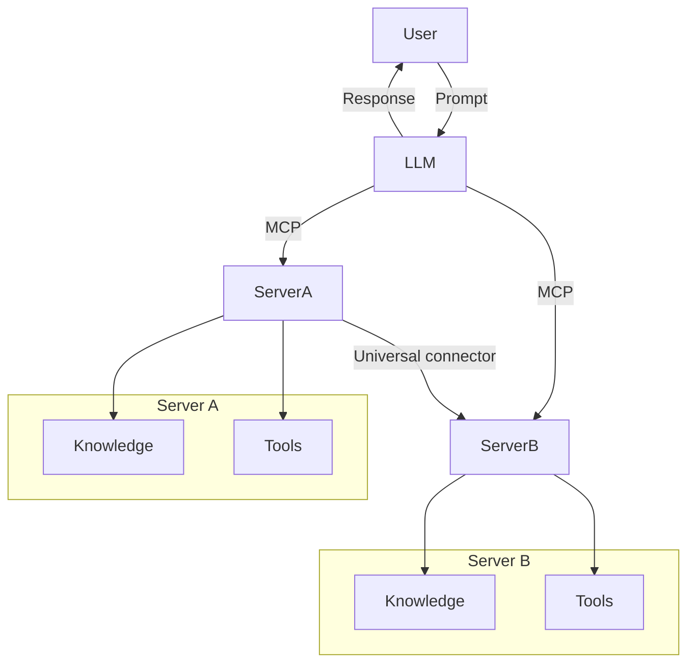

<!--
CO_OP_TRANSLATOR_METADATA:
{
  "original_hash": "cf84f987e1b771d2201408e110dfd2db",
  "translation_date": "2025-05-20T17:11:02+00:00",
  "source_file": "00-Introduction/README.md",
  "language_code": "th"
}
-->
# บทนำสู่ Model Context Protocol (MCP): ทำไมจึงสำคัญสำหรับแอปพลิเคชัน AI ที่ขยายตัวได้

แอปพลิเคชัน Generative AI เป็นก้าวสำคัญที่ช่วยให้ผู้ใช้สามารถโต้ตอบกับแอปผ่านคำสั่งภาษาธรรมชาติได้ อย่างไรก็ตาม เมื่อมีการลงทุนเวลาและทรัพยากรมากขึ้นกับแอปเหล่านี้ คุณต้องมั่นใจว่าสามารถรวมฟังก์ชันและทรัพยากรต่าง ๆ ได้อย่างง่ายดาย เพื่อให้ขยายระบบได้ง่าย แอปของคุณรองรับการใช้งานหลายโมเดลพร้อมกัน รวมถึงรายละเอียดที่ซับซ้อน ในภาพรวม การสร้างแอป Gen AI เริ่มต้นง่าย แต่เมื่อเติบโตและซับซ้อนขึ้น คุณจำเป็นต้องเริ่มกำหนดสถาปัตยกรรม และมักจะต้องพึ่งพามาตรฐานเพื่อให้มั่นใจว่าแอปถูกพัฒนาอย่างสอดคล้อง นี่คือจุดที่ MCP เข้ามาจัดระเบียบและให้มาตรฐาน

---

## **🔍 Model Context Protocol (MCP) คืออะไร?**

**Model Context Protocol (MCP)** คือ **อินเทอร์เฟซแบบเปิดและมาตรฐาน** ที่ช่วยให้ Large Language Models (LLMs) สามารถเชื่อมต่อกับเครื่องมือภายนอก, API และแหล่งข้อมูลได้อย่างราบรื่น MCP มอบสถาปัตยกรรมที่สม่ำเสมอเพื่อเพิ่มขีดความสามารถของโมเดล AI ให้เกินกว่าข้อมูลที่ใช้ฝึกฝน ช่วยให้ระบบ AI ฉลาดขึ้น ขยายตัวได้ และตอบสนองได้ดีขึ้น

---

## **🎯 ทำไมการมีมาตรฐานใน AI จึงสำคัญ**

เมื่อแอปพลิเคชัน generative AI ซับซ้อนขึ้น การนำมาตรฐานมาใช้เพื่อรับรองความสามารถในการขยายตัว, การเพิ่มฟังก์ชัน และการดูแลรักษาเป็นสิ่งจำเป็น MCP ตอบโจทย์เหล่านี้โดย:

- รวมการเชื่อมต่อโมเดลกับเครื่องมือให้เป็นหนึ่งเดียว
- ลดการแก้ไขแบบเฉพาะเจาะจงที่เปราะบาง
- อนุญาตให้หลายโมเดลอยู่ร่วมกันในระบบเดียวได้

---

## **📚 วัตถุประสงค์การเรียนรู้**

เมื่ออ่านบทความนี้จบ คุณจะสามารถ:

- อธิบาย **Model Context Protocol (MCP)** และกรณีการใช้งานได้
- เข้าใจว่าการสื่อสารระหว่างโมเดลกับเครื่องมือถูกมาตรฐานอย่างไร
- ระบุส่วนประกอบหลักของสถาปัตยกรรม MCP
- สำรวจการใช้งานจริงของ MCP ในองค์กรและการพัฒนา

---

## **💡 ทำไม Model Context Protocol (MCP) จึงเปลี่ยนเกมได้**

### **🔗 MCP แก้ปัญหาการแยกส่วนในการโต้ตอบ AI**

ก่อน MCP การเชื่อมต่อโมเดลกับเครื่องมือจำเป็นต้อง:

- เขียนโค้ดเฉพาะสำหรับแต่ละคู่โมเดล-เครื่องมือ
- ใช้ API ที่ไม่เป็นมาตรฐานสำหรับแต่ละผู้ให้บริการ
- เกิดการขัดข้องบ่อยจากการอัปเดต
- ขยายระบบได้ยากเมื่อต้องใช้เครื่องมือเพิ่มขึ้น

### **✅ ประโยชน์ของการมีมาตรฐาน MCP**

| **ประโยชน์**             | **คำอธิบาย**                                                                   |
|--------------------------|--------------------------------------------------------------------------------|
| การทำงานร่วมกันได้ดี     | LLMs ทำงานร่วมกับเครื่องมือจากผู้ให้บริการต่าง ๆ ได้อย่างราบรื่น            |
| ความสม่ำเสมอ            | พฤติกรรมที่เหมือนกันในทุกแพลตฟอร์มและเครื่องมือ                           |
| การนำกลับมาใช้ใหม่       | เครื่องมือที่สร้างขึ้นครั้งเดียวสามารถใช้ซ้ำในโปรเจกต์และระบบต่าง ๆ        |
| การพัฒนาที่รวดเร็วขึ้น   | ลดเวลาพัฒนาโดยใช้อินเทอร์เฟซที่เป็นมาตรฐานและ plug-and-play                 |

---

## **🧱 ภาพรวมสถาปัตยกรรม MCP ระดับสูง**

MCP ใช้โมเดล **client-server** โดยที่:

- **MCP Hosts** รันโมเดล AI
- **MCP Clients** เริ่มต้นคำขอ
- **MCP Servers** ให้บริการบริบท, เครื่องมือ และความสามารถ

### **ส่วนประกอบหลัก:**

- **Resources** – ข้อมูลคงที่หรือข้อมูลไดนามิกสำหรับโมเดล  
- **Prompts** – เวิร์กโฟลว์ที่กำหนดไว้ล่วงหน้าสำหรับการสร้างคำตอบ  
- **Tools** – ฟังก์ชันที่สามารถทำงานได้ เช่น การค้นหา, การคำนวณ  
- **Sampling** – พฤติกรรมแบบตัวแทนผ่านการโต้ตอบซ้ำ

---

## การทำงานของ MCP Servers

MCP servers ทำงานดังนี้:

- **ลำดับคำขอ**:  
    1. MCP Client ส่งคำขอไปยังโมเดล AI ที่รันอยู่ใน MCP Host  
    2. โมเดล AI ระบุว่าต้องการเครื่องมือหรือข้อมูลภายนอกเมื่อใด  
    3. โมเดลสื่อสารกับ MCP Server ผ่านโปรโตคอลที่เป็นมาตรฐาน

- **ฟังก์ชันของ MCP Server**:  
    - Tool Registry: ดูแลรายชื่อเครื่องมือและความสามารถ  
    - Authentication: ตรวจสอบสิทธิ์การเข้าถึงเครื่องมือ  
    - Request Handler: ประมวลผลคำขอเครื่องมือจากโมเดล  
    - Response Formatter: จัดรูปแบบผลลัพธ์ของเครื่องมือให้อยู่ในรูปแบบที่โมเดลเข้าใจ

- **การทำงานของเครื่องมือ**:  
    - เซิร์ฟเวอร์ส่งคำขอไปยังเครื่องมือภายนอกที่เหมาะสม  
    - เครื่องมือทำงานเฉพาะทาง (ค้นหา, คำนวณ, คิวรีฐานข้อมูล ฯลฯ)  
    - ผลลัพธ์ถูกส่งกลับไปยังโมเดลในรูปแบบที่สอดคล้องกัน

- **การตอบกลับสมบูรณ์**:  
    - โมเดล AI นำผลลัพธ์จากเครื่องมือมารวมในคำตอบ  
    - คำตอบสุดท้ายถูกส่งกลับไปยังแอปพลิเคชันลูกค้า

## 👨‍💻 วิธีสร้าง MCP Server (พร้อมตัวอย่าง)

MCP servers ช่วยให้คุณขยายขีดความสามารถของ LLM โดยการให้ข้อมูลและฟังก์ชันการทำงาน

พร้อมลองใช้งานหรือยัง? นี่คือตัวอย่างการสร้าง MCP server แบบง่ายในหลายภาษา:

- **ตัวอย่าง Python**: https://github.com/modelcontextprotocol/python-sdk

- **ตัวอย่าง TypeScript**: https://github.com/modelcontextprotocol/typescript-sdk

- **ตัวอย่าง Java**: https://github.com/modelcontextprotocol/java-sdk

- **ตัวอย่าง C#/.NET**: https://github.com/modelcontextprotocol/csharp-sdk

## 🌍 กรณีการใช้งานจริงของ MCP

MCP ช่วยขยายขีดความสามารถของ AI ในหลายแอปพลิเคชัน:

| **แอปพลิเคชัน**          | **คำอธิบาย**                                                                   |
|----------------------------|--------------------------------------------------------------------------------|
| การรวมข้อมูลองค์กร        | เชื่อมต่อ LLM กับฐานข้อมูล, CRM หรือเครื่องมือภายในองค์กร                    |
| ระบบ AI แบบตัวแทน         | เปิดใช้งานเอเจนต์อัตโนมัติที่เข้าถึงเครื่องมือและเวิร์กโฟลว์การตัดสินใจ    |
| แอปมัลติโมดอล            | รวมเครื่องมือข้อความ, รูปภาพ และเสียงในแอป AI เดียวกัน                      |
| การรวมข้อมูลเรียลไทม์     | นำข้อมูลสดเข้าสู่การโต้ตอบ AI เพื่อผลลัพธ์ที่แม่นยำและทันสมัย                |

### 🧠 MCP = มาตรฐานสากลสำหรับการโต้ตอบ AI

Model Context Protocol (MCP) ทำหน้าที่เป็นมาตรฐานสากลสำหรับการโต้ตอบ AI เหมือนกับที่ USB-C มาตรฐานการเชื่อมต่ออุปกรณ์ทางกายภาพ ในโลกของ AI MCP มอบอินเทอร์เฟซที่สม่ำเสมอ ทำให้โมเดล (ลูกค้า) สามารถรวมเข้ากับเครื่องมือและผู้ให้บริการข้อมูลภายนอก (เซิร์ฟเวอร์) ได้อย่างราบรื่น ช่วยขจัดความจำเป็นในการมีโปรโตคอลเฉพาะสำหรับแต่ละ API หรือแหล่งข้อมูล

ภายใต้ MCP เครื่องมือที่รองรับ (เรียกว่า MCP server) จะปฏิบัติตามมาตรฐานเดียวกัน เซิร์ฟเวอร์เหล่านี้สามารถแสดงรายการเครื่องมือหรือการกระทำที่มี และดำเนินการตามคำขอของเอเจนต์ AI แพลตฟอร์มเอเจนต์ AI ที่รองรับ MCP สามารถค้นหาเครื่องมือที่มีจากเซิร์ฟเวอร์และเรียกใช้งานผ่านโปรโตคอลนี้

### 💡 ช่วยให้เข้าถึงความรู้ได้ง่ายขึ้น

นอกจากการให้เครื่องมือแล้ว MCP ยังช่วยให้เข้าถึงความรู้ได้ แอปพลิเคชันสามารถให้บริบทกับ LLM โดยเชื่อมโยงกับแหล่งข้อมูลต่าง ๆ เช่น MCP server อาจเป็นที่เก็บเอกสารของบริษัท ช่วยให้เอเจนต์ดึงข้อมูลที่เกี่ยวข้องตามต้องการ อีกเซิร์ฟเวอร์อาจจัดการการกระทำเฉพาะ เช่น ส่งอีเมล หรืออัปเดตข้อมูล จากมุมมองของเอเจนต์ นี่คือเครื่องมือที่ใช้งานได้—บางเครื่องมือคืนข้อมูล (บริบทความรู้) ในขณะที่บางเครื่องมือทำการกระทำ MCP จัดการทั้งสองแบบอย่างมีประสิทธิภาพ

เอเจนต์ที่เชื่อมต่อกับ MCP server จะเรียนรู้ความสามารถและข้อมูลที่เข้าถึงได้ของเซิร์ฟเวอร์โดยอัตโนมัติผ่านรูปแบบมาตรฐาน การมีมาตรฐานนี้ช่วยให้เครื่องมือพร้อมใช้งานแบบไดนามิก เช่น การเพิ่ม MCP server ใหม่ในระบบเอเจนต์ทำให้ฟังก์ชันของเซิร์ฟเวอร์นั้นพร้อมใช้งานทันทีโดยไม่ต้องปรับแต่งคำสั่งของเอเจนต์เพิ่มเติม

การรวมระบบที่ราบรื่นนี้สอดคล้องกับโฟลว์ที่แสดงในแผนภาพ mermaid ซึ่งเซิร์ฟเวอร์ให้ทั้งเครื่องมือและความรู้ เพื่อให้ระบบทำงานร่วมกันได้อย่างไร้รอยต่อ

### 👉 ตัวอย่าง: โซลูชันเอเจนต์ที่ขยายตัวได้

## 🔐 ประโยชน์เชิงปฏิบัติของ MCP

นี่คือประโยชน์เชิงปฏิบัติของการใช้ MCP:

- **ความสดใหม่**: โมเดลเข้าถึงข้อมูลล่าสุดที่เกินกว่าข้อมูลฝึกสอน
- **ขยายขีดความสามารถ**: โมเดลใช้เครื่องมือเฉพาะทางสำหรับงานที่ไม่ได้ฝึกฝนมา
- **ลดการสร้างภาพหลอน**: แหล่งข้อมูลภายนอกช่วยให้ข้อมูลมีความถูกต้อง
- **ความเป็นส่วนตัว**: ข้อมูลที่ละเอียดอ่อนเก็บไว้ในสภาพแวดล้อมที่ปลอดภัย แทนที่จะฝังในคำสั่ง

## 📌 สรุปใจความสำคัญ

ข้อสรุปสำคัญสำหรับการใช้ MCP คือ:

- **MCP** มาตรฐานวิธีที่โมเดล AI โต้ตอบกับเครื่องมือและข้อมูล
- ส่งเสริม **การขยายตัว, ความสม่ำเสมอ และการทำงานร่วมกัน**
- MCP ช่วย **ลดเวลาพัฒนา, เพิ่มความน่าเชื่อถือ และขยายขีดความสามารถของโมเดล**
- สถาปัตยกรรม client-server ช่วยให้แอป AI มีความยืดหยุ่นและขยายตัวได้

## 🧠 แบบฝึกหัด

ลองคิดถึงแอป AI ที่คุณสนใจจะสร้าง

- เครื่องมือหรือข้อมูลภายนอกอะไรบ้างที่ช่วยเพิ่มขีดความสามารถ?
- MCP จะช่วยให้การรวมระบบง่ายขึ้นและน่าเชื่อถือขึ้นอย่างไร?

## แหล่งข้อมูลเพิ่มเติม

- [MCP GitHub Repository](https://github.com/modelcontextprotocol)

## ต่อไป

ถัดไป: [บทที่ 1: แนวคิดหลัก](/01-CoreConcepts/README.md)

**ข้อจำกัดความรับผิดชอบ**:  
เอกสารนี้ได้รับการแปลโดยใช้บริการแปลภาษาด้วย AI [Co-op Translator](https://github.com/Azure/co-op-translator) แม้ว่าเราจะพยายามให้ความถูกต้องสูงสุด โปรดทราบว่าการแปลโดยอัตโนมัติอาจมีข้อผิดพลาดหรือความไม่ถูกต้อง เอกสารต้นฉบับในภาษาต้นทางควรถือเป็นแหล่งข้อมูลที่เชื่อถือได้ สำหรับข้อมูลสำคัญ ขอแนะนำให้ใช้บริการแปลโดยผู้เชี่ยวชาญมนุษย์ เราไม่รับผิดชอบต่อความเข้าใจผิดหรือการตีความผิดที่เกิดขึ้นจากการใช้การแปลนี้