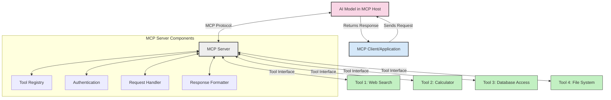
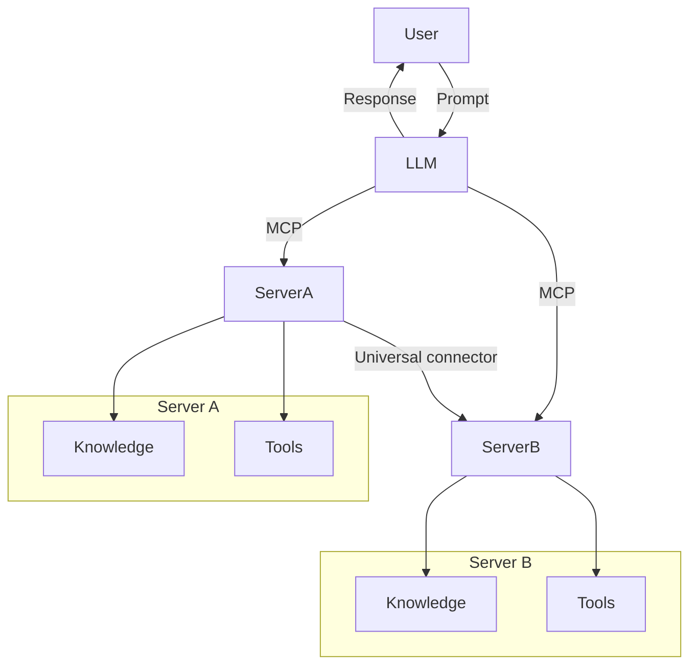
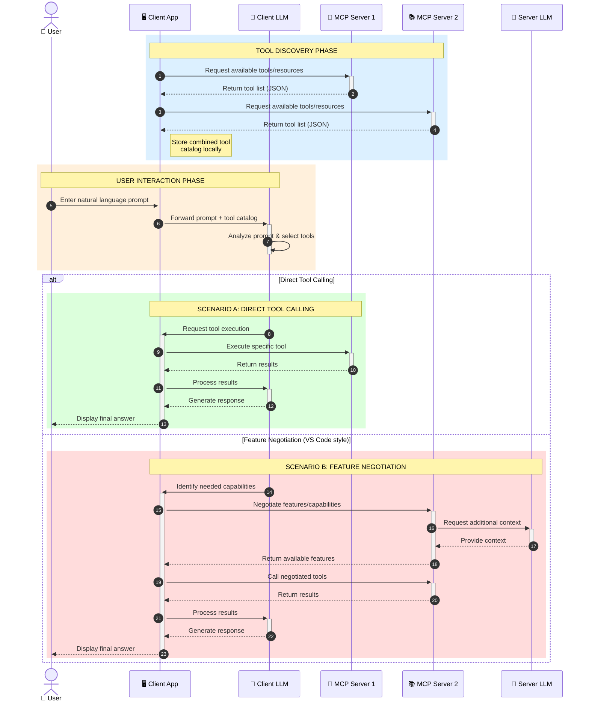

<!--
CO_OP_TRANSLATOR_METADATA:
{
  "original_hash": "25a94c681cf43612ff394d8cf78a74de",
  "translation_date": "2025-05-27T16:04:54+00:00",
  "source_file": "00-Introduction/README.md",
  "language_code": "th"
}
-->
# บทนำสู่ Model Context Protocol (MCP): ทำไมถึงสำคัญสำหรับแอปพลิเคชัน AI ที่ขยายตัวได้

แอปพลิเคชัน Generative AI เป็นก้าวสำคัญที่ช่วยให้ผู้ใช้สามารถโต้ตอบกับแอปผ่านคำสั่งภาษาธรรมชาติได้อย่างง่ายดาย อย่างไรก็ตาม เมื่อมีการลงทุนเวลาและทรัพยากรเพิ่มขึ้นในแอปเหล่านี้ คุณต้องมั่นใจว่าสามารถรวมฟังก์ชันและทรัพยากรต่างๆ ได้อย่างง่ายดาย เพื่อให้ขยายได้ง่าย แอปของคุณรองรับการใช้งานหลายโมเดล และจัดการกับความซับซ้อนของโมเดลต่างๆ ได้ โดยสรุป การสร้างแอป Gen AI เริ่มต้นง่าย แต่เมื่อเติบโตและซับซ้อนขึ้น คุณจำเป็นต้องกำหนดสถาปัตยกรรมและอาจต้องพึ่งพามาตรฐานเพื่อให้แน่ใจว่าแอปของคุณถูกสร้างอย่างสม่ำเสมอ นี่คือจุดที่ MCP เข้ามาจัดระเบียบและให้มาตรฐาน

---

## **🔍 Model Context Protocol (MCP) คืออะไร?**

**Model Context Protocol (MCP)** คือ **อินเทอร์เฟซแบบเปิดและมาตรฐาน** ที่ช่วยให้ Large Language Models (LLMs) สามารถเชื่อมต่อกับเครื่องมือภายนอก, API และแหล่งข้อมูลได้อย่างราบรื่น มันให้สถาปัตยกรรมที่สม่ำเสมอเพื่อเพิ่มขีดความสามารถของโมเดล AI เกินกว่าข้อมูลที่ใช้ฝึกฝน ทำให้ระบบ AI ฉลาดขึ้น ขยายตัวได้ และตอบสนองได้ดีขึ้น

---

## **🎯 ทำไมการมีมาตรฐานใน AI ถึงสำคัญ**

เมื่อแอปพลิเคชัน generative AI มีความซับซ้อนมากขึ้น การนำมาตรฐานมาใช้จึงเป็นสิ่งจำเป็นเพื่อให้มั่นใจในเรื่องของ **การขยายตัว, การต่อยอด**, และ **การดูแลรักษา** MCP ตอบโจทย์นี้โดย:

- รวมการเชื่อมต่อระหว่างโมเดลกับเครื่องมือให้เป็นหนึ่งเดียว
- ลดการแก้ปัญหาที่ทำขึ้นเฉพาะตัวและเปราะบาง
- อนุญาตให้โมเดลหลายตัวอยู่ร่วมกันในระบบเดียวได้

---

## **📚 วัตถุประสงค์การเรียนรู้**

เมื่ออ่านบทความนี้จบ คุณจะสามารถ:

- อธิบาย **Model Context Protocol (MCP)** และกรณีการใช้งานได้
- เข้าใจวิธีที่ MCP มาตรฐานการสื่อสารระหว่างโมเดลกับเครื่องมือ
- ระบุส่วนประกอบหลักของสถาปัตยกรรม MCP
- สำรวจการใช้งาน MCP ในโลกธุรกิจและการพัฒนา

---

## **💡 ทำไม Model Context Protocol (MCP) ถึงเป็นตัวเปลี่ยนเกม**

### **🔗 MCP แก้ปัญหาการกระจัดกระจายในการโต้ตอบ AI**

ก่อนจะมี MCP การรวมโมเดลกับเครื่องมือต้องใช้:

- โค้ดเฉพาะสำหรับแต่ละคู่เครื่องมือ-โมเดล
- API ที่ไม่เป็นมาตรฐานสำหรับแต่ละผู้ให้บริการ
- เกิดปัญหาบ่อยครั้งเมื่อต้องอัปเดต
- ขยายตัวได้ยากเมื่อมีเครื่องมือเพิ่มขึ้น

### **✅ ประโยชน์ของการมีมาตรฐาน MCP**

| **ประโยชน์**             | **คำอธิบาย**                                                                 |
|--------------------------|-------------------------------------------------------------------------------|
| การทำงานร่วมกันได้ดี    | LLMs ทำงานร่วมกับเครื่องมือต่างๆ จากผู้ให้บริการหลายรายได้อย่างราบรื่น      |
| ความสม่ำเสมอ            | พฤติกรรมที่เหมือนกันในทุกแพลตฟอร์มและเครื่องมือ                          |
| การนำกลับมาใช้ใหม่      | เครื่องมือที่สร้างขึ้นครั้งเดียวสามารถใช้ได้ในหลายโปรเจกต์และระบบ          |
| การพัฒนาที่รวดเร็ว      | ลดเวลาพัฒนาโดยใช้อินเทอร์เฟซที่เป็นมาตรฐานและพร้อมใช้งาน                   |

---

## **🧱 ภาพรวมสถาปัตยกรรม MCP ระดับสูง**

MCP ใช้ **โมเดลลูกค้า-เซิร์ฟเวอร์** ซึ่ง:

- **MCP Hosts** เป็นที่รันโมเดล AI
- **MCP Clients** เป็นผู้ส่งคำขอ
- **MCP Servers** ให้บริการบริบท เครื่องมือ และความสามารถต่างๆ

### **ส่วนประกอบหลัก:**

- **Resources** – ข้อมูลคงที่หรือข้อมูลแบบไดนามิกสำหรับโมเดล  
- **Prompts** – เวิร์กโฟลว์ที่กำหนดไว้ล่วงหน้าสำหรับการสร้างคำตอบที่มีทิศทาง  
- **Tools** – ฟังก์ชันที่สามารถเรียกใช้งานได้ เช่น การค้นหา การคำนวณ  
- **Sampling** – พฤติกรรมของตัวแทนผ่านการโต้ตอบซ้ำๆ

---

## วิธีการทำงานของ MCP Servers

MCP servers ทำงานดังนี้:

- **ลำดับการร้องขอ**: 
    1. MCP Client ส่งคำขอไปยังโมเดล AI ที่รันใน MCP Host
    2. โมเดล AI ระบุว่าเมื่อใดที่ต้องใช้เครื่องมือหรืข้อมูลภายนอก
    3. โมเดลสื่อสารกับ MCP Server ผ่านโปรโตคอลมาตรฐาน

- **ฟังก์ชันของ MCP Server**:
    - Tool Registry: เก็บรายการเครื่องมือและความสามารถต่างๆ
    - Authentication: ตรวจสอบสิทธิ์การเข้าถึงเครื่องมือ
    - Request Handler: ประมวลผลคำขอเครื่องมือที่เข้ามาจากโมเดล
    - Response Formatter: จัดรูปแบบผลลัพธ์จากเครื่องมือให้อยู่ในรูปแบบที่โมเดลเข้าใจได้

- **การเรียกใช้งานเครื่องมือ**: 
    - เซิร์ฟเวอร์ส่งคำขอไปยังเครื่องมือภายนอกที่เหมาะสม
    - เครื่องมือทำงานเฉพาะทาง (ค้นหา, คำนวณ, สืบค้นฐานข้อมูล ฯลฯ)
    - ผลลัพธ์ถูกส่งกลับไปยังโมเดลในรูปแบบที่สม่ำเสมอ

- **การตอบกลับสมบูรณ์**: 
    - โมเดล AI นำผลลัพธ์จากเครื่องมือมาใช้ในคำตอบ
    - คำตอบสุดท้ายถูกส่งกลับไปยังแอปพลิเคชันลูกค้า

## 👨‍💻 วิธีสร้าง MCP Server (พร้อมตัวอย่าง)

MCP servers ช่วยให้คุณขยายความสามารถของ LLM โดยการให้ข้อมูลและฟังก์ชันการทำงาน

พร้อมลองใช้งานไหม? นี่คือตัวอย่างการสร้าง MCP server ง่ายๆ ในหลายภาษา:

- **ตัวอย่าง Python**: https://github.com/modelcontextprotocol/python-sdk

- **ตัวอย่าง TypeScript**: https://github.com/modelcontextprotocol/typescript-sdk

- **ตัวอย่าง Java**: https://github.com/modelcontextprotocol/java-sdk

- **ตัวอย่าง C#/.NET**: https://github.com/modelcontextprotocol/csharp-sdk

## 🌍 กรณีใช้งานจริงของ MCP

MCP ช่วยขยายขีดความสามารถของ AI ให้ครอบคลุมการใช้งานหลากหลาย:

| **แอปพลิเคชัน**             | **คำอธิบาย**                                                                  |
|------------------------------|--------------------------------------------------------------------------------|
| การรวมข้อมูลองค์กร           | เชื่อมต่อ LLMs กับฐานข้อมูล, CRM หรือเครื่องมือภายในองค์กร                   |
| ระบบ AI ตัวแทนอิสระ          | เปิดใช้งานตัวแทนอัตโนมัติที่เข้าถึงเครื่องมือและเวิร์กโฟลว์การตัดสินใจ       |
| แอปพลิเคชันมัลติโหมด        | ผสมผสานเครื่องมือข้อความ, รูปภาพ และเสียงในแอป AI เดียว                     |
| การรวมข้อมูลแบบเรียลไทม์    | นำข้อมูลสดเข้าสู่การโต้ตอบ AI เพื่อผลลัพธ์ที่แม่นยำและทันสมัย                |

### 🧠 MCP = มาตรฐานสากลสำหรับการโต้ตอบ AI

Model Context Protocol (MCP) ทำหน้าที่เป็นมาตรฐานสากลสำหรับการโต้ตอบ AI เหมือนกับที่ USB-C เป็นมาตรฐานการเชื่อมต่ออุปกรณ์ทางกายภาพ ในโลกของ AI MCP ให้หน้าต่างสื่อสารที่สม่ำเสมอ ช่วยให้โมเดล (ลูกค้า) รวมตัวกับเครื่องมือและผู้ให้บริการข้อมูลภายนอก (เซิร์ฟเวอร์) ได้อย่างราบรื่น ซึ่งช่วยลดความจำเป็นในการมีโปรโตคอลเฉพาะสำหรับแต่ละ API หรือแหล่งข้อมูล

ภายใต้ MCP เครื่องมือที่เข้ากันได้กับ MCP (เรียกว่า MCP server) จะปฏิบัติตามมาตรฐานเดียวกัน เซิร์ฟเวอร์เหล่านี้สามารถแสดงรายการเครื่องมือหรือการกระทำที่ให้บริการ และดำเนินการเหล่านั้นเมื่อได้รับคำขอจากเอเจนต์ AI แพลตฟอร์มเอเจนต์ AI ที่รองรับ MCP สามารถค้นหาเครื่องมือที่มีอยู่จากเซิร์ฟเวอร์และเรียกใช้งานผ่านโปรโตคอลมาตรฐานนี้ได้

### 💡 ช่วยให้เข้าถึงความรู้ได้ง่ายขึ้น

นอกจากการให้เครื่องมือแล้ว MCP ยังช่วยให้เข้าถึงความรู้ได้อีกด้วย ช่วยให้อุปกรณ์ต่างๆ สามารถให้บริบทกับ LLMs โดยเชื่อมต่อกับแหล่งข้อมูลต่างๆ เช่น MCP server อาจเป็นตัวแทนของคลังเอกสารบริษัท ช่วยให้เอเจนต์ดึงข้อมูลที่เกี่ยวข้องได้ตามต้องการ อีกเซิร์ฟเวอร์อาจจัดการการกระทำเฉพาะ เช่น การส่งอีเมลหรืออัปเดตข้อมูล จากมุมมองของเอเจนต์ เครื่องมือเหล่านี้คือสิ่งที่มันสามารถใช้ได้ บางเครื่องมือคืนข้อมูล (บริบทความรู้) ในขณะที่บางเครื่องมือทำงานตามคำสั่ง MCP จัดการทั้งสองอย่างได้อย่างมีประสิทธิภาพ

เอเจนต์ที่เชื่อมต่อกับ MCP server จะเรียนรู้ความสามารถและข้อมูลที่เข้าถึงได้ของเซิร์ฟเวอร์นั้นโดยอัตโนมัติผ่านรูปแบบมาตรฐาน การมีมาตรฐานนี้ช่วยให้เครื่องมือสามารถเปลี่ยนแปลงได้แบบไดนามิก เช่น การเพิ่ม MCP server ใหม่ในระบบของเอเจนต์จะทำให้ฟังก์ชันของเซิร์ฟเวอร์นั้นพร้อมใช้งานทันทีโดยไม่ต้องปรับแต่งคำสั่งของเอเจนต์เพิ่มเติม

การรวมระบบอย่างเป็นระเบียบนี้สอดคล้องกับไดอะแกรม mermaid ที่แสดงให้เห็นว่าเซิร์ฟเวอร์ให้บริการทั้งเครื่องมือและความรู้ เพื่อให้การทำงานร่วมกันระหว่างระบบเป็นไปอย่างราบรื่น

### 👉 ตัวอย่าง: โซลูชันเอเจนต์ที่ขยายตัวได้

### 🔄 สถานการณ์ขั้นสูงของ MCP กับการรวม LLM ฝั่งลูกค้า

นอกจากสถาปัตยกรรม MCP พื้นฐาน ยังมีสถานการณ์ขั้นสูงที่ทั้งฝั่งลูกค้าและเซิร์ฟเวอร์มี LLM ช่วยให้เกิดการโต้ตอบที่ซับซ้อนมากขึ้น:

## 🔐 ประโยชน์ใช้งานจริงของ MCP

นี่คือประโยชน์ที่จับต้องได้ของการใช้ MCP:

- **ข้อมูลทันสมัย**: โมเดลสามารถเข้าถึงข้อมูลล่าสุดเกินกว่าข้อมูลที่ฝึกมา
- **ขยายความสามารถ**: โมเดลสามารถใช้เครื่องมือเฉพาะทางสำหรับงานที่ไม่ได้ฝึกไว้
- **ลดความผิดพลาด**: แหล่งข้อมูลภายนอกช่วยให้ข้อมูลมีความถูกต้อง
- **ความเป็นส่วนตัว**: ข้อมูลสำคัญสามารถเก็บไว้ในสภาพแวดล้อมที่ปลอดภัยโดยไม่ต้องฝังใน prompt

## 📌 สรุปใจความสำคัญ

นี่คือข้อสรุปสำคัญของการใช้ MCP:

- **MCP** มาตรฐานการสื่อสารระหว่างโมเดล AI กับเครื่องมือและข้อมูล
- ส่งเสริม **การขยายตัว, ความสม่ำเสมอ, และการทำงานร่วมกันได้**
- MCP ช่วย **ลดเวลาพัฒนา, เพิ่มความน่าเชื่อถือ, และขยายความสามารถของโมเดล**
- สถาปัตยกรรมลูกค้า-เซิร์ฟเวอร์ช่วยให้แอป AI มีความยืดหยุ่นและขยายตัวได้

## 🧠 แบบฝึกหัด

ลองคิดถึงแอป AI ที่คุณสนใจจะสร้าง

- เครื่องมือหรือข้อมูลภายนอกใดบ้างที่ช่วยเพิ่มความสามารถ?
- MCP จะช่วยให้งานรวมระบบง่ายและน่าเชื่อถือขึ้นอย่างไร?

## แหล่งข้อมูลเพิ่มเติม

- [MCP GitHub Repository](https://github.com/modelcontextprotocol)

## ต่อไป

ถัดไป: [บทที่ 1: แนวคิดหลัก](/01-CoreConcepts/README.md)

**ข้อจำกัดความรับผิดชอบ**:  
เอกสารนี้ได้รับการแปลโดยใช้บริการแปลภาษาอัตโนมัติ [Co-op Translator](https://github.com/Azure/co-op-translator) แม้ว่าเราจะพยายามให้ความถูกต้องสูงสุด โปรดทราบว่าการแปลอัตโนมัติอาจมีข้อผิดพลาดหรือความไม่ถูกต้อง เอกสารต้นฉบับในภาษาต้นทางควรถือเป็นแหล่งข้อมูลที่เชื่อถือได้ สำหรับข้อมูลที่สำคัญ ขอแนะนำให้ใช้บริการแปลโดยผู้เชี่ยวชาญที่เป็นมนุษย์ เราจะไม่รับผิดชอบต่อความเข้าใจผิดหรือการตีความผิดใด ๆ ที่เกิดขึ้นจากการใช้การแปลนี้