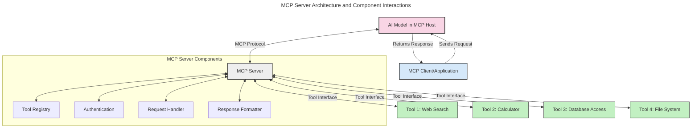
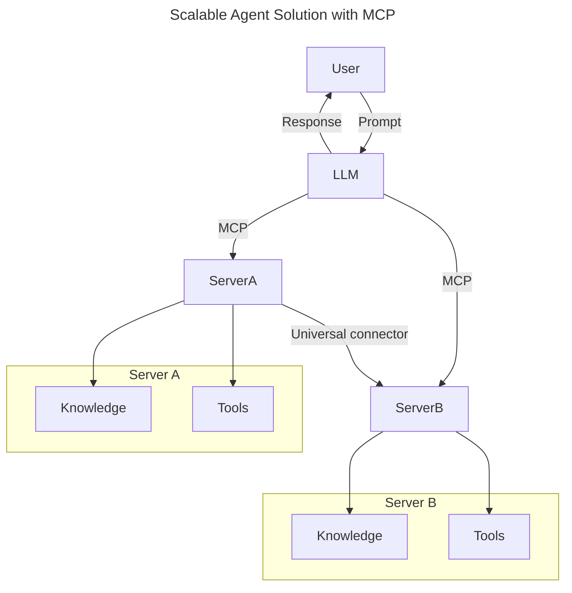
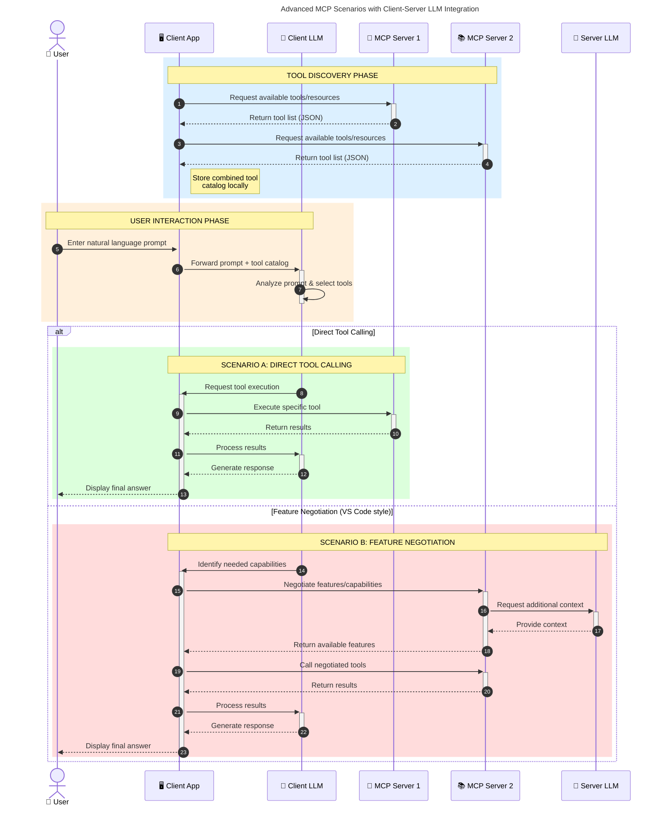

<!--
CO_OP_TRANSLATOR_METADATA:
{
  "original_hash": "105c2ddbb77bc38f7e9df009e1b06e45",
  "translation_date": "2025-07-13T15:33:26+00:00",
  "source_file": "00-Introduction/README.md",
  "language_code": "th"
}
-->
# บทนำสู่ Model Context Protocol (MCP): ทำไมจึงสำคัญสำหรับแอปพลิเคชัน AI ที่ขยายตัวได้

แอปพลิเคชัน Generative AI เป็นก้าวสำคัญที่ช่วยให้ผู้ใช้สามารถโต้ตอบกับแอปผ่านคำสั่งภาษาธรรมชาติได้อย่างง่ายดาย อย่างไรก็ตาม เมื่อมีการลงทุนเวลาและทรัพยากรมากขึ้นกับแอปเหล่านี้ คุณต้องมั่นใจว่าสามารถผสานรวมฟังก์ชันและทรัพยากรต่างๆ ได้อย่างง่ายดาย เพื่อให้ขยายระบบได้ง่าย แอปของคุณรองรับการใช้งานหลายโมเดล และจัดการกับความซับซ้อนของโมเดลต่างๆ ได้ กล่าวโดยสรุป การสร้างแอป Gen AI เริ่มต้นง่าย แต่เมื่อระบบเติบโตและซับซ้อนขึ้น คุณจำเป็นต้องกำหนดสถาปัตยกรรมและอาจต้องพึ่งพามาตรฐานเพื่อให้แอปของคุณถูกสร้างขึ้นอย่างสม่ำเสมอ นี่คือจุดที่ MCP เข้ามาจัดระเบียบและให้มาตรฐาน

---

## **🔍 Model Context Protocol (MCP) คืออะไร?**

**Model Context Protocol (MCP)** คือ **อินเทอร์เฟซเปิดและมีมาตรฐาน** ที่ช่วยให้ Large Language Models (LLMs) สามารถเชื่อมต่อกับเครื่องมือภายนอก, API และแหล่งข้อมูลต่างๆ ได้อย่างราบรื่น มันให้สถาปัตยกรรมที่สม่ำเสมอเพื่อเพิ่มขีดความสามารถของโมเดล AI ให้เกินกว่าข้อมูลที่ใช้ฝึกสอน ช่วยให้ระบบ AI ฉลาดขึ้น ขยายตัวได้ และตอบสนองได้ดีขึ้น

---

## **🎯 ทำไมการมีมาตรฐานใน AI จึงสำคัญ**

เมื่อแอปพลิเคชัน generative AI ซับซ้อนขึ้น การนำมาตรฐานมาใช้เพื่อให้มั่นใจในเรื่อง **การขยายตัว, การต่อยอด**, และ **การดูแลรักษา** เป็นสิ่งจำเป็น MCP ตอบโจทย์นี้โดย:

- รวมการเชื่อมต่อระหว่างโมเดลกับเครื่องมือให้เป็นหนึ่งเดียว
- ลดการแก้ปัญหาแบบเฉพาะเจาะจงที่เปราะบาง
- อนุญาตให้โมเดลหลายตัวอยู่ร่วมกันในระบบเดียวได้

---

## **📚 วัตถุประสงค์การเรียนรู้**

เมื่ออ่านบทความนี้จบ คุณจะสามารถ:

- อธิบายความหมายของ **Model Context Protocol (MCP)** และกรณีการใช้งาน
- เข้าใจวิธีที่ MCP มาตรฐานการสื่อสารระหว่างโมเดลกับเครื่องมือ
- ระบุส่วนประกอบหลักของสถาปัตยกรรม MCP
- สำรวจการใช้งานจริงของ MCP ในองค์กรและการพัฒนา

---

## **💡 ทำไม Model Context Protocol (MCP) ถึงเปลี่ยนเกม**

### **🔗 MCP แก้ปัญหาการแยกส่วนในการโต้ตอบ AI**

ก่อน MCP การเชื่อมต่อโมเดลกับเครื่องมือต้องใช้:

- โค้ดเฉพาะสำหรับแต่ละคู่เครื่องมือ-โมเดล
- API ที่ไม่มีมาตรฐานสำหรับแต่ละผู้ให้บริการ
- การหยุดชะงักบ่อยครั้งเมื่อมีการอัปเดต
- ขยายตัวได้ยากเมื่อมีเครื่องมือเพิ่มขึ้น

### **✅ ประโยชน์ของการมีมาตรฐาน MCP**

| **ประโยชน์**             | **คำอธิบาย**                                                                 |
|--------------------------|-------------------------------------------------------------------------------|
| การทำงานร่วมกันได้ดี     | LLMs ทำงานร่วมกับเครื่องมือจากผู้ให้บริการต่างๆ ได้อย่างราบรื่น             |
| ความสม่ำเสมอ            | พฤติกรรมที่เหมือนกันในทุกแพลตฟอร์มและเครื่องมือ                           |
| การนำกลับมาใช้ใหม่       | เครื่องมือที่สร้างขึ้นครั้งเดียวสามารถใช้ในโปรเจกต์และระบบต่างๆ ได้          |
| เร่งการพัฒนา             | ลดเวลาพัฒนาโดยใช้อินเทอร์เฟซมาตรฐานที่เสียบใช้งานได้ทันที                   |

---

## **🧱 ภาพรวมสถาปัตยกรรม MCP ระดับสูง**

MCP ใช้ **โมเดลไคลเอนต์-เซิร์ฟเวอร์** โดย:

- **MCP Hosts** เป็นที่รันโมเดล AI
- **MCP Clients** เป็นผู้เริ่มต้นคำขอ
- **MCP Servers** ให้บริการบริบท, เครื่องมือ และความสามารถต่างๆ

### **ส่วนประกอบหลัก:**

- **Resources** – ข้อมูลคงที่หรือข้อมูลแบบไดนามิกสำหรับโมเดล  
- **Prompts** – เวิร์กโฟลว์ที่กำหนดไว้ล่วงหน้าสำหรับการสร้างคำตอบที่มีแนวทาง  
- **Tools** – ฟังก์ชันที่สามารถรันได้ เช่น การค้นหา, การคำนวณ  
- **Sampling** – พฤติกรรมแบบตัวแทนผ่านการโต้ตอบซ้ำๆ

---

## วิธีการทำงานของ MCP Servers

MCP servers ทำงานดังนี้:

- **ลำดับคำขอ**:  
    1. MCP Client ส่งคำขอไปยังโมเดล AI ที่รันใน MCP Host  
    2. โมเดล AI ระบุเมื่อจำเป็นต้องใช้เครื่องมือหรือข้อมูลภายนอก  
    3. โมเดลสื่อสารกับ MCP Server ผ่านโปรโตคอลมาตรฐาน

- **ฟังก์ชันของ MCP Server**:  
    - Tool Registry: เก็บรายการเครื่องมือและความสามารถที่มี  
    - Authentication: ตรวจสอบสิทธิ์การเข้าถึงเครื่องมือ  
    - Request Handler: ประมวลผลคำขอเครื่องมือจากโมเดล  
    - Response Formatter: จัดรูปแบบผลลัพธ์จากเครื่องมือให้อยู่ในรูปแบบที่โมเดลเข้าใจได้

- **การรันเครื่องมือ**:  
    - เซิร์ฟเวอร์ส่งคำขอไปยังเครื่องมือภายนอกที่เหมาะสม  
    - เครื่องมือทำงานเฉพาะทาง (ค้นหา, คำนวณ, คิวรีฐานข้อมูล ฯลฯ)  
    - ผลลัพธ์ถูกส่งกลับไปยังโมเดลในรูปแบบที่สม่ำเสมอ

- **การตอบกลับสมบูรณ์**:  
    - โมเดล AI นำผลลัพธ์จากเครื่องมือมารวมในคำตอบ  
    - คำตอบสุดท้ายถูกส่งกลับไปยังแอปพลิเคชันไคลเอนต์

## 👨‍💻 วิธีสร้าง MCP Server (พร้อมตัวอย่าง)

MCP servers ช่วยให้คุณขยายความสามารถของ LLM โดยการให้ข้อมูลและฟังก์ชันการทำงาน

พร้อมลองใช้งานหรือยัง? นี่คือตัวอย่างการสร้าง MCP server ง่ายๆ ในหลายภาษา:

- **ตัวอย่าง Python**: https://github.com/modelcontextprotocol/python-sdk

- **ตัวอย่าง TypeScript**: https://github.com/modelcontextprotocol/typescript-sdk

- **ตัวอย่าง Java**: https://github.com/modelcontextprotocol/java-sdk

- **ตัวอย่าง C#/.NET**: https://github.com/modelcontextprotocol/csharp-sdk

## 🌍 กรณีใช้งานจริงของ MCP

MCP ช่วยขยายขีดความสามารถของ AI ในหลายแอปพลิเคชัน:

| **แอปพลิเคชัน**           | **คำอธิบาย**                                                                 |
|----------------------------|-------------------------------------------------------------------------------|
| การรวมข้อมูลองค์กร         | เชื่อมต่อ LLMs กับฐานข้อมูล, CRM หรือเครื่องมือภายในองค์กร                   |
| ระบบ AI แบบตัวแทน          | เปิดใช้งานตัวแทนอัตโนมัติที่เข้าถึงเครื่องมือและเวิร์กโฟลว์การตัดสินใจ      |
| แอปพลิเคชันมัลติโมดัล     | รวมเครื่องมือข้อความ, รูปภาพ และเสียงในแอป AI เดียวกัน                      |
| การรวมข้อมูลเรียลไทม์     | นำข้อมูลสดเข้าสู่การโต้ตอบ AI เพื่อผลลัพธ์ที่แม่นยำและทันสมัยกว่า            |

### 🧠 MCP = มาตรฐานสากลสำหรับการโต้ตอบ AI

Model Context Protocol (MCP) ทำหน้าที่เป็นมาตรฐานสากลสำหรับการโต้ตอบ AI เหมือนกับที่ USB-C เป็นมาตรฐานการเชื่อมต่ออุปกรณ์ทางกายภาพ ในโลกของ AI MCP ให้หน้าต่างเชื่อมต่อที่สม่ำเสมอ ช่วยให้โมเดล (ไคลเอนต์) ผสานรวมกับเครื่องมือและผู้ให้บริการข้อมูลภายนอก (เซิร์ฟเวอร์) ได้อย่างราบรื่น ซึ่งช่วยลดความจำเป็นในการใช้โปรโตคอลเฉพาะสำหรับแต่ละ API หรือแหล่งข้อมูล

ภายใต้ MCP เครื่องมือที่รองรับ MCP (เรียกว่า MCP server) จะปฏิบัติตามมาตรฐานเดียวกัน เซิร์ฟเวอร์เหล่านี้สามารถแสดงรายการเครื่องมือหรือการกระทำที่มี และดำเนินการตามคำขอจากตัวแทน AI แพลตฟอร์มตัวแทน AI ที่รองรับ MCP สามารถค้นหาเครื่องมือที่มีจากเซิร์ฟเวอร์และเรียกใช้งานผ่านโปรโตคอลมาตรฐานนี้ได้

### 💡 ช่วยให้เข้าถึงความรู้ได้ง่ายขึ้น

นอกจากการให้เครื่องมือแล้ว MCP ยังช่วยให้เข้าถึงความรู้ได้ด้วย ช่วยให้แอปพลิเคชันสามารถให้บริบทกับ LLMs โดยเชื่อมต่อกับแหล่งข้อมูลต่างๆ เช่น MCP server อาจเป็นตัวแทนของคลังเอกสารบริษัท ช่วยให้ตัวแทนดึงข้อมูลที่เกี่ยวข้องตามคำขอ อีกเซิร์ฟเวอร์หนึ่งอาจจัดการการกระทำเฉพาะ เช่น ส่งอีเมลหรืออัปเดตข้อมูล จากมุมมองของตัวแทน นี่คือเครื่องมือที่ใช้ได้—บางเครื่องมือคืนข้อมูล (บริบทความรู้) ขณะที่บางเครื่องมือทำการกระทำ MCP จัดการทั้งสองอย่างได้อย่างมีประสิทธิภาพ

ตัวแทนที่เชื่อมต่อกับ MCP server จะเรียนรู้ความสามารถและข้อมูลที่เข้าถึงได้ของเซิร์ฟเวอร์โดยอัตโนมัติผ่านรูปแบบมาตรฐาน การมีมาตรฐานนี้ช่วยให้เครื่องมือพร้อมใช้งานแบบไดนามิก เช่น การเพิ่ม MCP server ใหม่ในระบบตัวแทนจะทำให้ฟังก์ชันของเซิร์ฟเวอร์นั้นพร้อมใช้งานทันทีโดยไม่ต้องปรับแต่งคำสั่งของตัวแทนเพิ่มเติม

การผสานรวมที่ราบรื่นนี้สอดคล้องกับโฟลว์ที่แสดงในไดอะแกรม mermaid ซึ่งเซิร์ฟเวอร์ให้ทั้งเครื่องมือและความรู้ เพื่อให้ระบบทำงานร่วมกันได้อย่างไร้รอยต่อ

### 👉 ตัวอย่าง: โซลูชันตัวแทนที่ขยายตัวได้

### 🔄 สถานการณ์ MCP ขั้นสูงกับการผสาน LLM ฝั่งไคลเอนต์

นอกจากสถาปัตยกรรม MCP พื้นฐาน ยังมีสถานการณ์ขั้นสูงที่ทั้งไคลเอนต์และเซิร์ฟเวอร์มี LLM ทำให้เกิดการโต้ตอบที่ซับซ้อนขึ้น:

## 🔐 ประโยชน์เชิงปฏิบัติของ MCP

นี่คือประโยชน์เชิงปฏิบัติของการใช้ MCP:

- **ข้อมูลสดใหม่**: โมเดลสามารถเข้าถึงข้อมูลที่อัปเดตเกินกว่าข้อมูลฝึกสอน  
- **ขยายความสามารถ**: โมเดลใช้เครื่องมือเฉพาะทางสำหรับงานที่ไม่ได้ฝึกสอน  
- **ลดการสร้างข้อมูลผิดพลาด**: แหล่งข้อมูลภายนอกช่วยยืนยันความถูกต้อง  
- **ความเป็นส่วนตัว**: ข้อมูลที่ละเอียดอ่อนเก็บไว้ในสภาพแวดล้อมที่ปลอดภัย แทนที่จะฝังในคำสั่ง

## 📌 สรุปใจความสำคัญ

ข้อสรุปสำคัญสำหรับการใช้ MCP:

- **MCP** มาตรฐานการโต้ตอบระหว่างโมเดล AI กับเครื่องมือและข้อมูล  
- ส่งเสริม **การขยายตัว, ความสม่ำเสมอ, และการทำงานร่วมกัน**  
- MCP ช่วย **ลดเวลาพัฒนา, เพิ่มความน่าเชื่อถือ, และขยายความสามารถของโมเดล**  
- สถาปัตยกรรมไคลเอนต์-เซิร์ฟเวอร์ช่วยให้แอป AI มีความยืดหยุ่นและขยายตัวได้

## 🧠 แบบฝึกหัด

ลองคิดถึงแอป AI ที่คุณสนใจจะสร้าง

- เครื่องมือหรือข้อมูลภายนอกใดบ้างที่จะช่วยเพิ่มขีดความสามารถ?  
- MCP จะช่วยให้การผสานรวมง่ายขึ้นและน่าเชื่อถือขึ้นได้อย่างไร?

## แหล่งข้อมูลเพิ่มเติม

- [MCP GitHub Repository](https://github.com/modelcontextprotocol)

## ต่อไป

ถัดไป: [บทที่ 1: แนวคิดหลัก](../01-CoreConcepts/README.md)

**ข้อจำกัดความรับผิดชอบ**:  
เอกสารนี้ได้รับการแปลโดยใช้บริการแปลภาษาอัตโนมัติ [Co-op Translator](https://github.com/Azure/co-op-translator) แม้เราจะพยายามให้ความถูกต้องสูงสุด แต่โปรดทราบว่าการแปลอัตโนมัติอาจมีข้อผิดพลาดหรือความไม่ถูกต้อง เอกสารต้นฉบับในภาษาต้นทางถือเป็นแหล่งข้อมูลที่เชื่อถือได้ สำหรับข้อมูลที่สำคัญ ขอแนะนำให้ใช้บริการแปลโดยผู้เชี่ยวชาญมนุษย์ เราไม่รับผิดชอบต่อความเข้าใจผิดหรือการตีความผิดใด ๆ ที่เกิดจากการใช้การแปลนี้