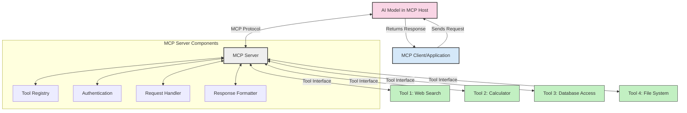
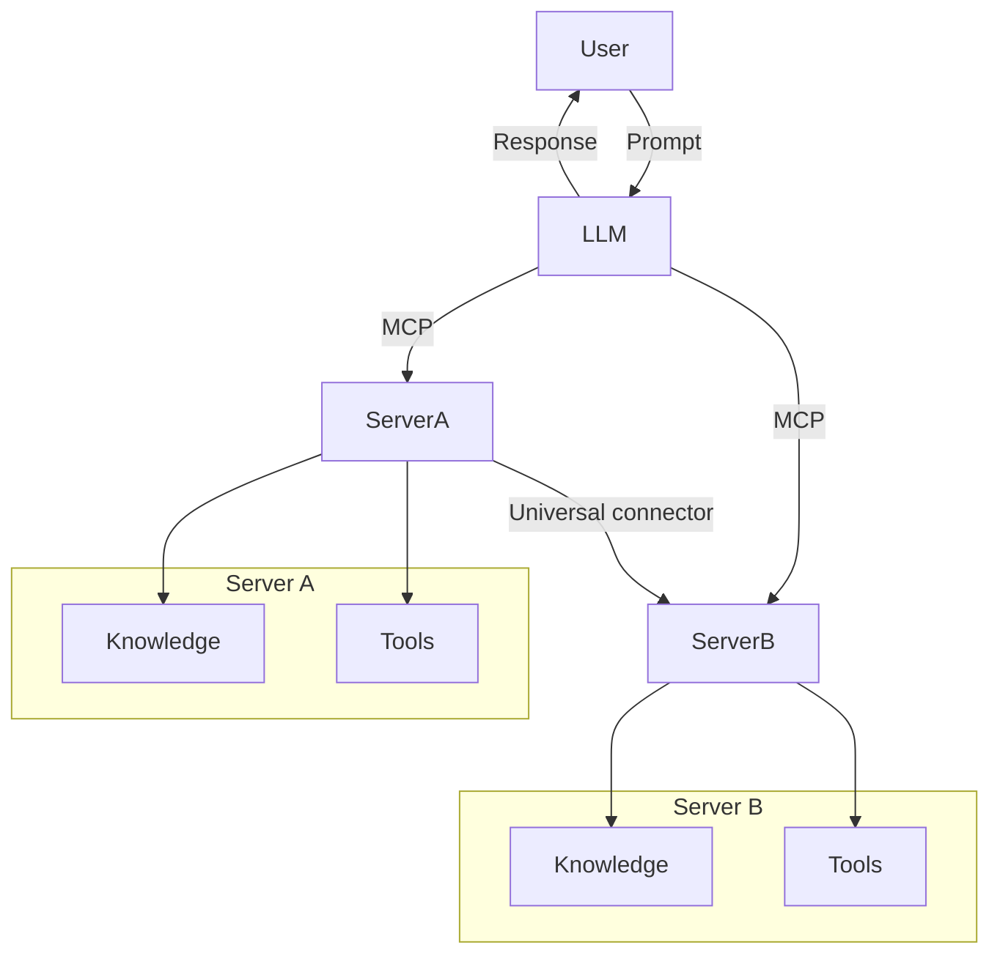

<!--
CO_OP_TRANSLATOR_METADATA:
{
  "original_hash": "02301140adbd807ecf0f17720fa307bc",
  "translation_date": "2025-05-17T06:01:25+00:00",
  "source_file": "00-Introduction/README.md",
  "language_code": "th"
}
-->
# บทนำเกี่ยวกับ Model Context Protocol (MCP): ทำไมมันถึงสำคัญสำหรับการใช้งาน AI ที่สามารถขยายได้

แอปพลิเคชัน AI ที่สร้างขึ้นเป็นก้าวที่ยอดเยี่ยมไปข้างหน้าเพราะมักจะให้ผู้ใช้โต้ตอบกับแอปผ่านการใช้ภาษาธรรมชาติ อย่างไรก็ตาม เมื่อมีการลงทุนเวลาและทรัพยากรมากขึ้นในแอปพลิเคชันเหล่านี้ คุณต้องแน่ใจว่าคุณสามารถรวมฟังก์ชันและทรัพยากรได้ง่าย เพื่อให้สามารถขยายได้ง่าย แอปของคุณสามารถรองรับการใช้งานมากกว่าหนึ่งโมเดล และมีความซับซ้อน ในระยะสั้น การสร้างแอป Gen AI นั้นง่ายในตอนเริ่มต้น แต่เมื่อมันเติบโตและซับซ้อนขึ้น คุณจำเป็นต้องเริ่มกำหนดสถาปัตยกรรมและมีแนวโน้มว่าจะต้องพึ่งพามาตรฐานเพื่อให้แน่ใจว่าแอปของคุณถูกสร้างขึ้นอย่างสม่ำเสมอ นี่คือที่ที่ MCP เข้ามาจัดระเบียบสิ่งต่าง ๆ เพื่อให้มาตรฐาน

---

## **🔍 Model Context Protocol (MCP) คืออะไร?**

**Model Context Protocol (MCP)** เป็น **อินเทอร์เฟซแบบเปิดและมีมาตรฐาน** ที่ช่วยให้ Large Language Models (LLMs) สามารถโต้ตอบกับเครื่องมือภายนอก, API, และแหล่งข้อมูลได้อย่างราบรื่น มันให้สถาปัตยกรรมที่สม่ำเสมอเพื่อเพิ่มประสิทธิภาพของโมเดล AI เกินกว่าข้อมูลการฝึกฝนของพวกเขา ทำให้ระบบ AI ฉลาดขึ้น, ขยายได้, และตอบสนองได้ดีขึ้น

---

## **🎯 ทำไมมาตรฐานใน AI ถึงสำคัญ**

เมื่อแอปพลิเคชัน AI ที่สร้างขึ้นมีความซับซ้อนมากขึ้น จำเป็นต้องนำมาตรฐานมาใช้เพื่อให้แน่ใจว่า **สามารถขยายได้, ขยายความสามารถได้**, และ **รักษาความสามารถได้** MCP ตอบสนองความต้องการเหล่านี้โดย:

- รวมการบูรณาการเครื่องมือ-โมเดล
- ลดการแก้ไขเฉพาะที่เปราะบาง
- อนุญาตให้หลายโมเดลอยู่ร่วมกันภายในระบบเดียว

---

## **📚 วัตถุประสงค์การเรียนรู้**

เมื่อสิ้นสุดบทความนี้ คุณจะสามารถ:

- กำหนด **Model Context Protocol (MCP)** และกรณีการใช้งานของมัน
- เข้าใจว่า MCP มาตรฐานการสื่อสารระหว่างโมเดลกับเครื่องมืออย่างไร
- ระบุองค์ประกอบหลักของสถาปัตยกรรม MCP
- สำรวจการใช้งานจริงของ MCP ในบริบทองค์กรและการพัฒนา

---

## **💡 ทำไม Model Context Protocol (MCP) ถึงเป็นตัวเปลี่ยนเกม**

### **🔗 MCP แก้ไขการกระจายตัวในการโต้ตอบของ AI**

ก่อน MCP การบูรณาการโมเดลกับเครื่องมือจำเป็นต้องมี:

- โค้ดที่กำหนดเองสำหรับแต่ละคู่เครื่องมือ-โมเดล
- API ที่ไม่มีมาตรฐานสำหรับแต่ละผู้จำหน่าย
- การหยุดชะงักบ่อยครั้งเนื่องจากการอัปเดต
- ความสามารถในการขยายที่ไม่ดีเมื่อมีเครื่องมือมากขึ้น

### **✅ ประโยชน์ของมาตรฐาน MCP**

| **ประโยชน์**              | **คำอธิบาย**                                                                |
|--------------------------|--------------------------------------------------------------------------------|
| การทำงานร่วมกัน         | LLMs ทำงานร่วมกับเครื่องมือจากผู้จำหน่ายต่าง ๆ ได้อย่างราบรื่น                       |
| ความสม่ำเสมอ              | พฤติกรรมที่เหมือนกันทั่วแพลตฟอร์มและเครื่องมือ                                    |
| การใช้งานซ้ำได้              | เครื่องมือที่สร้างครั้งเดียวสามารถใช้งานได้ทั่วโครงการและระบบ                       |
| การพัฒนาเร็วขึ้น          | ลดเวลาการพัฒนาโดยใช้อินเทอร์เฟซแบบมาตรฐานและเสียบและเล่นได้                |

---

## **🧱 ภาพรวมสถาปัตยกรรม MCP ระดับสูง**

MCP ใช้ **โมเดล client-server**, โดยที่:

- **MCP Hosts** รันโมเดล AI
- **MCP Clients** เริ่มต้นคำร้องขอ
- **MCP Servers** ให้บริการบริบท, เครื่องมือ, และความสามารถ

### **องค์ประกอบหลัก:**

- **ทรัพยากร** – ข้อมูลแบบสถิตหรือแบบไดนามิกสำหรับโมเดล  
- **คำแนะนำ** – เวิร์กโฟลว์ที่กำหนดไว้ล่วงหน้าสำหรับการสร้างที่นำทาง  
- **เครื่องมือ** – ฟังก์ชันที่สามารถดำเนินการได้ เช่น การค้นหา, การคำนวณ  
- **การสุ่มตัวอย่าง** – พฤติกรรมของตัวแทนผ่านการโต้ตอบแบบวนซ้ำ

---

## วิธีการทำงานของ MCP Servers

เซิร์ฟเวอร์ MCP ทำงานในลักษณะต่อไปนี้:

- **การไหลของคำขอ**: 
    1. MCP Client ส่งคำขอไปยังโมเดล AI ที่รันใน MCP Host
    2. โมเดล AI ระบุเมื่อมันต้องการเครื่องมือหรือข้อมูลภายนอก
    3. โมเดลสื่อสารกับ MCP Server โดยใช้โปรโตคอลที่มีมาตรฐาน

- **ฟังก์ชันการทำงานของ MCP Server**:
    - การลงทะเบียนเครื่องมือ: รักษารายการของเครื่องมือที่มีและความสามารถของพวกมัน
    - การตรวจสอบสิทธิ์: ตรวจสอบสิทธิ์ในการเข้าถึงเครื่องมือ
    - ตัวจัดการคำขอ: ประมวลผลคำขอเครื่องมือที่เข้ามาจากโมเดล
    - ตัวจัดรูปแบบการตอบสนอง: จัดโครงสร้างผลลัพธ์ของเครื่องมือในรูปแบบที่โมเดลสามารถเข้าใจได้

- **การดำเนินการของเครื่องมือ**: 
    - เซิร์ฟเวอร์ส่งคำขอไปยังเครื่องมือภายนอกที่เหมาะสม
    - เครื่องมือดำเนินการฟังก์ชันเฉพาะของพวกมัน (ค้นหา, คำนวณ, คำขอฐานข้อมูล ฯลฯ)
    - ผลลัพธ์ถูกส่งกลับไปยังโมเดลในรูปแบบที่สม่ำเสมอ

- **การตอบสนองสมบูรณ์**: 
    - โมเดล AI รวมผลลัพธ์ของเครื่องมือเข้ากับการตอบสนองของมัน
    - การตอบสนองสุดท้ายถูกส่งกลับไปยังแอปพลิเคชันของลูกค้า

## 👨‍💻 วิธีสร้าง MCP Server (พร้อมตัวอย่าง)

เซิร์ฟเวอร์ MCP ช่วยให้คุณขยายความสามารถของ LLM โดยให้ข้อมูลและฟังก์ชัน 

พร้อมลองแล้วหรือยัง? นี่คือตัวอย่างการสร้างเซิร์ฟเวอร์ MCP แบบง่ายในภาษาโปรแกรมต่าง ๆ:

- **ตัวอย่าง Python**: https://github.com/modelcontextprotocol/python-sdk

- **ตัวอย่าง TypeScript**: https://github.com/modelcontextprotocol/typescript-sdk

- **ตัวอย่าง Java**: https://github.com/modelcontextprotocol/java-sdk

- **ตัวอย่าง C#/.NET**: https://github.com/modelcontextprotocol/csharp-sdk

## 🌍 กรณีการใช้งานจริงสำหรับ MCP

MCP เปิดใช้งานแอปพลิเคชันหลากหลายโดยการขยายความสามารถของ AI:

| **แอปพลิเคชัน**              | **คำอธิบาย**                                                                |
|------------------------------|--------------------------------------------------------------------------------|
| การบูรณาการข้อมูลองค์กร  | เชื่อมต่อ LLMs กับฐานข้อมูล, CRM, หรือเครื่องมือภายใน                             |
| ระบบ AI ที่มีตัวแทน           | เปิดใช้งานตัวแทนอัตโนมัติด้วยการเข้าถึงเครื่องมือและเวิร์กโฟลว์การตัดสินใจ        |
| แอปพลิเคชันหลายรูปแบบ     | รวมข้อความ, รูปภาพ, และเครื่องมือเสียงภายในแอป AI เดียวที่รวมกัน            |
| การบูรณาการข้อมูลเรียลไทม์   | นำข้อมูลสดเข้ามาในการโต้ตอบ AI เพื่อให้ผลลัพธ์ที่แม่นยำและทันสมัยมากขึ้น        |

### 🧠 MCP = มาตรฐานสากลสำหรับการโต้ตอบของ AI

Model Context Protocol (MCP) ทำหน้าที่เป็นมาตรฐานสากลสำหรับการโต้ตอบของ AI เช่นเดียวกับที่ USB-C มาตรฐานการเชื่อมต่อทางกายภาพสำหรับอุปกรณ์ ในโลกของ AI, MCP ให้อินเทอร์เฟซที่สม่ำเสมอ ทำให้โมเดล (ลูกค้า) สามารถบูรณาการกับเครื่องมือภายนอกและผู้ให้บริการข้อมูล (เซิร์ฟเวอร์) ได้อย่างราบรื่น สิ่งนี้กำจัดความจำเป็นในการใช้โปรโตคอลที่หลากหลายและกำหนดเองสำหรับแต่ละ API หรือแหล่งข้อมูล

ภายใต้ MCP, เครื่องมือที่เข้ากันได้กับ MCP (เรียกว่าเซิร์ฟเวอร์ MCP) จะปฏิบัติตามมาตรฐานเดียว เซิร์ฟเวอร์เหล่านี้สามารถแสดงรายการเครื่องมือหรือการดำเนินการที่พวกเขานำเสนอและดำเนินการเมื่อได้รับคำร้องขอจากตัวแทน AI แพลตฟอร์มตัวแทน AI ที่สนับสนุน MCP สามารถค้นพบเครื่องมือที่มีอยู่จากเซิร์ฟเวอร์และเรียกใช้งานผ่านโปรโตคอลมาตรฐานนี้

### 💡 สิ่งอำนวยความสะดวกในการเข้าถึงความรู้

นอกจากการเสนอเครื่องมือแล้ว MCP ยังอำนวยความสะดวกในการเข้าถึงความรู้ด้วย มันช่วยให้แอปพลิเคชันสามารถให้บริบทแก่โมเดลภาษาใหญ่ (LLMs) โดยเชื่อมโยงพวกมันกับแหล่งข้อมูลต่าง ๆ ตัวอย่างเช่น เซิร์ฟเวอร์ MCP อาจเป็นตัวแทนของที่เก็บเอกสารของบริษัท อนุญาตให้ตัวแทนดึงข้อมูลที่เกี่ยวข้องตามต้องการ เซิร์ฟเวอร์อื่นอาจจัดการการดำเนินการเฉพาะเช่นการส่งอีเมลหรือการอัปเดตบันทึก จากมุมมองของตัวแทน สิ่งเหล่านี้เป็นเพียงเครื่องมือที่มันสามารถใช้—เครื่องมือบางอย่างคืนข้อมูล (บริบทความรู้) ในขณะที่บางเครื่องมือดำเนินการ MCP จัดการทั้งสองอย่างได้อย่างมีประสิทธิภาพ

ตัวแทนที่เชื่อมต่อกับเซิร์ฟเวอร์ MCP จะเรียนรู้ความสามารถที่มีอยู่และข้อมูลที่สามารถเข้าถึงได้ของเซิร์ฟเวอร์โดยอัตโนมัติผ่านรูปแบบมาตรฐาน การมาตรฐานนี้ทำให้เครื่องมือที่มีอยู่แบบไดนามิก ตัวอย่างเช่น การเพิ่มเซิร์ฟเวอร์ MCP ใหม่ในระบบของตัวแทนทำให้ฟังก์ชันของมันสามารถใช้งานได้ทันทีโดยไม่จำเป็นต้องปรับแต่งคำแนะนำของตัวแทนเพิ่มเติม

การบูรณาการที่ราบรื่นนี้สอดคล้องกับการไหลที่แสดงในแผนภาพเมอร์เมด ที่เซิร์ฟเวอร์ให้ทั้งเครื่องมือและความรู้ เพื่อให้เกิดการทำงานร่วมกันที่ราบรื่นทั่วระบบ

### 👉 ตัวอย่าง: โซลูชันตัวแทนที่สามารถขยายได้

## 🔐 ประโยชน์ในทางปฏิบัติของ MCP

นี่คือประโยชน์ในทางปฏิบัติของการใช้ MCP:

- **ความสดใหม่**: โมเดลสามารถเข้าถึงข้อมูลที่ทันสมัยเกินกว่าข้อมูลการฝึกฝนของพวกมัน
- **การขยายความสามารถ**: โมเดลสามารถใช้เครื่องมือเฉพาะสำหรับงานที่พวกมันไม่ได้รับการฝึกฝน
- **ลดการสร้างภาพหลอน**: แหล่งข้อมูลภายนอกให้การสนับสนุนที่แท้จริง
- **ความเป็นส่วนตัว**: ข้อมูลที่สำคัญสามารถอยู่ภายในสภาพแวดล้อมที่ปลอดภัยแทนที่จะถูกฝังอยู่ในคำแนะนำ

## 📌 ประเด็นสำคัญ

ต่อไปนี้คือประเด็นสำคัญสำหรับการใช้ MCP:

- **MCP** มาตรฐานการโต้ตอบของโมเดล AI กับเครื่องมือและข้อมูล
- ส่งเสริม **การขยายความสามารถ, ความสม่ำเสมอ, และการทำงานร่วมกัน**
- MCP ช่วย **ลดเวลาในการพัฒนา, ปรับปรุงความน่าเชื่อถือ, และขยายความสามารถของโมเดล**
- สถาปัตยกรรม client-server **ช่วยให้แอปพลิเคชัน AI มีความยืดหยุ่นและขยายได้**

## 🧠 การฝึกฝน

คิดเกี่ยวกับแอปพลิเคชัน AI ที่คุณสนใจในการสร้าง

- เครื่องมือหรือข้อมูลภายนอกใดที่สามารถเพิ่มความสามารถของมันได้?
- MCP จะทำให้การบูรณาการ **ง่ายขึ้นและน่าเชื่อถือมากขึ้น** ได้อย่างไร?

## แหล่งข้อมูลเพิ่มเติม

- [MCP GitHub Repository](https://github.com/modelcontextprotocol)

## สิ่งที่จะเกิดขึ้นต่อไป

ต่อไป: [บทที่ 1: แนวคิดหลัก](/01-CoreConcepts/README.md)

**คำปฏิเสธความรับผิดชอบ**:  
เอกสารนี้ได้รับการแปลโดยใช้บริการแปล AI [Co-op Translator](https://github.com/Azure/co-op-translator) แม้ว่าเราจะพยายามให้ถูกต้องแม่นยำ แต่โปรดทราบว่าการแปลอัตโนมัติอาจมีข้อผิดพลาดหรือความไม่ถูกต้อง เอกสารต้นฉบับในภาษาของมันเองควรถูกพิจารณาเป็นแหล่งข้อมูลที่เชื่อถือได้ สำหรับข้อมูลที่สำคัญ แนะนำให้ใช้การแปลโดยมนุษย์ที่มีความเชี่ยวชาญ เราไม่รับผิดชอบต่อความเข้าใจผิดหรือการตีความผิดที่เกิดจากการใช้การแปลนี้