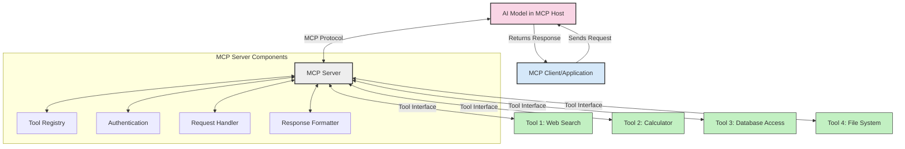
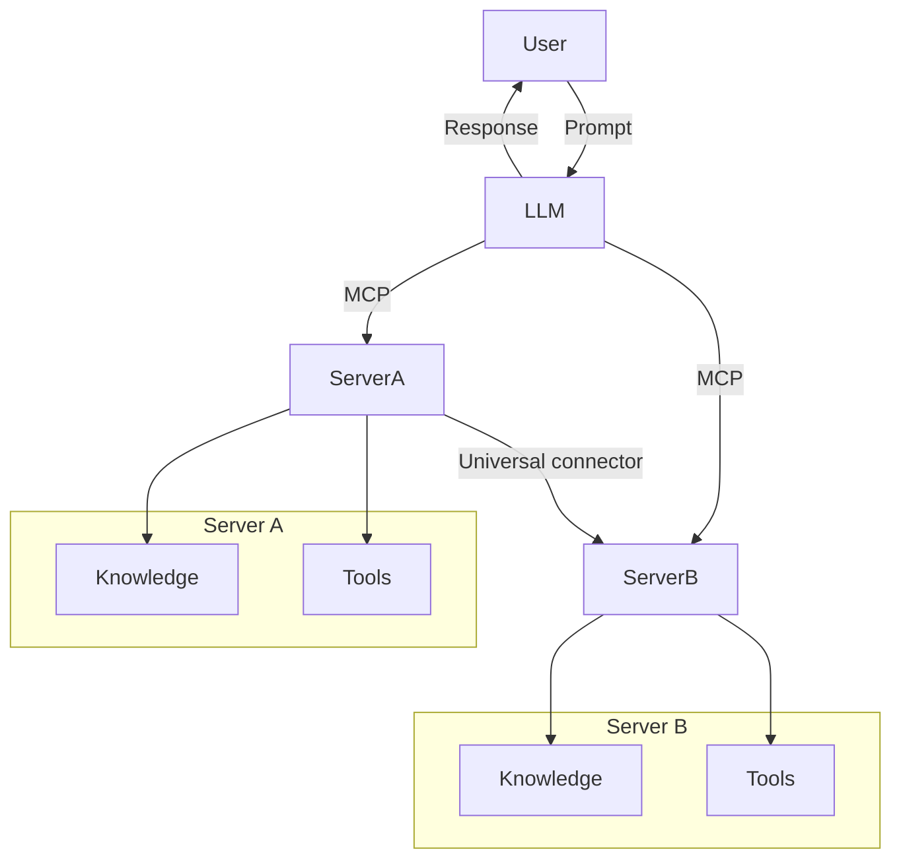

<!--
CO_OP_TRANSLATOR_METADATA:
{
  "original_hash": "1d88dee994dcbb3fa52c271d0c0817b5",
  "translation_date": "2025-05-20T21:34:40+00:00",
  "source_file": "00-Introduction/README.md",
  "language_code": "th"
}
-->
# บทนำสู่ Model Context Protocol (MCP): ทำไมจึงสำคัญสำหรับแอปพลิเคชัน AI ที่ขยายตัวได้

แอปพลิเคชัน Generative AI เป็นก้าวสำคัญที่ช่วยให้ผู้ใช้สามารถโต้ตอบกับแอปผ่านคำสั่งภาษาธรรมชาติได้ อย่างไรก็ตาม เมื่อมีการลงทุนเวลาและทรัพยากรในแอปเหล่านี้มากขึ้น คุณต้องมั่นใจว่าสามารถผสานรวมฟังก์ชันและทรัพยากรได้อย่างง่ายดาย เพื่อให้ง่ายต่อการขยาย รองรับการใช้งานหลายโมเดล และจัดการกับความซับซ้อนของแต่ละโมเดลได้ โดยสรุป การสร้างแอป Gen AI เริ่มต้นง่าย แต่เมื่อเติบโตและซับซ้อนขึ้น คุณจำเป็นต้องกำหนดสถาปัตยกรรมและน่าจะต้องพึ่งพามาตรฐานเพื่อให้แอปของคุณถูกสร้างขึ้นอย่างสม่ำเสมอ นี่คือที่ที่ MCP เข้ามาจัดระเบียบและให้มาตรฐาน

---

## **🔍 Model Context Protocol (MCP) คืออะไร?**

**Model Context Protocol (MCP)** คือ **อินเทอร์เฟซเปิดและมาตรฐาน** ที่ช่วยให้ Large Language Models (LLMs) สามารถโต้ตอบกับเครื่องมือภายนอก, API และแหล่งข้อมูลได้อย่างราบรื่น มันให้สถาปัตยกรรมที่สม่ำเสมอเพื่อเพิ่มประสิทธิภาพการทำงานของโมเดล AI เกินกว่าข้อมูลที่ใช้ฝึก ช่วยให้ระบบ AI ฉลาดขึ้น, ขยายตัวได้ และตอบสนองได้ดีขึ้น

---

## **🎯 ทำไมการมีมาตรฐานใน AI จึงสำคัญ**

เมื่อแอปพลิเคชัน generative AI ซับซ้อนขึ้น การนำมาตรฐานมาใช้จึงจำเป็นเพื่อให้มั่นใจในเรื่อง **ความสามารถในการขยายตัว, ความยืดหยุ่น** และ **การดูแลรักษา** MCP ตอบโจทย์นี้ด้วยการ:

- รวมการเชื่อมต่อระหว่างโมเดลกับเครื่องมือเข้าด้วยกัน
- ลดการแก้ปัญหาแบบเฉพาะเจาะจงที่เปราะบาง
- รองรับการใช้งานหลายโมเดลในระบบเดียวกัน

---

## **📚 วัตถุประสงค์การเรียนรู้**

เมื่ออ่านบทความนี้จบ คุณจะสามารถ:

- อธิบายความหมายของ **Model Context Protocol (MCP)** และกรณีการใช้งาน
- เข้าใจวิธีที่ MCP มาตรฐานการสื่อสารระหว่างโมเดลกับเครื่องมือ
- ระบุส่วนประกอบหลักของสถาปัตยกรรม MCP
- สำรวจการใช้งาน MCP ในโลกจริง ทั้งในองค์กรและการพัฒนา

---

## **💡 ทำไม Model Context Protocol (MCP) จึงเปลี่ยนเกม**

### **🔗 MCP แก้ปัญหาการกระจัดกระจายในการโต้ตอบ AI**

ก่อน MCP การผสานโมเดลกับเครื่องมือต้องใช้:

- โค้ดเฉพาะสำหรับแต่ละคู่เครื่องมือ-โมเดล
- API ที่ไม่เป็นมาตรฐานสำหรับแต่ละผู้ขาย
- การขัดข้องบ่อยครั้งเมื่อมีการอัปเดต
- ความสามารถในการขยายตัวที่ต่ำเมื่อเพิ่มจำนวนเครื่องมือ

### **✅ ประโยชน์ของการมีมาตรฐาน MCP**

| **ประโยชน์**             | **คำอธิบาย**                                                                |
|--------------------------|-----------------------------------------------------------------------------|
| ความสามารถในการทำงานร่วมกัน | LLMs ทำงานร่วมกับเครื่องมือจากผู้ขายต่าง ๆ ได้อย่างราบรื่น               |
| ความสม่ำเสมอ             | พฤติกรรมที่เหมือนกันในทุกแพลตฟอร์มและเครื่องมือ                         |
| การนำกลับมาใช้ใหม่        | เครื่องมือที่สร้างขึ้นครั้งเดียวสามารถใช้ซ้ำในโปรเจกต์และระบบต่าง ๆ      |
| เร่งการพัฒนา             | ลดเวลาพัฒนาโดยใช้อินเทอร์เฟซที่เป็นมาตรฐานและเสียบใช้งานได้ทันที          |

---

## **🧱 ภาพรวมสถาปัตยกรรม MCP ระดับสูง**

MCP ใช้ **โมเดลไคลเอนต์-เซิร์ฟเวอร์** โดย:

- **MCP Hosts** รันโมเดล AI
- **MCP Clients** เริ่มต้นคำขอ
- **MCP Servers** ให้บริการบริบท, เครื่องมือ และความสามารถต่าง ๆ

### **ส่วนประกอบหลัก:**

- **Resources** – ข้อมูลคงที่หรือตัวแปรสำหรับโมเดล  
- **Prompts** – เวิร์กโฟลว์ที่กำหนดไว้ล่วงหน้าสำหรับการสร้างเนื้อหา  
- **Tools** – ฟังก์ชันที่สามารถรันได้ เช่น การค้นหา, การคำนวณ  
- **Sampling** – พฤติกรรมแบบตัวแทนผ่านการโต้ตอบซ้ำ ๆ

---

## วิธีการทำงานของ MCP Servers

MCP servers ทำงานดังนี้:

- **การไหลของคำขอ**:  
    1. MCP Client ส่งคำขอไปยัง AI Model ที่รันอยู่ใน MCP Host  
    2. โมเดล AI ระบุว่าต้องการเครื่องมือหรือข้อมูลภายนอกเมื่อใด  
    3. โมเดลสื่อสารกับ MCP Server ผ่านโปรโตคอลมาตรฐาน

- **ฟังก์ชันของ MCP Server**:  
    - Tool Registry: เก็บรายการเครื่องมือและความสามารถของเครื่องมือเหล่านั้น  
    - Authentication: ตรวจสอบสิทธิ์การเข้าถึงเครื่องมือ  
    - Request Handler: ประมวลผลคำขอเครื่องมือจากโมเดล  
    - Response Formatter: จัดรูปแบบผลลัพธ์ของเครื่องมือให้อยู่ในรูปแบบที่โมเดลเข้าใจได้

- **การรันเครื่องมือ**:  
    - เซิร์ฟเวอร์ส่งคำขอไปยังเครื่องมือภายนอกที่เหมาะสม  
    - เครื่องมือทำงานเฉพาะทาง เช่น ค้นหา, คำนวณ, สืบค้นฐานข้อมูล ฯลฯ  
    - ผลลัพธ์ถูกส่งกลับไปยังโมเดลในรูปแบบที่สอดคล้องกัน

- **การส่งคืนคำตอบ**:  
    - โมเดล AI นำผลลัพธ์จากเครื่องมือมารวมในคำตอบ  
    - คำตอบสุดท้ายถูกส่งกลับไปยังแอปพลิเคชันไคลเอนต์

## 👨‍💻 วิธีสร้าง MCP Server (พร้อมตัวอย่าง)

MCP servers ช่วยให้คุณขยายความสามารถของ LLM โดยการให้ข้อมูลและฟังก์ชันการทำงาน

พร้อมลองใช้งานหรือยัง? นี่คือตัวอย่างการสร้าง MCP server ง่าย ๆ ในหลายภาษา:

- **ตัวอย่าง Python**: https://github.com/modelcontextprotocol/python-sdk

- **ตัวอย่าง TypeScript**: https://github.com/modelcontextprotocol/typescript-sdk

- **ตัวอย่าง Java**: https://github.com/modelcontextprotocol/java-sdk

- **ตัวอย่าง C#/.NET**: https://github.com/modelcontextprotocol/csharp-sdk

## 🌍 กรณีการใช้งานจริงของ MCP

MCP ช่วยให้แอปพลิเคชันหลากหลายขยายความสามารถของ AI ได้:

| **แอปพลิเคชัน**             | **คำอธิบาย**                                                                |
|------------------------------|-----------------------------------------------------------------------------|
| การรวมข้อมูลองค์กร           | เชื่อมต่อ LLM กับฐานข้อมูล, CRM หรือเครื่องมือภายในองค์กร                  |
| ระบบ AI แบบตัวแทน           | เปิดใช้งานตัวแทนอิสระที่เข้าถึงเครื่องมือและเวิร์กโฟลว์การตัดสินใจ         |
| แอปพลิเคชันมัลติ-โหมด       | รวมเครื่องมือข้อความ, รูปภาพ และเสียงไว้ในแอป AI เดียวกัน                 |
| การรวมข้อมูลแบบเรียลไทม์    | นำข้อมูลสดเข้าสู่การโต้ตอบ AI เพื่อผลลัพธ์ที่แม่นยำและทันสมัย               |

### 🧠 MCP = มาตรฐานสากลสำหรับการโต้ตอบ AI

Model Context Protocol (MCP) ทำหน้าที่เป็นมาตรฐานสากลสำหรับการโต้ตอบ AI เหมือนกับที่ USB-C มาตรฐานการเชื่อมต่ออุปกรณ์ในโลกจริง ในโลกของ AI MCP ให้หน้าต่างสื่อสารที่สม่ำเสมอ ช่วยให้โมเดล (ไคลเอนต์) ผสานรวมกับเครื่องมือและผู้ให้บริการข้อมูลภายนอก (เซิร์ฟเวอร์) ได้อย่างราบรื่น โดยไม่ต้องใช้โปรโตคอลเฉพาะที่หลากหลายสำหรับแต่ละ API หรือแหล่งข้อมูล

ภายใต้ MCP เครื่องมือที่เข้ากันได้ (เรียกว่า MCP server) จะปฏิบัติตามมาตรฐานเดียวกัน เซิร์ฟเวอร์เหล่านี้สามารถแสดงรายการเครื่องมือหรือการกระทำที่มีและรันการกระทำนั้นเมื่อได้รับคำขอจากตัวแทน AI แพลตฟอร์มตัวแทน AI ที่รองรับ MCP สามารถค้นหาเครื่องมือที่มีจากเซิร์ฟเวอร์และเรียกใช้งานผ่านโปรโตคอลมาตรฐานนี้

### 💡 ช่วยให้เข้าถึงความรู้ได้ง่ายขึ้น

นอกจากการให้เครื่องมือแล้ว MCP ยังช่วยให้เข้าถึงความรู้ได้อีกด้วย ช่วยให้อุปกรณ์เชื่อมต่อบริบทกับ LLM โดยเชื่อมโยงกับแหล่งข้อมูลต่าง ๆ เช่น MCP server อาจเป็นที่เก็บเอกสารของบริษัท ช่วยให้ตัวแทนดึงข้อมูลที่เกี่ยวข้องเมื่อจำเป็น เซิร์ฟเวอร์อีกตัวอาจจัดการการกระทำเฉพาะ เช่น ส่งอีเมล หรืออัปเดตข้อมูล จากมุมมองของตัวแทน นี่คือเครื่องมือที่ใช้งานได้ บางเครื่องมือคืนข้อมูล (บริบทความรู้) บางเครื่องมือทำหน้าที่ต่าง ๆ MCP จัดการทั้งสองอย่างได้อย่างมีประสิทธิภาพ

ตัวแทนที่เชื่อมต่อกับ MCP server จะเรียนรู้ความสามารถและข้อมูลที่เข้าถึงได้ของเซิร์ฟเวอร์นั้นโดยอัตโนมัติผ่านรูปแบบมาตรฐาน การมีมาตรฐานนี้ช่วยให้เครื่องมือพร้อมใช้งานแบบไดนามิก เช่น การเพิ่ม MCP server ใหม่ในระบบตัวแทนทำให้ฟังก์ชันของมันพร้อมใช้ทันทีโดยไม่ต้องปรับแต่งคำสั่งของตัวแทนเพิ่มเติม

การผสานรวมที่ราบรื่นนี้สอดคล้องกับการไหลที่แสดงในแผนภาพ mermaid ซึ่งเซิร์ฟเวอร์ให้ทั้งเครื่องมือและความรู้ เพื่อให้การทำงานร่วมกันระหว่างระบบเป็นไปอย่างราบรื่น

### 👉 ตัวอย่าง: โซลูชันตัวแทนที่ขยายตัวได้

## 🔐 ประโยชน์เชิงปฏิบัติของ MCP

นี่คือประโยชน์เชิงปฏิบัติของการใช้ MCP:

- **ความสดใหม่**: โมเดลเข้าถึงข้อมูลที่อัปเดตเกินกว่าข้อมูลที่ใช้ฝึกได้  
- **การขยายความสามารถ**: โมเดลใช้เครื่องมือเฉพาะทางสำหรับงานที่ไม่ได้ฝึกมา  
- **ลดการสร้างภาพหลอน**: แหล่งข้อมูลภายนอกช่วยยืนยันข้อเท็จจริง  
- **ความเป็นส่วนตัว**: ข้อมูลที่ละเอียดอ่อนยังคงอยู่ในสภาพแวดล้อมที่ปลอดภัย แทนที่จะฝังในคำสั่ง

## 📌 สรุปประเด็นสำคัญ

ข้อสรุปสำคัญสำหรับการใช้ MCP:

- **MCP** มาตรฐานการโต้ตอบระหว่างโมเดล AI กับเครื่องมือและข้อมูล  
- ส่งเสริม **การขยายตัว, ความสม่ำเสมอ และความสามารถในการทำงานร่วมกัน**  
- MCP ช่วย **ลดเวลาพัฒนา, ปรับปรุงความน่าเชื่อถือ และขยายความสามารถของโมเดล**  
- สถาปัตยกรรมไคลเอนต์-เซิร์ฟเวอร์ช่วยให้แอป AI มีความยืดหยุ่นและขยายตัวได้

## 🧠 แบบฝึกหัด

ลองคิดถึงแอป AI ที่คุณสนใจจะสร้าง

- เครื่องมือหรือข้อมูลภายนอกใดที่จะช่วยเพิ่มความสามารถ?  
- MCP จะช่วยให้การผสานรวมเป็นเรื่องง่ายและน่าเชื่อถือขึ้นได้อย่างไร?

## แหล่งข้อมูลเพิ่มเติม

- [MCP GitHub Repository](https://github.com/modelcontextprotocol)

## ต่อไป

ถัดไป: [Chapter 1: Core Concepts](/01-CoreConcepts/README.md)

**ข้อจำกัดความรับผิดชอบ**:  
เอกสารนี้ได้รับการแปลโดยใช้บริการแปลภาษา AI [Co-op Translator](https://github.com/Azure/co-op-translator) แม้ว่าเราจะพยายามให้ความถูกต้องสูงสุด โปรดทราบว่าการแปลโดยอัตโนมัติอาจมีข้อผิดพลาดหรือความไม่ถูกต้อง เอกสารต้นฉบับในภาษาดั้งเดิมถือเป็นแหล่งข้อมูลที่เชื่อถือได้ สำหรับข้อมูลที่สำคัญ แนะนำให้ใช้บริการแปลโดยผู้เชี่ยวชาญมนุษย์ เราไม่รับผิดชอบต่อความเข้าใจผิดหรือการตีความผิดใด ๆ ที่เกิดจากการใช้การแปลนี้