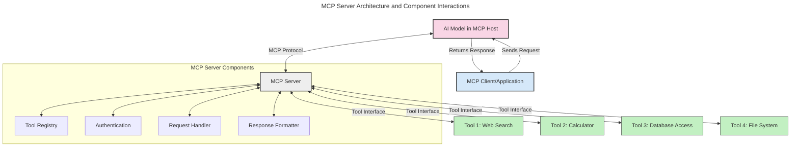
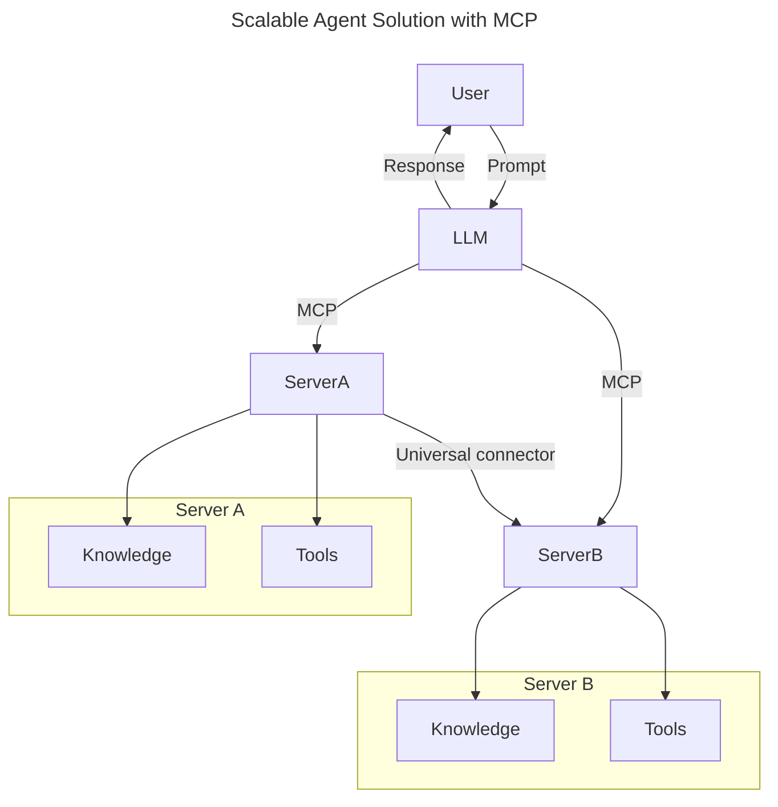
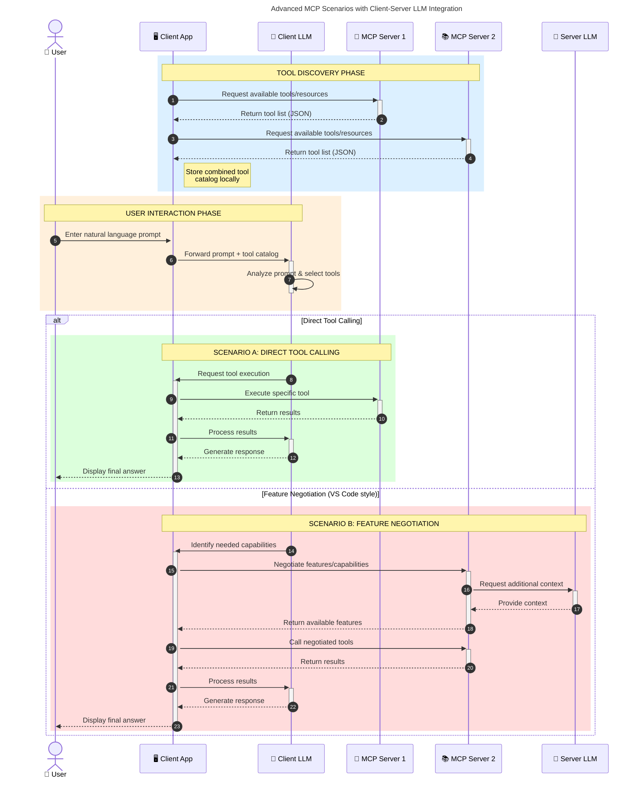

<!--
CO_OP_TRANSLATOR_METADATA:
{
  "original_hash": "1446979020432f512c883848d7eca144",
  "translation_date": "2025-05-29T21:48:39+00:00",
  "source_file": "00-Introduction/README.md",
  "language_code": "th"
}
-->
# บทนำสู่ Model Context Protocol (MCP): ทำไมจึงสำคัญสำหรับแอปพลิเคชัน AI ที่ขยายตัวได้

แอปพลิเคชัน Generative AI เป็นก้าวสำคัญที่ช่วยให้ผู้ใช้สามารถโต้ตอบกับแอปผ่านคำสั่งภาษาแบบธรรมชาติได้ง่ายขึ้น อย่างไรก็ตาม เมื่อเวลาผ่านไปและมีการลงทุนทรัพยากรในแอปเหล่านี้มากขึ้น คุณจะต้องมั่นใจว่าสามารถรวมฟังก์ชันและทรัพยากรต่างๆ ได้อย่างง่ายดาย เพื่อให้แอปของคุณสามารถขยายตัว รองรับโมเดลมากกว่าหนึ่งตัว และจัดการกับความซับซ้อนของโมเดลต่างๆ ได้ กล่าวโดยสรุป การสร้างแอป Gen AI เริ่มต้นอาจง่าย แต่เมื่อระบบเติบโตและซับซ้อนขึ้น คุณจำเป็นต้องกำหนดสถาปัตยกรรมและน่าจะต้องพึ่งพามาตรฐานเพื่อให้แอปของคุณถูกพัฒนาด้วยแนวทางที่สม่ำเสมอ นี่คือจุดที่ MCP เข้ามาจัดระเบียบและให้มาตรฐาน

---

## **🔍 Model Context Protocol (MCP) คืออะไร?**

**Model Context Protocol (MCP)** คือ **อินเทอร์เฟซแบบเปิดและมาตรฐาน** ที่ช่วยให้ Large Language Models (LLMs) สามารถเชื่อมต่อกับเครื่องมือภายนอก, API และแหล่งข้อมูลต่างๆ ได้อย่างราบรื่น โดยให้สถาปัตยกรรมที่สม่ำเสมอเพื่อเพิ่มความสามารถของโมเดล AI เกินกว่าข้อมูลที่ใช้ฝึกฝน ช่วยให้ระบบ AI ฉลาดขึ้น ขยายตัวได้ และตอบสนองได้ดีขึ้น

---

## **🎯 ทำไมการใช้มาตรฐานใน AI จึงสำคัญ**

เมื่อแอปพลิเคชัน generative AI ซับซ้อนขึ้น การนำมาตรฐานมาใช้จึงมีความจำเป็นเพื่อรับประกันความสามารถในการ **ขยายตัว, ต่อยอด**, และ **ดูแลรักษา** MCP ตอบโจทย์นี้ด้วยการ:

- รวมการเชื่อมต่อโมเดลกับเครื่องมือต่างๆ ให้เป็นหนึ่งเดียว
- ลดการพึ่งพาโซลูชันเฉพาะตัวที่เปราะบาง
- อนุญาตให้โมเดลหลายตัวอยู่ร่วมกันในระบบเดียว

---

## **📚 วัตถุประสงค์การเรียนรู้**

เมื่ออ่านบทความนี้จบ คุณจะสามารถ:

- อธิบายความหมายของ **Model Context Protocol (MCP)** และกรณีการใช้งาน
- เข้าใจวิธีที่ MCP สร้างมาตรฐานการสื่อสารระหว่างโมเดลกับเครื่องมือ
- ระบุส่วนประกอบหลักของสถาปัตยกรรม MCP
- สำรวจตัวอย่างการใช้งานจริงของ MCP ในองค์กรและบริบทการพัฒนา

---

## **💡 ทำไม Model Context Protocol (MCP) ถึงเปลี่ยนเกม**

### **🔗 MCP แก้ปัญหาการกระจัดกระจายในการโต้ตอบของ AI**

ก่อน MCP การเชื่อมต่อโมเดลกับเครื่องมือต้อง:

- เขียนโค้ดเฉพาะสำหรับคู่เครื่องมือ-โมเดลแต่ละคู่
- ใช้ API ที่ไม่เป็นมาตรฐานสำหรับแต่ละผู้ให้บริการ
- มีการหยุดชะงักบ่อยครั้งเมื่อมีการอัปเดต
- ขยายตัวได้ยากเมื่อมีเครื่องมือมากขึ้น

### **✅ ประโยชน์ของการใช้มาตรฐาน MCP**

| **ประโยชน์**            | **คำอธิบาย**                                                                  |
|-------------------------|-------------------------------------------------------------------------------|
| การทำงานร่วมกันได้ดี    | LLMs สามารถทำงานร่วมกับเครื่องมือต่างๆ จากผู้ให้บริการหลายรายได้อย่างราบรื่น |
| ความสม่ำเสมอ           | พฤติกรรมที่เหมือนกันในแพลตฟอร์มและเครื่องมือต่างๆ                          |
| การนำกลับมาใช้ใหม่      | เครื่องมือที่สร้างขึ้นครั้งเดียวสามารถใช้ซ้ำในโปรเจกต์และระบบอื่นได้         |
| เร่งการพัฒนา           | ลดเวลาการพัฒนาโดยใช้อินเทอร์เฟซมาตรฐานแบบ plug-and-play                      |

---

## **🧱 ภาพรวมสถาปัตยกรรม MCP ระดับสูง**

MCP ใช้โมเดล **client-server** ซึ่ง:

- **MCP Hosts** เป็นที่รันโมเดล AI
- **MCP Clients** เริ่มต้นคำขอ
- **MCP Servers** ให้บริบท, เครื่องมือ และความสามารถต่างๆ

### **ส่วนประกอบสำคัญ:**

- **Resources** – ข้อมูลคงที่หรือตัวแปรสำหรับโมเดล  
- **Prompts** – เวิร์กโฟลว์ที่กำหนดไว้ล่วงหน้าสำหรับการสร้างเนื้อหาแบบมีแนวทาง  
- **Tools** – ฟังก์ชันที่รันได้ เช่น การค้นหา, การคำนวณ  
- **Sampling** – พฤติกรรมของตัวแทนผ่านการโต้ตอบแบบวนซ้ำ

---

## วิธีการทำงานของ MCP Servers

MCP servers ทำงานดังนี้:

- **ลำดับคำขอ**:  
    1. MCP Client ส่งคำขอไปยัง AI Model ที่รันอยู่ใน MCP Host  
    2. โมเดล AI ระบุเมื่อจำเป็นต้องใช้เครื่องมือหรือข้อมูลภายนอก  
    3. โมเดลสื่อสารกับ MCP Server ผ่านโปรโตคอลมาตรฐาน  

- **ฟังก์ชันของ MCP Server**:  
    - Tool Registry: ดูแลรายการเครื่องมือและความสามารถ  
    - Authentication: ตรวจสอบสิทธิ์การเข้าถึงเครื่องมือ  
    - Request Handler: ประมวลผลคำขอเครื่องมือจากโมเดล  
    - Response Formatter: จัดรูปแบบผลลัพธ์ของเครื่องมือให้โมเดลเข้าใจได้  

- **การทำงานของเครื่องมือ**:  
    - เซิร์ฟเวอร์ส่งคำขอไปยังเครื่องมือภายนอกที่เหมาะสม  
    - เครื่องมือทำหน้าที่เฉพาะ (ค้นหา, คำนวณ, คิวรีฐานข้อมูล ฯลฯ)  
    - ผลลัพธ์ถูกส่งกลับไปยังโมเดลในรูปแบบที่สม่ำเสมอ  

- **การตอบกลับสมบูรณ์**:  
    - โมเดล AI นำผลลัพธ์จากเครื่องมือมารวมในคำตอบ  
    - คำตอบสุดท้ายถูกส่งกลับไปยังแอปพลิเคชันลูกค้า  

## 👨‍💻 วิธีสร้าง MCP Server (พร้อมตัวอย่าง)

MCP servers ช่วยให้คุณขยายความสามารถของ LLMs โดยการให้ข้อมูลและฟังก์ชันการทำงาน

พร้อมลองไหม? นี่คือตัวอย่างการสร้าง MCP server ง่ายๆ ในภาษาต่างๆ:

- **ตัวอย่าง Python**: https://github.com/modelcontextprotocol/python-sdk

- **ตัวอย่าง TypeScript**: https://github.com/modelcontextprotocol/typescript-sdk

- **ตัวอย่าง Java**: https://github.com/modelcontextprotocol/java-sdk

- **ตัวอย่าง C#/.NET**: https://github.com/modelcontextprotocol/csharp-sdk

## 🌍 กรณีการใช้งานจริงของ MCP

MCP เปิดทางให้แอปพลิเคชันหลากหลายประเภทโดยการขยายความสามารถของ AI:

| **แอปพลิเคชัน**            | **คำอธิบาย**                                                              |
|-----------------------------|---------------------------------------------------------------------------|
| การรวมข้อมูลองค์กร          | เชื่อมต่อ LLMs กับฐานข้อมูล, CRM หรือเครื่องมือภายในองค์กร              |
| ระบบ AI ตัวแทนอิสระ         | เปิดใช้งานตัวแทนอัตโนมัติที่เข้าถึงเครื่องมือและเวิร์กโฟลว์การตัดสินใจ  |
| แอปพลิเคชันมัลติ-โหมด       | รวมเครื่องมือข้อความ, รูปภาพ และเสียงไว้ในแอป AI เดียว                  |
| การรวมข้อมูลแบบเรียลไทม์   | นำข้อมูลสดเข้าสู่การโต้ตอบ AI เพื่อผลลัพธ์ที่แม่นยำและทันสมัย           |

### 🧠 MCP = มาตรฐานสากลสำหรับการโต้ตอบ AI

Model Context Protocol (MCP) ทำหน้าที่เป็นมาตรฐานสากลสำหรับการโต้ตอบ AI คล้ายกับที่ USB-C ทำให้การเชื่อมต่ออุปกรณ์เป็นมาตรฐาน ในโลก AI MCP ให้อินเทอร์เฟซที่สม่ำเสมอ ช่วยให้โมเดล (ลูกค้า) รวมเข้ากับเครื่องมือและผู้ให้บริการข้อมูลภายนอก (เซิร์ฟเวอร์) ได้อย่างราบรื่น ซึ่งช่วยลดความจำเป็นในการมีโปรโตคอลเฉพาะสำหรับแต่ละ API หรือแหล่งข้อมูล

ภายใต้ MCP เครื่องมือที่รองรับ MCP (เรียกว่า MCP server) จะปฏิบัติตามมาตรฐานเดียวกัน เซิร์ฟเวอร์เหล่านี้สามารถแสดงรายการเครื่องมือหรือการกระทำที่ให้บริการ และดำเนินการตามคำขอเมื่อได้รับจากตัวแทน AI แพลตฟอร์มตัวแทน AI ที่สนับสนุน MCP สามารถค้นหาเครื่องมือที่มีจากเซิร์ฟเวอร์และเรียกใช้งานผ่านโปรโตคอลมาตรฐานนี้

### 💡 ช่วยให้เข้าถึงความรู้ได้ง่ายขึ้น

นอกจากการให้เครื่องมือแล้ว MCP ยังช่วยให้เข้าถึงความรู้ได้ด้วย ช่วยให้อุปกรณ์สามารถให้บริบทกับ LLMs โดยเชื่อมต่อกับแหล่งข้อมูลต่างๆ ตัวอย่างเช่น MCP server อาจเป็นตัวแทนของคลังเอกสารของบริษัท ช่วยให้ตัวแทนดึงข้อมูลที่เกี่ยวข้องตามคำขอ เซิร์ฟเวอร์อีกตัวอาจจัดการกับการกระทำเฉพาะ เช่น ส่งอีเมลหรืออัปเดตข้อมูล จากมุมมองของตัวแทน นี่คือเครื่องมือที่สามารถใช้ได้ บางเครื่องมือส่งคืนข้อมูล (บริบทความรู้) ในขณะที่บางเครื่องมือทำหน้าที่กระทำ MCP จัดการทั้งสองอย่างได้อย่างมีประสิทธิภาพ

ตัวแทนที่เชื่อมต่อกับ MCP server จะเรียนรู้ความสามารถและข้อมูลที่เข้าถึงได้ของเซิร์ฟเวอร์โดยอัตโนมัติผ่านรูปแบบมาตรฐาน การมีมาตรฐานนี้ช่วยให้เครื่องมือพร้อมใช้งานแบบไดนามิก เช่น การเพิ่ม MCP server ใหม่ในระบบของตัวแทนจะทำให้ฟังก์ชันของเซิร์ฟเวอร์นั้นพร้อมใช้ทันทีโดยไม่ต้องปรับแต่งคำสั่งของตัวแทนเพิ่มเติม

การรวมระบบที่ราบรื่นนี้สอดคล้องกับโฟลว์ในไดอะแกรม mermaid ที่แสดงว่าเซิร์ฟเวอร์ให้ทั้งเครื่องมือและความรู้ เพื่อให้ระบบทำงานร่วมกันได้อย่างไร้รอยต่อ

### 👉 ตัวอย่าง: โซลูชันตัวแทนที่ขยายตัวได้

### 🔄 สถานการณ์ขั้นสูงของ MCP กับการรวม LLM ฝั่งลูกค้า

นอกเหนือจากสถาปัตยกรรม MCP พื้นฐาน ยังมีสถานการณ์ขั้นสูงที่ทั้งลูกค้าและเซิร์ฟเวอร์มี LLMs ทำให้เกิดการโต้ตอบที่ซับซ้อนขึ้น:

## 🔐 ประโยชน์เชิงปฏิบัติของ MCP

นี่คือประโยชน์เชิงปฏิบัติของการใช้ MCP:

- **ข้อมูลทันสมัย**: โมเดลสามารถเข้าถึงข้อมูลที่อัปเดตเกินกว่าข้อมูลฝึกฝน  
- **ขยายความสามารถ**: โมเดลใช้เครื่องมือเฉพาะทางสำหรับงานที่ไม่ได้ฝึกมาโดยตรง  
- **ลดการสร้างข้อมูลผิดพลาด**: แหล่งข้อมูลภายนอกช่วยยืนยันข้อเท็จจริง  
- **ความเป็นส่วนตัว**: ข้อมูลที่ละเอียดอ่อนเก็บไว้ในสภาพแวดล้อมที่ปลอดภัย แทนที่จะฝังในคำสั่ง  

## 📌 สรุปประเด็นสำคัญ

ข้อสรุปสำคัญสำหรับการใช้ MCP:

- **MCP** สร้างมาตรฐานการโต้ตอบระหว่างโมเดล AI กับเครื่องมือและข้อมูล  
- ส่งเสริม **การขยายตัว, ความสม่ำเสมอ, และการทำงานร่วมกัน**  
- MCP ช่วย **ลดเวลาพัฒนา, เพิ่มความน่าเชื่อถือ, และขยายความสามารถของโมเดล**  
- สถาปัตยกรรม client-server ช่วยให้แอป AI มีความยืดหยุ่นและขยายตัวได้  

## 🧠 แบบฝึกหัด

ลองคิดถึงแอป AI ที่คุณสนใจจะสร้าง

- เครื่องมือหรือข้อมูลภายนอกใดที่อาจช่วยเพิ่มความสามารถของแอปได้?  
- MCP จะช่วยให้การรวมระบบง่ายขึ้นและเชื่อถือได้มากขึ้นอย่างไร?  

## แหล่งข้อมูลเพิ่มเติม

- [MCP GitHub Repository](https://github.com/modelcontextprotocol)

## ต่อไป

ถัดไป: [บทที่ 1: แนวคิดหลัก](/01-CoreConcepts/README.md)

**ข้อจำกัดความรับผิดชอบ**:  
เอกสารฉบับนี้ได้รับการแปลโดยใช้บริการแปลภาษาอัตโนมัติ [Co-op Translator](https://github.com/Azure/co-op-translator) แม้ว่าเราจะพยายามให้มีความถูกต้อง แต่โปรดทราบว่าการแปลอัตโนมัติอาจมีข้อผิดพลาดหรือความคลาดเคลื่อน เอกสารต้นฉบับในภาษาต้นฉบับควรถูกพิจารณาเป็นแหล่งข้อมูลที่เชื่อถือได้ สำหรับข้อมูลที่สำคัญ แนะนำให้ใช้บริการแปลโดยผู้เชี่ยวชาญมืออาชีพ เราไม่รับผิดชอบต่อความเข้าใจผิดหรือการตีความที่ผิดพลาดที่เกิดขึ้นจากการใช้การแปลนี้