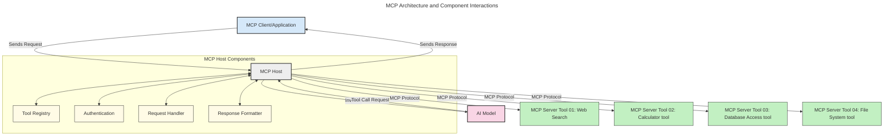
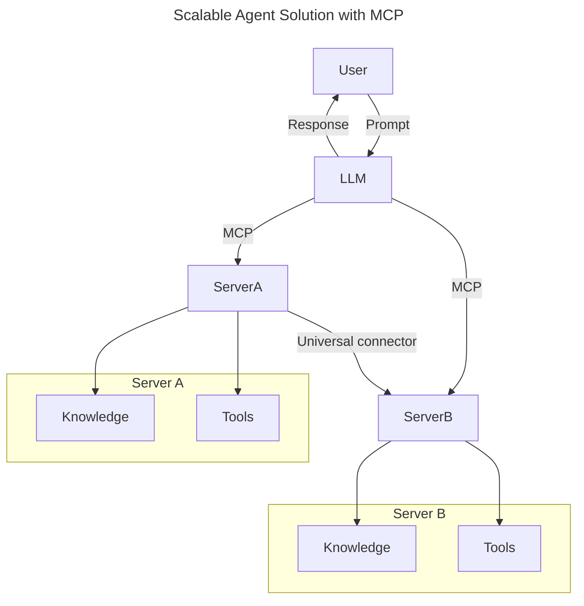
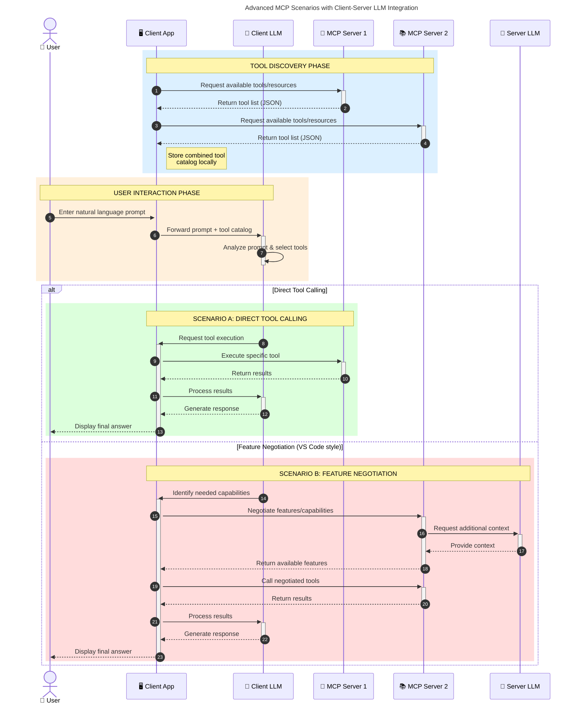

<!--
CO_OP_TRANSLATOR_METADATA:
{
  "original_hash": "0df1ee78a6dd8300f3a040ca5b411c2e",
  "translation_date": "2025-08-18T14:38:58+00:00",
  "source_file": "00-Introduction/README.md",
  "language_code": "th"
}
-->
# บทนำสู่ Model Context Protocol (MCP): ทำไมถึงสำคัญสำหรับแอปพลิเคชัน AI ที่ขยายตัวได้

_(คลิกที่ภาพด้านบนเพื่อดูวิดีโอของบทเรียนนี้)_

แอปพลิเคชัน Generative AI เป็นก้าวสำคัญที่ช่วยให้ผู้ใช้สามารถโต้ตอบกับแอปผ่านคำสั่งภาษาธรรมชาติได้อย่างง่ายดาย อย่างไรก็ตาม เมื่อมีการลงทุนเวลาและทรัพยากรมากขึ้นในแอปเหล่านี้ คุณต้องการให้แน่ใจว่าสามารถผสานรวมฟังก์ชันและทรัพยากรต่าง ๆ ได้อย่างง่ายดาย เพื่อให้สามารถขยายตัวได้ รองรับการใช้งานโมเดลมากกว่าหนึ่งตัว และจัดการกับความซับซ้อนของโมเดลต่าง ๆ กล่าวโดยสรุป การสร้างแอป Gen AI อาจเริ่มต้นได้ง่าย แต่เมื่อแอปเติบโตและซับซ้อนขึ้น คุณจำเป็นต้องกำหนดสถาปัตยกรรม และอาจต้องพึ่งพามาตรฐานเพื่อให้แน่ใจว่าแอปของคุณถูกสร้างขึ้นอย่างสม่ำเสมอ นี่คือจุดที่ MCP เข้ามาช่วยจัดระเบียบและให้มาตรฐาน

---

## **🔍 Model Context Protocol (MCP) คืออะไร?**

**Model Context Protocol (MCP)** คือ **อินเทอร์เฟซแบบเปิดและมีมาตรฐาน** ที่ช่วยให้ Large Language Models (LLMs) สามารถโต้ตอบกับเครื่องมือภายนอก, APIs และแหล่งข้อมูลได้อย่างราบรื่น MCP มอบสถาปัตยกรรมที่สม่ำเสมอเพื่อเพิ่มความสามารถของโมเดล AI ให้เกินกว่าข้อมูลการฝึกอบรม ทำให้ระบบ AI ฉลาดขึ้น ขยายตัวได้ และตอบสนองได้ดีขึ้น

---

## **🎯 ทำไมมาตรฐานใน AI ถึงสำคัญ**

เมื่อแอปพลิเคชัน Generative AI มีความซับซ้อนมากขึ้น การนำมาตรฐานมาใช้เป็นสิ่งสำคัญเพื่อให้มั่นใจใน **การขยายตัว, การต่อยอด, การบำรุงรักษา** และ **การหลีกเลี่ยงการผูกขาดกับผู้ให้บริการรายเดียว** MCP ตอบโจทย์เหล่านี้โดย:

- รวมการผสานรวมระหว่างโมเดลและเครื่องมือ
- ลดการสร้างโซลูชันเฉพาะที่เปราะบาง
- อนุญาตให้โมเดลจากผู้ให้บริการหลายรายอยู่ร่วมกันในระบบเดียว

**หมายเหตุ:** แม้ว่า MCP จะระบุว่าเป็นมาตรฐานแบบเปิด แต่ยังไม่มีแผนที่จะทำให้ MCP เป็นมาตรฐานผ่านองค์กรมาตรฐานใด ๆ เช่น IEEE, IETF, W3C, ISO หรือองค์กรอื่น ๆ

---

## **📚 วัตถุประสงค์การเรียนรู้**

เมื่อจบบทความนี้ คุณจะสามารถ:

- อธิบาย **Model Context Protocol (MCP)** และกรณีการใช้งาน
- เข้าใจว่า MCP ช่วยสร้างมาตรฐานการสื่อสารระหว่างโมเดลและเครื่องมืออย่างไร
- ระบุองค์ประกอบหลักของสถาปัตยกรรม MCP
- สำรวจการใช้งาน MCP ในโลกจริงในบริบทขององค์กรและการพัฒนา

---

## **💡 ทำไม Model Context Protocol (MCP) ถึงเป็นตัวเปลี่ยนเกม**

### **🔗 MCP แก้ปัญหาการกระจัดกระจายใน AI**

ก่อนมี MCP การผสานรวมโมเดลกับเครื่องมือจำเป็นต้อง:

- เขียนโค้ดเฉพาะสำหรับแต่ละคู่เครื่องมือ-โมเดล
- ใช้ API ที่ไม่มีมาตรฐานจากผู้ให้บริการแต่ละราย
- เกิดปัญหาบ่อยครั้งเมื่อมีการอัปเดต
- ขยายตัวได้ยากเมื่อเพิ่มเครื่องมือ

### **✅ ประโยชน์ของการสร้างมาตรฐาน MCP**

| **ประโยชน์**              | **คำอธิบาย**                                                                |
|--------------------------|--------------------------------------------------------------------------------|
| การทำงานร่วมกัน         | LLMs ทำงานร่วมกับเครื่องมือจากผู้ให้บริการต่าง ๆ ได้อย่างราบรื่น            |
| ความสม่ำเสมอ             | พฤติกรรมที่เป็นมาตรฐานระหว่างแพลตฟอร์มและเครื่องมือ                        |
| การนำกลับมาใช้ใหม่        | เครื่องมือที่สร้างครั้งเดียวสามารถใช้ได้ในหลายโปรเจกต์และระบบ               |
| การพัฒนาเร็วขึ้น          | ลดเวลาการพัฒนาโดยใช้อินเทอร์เฟซที่เป็นมาตรฐานและพร้อมใช้งาน                 |

---

## **🧱 ภาพรวมสถาปัตยกรรม MCP ระดับสูง**

MCP ใช้ **โมเดลไคลเอนต์-เซิร์ฟเวอร์** ซึ่ง:

- **MCP Hosts** รันโมเดล AI
- **MCP Clients** เริ่มต้นคำขอ
- **MCP Servers** ให้บริการบริบท, เครื่องมือ และความสามารถ

### **องค์ประกอบสำคัญ:**

- **Resources** – ข้อมูลแบบคงที่หรือไดนามิกสำหรับโมเดล  
- **Prompts** – เวิร์กโฟลว์ที่กำหนดไว้ล่วงหน้าสำหรับการสร้างเนื้อหา  
- **Tools** – ฟังก์ชันที่สามารถดำเนินการได้ เช่น การค้นหา การคำนวณ  
- **Sampling** – พฤติกรรมเชิงตัวแทนผ่านการโต้ตอบแบบวนซ้ำ  

---

## การทำงานของ MCP Servers

MCP servers ทำงานดังนี้:

- **กระบวนการคำขอ**:
    1. คำขอเริ่มต้นโดยผู้ใช้ปลายทางหรือซอฟต์แวร์ที่ทำงานแทนผู้ใช้
    2. **MCP Client** ส่งคำขอไปยัง **MCP Host** ซึ่งจัดการ runtime ของโมเดล AI
    3. **AI Model** รับคำสั่งจากผู้ใช้และอาจร้องขอการเข้าถึงเครื่องมือหรือข้อมูลภายนอกผ่านการเรียกใช้เครื่องมือ
    4. **MCP Host** (ไม่ใช่โมเดลโดยตรง) สื่อสารกับ **MCP Server(s)** ที่เหมาะสมโดยใช้โปรโตคอลมาตรฐาน
- **ฟังก์ชันของ MCP Host**:
    - **Tool Registry**: เก็บแคตตาล็อกของเครื่องมือที่มีและความสามารถของเครื่องมือ
    - **Authentication**: ตรวจสอบสิทธิ์การเข้าถึงเครื่องมือ
    - **Request Handler**: ประมวลผลคำขอเครื่องมือที่เข้ามาจากโมเดล
    - **Response Formatter**: จัดรูปแบบผลลัพธ์ของเครื่องมือให้อยู่ในรูปแบบที่โมเดลเข้าใจได้
- **การดำเนินการของ MCP Server**:
    - **MCP Host** ส่งคำขอเครื่องมือไปยัง **MCP Server(s)** ซึ่งแต่ละตัวมีฟังก์ชันเฉพาะ (เช่น การค้นหา การคำนวณ การสืบค้นฐานข้อมูล)
    - **MCP Servers** ดำเนินการตามคำขอและส่งผลลัพธ์กลับไปยัง **MCP Host** ในรูปแบบที่สม่ำเสมอ
    - **MCP Host** จัดรูปแบบและส่งผลลัพธ์เหล่านี้ไปยัง **AI Model**
- **การตอบสนองเสร็จสมบูรณ์**:
    - **AI Model** รวมผลลัพธ์ของเครื่องมือเข้ากับคำตอบสุดท้าย
    - **MCP Host** ส่งคำตอบนี้กลับไปยัง **MCP Client** ซึ่งส่งต่อไปยังผู้ใช้ปลายทางหรือซอฟต์แวร์ที่เรียกใช้

## 👨‍💻 วิธีสร้าง MCP Server (พร้อมตัวอย่าง)

MCP servers ช่วยให้คุณขยายความสามารถของ LLM โดยการให้ข้อมูลและฟังก์ชันการทำงาน

พร้อมที่จะลองหรือยัง? นี่คือตัวอย่าง SDK ที่เฉพาะเจาะจงสำหรับภาษา/สแต็กต่าง ๆ ในการสร้าง MCP servers อย่างง่าย:

- **Python SDK**: https://github.com/modelcontextprotocol/python-sdk

- **TypeScript SDK**: https://github.com/modelcontextprotocol/typescript-sdk

- **Java SDK**: https://github.com/modelcontextprotocol/java-sdk

- **C#/.NET SDK**: https://github.com/modelcontextprotocol/csharp-sdk

---

## 🌍 กรณีการใช้งาน MCP ในโลกจริง

MCP ช่วยให้เกิดแอปพลิเคชันที่หลากหลายโดยการขยายความสามารถของ AI:

| **แอปพลิเคชัน**            | **คำอธิบาย**                                                                |
|----------------------------|--------------------------------------------------------------------------------|
| การผสานรวมข้อมูลองค์กร     | เชื่อมต่อ LLMs กับฐานข้อมูล, CRM หรือเครื่องมือภายในองค์กร                  |
| ระบบ AI เชิงตัวแทน         | เปิดใช้งานตัวแทนอัตโนมัติที่มีการเข้าถึงเครื่องมือและเวิร์กโฟลว์การตัดสินใจ |
| แอปพลิเคชันหลายรูปแบบ      | รวมข้อความ, รูปภาพ และเครื่องมือเสียงในแอป AI เดียว                          |
| การผสานรวมข้อมูลเรียลไทม์  | นำข้อมูลสดเข้าสู่การโต้ตอบของ AI เพื่อผลลัพธ์ที่แม่นยำและทันสมัยยิ่งขึ้น     |

### 🧠 MCP = มาตรฐานสากลสำหรับการโต้ตอบของ AI

Model Context Protocol (MCP) ทำหน้าที่เป็นมาตรฐานสากลสำหรับการโต้ตอบของ AI เช่นเดียวกับที่ USB-C เป็นมาตรฐานสำหรับการเชื่อมต่ออุปกรณ์ ในโลกของ AI MCP มอบอินเทอร์เฟซที่สม่ำเสมอ ช่วยให้โมเดล (ไคลเอนต์) ผสานรวมกับเครื่องมือและผู้ให้บริการข้อมูลภายนอก (เซิร์ฟเวอร์) ได้อย่างราบรื่น สิ่งนี้ช่วยลดความจำเป็นในการใช้โปรโตคอลเฉพาะสำหรับแต่ละ API หรือแหล่งข้อมูล

---

### 💡 อำนวยความสะดวกในการเข้าถึงความรู้

นอกเหนือจากการให้เครื่องมือ MCP ยังช่วยอำนวยความสะดวกในการเข้าถึงความรู้ โดยช่วยให้แอปพลิเคชันสามารถให้บริบทแก่ LLMs ได้ผ่านการเชื่อมโยงกับแหล่งข้อมูลต่าง ๆ ตัวอย่างเช่น MCP server อาจเป็นตัวแทนของคลังเอกสารของบริษัท ช่วยให้ตัวแทนสามารถดึงข้อมูลที่เกี่ยวข้องได้ตามต้องการ หรืออีกเซิร์ฟเวอร์หนึ่งอาจจัดการการดำเนินการเฉพาะ เช่น การส่งอีเมลหรือการอัปเดตข้อมูลบันทึก จากมุมมองของตัวแทน สิ่งเหล่านี้เป็นเพียงเครื่องมือที่สามารถใช้ได้—บางเครื่องมือให้ข้อมูล (บริบทความรู้) ในขณะที่บางเครื่องมือดำเนินการ MCP จัดการทั้งสองอย่างได้อย่างมีประสิทธิภาพ

ตัวแทนที่เชื่อมต่อกับ MCP server จะเรียนรู้ความสามารถและข้อมูลที่เข้าถึงได้ของเซิร์ฟเวอร์โดยอัตโนมัติผ่านรูปแบบมาตรฐาน การสร้างมาตรฐานนี้ช่วยให้เครื่องมือพร้อมใช้งานแบบไดนามิก ตัวอย่างเช่น การเพิ่ม MCP server ใหม่ในระบบของตัวแทนทำให้ฟังก์ชันของเซิร์ฟเวอร์นั้นสามารถใช้งานได้ทันทีโดยไม่ต้องปรับแต่งคำสั่งของตัวแทนเพิ่มเติม

การผสานรวมที่คล่องตัวนี้สอดคล้องกับกระบวนการที่แสดงในแผนภาพต่อไปนี้ ซึ่งเซิร์ฟเวอร์ให้ทั้งเครื่องมือและความรู้ เพื่อให้มั่นใจว่าระบบทำงานร่วมกันได้อย่างราบรื่น

### 👉 ตัวอย่าง: โซลูชันตัวแทนที่ขยายตัวได้

### 🔄 สถานการณ์ MCP ขั้นสูงกับการผสานรวม LLM ฝั่งไคลเอนต์

นอกเหนือจากสถาปัตยกรรม MCP พื้นฐาน ยังมีสถานการณ์ขั้นสูงที่ทั้งไคลเอนต์และเซิร์ฟเวอร์มี LLMs ซึ่งช่วยให้เกิดการโต้ตอบที่ซับซ้อนมากขึ้น ในแผนภาพต่อไปนี้ **Client App** อาจเป็น IDE ที่มีเครื่องมือ MCP จำนวนหนึ่งพร้อมใช้งานสำหรับ LLM:

---

## 🔐 ประโยชน์ในทางปฏิบัติของ MCP

นี่คือประโยชน์ในทางปฏิบัติของการใช้ MCP:

- **ความสดใหม่ของข้อมูล**: โมเดลสามารถเข้าถึงข้อมูลที่ทันสมัยนอกเหนือจากข้อมูลการฝึกอบรม
- **การขยายความสามารถ**: โมเดลสามารถใช้เครื่องมือเฉพาะสำหรับงานที่ไม่ได้รับการฝึกอบรม
- **ลดการสร้างข้อมูลเท็จ**: แหล่งข้อมูลภายนอกให้ข้อมูลที่มีความถูกต้อง
- **ความเป็นส่วนตัว**: ข้อมูลที่ละเอียดอ่อนสามารถเก็บไว้ในสภาพแวดล้อมที่ปลอดภัยแทนที่จะฝังอยู่ในคำสั่ง

---

## 📌 สาระสำคัญ

สิ่งสำคัญที่ควรทราบเกี่ยวกับ MCP:

- **MCP** สร้างมาตรฐานการโต้ตอบระหว่างโมเดล AI กับเครื่องมือและข้อมูล
- ส่งเสริม **การต่อยอด, ความสม่ำเสมอ และการทำงานร่วมกัน**
- MCP ช่วย **ลดเวลาการพัฒนา, เพิ่มความน่าเชื่อถือ และขยายความสามารถของโมเดล**
- สถาปัตยกรรมไคลเอนต์-เซิร์ฟเวอร์ **ช่วยให้แอปพลิเคชัน AI มีความยืดหยุ่นและขยายตัวได้**

---

## 🧠 แบบฝึกหัด

ลองคิดถึงแอปพลิเคชัน AI ที่คุณสนใจจะสร้าง

- **เครื่องมือหรือข้อมูลภายนอก** ใดที่สามารถเพิ่มความสามารถของแอปได้?
- MCP จะช่วยให้การผสานรวม **ง่ายและน่าเชื่อถือ** ขึ้นได้อย่างไร?

---

## แหล่งข้อมูลเพิ่มเติม

- [MCP GitHub Repository](https://github.com/modelcontextprotocol)

---

## ลำดับถัดไป

ถัดไป: [บทที่ 1: แนวคิดหลัก](../01-CoreConcepts/README.md)

**ข้อจำกัดความรับผิดชอบ**:  
เอกสารนี้ได้รับการแปลโดยใช้บริการแปลภาษา AI [Co-op Translator](https://github.com/Azure/co-op-translator) แม้ว่าเราจะพยายามให้การแปลมีความถูกต้อง แต่โปรดทราบว่าการแปลอัตโนมัติอาจมีข้อผิดพลาดหรือความไม่แม่นยำ เอกสารต้นฉบับในภาษาต้นทางควรถือเป็นแหล่งข้อมูลที่เชื่อถือได้ สำหรับข้อมูลที่สำคัญ ขอแนะนำให้ใช้บริการแปลภาษาจากผู้เชี่ยวชาญ เราไม่รับผิดชอบต่อความเข้าใจผิดหรือการตีความที่ผิดพลาดซึ่งเกิดจากการใช้การแปลนี้